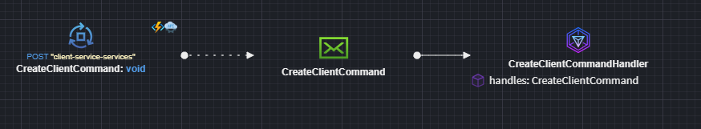
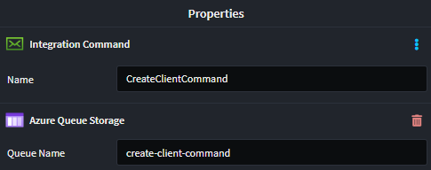
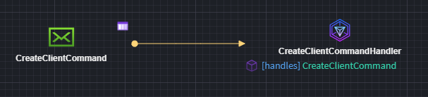

# Intent.Eventing.AzureQueueStorage

This module provides patterns for working with Azure Queue Storage directly.

## What is Azure Queue Storage?

Azure Queue Storage is a cloud-based messaging service for storing large numbers of messages accessible via authenticated HTTP(S) calls. It enables asynchronous communication between application components, helping you decouple services and scale distributed systems effectively.

- Each message can be up to 64 KB in size.
- Queues can contain millions of messages.
- Ideal for message exchange between systems such as a web frontend and a background worker.

Azure Queue Storage supports durable message delivery, retry policies, and visibility timeouts - ensuring no message is lost during high load or transient failures.

Learn more in the [official Azure documentation](https://learn.microsoft.com/en-us/azure/storage/queues/storage-queues-introduction).

## Modeling Integration Events and Commands

Integration Events and Commands are modeled in the `Services Designer`, via the `Intent.Modelers.Eventing` module, which is automatically included.

For details on modeling integration events and commands, refer to its [README](https://docs.intentarchitect.com/articles/modules-common/intent-modelers-eventing/intent-modelers-eventing.html).



By default, the queue name is derived from the event or command name. To override this, apply the `Azure Queue Storage` stereotype and set a custom `Queue Name`.



## Azure Queue Storage Implementation

This module includes a Queue Storage-specific implementation of the `IEventBus` interface for dispatching events and commands.

## Publishing Messages

Use the IEventBus interface:

- `Publish(...)` for events
- `Send(...)` for commands

## Consuming Messages

Each subscription modeled in the `Services Designer` generates an integration event handler like this:

```csharp

[IntentManaged(Mode.Fully, Body = Mode.Merge)]
public class CreateClientCommandHandler : IIntegrationEventHandler<CreateClientCommand>
{
    [IntentManaged(Mode.Merge)]
    public CreateClientCommandHandler()
    {
    }

    [IntentManaged(Mode.Fully, Body = Mode.Merge)]
    public async Task HandleAsync(CreateClientCommand message, CancellationToken cancellationToken = default)
    {
        // TODO: Implement HandleAsync (CreateClientCommandHandler) functionality
        throw new NotImplementedException("Implement your handler logic here...");
    }
}
```

## Configuring Azure Queue Storage

The `appsettings.json` file controls how queues are configured and linked to event types. A default config is generated for local development, but can be customized for production environments.

### Example Configuration

```json
"QueueStorage": {
    "DefaultEndpoint": "UseDevelopmentStorage=true",
    "Queues": {
      "client-create-command": {
        "Endpoint": null,
        "CreateQueue": false
      },
      "create-organization-command": {
        "Endpoint": null,
        "CreateQueue": false
      }
    },
    "QueueTypeMap": {
      "Client.Api.Eventing.ClientCreatedCommand": "client-create-command",
      "Client.Api.Eventing.CreateOrganizationCommand": "create-organization-command"
    }
  }
```

### Configuration Reference

| Name | Type  | Description | Example |
| ---- | ----- | ----------- | ------- |
| `DefaultEndpoint` | `string` | The default connection string or endpoint for the Azure Queue Storage account. Used when a queue does not specify its own endpoint. | `UseDevelopmentStorage=true` |
| `Queues` | `Dictionary<string, QueueDefinition>` | A dictionary of queue configurations, keyed by queue name. Each value defines properties such as whether to create the queue and a specific endpoint. | `{ "client-create-command": { "CreateQueue": false, "Endpoint": null } }` |
| `Queues[queueName].Endpoint`    | `string` (nullable) | Optional custom endpoint for a specific queue. If `null`, the `DefaultEndpoint` is used. | `DefaultEndpointsProtocol=https;AccountName=...` or `null` |
| `Queues[queueName].CreateQueue` | `bool` | Whether the application should create the queue at startup if it doesn’t already exist. If `false` and the queue does not exist, and exception will be thrown | `true` |
| `QueueTypeMap` | `Dictionary<string, string>` | Maps a .NET message type name (e.g., a command or event class) to its corresponding queue name. This enables dynamic linking of messages to queue names. | `{ "Client.Api.Eventing.ClientCreatedCommand": "client-create-command" }` |

## Message Encoding

By default, messages are not encoded. This can be configured using the `Azure Queue Storage` application setting:

- `None` (default)
- `Base64`

**Important**: All publishers and consumers must use the same encoding configuration, or message deserialization will fail.

## Local Development

[Azurite](https://learn.microsoft.com/en-us/azure/storage/common/storage-use-azurite) is a emulator which provides a local environment for testing of cloud-based application. Information on how to install and run can be found [on the Azure website.](https://learn.microsoft.com/en-us/azure/storage/common/storage-install-azurite).

[Microsoft Azure Storage Explorer](https://azure.microsoft.com/en-us/products/storage/storage-explorer) can then be used to connect to and manage the local environment.

## Related Modules

### Intent.AzureFunctions.AzureQueueStorage

This module handles the consumer code for Azure Queue Storage when Azure Functions is selected as the hosting technology. Event subscriptions modeled when using an Azure Function will be realized as a `QueueTrigger` function:



``` csharp
[Function("CreateClientCommandConsumer")]
public async Task Run(
    [QueueTrigger("create-client-command", Connection = "QueueStorage:DefaultEndpoint")] AzureQueueStorageEnvelope message,
    CancellationToken cancellationToken)
{
  // Function implication omitted
}
```

### Intent.AspNetCore

This module introduces ASP.NET Core as the hosting platform for your application. When this is detected, a special background service is added to listen for inbound messages from Azure Service Queue.

> [!NOTE]
>
> Not seeing the hosting technology you're looking for? Please reach out to us on [GitHub](https://github.com/IntentArchitect/Support) or email us at [support@intentarchitect.com](mailto://support@intentarchitect.com), and we'll be happy to help.
