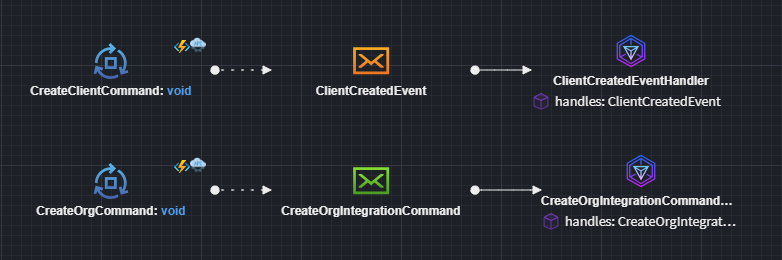
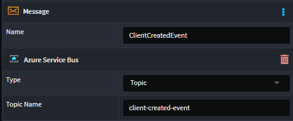
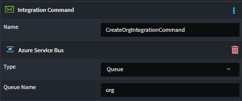

# Intent.Eventing.AzureServiceBus

This module provides patterns for working with Azure Service Bus directly.

## What is Azure Service Bus?

Azure Service Bus is a fully managed enterprise message broker with message queues and publish-subscribe topics. It enables reliable message delivery, message routing, and data transfers between different applications and services. Service Bus helps you decouple applications and services from each other, providing features like message sessions, transactions, ordering, and duplicate detection.

For more information on Azure Service Bus, check out their [official docs](https://docs.microsoft.com/en-us/azure/service-bus/).

## Modeling Integration Events and Commands

Modeling Integration Events can be achieved from within the Services designer. 
This module automatically installs the `Intent.Modelers.Eventing` module which provides designer modeling capabilities for integration events and commands. 
For details on modeling integration events and commands, refer to its [README](https://docs.intentarchitect.com/articles/modules-common/intent-modelers-eventing/intent-modelers-eventing.html).



You can model Integration Events (orange Message envelope element), and it will automatically configure to work against a Topic with a derived name.
However, you can customize the name of the Topic by applying an `Azure Service Bus` stereotype and setting the `Type` to `Topic` (or `Queue`) and `Topic Name` to the desired name.



Similarly, can model Integration Commands (green Message envelope element), and it will automatically configure to work against a Queue with a derived name.
However, you can customize the name of the Topic by applying an `Azure Service Bus` stereotype and setting the `Type` to `Queue` (or `Topic`) and `Queue Name` to the desired name.



## Azure Service Bus Implementation

Provides an Azure Service Bus specific implementation of the `IEventBus` interface for dispatching messages.

## Message Publishing

Message publishing can be done through the `IEventBus` interface using the `Publish` method for `Topics` and `Send` for `Queues`.

## Message Consumption

For every message subscribed to in the `Services Designer` will receive its own Integration Event handler.

The is what the Business logic Integration Event handler looks like:


```csharp

    [IntentManaged(Mode.Merge, Signature = Mode.Fully)]
    public class ClientCreatedIntegrationEventHandler : IIntegrationEventHandler<ClientCreatedEvent>
    {
        [IntentManaged(Mode.Ignore)]
        public ClientCreatedIntegrationEventHandler()
        {
        }

        [IntentManaged(Mode.Fully, Body = Mode.Ignore)]
        public async Task HandleAsync(ClientCreatedEvent message, CancellationToken cancellationToken = default)
        {
            // Business logic here
            throw new NotImplementedException();
        }
    }

``` 

> [!NOTE]
>
> This module will not be generating consumer code automatically for you. Look at the [Related Modules](#related-modules) section to see which modules cause this to happen.

## Configuring Service Bus

When you're publishing using Azure Service Bus, you will need to configure it in your `appsettings.json` file.

```json
{
  "AzureServiceBus":{
    "CreateOrg": "create-org",
    "ClientCreated": "client-created",
    "ConnectionString": "Endpoint=sb://your-namespace.servicebus.windows.net/;SharedAccessKeyName=RootManageSharedAccessKey;SharedAccessKey=yourkey"
  }
}
```

## Related Modules

### Intent.AzureFunctions.AzureServiceBus

This module handles the consumer code for Azure Service Bus when Azure Functions is selected as the hosting technology.

### Intent.AspNetCore

This module introduces ASP.NET Core as the hosting platform for your application. When this is detected, a special background service is added to listen for inbound messages from Azure Service Bus.

### Intent.WindowsServiceHost

This module introduces minimal hosting components to allow for background processing. When this is detected, a special background service is added to listen for inbound messages from Azure Service Bus.

> [!NOTE]
>
> Not seeing the hosting technology you're looking for? Please reach out to us on [GitHub](https://github.com/IntentArchitect/Support) or email us at [support@intentarchitect.com](mailto://support@intentarchitect.com), and we'll be happy to help. 