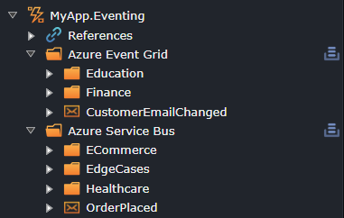

# Intent.Eventing.Contracts

## What This Module Does
Provides application-level eventing contracts: Event Bus interface, integration event DTO / enum / message types, integration command types, and handler interfaces. It standardizes how application code publishes and consumes integration events/commands across transport implementations.

## Generated Artifacts
- `IMessageBus` interface (publish events, commands; potentially subscribe/unsubscribe depending on implementation).
- Integration Event DTOs (typed payload classes) and Enums.
- Integration Event Message wrapper (metadata envelope for event distribution).
- Integration Commands (request-like messages for asynchronous processing).
- Integration Event Handler interfaces (`IIntegrationEventHandler<TEvent>`).
- Assembly attributes template allowing reflection-based scanning or version metadata.

## Design Principles
- Decoupling: Publishers depend only on `IMessageBus`; transport-specific code lives in infrastructure modules.
- Explicit Contracts: Event payloads, commands and enums generated from modelling provide schema clarity.
- Handler Abstraction: Consumers implement handler interfaces enabling pipeline behaviours (logging, retries, etc.).

## Typical Workflow
1. Model integration events/commands in Eventing or Services Event Interactions modelers.
2. Generation creates event DTOs/enums and handler interfaces.
3. Implement transport (e.g. Azure Service Bus, RabbitMQ, Kafka) in separate module providing concrete `IMessageBus` (or `IEventBus` for legacy compatibility).
4. Application services publish via `IMessageBus.Publish(...)` without transport coupling.
5. Infrastructure resolves handlers and dispatches events/commands.

## Multiple Message Bus Providers

Starting from version 6.1.0, this module supports running multiple message bus implementations simultaneously within the same application. This enables scenarios where different messaging technologies serve different purposes (e.g., Azure Service Bus for internal events, Kafka for external integrations).

### Automatic Composite Message Bus

When **two or more** message bus provider modules are installed, the system automatically generates:

- **CompositeMessageBus**: A routing implementation of `IMessageBus` that delegates to the appropriate provider(s)
- **MessageBrokerRegistry**: Runtime registry mapping message types to their designated providers
- **MessageBrokerResolver**: Service that resolves the correct provider(s) for each message type

With only **one** provider installed, that provider's implementation is registered directly as `IMessageBus` and no composite infrastructure is generated. Everything works exactly as before.

### Message Bus Stereotype

To control which messages are routed to which provider(s), apply the **`Message Bus`** stereotype at the **package** or **folder** level in the Services designer:


The `Message Bus` stereotype allows you to select one or more message bus providers from those currently installed in your application. This stereotype can be applied to:

1. **Package level**: All messages in the package inherit the selected providers
2. **Folder level**: All messages in the folder (and subfolders) inherit the selected providers
3. **Individual messages**: Fine-grained control (though typically package/folder level is sufficient)

**Stereotype Inheritance**: Child elements inherit stereotypes from their parents. A message in a folder will use the folder's providers, unless explicitly overridden. Folders inherit from packages, and so on.

### When Stereotypes Are Required

- **Single Provider**: No stereotypes needed. All messages automatically use the single installed provider.
- **Multiple Providers**: The `Message Bus` stereotype is required to designate which provider(s) should handle each message. Messages without any provider designation will cause a validation error during code generation.

### Provider-Specific Message Handling

Each message bus provider module only generates handlers and configuration for messages marked with its corresponding provider designation:

- Messages marked for Azure Service Bus → Only Azure Service Bus handlers generated
- Messages marked for Kafka → Only Kafka consumers generated
- Messages marked for both → Both providers handle the message

This ensures clean separation of concerns and prevents unnecessary code generation.

### Example Multi-Provider Scenario



### Provider-Specific Extensions

Some message bus modules extend the `IMessageBus` interface with additional methods. These extensions operate across **all installed message bus providers**. See the documentation for each module for details on any methods they add (e.g., MassTransit scheduling methods, address-specific send methods).

### IMessageBus vs IEventBus

- **`IMessageBus`** is the new standard interface (introduced in version 6.0.0)
- **`IEventBus`** remains available as a legacy-compatible interface to prevent breaking changes in existing applications

You can configure which interface to use via the module settings:
- **Setting**: "Use Legacy Interface Name" 
- **Default**: `false` (uses `IMessageBus`)
- **Legacy**: `true` (uses `IEventBus`)

Both interfaces provide identical functionality; the naming change reflects the broader support for commands and varied messaging patterns beyond just "events."

### Application Code Example

```csharp
public class OrderService
{
    private readonly IMessageBus _messageBus;
    
    public OrderService(IMessageBus messageBus)
    {
        _messageBus = messageBus;
    }
    
    public async Task PlaceOrder(Order order)
    {
        // Publishes to Azure Service Bus (based on stereotype)
        _messageBus.Publish(new OrderPlacedEvent { OrderId = order.Id });
        
        // Publishes to Kafka (based on stereotype)
        _messageBus.Publish(new OrderAnalyticsEvent { OrderId = order.Id });
        
        // Commits all messages to their respective providers
        // Not needed when appropriate cross-cutting handlers are used (e.g. EventBusPublishBehaviour).
        await _messageBus.FlushAllAsync();
    }
}
```

The application code remains clean and decoupled from specific transport implementations. The routing happens transparently based on the stereotypes configured in the designer.

## Interoperability
Detects CRUD MediatR module to ensure event interactions can be woven into generated request handlers (e.g., publish domain integration events after operations). Additional transport-specific modules will implement concrete bus.

## Customization Points
- Extend Message envelope with correlation IDs, tracing information.
- Enrich handler interfaces with context objects (e.g., headers) via partial methods.
- Add semantic partitions or routing keys in enums.

## Related Modules
- Transport modules (Azure Service Bus, RabbitMQ, etc.)
- `Intent.Application.MediatR.Behaviours` (EventBusPublishBehaviour for automatic publication)

