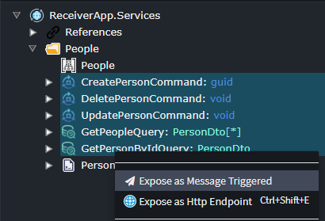
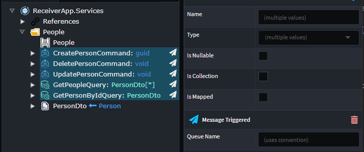
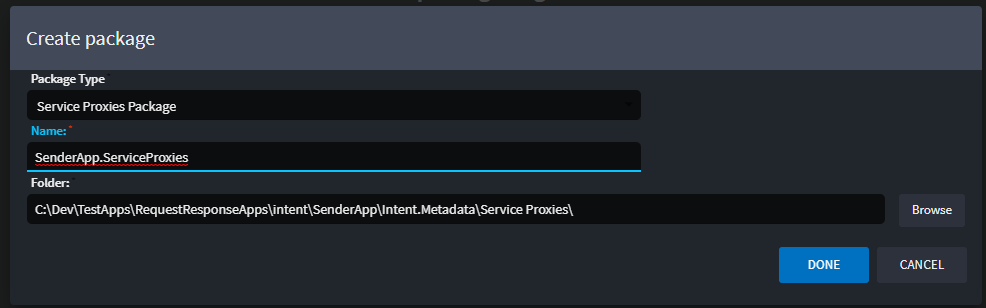
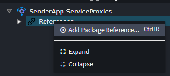
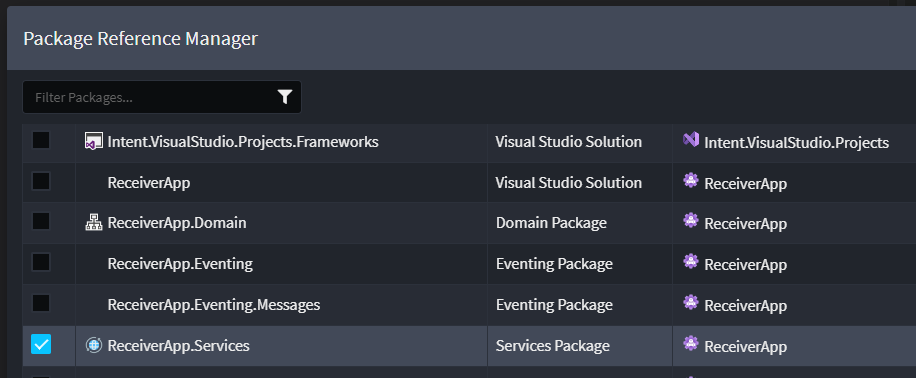
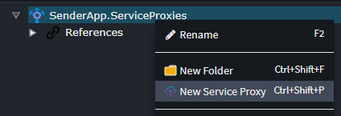

# Intent.Eventing.MassTransit.RequestResponse

This module extends the MassTransit module with the capability to perform Request/Response messaging.

## What is MassTransit's Request feature?

Request/response is a commonly used message pattern where one service sends a request to another service, continuing after the response is received. In a distributed system, this can increase the latency of an application since the service may be hosted in another process, on another machine, or may even be a remote service in another network. While in many cases it is best to avoid request/response use in distributed applications, particularly when the request is a command, it is often necessary and preferred over more complex solutions.

For more information on MassTransit's Request feature, check out their [official docs](https://masstransit.io/documentation/concepts/requests).

## What's in this module?

* Exposing Commands/Queries for handling Message broker requests.
* Selecting which Commands/Queries to generate Clients and their Contracts.
* MassTransit Consumer for dispatching MediatR Commands/Queries.

## Exposing Commands/Queries for handling Message Broker requests

In your application that will be used to expose your Commands / Queries for message-broker consumption; select them, right-click and select `Expose as Message Triggered`.



Once that is done, you can choose to specify their queue names if you don't want them to use the default naming convention.



> ⚠️ **NOTE**
> 
> The generated Messages that will be used to travel across the message-broker will use the Package name as the Namespace. This is because MassTransit requires that Messages have exactly the same Name and Namespaces for both the sender and receiver.
 
## Selecting which Commands/Queries to generate Clients and their Contracts

In your application that will be used to communicate with the Receiver application, you will need to open the Service Proxy designer and create a new package.



Once done, you will need to add a reference to the Receiver app's Service package.



Locate and select the Service package of the Receiver app.



Right click on the Service Proxy package and select `New Service Proxy`.



Choose the Commands / Queries you wish to invoke using this Service Proxy.


This is what the Service Proxy will look like once its created.


## Using Service Proxies in your Code

Once the Service Proxy has been setup, you can inject it like a normal service in your code and invoke it.

```csharp
public class PerformFunctionCommandHandler : IRequestHandler<PerformFunctionCommand>
{
    private readonly IPeopleService _peopleService;

    [IntentManaged(Mode.Merge)]
    public PerformFunctionCommandHandler(IPeopleService peopleService)
    {
        _peopleService = peopleService;
    }

    [IntentManaged(Mode.Fully, Body = Mode.Ignore)]
    public async Task Handle(PerformFunctionCommand request, CancellationToken cancellationToken)
    {
        await _peopleService.CreatePersonAsync(CreatePersonCommand.Create(request.Name), cancellationToken);
    }
}
```

> ⚠️ **NOTE**
> 
> These proxy invocations are "synchronous" in nature even though it has the async/await capabilities. The operation completes once it has received a reply from the Receiving application.