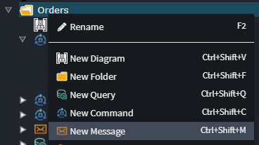
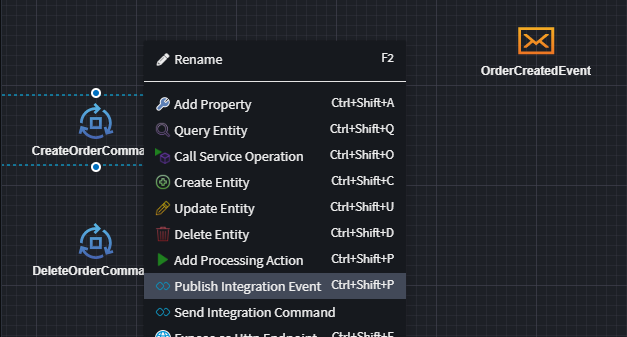
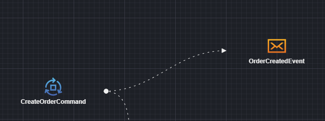
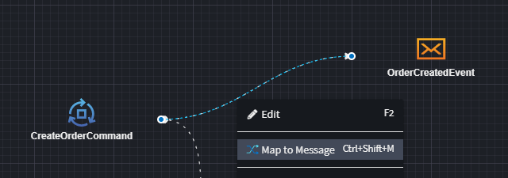
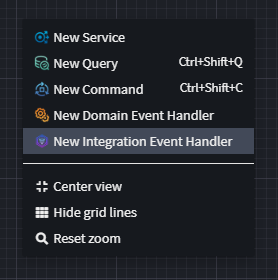
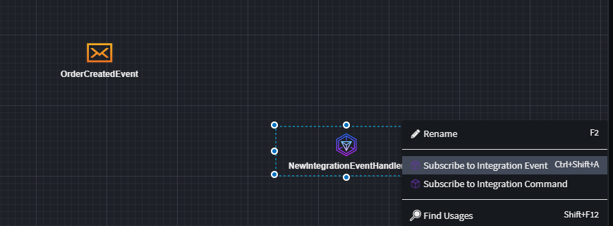
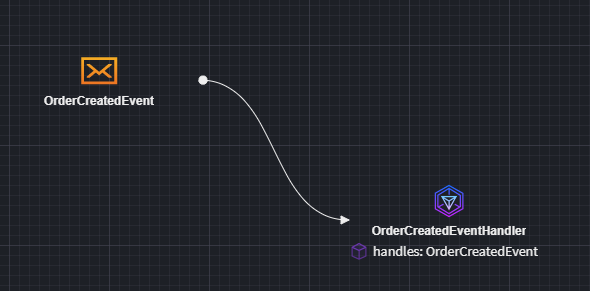

# Intent.Eventing.MassTransit

This module provides patterns for working with MassTransit.

## What is MassTransit?

MassTransit is an open-source distributed application framework for building and managing message-based communication systems in .NET applications. It provides a comprehensive set of tools and abstractions to simplify the implementation of event-driven architectures, allowing components of a system to communicate seamlessly through messages. MassTransit abstracts away the complexities of managing message queues, routing, and serialization, enabling developers to focus on designing and developing the core functionality of their applications. It supports various messaging patterns like publish/subscribe, request/response, and more, making it a versatile choice for building scalable, decoupled, and maintainable systems.

For more information on MassTransit, check out their [official docs](https://masstransit.io//).

## What's in this module?

* Modeling Integration Events and Commands.
* MassTransit Message Broker Implementation.
* Message Publishing.
* Message Consumption.
* Multi-tenancy Finbuckle integration.
* `app.settings` configuration.
* Dependency Injection wiring.
* Telemetry support.

## Modeling Integration Events and Commands

From version `6.0.0` of this Module, modeling Integration Events can be achieved from within the Services designer.

### Publishing Integration Events

Create an Integration Event by right-clicking on a Folder and selecting `New Message`.



You can drag that Message onto the diagram in order to make publish from elements or subscribe handlers to those Events.

Right click on an element you wish to publish from (that has the context menu option available).



Drag the line to the Message that needs to be published. 



Finally map what the element should populate on the Message by right-clicking on the dotted line and selecting the `Map to Message` option.



### Subscribing to Integration Events

Right click on the diagram or the Services tree-view and select `New Integration Event Handler`.



Introduce the Message that you want to subscribe to by either creating it (as a duplicate potentially) as done [here](#publishing-integration-events) or by referencing the package that contains that Event in Intent Architect through right-clicking on `References` of your Services package and selecting `Add Package Reference...`.
Ensure that the Message is present on the diagram. 

To subscribe to the Event, right-click on the newly created Integration Event Handler and select `Subscribe to Integration Event`.



Drag the line to the Event message and will then add a handler operation to work from.




## Modules Settings

### Messaging Service Provider Setting

Configure what your underlying message broker is, the supported options are:

* In Memory
* Rabbit MQ
* Azure Service Bus
* Amazon SQS

> ⚠️ **NOTE**
> The in-memory transport is a great tool for testing, as it doesn't require a message broker to be installed or running. It's also very fast. But it isn't durable, and messages are gone if the bus is stopped or the process terminates. So, it's generally not a smart option for a production system

### Outbox Pattern Setting

Configure your Outbox pattern implementation, the supported options are:

* None
* [In Memory](https://masstransit.io/documentation/patterns/in-memory-outbox)
* [Entity Framework](https://masstransit.io/documentation/patterns/transactional-outbox)

> ⚠️ **NOTE**
> Using an Outbox pattern for Consumers will also introduce idempotency to ensure that the same messages doesn't get processed more than once.

### Retry Policy Setting

Configure the messaging retry strategy. Once the retry strategy is exhausted, the failing message will be placed in a error queue.

* None: No retries occur (not recommended).
* Immediate: Consecutive retries for a specified number of times without delay.
* Interval: Retry with constant intervals, for a specified number of times.
* Exponential: The retry interval increases exponentially, typically doubling each time.
* Incremental: Retry interval increases by a consistent margin.

For more information on these options check out the MassTransit [documentation](https://masstransit.io/documentation/concepts/exceptions#retry).

## Designer Support - Eventing Designer

The eventing designer can be used to describe messaging from an Applications perspective. This really boils down to the following:

* The message contracts, i.e. the message content.
* Which messages the application publishes.
* Which messages the application subscribes to.

## MassTransit Message Broker Implementation

Provider a MassTransit specific implementation of the `IEventBus` interface.

## Message Publishing

Message publishing can be done through the `IEventBus` interface using the `Publish` method.

## Message Consumption

For every message subscribed to in the `Eventing Designer`, this module will register up an Infrasrtuctual handler (`WrapperConsumer`)  which will deal with all the technical concerns around how the message is processed and delegate the business logic processing to an Application layer inegration message handler, which implements `IIntegrationEventHandler`.

An example of the technical message handler registration:

```csharp

    public static class MassTransitConfiguration
    {

      ...

        private static void AddConsumers(this IRegistrationConfigurator cfg)
        {
            cfg.AddConsumer<WrapperConsumer<IIntegrationEventHandler<CustomerCreatedIntegrationEvent>, CustomerCreatedIntegrationEvent>>(typeof(WrapperConsumerDefinition<IIntegrationEventHandler<CustomerCreatedIntegrationEvent>, CustomerCreatedIntegrationEvent>)).Endpoint(config => config.InstanceId = "NewApplication");
        }
    }
```

The is what the Business logic Integration Event handler looks like:

```csharp

    [IntentManaged(Mode.Merge, Signature = Mode.Fully)]
    public class CustomerCreatedIntegrationEventHandler : IIntegrationEventHandler<CustomerCreatedIntegrationEvent>
    {
        [IntentManaged(Mode.Ignore)]
        public CustomerCreatedIntegrationEventHandler()
        {
        }

        [IntentManaged(Mode.Fully, Body = Mode.Ignore)]
        public async Task HandleAsync(CustomerCreatedIntegrationEvent message, CancellationToken cancellationToken = default)
        {
            throw new NotImplementedException();
        }
    }

```

## Multi-tenancy Finbuckle Integration

If you have the `Intent.Modules.AspNetCore.MultiTenancy` module install, this module will add Multi-tenancy support to your MassTransit implementation. All outbound messages published will automatically include a tenant identifier in the header and all message consumers which encounter messages with a tenant identifier will set up the Finbuckle tenancy for the processing of the message.

Notable details of the implementation:

* Tenancy Publishing Filter, this filter adds the current Tenant Identity to outbound messages.
* Tenancy Consuming Filter, reads the Tenant Identity in inbound messages and configures Finbuckle accordingly.
* Finbuckle Message Header Tenancy Strategy, Finbuckle integration with setting up Tenancy through Message headers.

You can configure the name of the header in your `appsettings.json`, by default the header will be "Tenant-Identifier". If you re-configure these make sure the configuration is done across publishers and consumers.

```json
{
  "MassTransit": {
    "TenantHeader": "My-Tenant-Header"
  }
}
```

### `app.settings` configuration

You `app.settings.json` will have 2 sections populated, one for MassTransit itself and the other for your specific message broker. illustrated below.

```json
  "MassTransit": {
    "RetryIncremental": {
      "RetryLimit": 10,
      "InitialInterval": "00:00:05",
      "IntervalIncrement": "00:00:05"
    },
    "RetryImmediate": {
      "RetryLimit": 5
    }
  },
  "RabbitMq": {
    "Host": "localhost",
    "VirtualHost": "/",
    "Username": "guest",
    "Password": "guest"
  }
```

### Dependency Injection wiring

Registers up the MassTransit dependency injection in the Infrastructure layer.

```csharp
    public static class DependencyInjection
    {
        public static IServiceCollection AddInfrastructure(this IServiceCollection services, IConfiguration configuration)
        {
            ...
            services.AddMassTransitConfiguration(configuration);
            ...
        }
    }
```

Adds a MassTransit Configuration file, which look similar to this depending on your configuration.

```csharp
    public static class MassTransitConfiguration
    {
        public static void AddMassTransitConfiguration(this IServiceCollection services, IConfiguration configuration)
        {
            services.AddScoped<MassTransitEventBus>();
            services.AddScoped<IEventBus>(provider => provider.GetRequiredService<MassTransitEventBus>());

            services.AddMassTransit(x =>
            {
                x.SetKebabCaseEndpointNameFormatter();
                x.AddConsumers();

                x.UsingInMemory((context, cfg) =>
                {
                    cfg.UseMessageRetry(r => r.Immediate(
                        configuration.GetValue<int?>("MassTransit:RetryImmediate:RetryLimit") ?? 5));
                    cfg.ConfigureEndpoints(context);
                    cfg.UseInMemoryOutbox();
                });
                x.AddInMemoryInboxOutbox();
            });
        }

        private static void AddConsumers(this IRegistrationConfigurator cfg)
        {
        }
    }

```

### Telemetry support

If you have the `Intent.OpenTelemetry` module installed, this module will register `MassTransit` up as a telemetry source.

## Related Modules

### Intent.Eventing.MassTransit.EntityFrameworkCore

This modules provides patterns around using Entity Framework Core as the technology provider for the OutBox pattern.

### Intent.Eventing.MassTransit.Scheduling

This module brings in the ability to publish scheduled messages.

## Local Development

If you are running docker you can get RabbitMQ upo and running using a command like

```text
docker run -it --rm --name rabbitmq -p 5672:5672 -p 15672:15672 rabbitmq:3.11-management
```

You should be able to access the admin console through `http://localhost:15672/`.  
