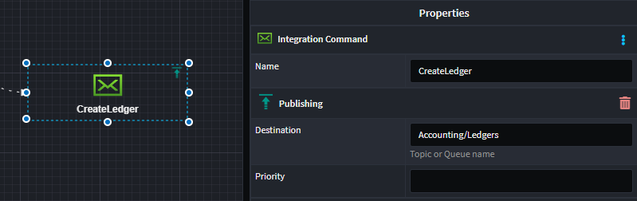
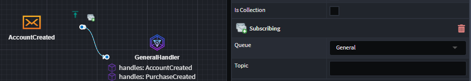

# Intent.Eventing.Solace

This module provides patterns for working with Solace as a publish/subscribe message system.

## What is Solace?

Solace is a sophisticated pub-sub messaging platform designed to facilitate real-time data distribution and integration across various systems, applications, and devices. Utilizing a distributed architecture, Solace enables efficient, scalable, and reliable message brokering, supporting diverse messaging patterns such as publish-subscribe, message queueing, request-reply, and streaming. Its capabilities include high throughput, low latency, and robust fault tolerance, making it ideal for dynamic and demanding environments like financial services, IoT, and telecommunications. Solace integrates seamlessly with cloud services, enterprise applications, and open-source technologies, providing a unified messaging layer that enhances interoperability and data flow within complex digital ecosystems.

For more information on Solace, check out their [official docs](https://solace.com/products/event-broker/software/getting-started/).

## Overview

This module generates code to work with Solace's [`SolaceSystems.Solclient.Messaging` NuGet package](https://www.nuget.org/packages/SolaceSystems.Solclient.Messaging), in particular:

- SolaceEventBus, for publishing messages.
- SolaceConsumingService, for subscribing to and processing messages.

An ASP.NET Core [BackgroundService](https://learn.microsoft.com/aspnet/core/fundamentals/host/hosted-services) is added using [`AddHostedService<THostedService>(IServiceCollection)`](https://learn.microsoft.com/dotnet/api/microsoft.extensions.dependencyinjection.servicecollectionhostedserviceextensions.addhostedservice) to run a Solace Consumer for each queue an application is subscribed to and ultimately dispatches incoming events to handlers which we generate and to which any additional services can be dependency injected into the constructor as is idiomatic when working with .NET.

To publish a message using manually written code, inject the `IEventBus` interface into the constructor where you want to use it and call the `Publish<T>(T)` method on it. Calling this method merely adds the message to an in-memory collection and is only dispatched to Solace once the `IEventBus`'s `FlushAllAsync(CancellationToken)` method is called. If you're using Intent Architect's standard architecture templates, they already ensure that `FlushAllAsync` is called at the end of each operation, typically after committing database transactions to minimize the possibility of messages being published and a transaction failing shortly after.

## Modeling Integration Events

This module automatically installs the `Intent.Modelers.Eventing` module which provides designer modeling capabilities for integration events. For details on modeling integration events, refer to its [README](https://github.com/IntentArchitect/Intent.Modules/blob/development/Modules/Intent.Modules.Modelers.Eventing/README.md).

## Messaging Locations

### Publishing locations

When publishing an Integration 'Message' it will go to a `Topic` with the full name of the Message type, e.g. if the message type is 'Sample.Messages.CustomerCreated' the `Topic` name will be "Sample/Messages/CustomerCreated".
When publishing an Integration 'Command' it will go to a `Queue`with the full name of the Message type, e.g. if the message type is 'Sample.Commands.CreateCustomer' the `Queue` name will be "Sample/Commands/CreateCustomer".

You can get specific about the publishing location by applying the `Publishing` stereotype to the `Message` or `IntegrationCommand` and specifying the address.



### Subscription locations

When subscribing to an Integration 'Message' a `Queue` will be configured based on the subscribing application name and the Message type, e.g. If the application name is "MyApp" if the message type is 'Sample.Messages.CustomerCreated' the queue name will my "MyApp/Sample/Messages/CustomerCreated". The application name is prepended as you can have multiple subscribing applications to topics.

When subscribing to an Integration 'Command' it will use the `Queue` the command was published to.

You can get specific about the subscription location by applying the `Subscribing` stereotype to the `Message` or `IntegrationCommand` and specifying the `Queue` the subscription should occur on as well as the Topic to subscribe too(This could be a wild card subscription).



You will need to model your queues for this, simply you `Queue`s in the service designer, so you can select them in the `Subscribing` stereotype.

You can set the following properties on the queue:

- Max Flows, configures the number of concurrent messages which can be process from the queue. (WindowSize)
- Selector, configures a selector filter for the queue, typically used for load balancing.


## Application Settings

You `appsettings.json` will contain configuration for connection to your `Solace` server, the configuration looks as follows.

```json
  "Solace": {
    "Host": "tcp://localhost:55555",
    "VPNName": "default",
    "UserName": "admin",
    "Password": "admin",
    "Application": "MyApp"
  }
```

### Additional Settings

| Settings  | Type | Description|
| ------------- | ------------- |------------- |
| EnvironmentPrefix  | string | All Queues and Topics will be prefixed with this value.|
| DefaultSendPriority | int | All messages send without a specific priority, will have this default priority |
| BindQueues | boolean | This setting can be used to turn of message subscriptions for an application instance. (Default: true) |

## Variable Replacement on Names

When specifying names for Queues, Topics and Selectors, you can use variables using the `{}` syntax. These variables will be substituted at run time but `SolaceConfig` properties, which are backed by the appsettings.json.

For example: You could could subscribe to a topic using the following Queue '{Application}/MyQueue' which would equate to 'MyApp/MyQueue' at runtime. 