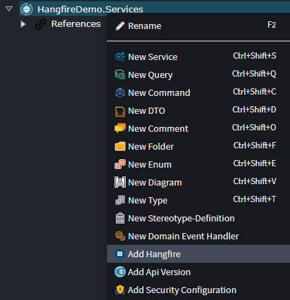
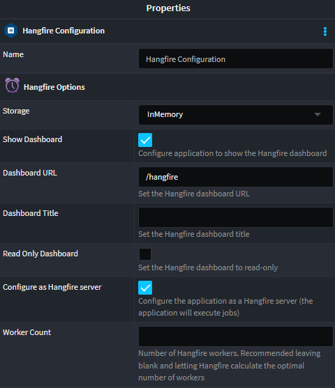
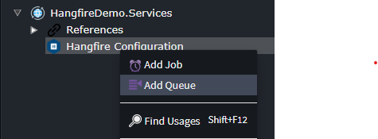

# Intent.Modules.Hangfire

This module provides patterns for time based, as well as fire-and-forget jobs, using Hangfire.

## What is Hangfire?

Hangfire is an open-source framework that helps you to create, process and manage your background jobs. Hangfire supports several kinds of background tasks: short-running and long-running, CPU intensive and I/O intensive, one shot and recurrent

For more information on Hangfire, check out their [official docs](https://www.hangfire.io/).

## What's in this module?

This module creates the required infrastructure to run Hangfire in a .NET web application, as well as Windows service:-

* Hangfire host registration 
* Optional Hangfire Dashboard registration and configuration
* Job generation

## Service Designer

### Hangfire Configuration
In the `Service Designer`, right click on your service package and select the `Add Hangfire` context menu option:

This will add the core Hangfire components to the application, with the following options:

#### Hangfire Configuration Options

##### Show Dashboard
If this condition is on (the default value), then the Hangfire Dashboard will be added to the application

##### Dashboard URL
The URL on which the Hangfire dashboard will be served. The default is `/hangfire`

##### Dashboard Title
The title which appears on the dashboard when browsing to it

##### Read Only Dashboard
If this condition is off (the default value), the dashboard can be used to trigger scheduled jobs, or reprocess completed jobs. If this condition is on, the dashboard is read-only and is used for monitoring purposes only.

##### Configure as Hangfire Server
If this condition is on (the default value) the application is treated as a Hangfire server and will serve as one of, potentially many, servers which will process Hangfire jobs. If this condition is off, the application will only be able to create/schedule jobs, but not perform the processing of the jobs.

##### Worker Count
This value indicates the number of paralell internal processors (workers) are created to handle job processing (i.e. the maxiumum number of jobs which can be processed in parallel). If left blank (the recommendation) Hangfire will automatically calculate the optimal number of workers.

### Hangfire Jobs and Queues

Once the core Hangfire configuration is completed, one or more jobs and/or queues can be added. In the `Service Designer`, right click on the `Hangfire Configuration` and select the `Add Job` or `Ad Queue` context menu option:

#### Queues

Zero or more queues can be added to the Hangfire configuration, which allows for different jobs to be prioritised, or split across different servers (for example):

A queue is not required to be added, and if none are added, a single _default_ queue to will be used for all job processing.

#### Jobs

Zero or more queues can be added to the Hangfire configuration. Adding a job will provide you with the folling job options:

##### Name
The unique name of the job

##### Enabled
If this option is on (the default), the job processing code included, otherwise it is excluded from the application. 

##### Job Type
The type of the job being added. The available options:
* Recurring (the default): These jobs are executed many times on a specific CRON schedule
* Delayed: These jobs are executed only once, but only after the specified time interval
* Fire and Forget: These jobs are executed only once, and almost immediately after they are fired.

##### Cron Schedule

Specifies the interval on which the job should executing, using the cron expression format.

> Only applicable when _Job Type_ is **Recurring** 

##### Disallow Concurrent Execution

If this condition is set, then only one instance of the recurring job can be executed at any given time.

> Only applicable when _Job Type_ is **Recurring** 

##### Concurrent Execution Timeout

The amount of time, in seconds, a duplicate job will wait (if _Disallow Concurrent Execution_ is set) before it is cancelled.

> Only applicable when _Job Type_ is **Recurring** 

##### Delay Time Frame

The unit of the _Delay Value_, the amount of time delayed before the job is executed.

> Only applicable when _Job Type_ is **Delayed** 

##### Delay Value

The value of the _Delay Time Frame_, the amount of time delayed before the job is executed.

> Only applicable when _Job Type_ is **Delayed** 

##### Queue

The _optional_ queue on which the job should be queued when executed. If no queue is specified, the _default_ queue will be used.