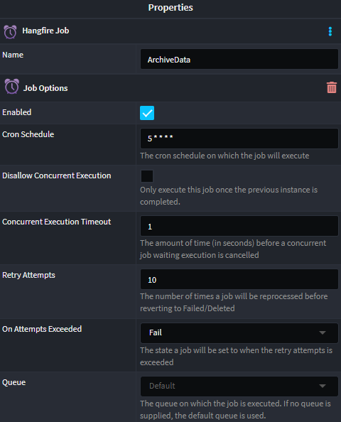

# Intent.Hangfire

This module provides patterns for time based, as well as fire-and-forget jobs, using Hangfire.

## What is Hangfire?

Hangfire is an open-source library for .NET that facilitates background job processing in a reliable and scalable manner - it allows developers to create, manage, and execute background tasks. Hangfire supports several different kinds of background tasks: short-running and long-running, CPU intensive and I/O intensive, one shot and recurrent

For more information on Hangfire, check out their [official docs](https://www.hangfire.io/).

## What's in this module?

This module creates the required infrastructure to run Hangfire in a .NET web application, as well as Windows service:-

* Hangfire host registration
* Optional Hangfire Dashboard registration and configuration
* Job generation

## Hangfire Application Settings

The following configuration settings are available on the `Application Settings` screen.

### Storage

The storage mechanism utilized by Hangfire. Available options are:

* In Memory: all job information, including job execution history is stored in memory and is lost if the service is restarted
* SQL Server: all job information is stored in SQL Server tables and is persisted even if the service is restarted
* None: no storage mechanism is configured by Intent Architect. The configuration is entirely up to the developer.

#### Show Dashboard

If this condition is on (the default value), then the Hangfire Dashboard will be exposed using the _Dashboard Url_

#### Dashboard URL

The URL on which the Hangfire dashboard will be served. The default is `/hangfire`

#### Dashboard Title

The title which appears on the dashboard when browsing

#### Read Only Dashboard

If this condition is off (the default value), the dashboard can be used to trigger scheduled jobs, or reprocess completed jobs. If this condition is on, the dashboard is read-only and is used for monitoring purposes only.

#### Configure as Hangfire Server

If this condition is on (the default value) the application is configured as a Hangfire server and will function as a servers, processing Hangfire jobs. If this condition is off, the application will only be able to create/schedule jobs, but not process any jobs.

#### Worker Count

This value indicates the number of parallel internal processors (workers) created to handle job processing (i.e. the maximum number of jobs which can be processed in parallel). If left blank (the recommendation) Hangfire will automatically calculate the optimal number of workers based on CPU's available.

### Job Retention Hours

The time frame, in hours, that the history of completed jobs (successful or deleted) will be retained before expiring and being removed from Hangfire

## Hangfire Jobs and Queues

In the `Services Designer`, one or more jobs and/or queues can be added. Right click on the `Services Package` or a `Folder` and select the `Add Job` or `Add Queue` context menu option:

### Queues

Zero or more queues can be added to the Hangfire configuration, which allows for different jobs to be prioritized, or split across different servers (for example):


A queue is not required to be added, and if none are added, a single _default_ queue to will be used for all job processing.

### Jobs

Zero or more queues can be added to the Hangfire configuration. Adding a job will provide you with the following job options:



#### Name

The unique name of the job

#### Enabled

If this option is on (the default), the job processing handler code is included, otherwise it is excluded from the application.

#### Cron Schedule

Specifies the interval on which the job should executing, using the cron expression format. [This website](https://crontab.guru/) can be used to generate a cron expression.

#### Disallow Concurrent Execution

If this condition is set, then only one instance of the recurring job can be executed at any given time.

#### Concurrent Execution Timeout

The amount of time, in seconds, a duplicate job will wait (if _Disallow Concurrent Execution_ is set) before it is cancelled.

#### Retry Attempts

The number of times the processing of the job will be retried, in the case where the job did not complete successfully.

#### On Attempts Exceeded

When the processing of a job has been retried more than _retry attempts_ number of times, this is the final state the job will be moved into. Options are _Fail_ and _Deleted_

#### Queue

The _optional_ queue on which the job should be queued when executed. If no queue is specified, the _default_ queue will be used.

## Dashboard Authorization

Authorization to the Hangfire Dashboard (accessible on the setting _Dashboard URL_) is controlled via the `Authorize` method in `HangfireDashboardAuthFilter`. By default this only allows logged in users access:

``` csharp
public bool Authorize(DashboardContext context)
{
    var currentUser = context.GetHttpContext().RequestServices.GetRequiredService<ICurrentUserService>();
    return currentUser.UserId is not null;
}
```

This method should be updated to perform your specific authorization checks to grant access to the dashboard, or to return `true` if anyone is allowed access:

``` csharp
public bool Authorize(DashboardContext context)
{
    // grant access to everyone
    return true;
}
```

> [!NOTE]  
> By default, you will not be able to access the Hangfire dashboard locally while developing, unless authenticated or the `HangfireDashboardAuthFilter > Authorize` method is changed as per the above.

## Appsettings Cron Configuration

By default, cron expressions configured for _recurring jobs_ are set in the C# code. However, these values can be overwritten (per job), but setting a value in `appsettings.json`. The value set in appsettings.json will take precedence over the value set in code. In other words, if a value is configured in Intent Architect (and thus set in code), it can be overwritten by adding a different value in `appsettings.json`:

``` json
  "Hangfire": {
   "Jobs": {
     "MyJobName": {
       "CronSchedule": "5 * * * *"
     }
   }
  }
```

Ensure that the job name in the appsettings.json (_MyJobName_ in the above example) matches the name of the job configured in Intent Architect and generated in the C# code.
