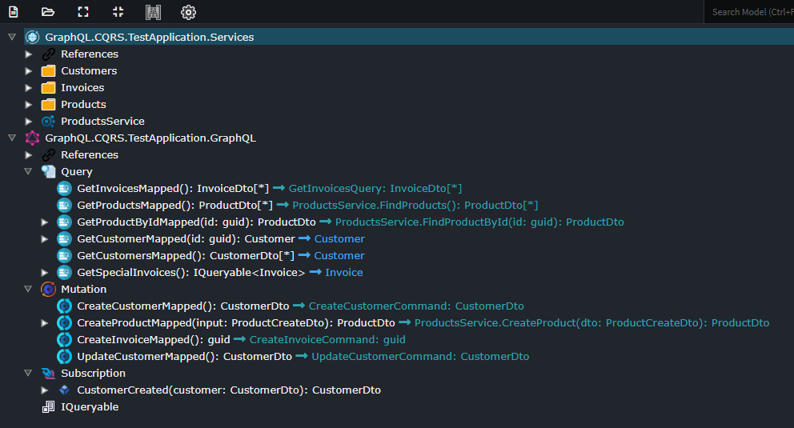
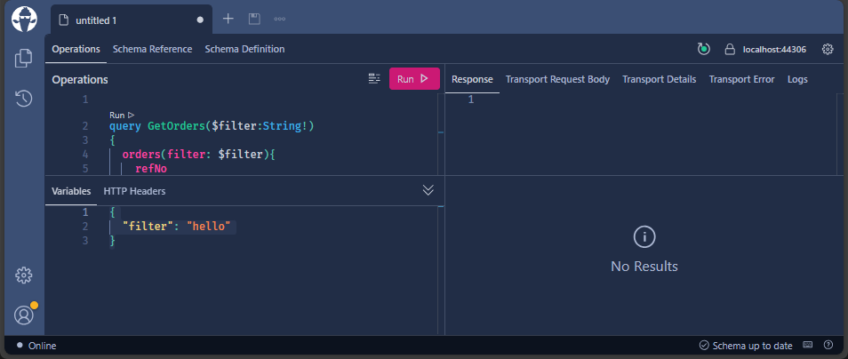

# Intent.HotChocolate.GraphQL

GraphQL is a query language for APIs and a runtime for executing those queries with existing data. It offers a more efficient, powerful, and flexible approach to API design compared to traditional REST APIs. With GraphQL, clients can request only the data they need, reducing over-fetching and under-fetching issues commonly encountered in REST. It provides a strongly-typed schema, allowing clients to know exactly what data is available and how to request it, leading to better documentation and fewer communication overheads between frontend and backend teams. Additionally, GraphQL supports real-time updates and enables the composition of multiple data sources into a single query, making it a versatile solution for building modern web and mobile applications.

This module installs GraphQL patterns using [HotChocolate](https://chillicream.com/docs/hotchocolate/v13).

## Designer Modeling

You can simply expose you application services over GraphQL by adding the `GraphQL Enabled` stereotype to the services.

Alternatively you can model out more explicit GraphQL endpoints.

## Development

To access the "GraphQL Playground" run your application and connect to https://localhost/graphql/ (https://localhost:{PortNumber}/graphql/)

