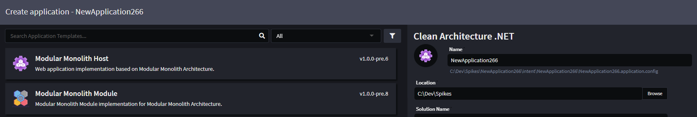

# Intent.ModularMonolith.Module

This module works with-in the `Modular Monolith Module` **Architecture Template**, and configures various aspects of module application.

## What is the Modular Monolith Architecture?

A modular monolith is a software architecture style where the application is built as a single, deployable unit (a monolith) but is internally divided into well-structured, independent modules. Each module encapsulates a specific domain or feature set, enforcing strong boundaries and separation of concerns, often resembling the design of microservices but without the operational overhead of distributed systems. This approach allows teams to gain many of the benefits of modularity—such as easier testing, better maintainability, and clearer domain organization—while still enjoying the simplicity of monolithic deployment and runtime.

## How to setup your Modular Monolith Solution

- Create your `Modular Monolith Host` using the `Modular Monolith Host` **Architecture Template**.
- Add Modules to the host by create new applications using the `Modular Monolith Module` **Architecture Template**.

- 

Your Intent Architect solution should look similar to this-

- 

