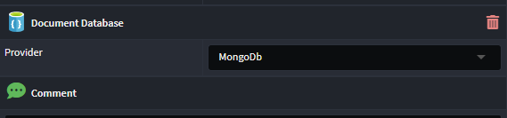

# Intent.MongoDb

This module provides patterns for working with MongoDB.

## What's is MongoDB?

MongoDB is a popular open-source, document-oriented NoSQL database management system that provides a flexible and scalable approach to storing and managing data. Unlike traditional relational databases, MongoDB stores data in a JSON-like format called BSON, which allows for the representation of complex and dynamic structures. It enables developers to work with data in a more natural and intuitive manner, making it suitable for a wide range of applications, from web and mobile applications to data analytics and content management systems. MongoDB's key features include horizontal scalability, support for sharding and replication, dynamic schema design, and powerful querying capabilities. It has gained popularity for its ability to handle large volumes of unstructured or semi-structured data while offering high performance and ease of development.

For more information on MongoDB, check out their [official site](https://www.mongodb.com/).

## What's in this module?

This module consumes your `Domain Model`, which you build in the `Domain Designer` and generates the corresponding MongoDB implementation:-

* Database context
* Unit of Work.
* `app.settings` configuration.
* Dependency Injection wiring.

These MongoDB patterns are realized using [MongoFramework](https://github.com/TurnerSoftware/MongoFramework).

## Domain Designer

When designing domain models for MongoDB your domain package must be annotated with the `Document Database` stereotype. If you have multiple Document DB technologies modules, you must explicitly indicate which Domain Packages contain MongoDB domain models, by setting `Document Database`'s `Provider` property to MongoDB.



## Multi-Tenancy Support

The module can work in conjunction with the `Intent.Modules.AspNetCore.MultiTenancy`. This module currently only support the `Seperate Databases` Data Isolation option.

In this setup each tenant will connection to their own MongoDB, you simply need to configure your connection strings per tenant.

Here is a sample configuration for the `In Memory` tenant store.

```csharp

public static void InitializeStore(IServiceProvider sp)
{
    var scopeServices = sp.CreateScope().ServiceProvider;
    var store = scopeServices.GetRequiredService<IMultiTenantStore<TenantInfo>>();

    store.TryAddAsync(new TenantInfo() { Id = "sample-tenant-1", Identifier = "tenant1", Name = "Tenant 1", ConnectionString = "mongodb://localhost/MongoMultiTenant1" }).Wait();
    store.TryAddAsync(new TenantInfo() { Id = "sample-tenant-2", Identifier = "tenant2", Name = "Tenant 2", ConnectionString = "mongodb://localhost/MongoMultiTenant2" }).Wait();
}

```

## Related Modules

### Intent.Metadata.DocumentDB

This module provides Document DB related stereotypes for extending the Domain Designer with Document DB technology specific data.

### Intent.Entities

This module generated domain entities as C# classes, which are used by this model.

### Intent.MongoDb.Repositories

This module provides a MongoDB repository pattern implementation.
