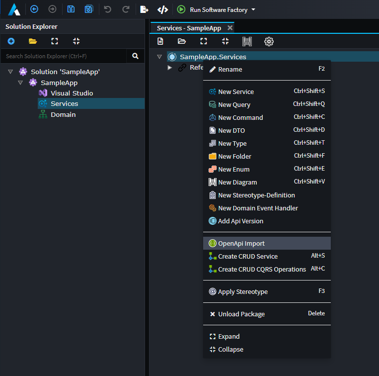
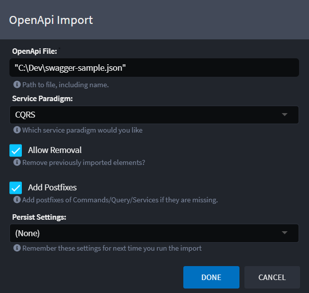

# Intent.OpenApi.Importer

This module enhances the `Service Designer` allowing you to import / reverse engineer service models from OpenApi documents.

## Service Designer

In the `Service Designer`, right click on your service package (or a folder in the package) and select the `OpenApi Import` context menu option.

Selecting this option will provide you with the following dialog:

### Dialog options

#### OpenApiFile

File path to the OpenApi document to import. Note this document needs to be at least version 3.x, if you are working with an older version document you can potentially use tools like `https://editor.swagger.io/` to upgrade older format files to the new standard.

The importer allows for `"` around the file name, these are not required. The Windows `Copy as Path` feature puts `"` around the file name so we support this for ease of use.

#### Service Paradigm

Select the paradigm you want the service modelled in:

- CQRS
- Traditional service

#### Allow Removal

The importer tracks what data it has imported, if this setting is enabled, the importer will remove any previously imported data.

#### Add Postfixes

If this option is on, it adds the relevant postfixes to your imported services, if they are not present. The postfixes are:

- Command
- Query
- Service

For example if you had a service end point named CreateCustomer and you select CQRS paradigm, the command will be named `CreateCustomerCommand` rather than simply `CreateCustomer`.

#### Persist Settings

The dialog can remember your configuration for the next time you want to run it. If you choose to persist the settings, they are saved in the `Services Package` which is committed in your source code repository.

- `(None)`,  settings will not be persisted and remembered. Previously saved configuration will be deleted.
- `All`, All settings will be persisted.
