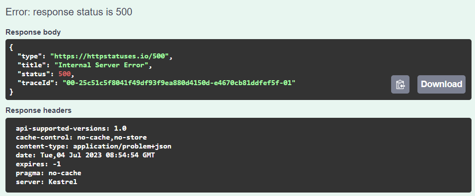
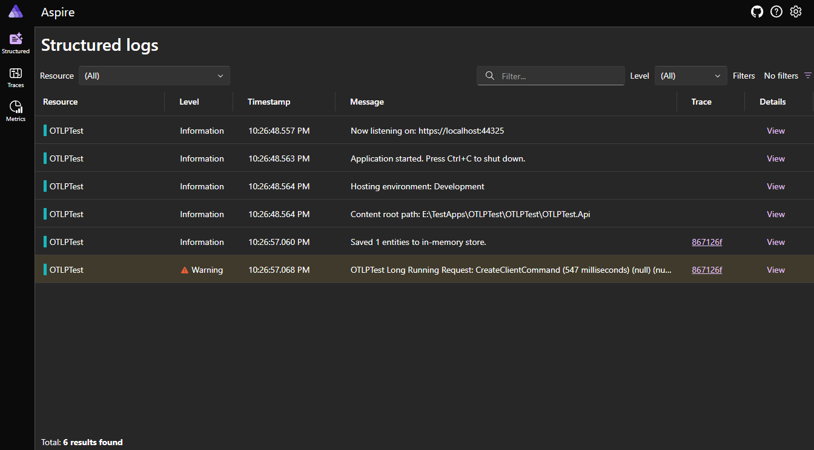

# Intent.OpenTelemetry

## Overview

The `Intent.OpenTelemetry` module provides a comprehensive framework for integrating observability into your ASP.NET Core applications. With OpenTelemetry, developers can collect and export telemetry data, such as traces, metrics, and logs, from their applications to various observability backends, enhancing their ability to monitor application performance and diagnose issues.

## What is OpenTelemetry?

OpenTelemetry is an open-source initiative for creating universal standards for telemetry data collection, including distributed tracing, metrics, and logging. By implementing OpenTelemetry in your applications, you can gain valuable insights into how your system behaves in real time.

### Why Use OpenTelemetry?

Applying OpenTelemetry in your applications allows you to:

- **Improve Performance Monitoring**: Track and visualize request paths, system performance, and infrastructure health.
- **Support Error Diagnosis**: Identify where errors occur and understand the context in which they happen.
- **Visualize Metrics**: Gain insights into application performance metrics over time, such as request latency or error rates.

With OpenTelemetry integrated, you can seamlessly connect to various Application Performance Monitoring (APM) tools like Azure Application Insights, Aspire Dashboard, and Elastic Search, enriching your application’s observability landscape.

### Example

In the example below there are 3 different microservices that talk to one another through an HTTP Client and Message Broker integration. It also captured the Serilog messages as part of the transaction details.


Use the `Trace ID` that is returned due to request processing failure to find those logs and traces in your APM.



The number that is situated between the first two `-` symbols (`25c51c5f8041f49df93f9ea880d4150d` in this case) is the `Operation ID` that you can use in your APM to look up the message trace as shown above.

## Export Options

The `Intent.OpenTelemetry` module supports multiple export options, which can be configured based on your application's requirements:

- **Azure Application Insights**: Directly send telemetry data to Azure Application Insights, allowing for deep performance analytics and powerful alerting capabilities.

- **Azure Monitor OpenTelemetry Distro**: Utilize the Azure-specific OpenTelemetry distribution for enhanced compatibility and features tailored for Azure environments like `Live metrics`.

- **Console**: Log telemetry data to the console, useful for debugging or local development scenarios where full observability might not be set up.

- **OpenTelemetry Protocol (OTLP)**: Use OTLP to export telemetry data to various consumers, including distributed tracing systems like Jaeger or logging backends like Elastic Search.

Alongside the export options, you can configure settings to control what type of telemetry is captured:

- **Capture Traces**: Monitor the journey of requests through your application, providing a detailed view of service interactions and timings.

- **Capture Metrics**: Collect metrics like request counts, error rates, and latencies for detailed performance analysis over time.

- **Capture Logs**: Integrate logs as part of your telemetry data, linking real-time logging information with distributed traces for easier troubleshooting.

## Running APM Locally with Aspire Dashboard

For local development, you can set up an Application Performance Monitoring (APM) system using the Aspire Dashboard. The following guide describes how to deploy it using Docker:

### Step 1: Pull the Aspire Dashboard Docker Image

First, ensure you have Docker installed on your machine. Then, run the following command to pull the Aspire Dashboard image:

```bash
docker pull mcr.microsoft.com/dotnet/aspire-dashboard
```

### Step 2: Run the Aspire Dashboard

Start the Aspire Dashboard using Docker:

```bash
docker run -d -p 18888:18888 -p 4317:18889 mcr.microsoft.com/dotnet/aspire-dashboard
```

### Step 3: Access the Dashboard

Once the container is running, visit `http://localhost:18888` in your web browser.
You will be greeted with the Aspire Dashboard, where you can visualize the performance metrics captured from your ASP.NET Core application.

### Connect to Azure Application Insights

Configure your application by choosing the `OTLP` export option and setting the URL in your appsettings.json file:

```json
"open-telemetry-protocol": {
    "endpoint": "http://localhost:4317",
    "protocol": "Grpc"
}
```

If you've configured your application to export telemetry to Azure Application Insights, you can view performance insights directly in the dashboard, making it easy to analyze your application's performance and troubleshoot issues in a unified interface.

By installing the `Intent.OpenTelemetry` module, you empower your ASP.NET Core application with robust observability capabilities, ensuring you have clear visibility into application performance and health.


