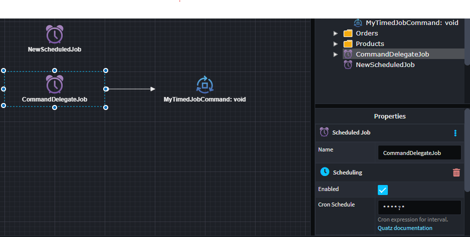

# Intent.QuartzScheduler

This module provides patterns for time based jobs, using Quartz.NET Scheduler.

## What is Quartz.NET Scheduler?

Quartz.Net Scheduler is an open-source job scheduling library for the .NET framework, offering a powerful and flexible way to schedule and manage tasks in applications. Developed as a port of the Quartz Scheduler for Java, Quartz.Net provides a feature-rich scheduling mechanism, allowing developers to define jobs and trigger them based on various criteria such as time intervals, cron expressions, or even in response to external events. The scheduler is designed to be highly configurable, supporting features like job persistence, clustering for distributed execution, and the ability to handle complex scheduling scenarios. It is commonly used in applications where periodic or recurring tasks need to be executed automatically, such as in the context of enterprise systems, batch processing, or background job execution in web applications.

For more information on Quartz.NET Scheduler, check out their [official docs](https://www.quartz-scheduler.net/).

## What's in this module?

This module creates the required infrastructure for a Windows Service:-

* Quartz.Net host registration 
* Job generation
* Mediator delegation to Commands (if modeled as such)
 

## Service Designer

You can model scheduled jobs in the services designer, using the CRON syntax to specify the scheduling.
`Scheduled Jobs` can be modeled to publish commands if you are using MediatR.

