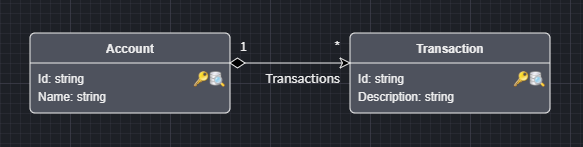
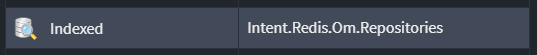
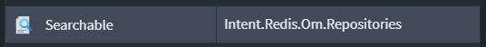

# Intent.Redis.Om.Repositories

This module provides patterns for modeling your domain and persisting it in a Redis Stack.

## What is Redis OM?

Redis OM .NET is a purpose-built library for handling documents in Redis Stack. This module uses this library to facilitate document storage and retrieval.

For more information, check out their [official docs](https://redis.io/docs/connect/clients/om-clients/stack-dotnet/).

## What's in this module?

This module consumes your `Domain Model`, which you build in the `Domain Designer` and generates the corresponding Redis OM implementation:

* Unit of Work and associated artifacts.
* Redis OM entities and associated artifacts.
* Repositories and associated artifacts.
* `app.settings` configuration.
* Dependency Injection wiring.

## Domain Modeling Notes

Modeling your domain for Redis OM will look familiar to modeling your domain for other database technologies in Intent Architect.

`Id` attributes will automatically have `Indexed` stereotypes applied since Redis OM requires fields be `Indexed` when one wants to query them.

Attributes can be marked as `Indexed` by applying this Stereotype.

Also you can make use of Full-text search by applying the `Searchable` Stereotype.

## Locally based development

You can develop locally by [installing Redis Stack](https://redis.io/docs/install/install-stack/).

Simplest is to use docker by invoking this command:

> docker run -d --name redis-stack-server -p 6379:6379 redis/redis-stack-server:latest

To connect and view your Redis Stack database, you can install and use [Another Redis Desktop Manager](https://github.com/qishibo/AnotherRedisDesktopManager/releases/tag/v1.6.3).