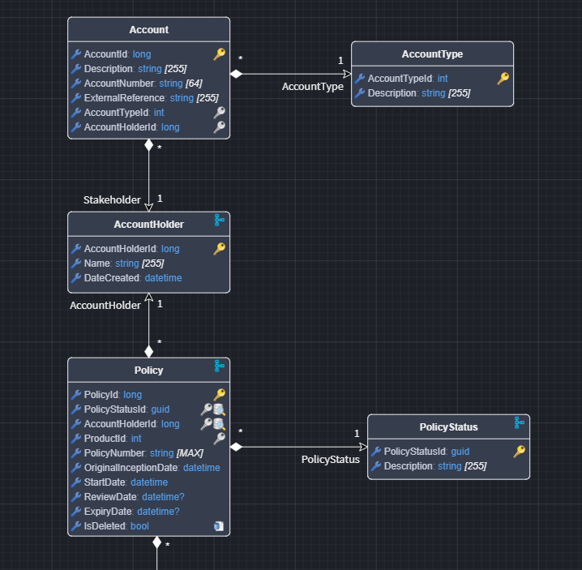
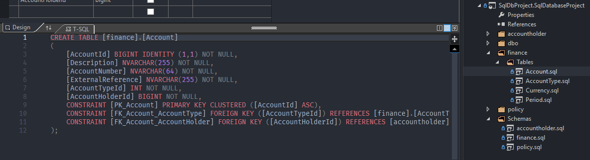

# Intent.SqlDatabaseProject

This module provides a pattern for working with SQL Database Projects.

This module consumes your `Domain Model`, which you build in the `Domain Designer` (and can import using the [Intent.SqlServerImporter](https://docs.intentarchitect.com/articles/modules-dotnet/intent-sqlserverimporter/intent-sqlserverimporter.html)) and generates a SQL Database Project.

## What are SQL Database Projects?

SQL Database Projects provide a structured way to develop, version, and deploy database schemas as code. They allow you to manage database objects alongside application code, validate schema changes, and generate deployment scripts.

For more comprehensive information on SQL Database Projects, see [Microsoft's SQL Database Projects documentation](https://learn.microsoft.com/en-us/sql/tools/sql-database-projects/get-started).

## Domain Designer modeling

The Domain Designer provides specialized stereotypes and extensions for modeling database-specific concepts:

*Example: A domain model with SQL-specific stereotypes applied to entities and attributes*

For comprehensive guidance on modeling RDBMS concepts, refer to the [RDBMS Documentation](https://docs.intentarchitect.com/articles/modules-common/intent-metadata-rdbms/intent-metadata-rdbms.html), which covers:

* **Modifying Table defaults**
* **Modifying Column defaults**
* **Primary Keys**
* **Foreign Keys**
* **Text Constraints**
* **Decimal Constraints**
* **Computed Value**
* **Default Constraints**
* **Table Join Constraints**
* **Indexes**
* **Schemas**
* **Views**

## SQL Database Project Generation

Once your domain model is properly configured, the module generates a complete SQL Database Project:

*Example: The structure of a generated SQL Database Project*

