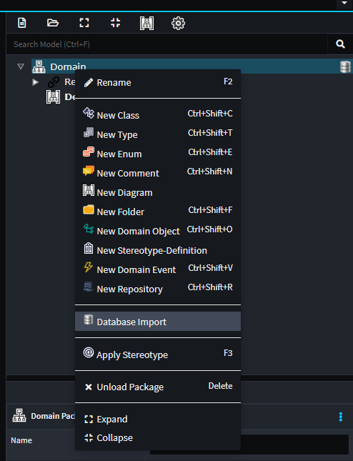
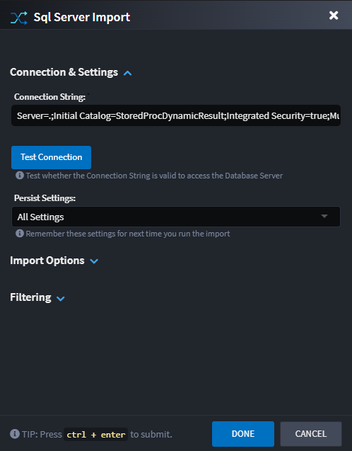
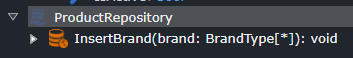
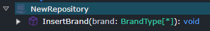

# Intent.SqlServerImporter

This module added to the Domain Designer allowing you to import / reverse engineer domain models from SQl Server databases.

## Domain Designer

In the `Domain Designer`, right-click on your domain package and select the `Database Import` context menu option.

Selecting this option will provide you with the following dialog:

### Dialog options

#### Connection String

The connection string for the SQL Server database you wish to import.

#### Entity name convention

The setting controls the naming convention of the entities which will be created in the Domain Designer.

- `Singularized table name`,  entity names will be the SQL Table names, singularized. e.g. Customers -> Customer.
- `Table name, as is`, entity names will be the SQL Table names, as is.

#### Apply table stereotypes

The setting controls under which conditions Table stereotypes are applied to the Entities. Tables stereotypes use to specify the underlying SQL Table name.
Sometimes Entity names may not be directly translatable back to the original table name due to differences in allowable character sets.

- `If They Differ`,  only introduce Table stereotypes if the Entity name does not translate back to the original table name.
- `Always`, always add explicit tables names.

#### Schema Filter

A `;` separated list of SQL Schemas to export from, allowing you to subset your export if required.

#### Include Type (s)

Select which SQL Types you would like to export e.g. Tables, Views and / or Stored Procedures.

#### Table/View Filter

Specify a file path that contains the names of Tables and Views that you would like to import and it will stick to those objects only. Each item is line separated.

#### Stored Procedure Representations

Choose between using Repository Elements and Repository Operations to represent your Stored Procedures.

- Stored Procedure Element
   

- Stored Procedure Operation
  

#### Persist Settings

The dialog can remember your configuration for the next time you want to run it. If you choose to persist the settings, they are saved in the `Domain Package` which is committed in your source code repository.
If you have any concerns around committing connection string in your code base, use the relevant option to avoid this.

- `(None)`,  settings will not be persisted and remembered. Previously saved configuration will be deleted.
- `All (with Sanitized connection string, no password)`,  All settings will be persisted, if the connection string has a password in it, the password will not be persisted.
- `All (without connection string)`,  All settings, except for the connection string, will be persisted.
- `All`, All settings will be persisted.