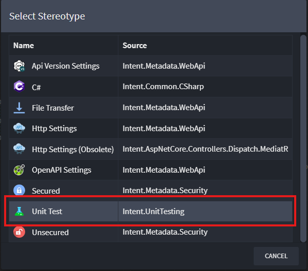

# Intent.UnitTesting

This module adds infrastructure and support for unit testing an application using **xUnit**.

> [!NOTE]
>
> This module currently generates **unit test stubs only** — actual test implementations must be written manually. Enhancements to improve test generation will be introduced in future versions.

## Application Unit Testing

### Unit Test Generation

The module generates **stub test classes** for:

- Command and Query handlers (for CQRS-based services)
- Service operations (for traditional services)

By default, unit test generation operates in **opt-in** mode. Test stubs are only generated for `Commands`, `Queries`, `Services`, or `Operations` that are explicitly marked for unit testing (see the [Generation Mode](#generation-mode) section below to change this behavior)

This is controlled using the `Unit Test` stereotype in the **Services Designer**:

You can apply the `Unit Test` stereotype to the following elements:

- `Commands`
- `Queries`
- `Services`
- `Operations`

Once applied, test classes will be scaffolded when running the Software Factory.

## Module Settings

### Generation Mode

As mentioned above, the module defaults to **opt-in** mode for test generation. However, this behavior can be changed via the **Application Settings** to enable **automatic generation** of unit test stubs for *all* relevant elements, including:

- `Commands`
- `Queries`
- `Services` / `Operations`

You can adjust this setting here:

### Mocking Framework

The mocking framework used in the generated unit test stubs can also be configured in the **Application Settings**. Supported mocking libraries include:

- `Moq` (default)
- `NSubstitute`

Choose the framework that best aligns with your team’s preferences and testing practices.
