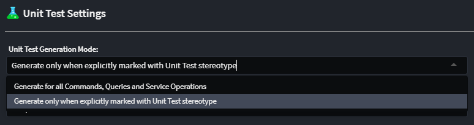

# Intent.UnitTesting

This module adds infrastructure and support for unit testing an application using xUnit.

> [!NOTE]
>
> This module currently generates **unit test stubs only** — actual test implementations must be written manually. Enhancements to improve generation will be available in future versions.

## Application Unit Testing

### Unit Test Generation

The module generates stub test classes for:

- Command and Query handlers (for CQRS services)
- Service operations (for traditional services)

By default, test generation is in **opt-in** mode — unit test stubs will only be generated for `Commands`, `Queries`, `Services`, or `Operations` explicitly marked for unit testing. This is controlled using the `Unit Test` stereotype in the **Services Designer**:

The stereotype can be applied to:

- `Commands`
- `Queries`
- `Services`
- `Operations`

You can override this default behavior in the **Application Settings** to enable automatic generation of unit test stubs for **all** `Commands`, `Queries`, and `Services/Operations`:

### Mocking Framework

The mocking framework used in generated unit test stubs can be configured via the **Application Settings**. Supported frameworks:

- `Moq` (default)
- `NSubstitute`
