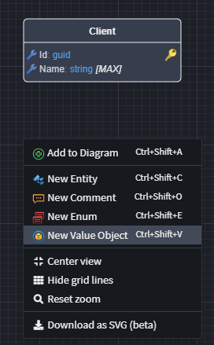
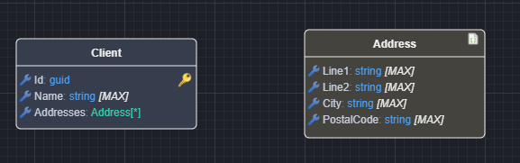
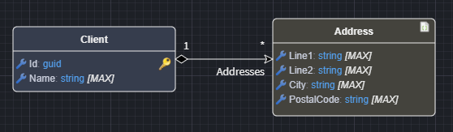
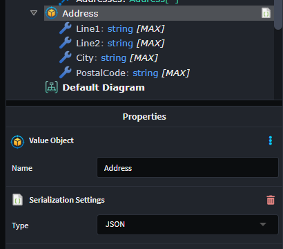

# Intent.ValueObjects

This module provides a simple Value Object implementation in C# based on the [Microsoft suggested pattern.](https://learn.microsoft.com/en-us/dotnet/architecture/microservices/microservice-ddd-cqrs-patterns/implement-value-objects)

## What is a ValueObject

More information can be found on the official [Microsoft documentation website](https://learn.microsoft.com/en-us/dotnet/architecture/microservices/microservice-ddd-cqrs-patterns/implement-value-objects#important-characteristics-of-value-objects), but in summary:

- **Value Objects do not have an identity** – they are defined solely by their attributes.
- **They are immutable** – once created, their state cannot be changed.

## What's in this module?

- [Microsoft suggested pattern](https://learn.microsoft.com/en-us/dotnet/architecture/microservices/microservice-ddd-cqrs-patterns/implement-value-objects) implementation.
- `Domain Designer` extensions that enable modeling `ValueObjects` in the `Domain Designer`.

## Modelling ValueObjects

Once this module is installed, the _New Value Object_ menu item will be available, allowing Value Objects to be added in the _Domain Designer_. 

`ValueObjects` are modelled in a similar fashion to `Entities`. 

It can be applied to Entities as either Attributes...

Or Composite associations...

## ValueObjects and Primary Keys

> [!NOTE]
>
> Value Objects **should not** be modeled with a `primary key`.

Unlike `Entities`, which have a unique identifier, `Value Objects` are **defined by their attributes** rather than an identity. If two Value Objects have the same data, they are considered equal. Therefore, assigning a primary key would contradict their purpose and introduce unnecessary complexity. Instead, Value Objects are typically embedded within Entities rather than stored as separate database records.

## JSON Serialization

Value Objects can be serialized to JSON and stored as a single database column, allowing structured data to be persisted without normalizing into separate tables.

### When to Use JSON Serialization

Use JSON serialization when your Value Objects have the following domain characteristics:

- **No independent identity** — they exist only as part of their parent Entity and are never loaded or queried independently
- **Dependent lifecycle** — they are created, updated, and deleted together with their parent Entity
- **Value equality** — two instances with identical attributes are considered equal (not distinguished by ID)
- **Always accessed together** — they are never accessed separately from their parent, even if your database supports querying nested JSON

### How to Enable JSON Serialization

1. **Model your Value Object**: Create a Value Object in the Domain Designer with the properties you need (e.g., `Address` with `Line1`, `Line2`, `City`, `PostalCode`)

2. **Add the Serialization Settings stereotype**: Select your Value Object and apply the **Serialization Settings** stereotype

3. **Set Type to JSON**: In the properties panel, set the `Type` field to `JSON`

4. **Associate with your Entity**: Create a collection relationship from your Entity (e.g., `Client`) to the Value Object (e.g., `Addresses`)

When persisted to the database, the `Addresses` collection is serialized to JSON and stored in a single column. The database handler applies the optimal JSON column type for your database provider—see [EntityFrameworkCore JSON Column Storage](https://docs.intentarchitect.com/articles/modules-dotnet/intent-entityframeworkcore/intent-entityframeworkcore.html#json-column-storage) for details on how each database stores this data natively.
