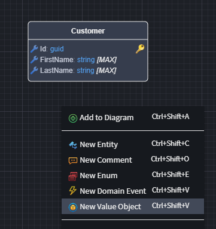

# Intent.ValueObjects

This module provides a simple Value Object implementation in C# based on the [Microsoft suggested pattern.](https://learn.microsoft.com/en-us/dotnet/architecture/microservices/microservice-ddd-cqrs-patterns/implement-value-objects)

## What is a ValueObject

More information can be found on the official [Microsoft documentation website](https://learn.microsoft.com/en-us/dotnet/architecture/microservices/microservice-ddd-cqrs-patterns/implement-value-objects#important-characteristics-of-value-objects), but in summary:

- **Value Objects do not have an identity** – they are defined solely by their attributes.
- **They are immutable** – once created, their state cannot be changed.

## What's in this module?

- [Microsoft suggested pattern](https://learn.microsoft.com/en-us/dotnet/architecture/microservices/microservice-ddd-cqrs-patterns/implement-value-objects) implementation.
- `Domain Designer` extensions that enable modeling `ValueObjects` in the `Domain Designer`.

## Modelling ValueObjects

Once this module is installed, the _New Value Object_ menu item will be available, allowing Value Objects to be added in the _Domain Designer_. 

`ValueObjects` are modelled in a similar fashion to `Entities`.

## ValueObjects and Primary Keys

> [!NOTE]
>
> Value Objects **should not** be modeled with a `primary key`.

Unlike `Entities`, which have a unique identifier, `Value Objects` are **defined by their attributes** rather than an identity. If two Value Objects have the same data, they are considered equal. Therefore, assigning a primary key would contradict their purpose and introduce unnecessary complexity. Instead, Value Objects are typically embedded within Entities rather than stored as separate database records.
