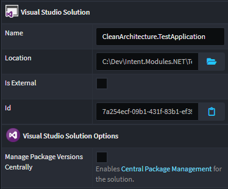
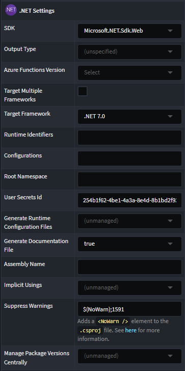

# Intent.VisualStudio.Projects

This [Intent Architect](https://intentarchitect.com/) module adds the `Visual Studio` [Designer](https://docs.intentarchitect.com/articles/application-development/modelling/about-designers/about-designers.html) to an Intent Architect [Application](https://docs.intentarchitect.com/articles/application-development/applications-and-solutions/about-applications/about-applications.html), generates and manages both Visual Studio `.sln` and .NET `.csproj` files.

## The _.NET Settings_ stereotype

### The `Suppress Warnings` property

Adds  a [`<NoWarn />`](https://learn.microsoft.com/dotnet/csharp/language-reference/compiler-options/errors-warnings#nowarn) element to the `.csproj` file with the specified value of semi-colon separated codes of warnings to suppress.

By default this is populated with the value `$(NoWarn)` which will apply the [default suppressed warnings](https://github.com/dotnet/sdk/blob/2eb6c546931b5bcb92cd3128b93932a980553ea1/src/Tasks/Microsoft.NET.Build.Tasks/targets/Microsoft.NET.Sdk.CSharp.props#L16). While this value is set to `$(NoWarn)`, no `<NoWarn />` element will be added to the `.csproj` file.

`;1561` is automatically appended by some Intent Architect application templates to suppress the [Missing XML comment for publicly visible type or member 'Type_or_Member'](https://learn.microsoft.com/dotnet/csharp/language-reference/compiler-messages/cs1591) warning.

## Central Package Management

In .NET, [Central Package Management (CPM)](https://learn.microsoft.com/nuget/consume-packages/central-package-management) allows management of versions of NuGet packages for multiple `.csproj` from a central `Directory.Packages.props` file and an MSBuild property.

To have Intent Architect automatically create and manage a `Directory.Packages.props` file for a solution, on the _Visual Studio Solution Options_ stereotype, check the _Manage Package Versions Centrally_ property.

Once enabled, `PackageReference` items `.csproj` files will by default no longer add a `Version` attributes added to them and any existing ones will be removed.

It is also possible to control the behaviour of a single project by setting the _Manage Package Versions_ property on its stereotype:

The following options are available:

- **(unmanaged)** - Intent will not add, change or remove the `ManagePackageVersionsCentrally` property in the `.csproj` file.

- **(unspecified)** - Intent will ensure there is no `ManagePackageVersionsCentrally` property in the `.csproj` file removing it if necessary. `Version` attributes will be added to `PackageReference` items depending on whether or not the Solution has the CPM option set.

- **false** - Intent will ensure the `ManagePackageVersionsCentrally` property is present with a value of `false` and regardless of the the Solution's CPM setting, `Version` attributes will always be added to `PackageReference` items.

- **true** - Intent will ensure the `ManagePackageVersionsCentrally` property is present with a value of `true` and regardless of the the Solution's CPM setting, `Version` attributes will be removed from `PackageReference` items.

> [!NOTE]
> Regardless of the project level's _Manage Package Versions_ setting, unless the solution has _Manage Package Versions Centrally_ set, Intent will not update or manage `PackageVersion` items for a `Directory.Packages.props` file.

## Use top-level statements

When enabled the `Program.cs` will no longer generate a class and instead use [top-level statements](https://learn.microsoft.com/dotnet/csharp/fundamentals/program-structure/top-level-statements).

> [!NOTE]
> Requires at least version `6.0.0` of the `Intent.Modules.AspNetCore` to be installed in order for changes to take effect.

## Use minimal hosting model

When enabled `Startup.cs` will no longer be generated and all start-up will be performed in `Program.cs` by of the [new minimal hosting model](https://learn.microsoft.com/aspnet/core/migration/50-to-60#use-startup-with-the-new-minimal-hosting-model) introduced with .NET 6.

> [!NOTE]
> Requires at least version `6.0.0` of the `Intent.Modules.AspNetCore` to be installed in order for changes to take effect.
