# Intent.VisualStudio.Projects

This module adds Visual Studio capabilities to the  to allow applications to generate related files such as `.sln` and `.csproj` types.

## Codebase Structure Designer Extensions

This module allows modelling of the following within the :

- `Visual Studio Solution`s and its configuration.
- The various C# projects that make up your solution and their configuration.

Below is an example of a Visual Studio Solution in the Codebase Structure Designer configured for a typical Clean Architecture application. We can see the following:

- The Visual Studio Solution will be named **OnlineOrdering**.
- The solution will have four C# projects:
  - **OnlineOrdering.Api** – Responsible for application hosting and service distribution.
  - **OnlineOrdering.Application** – Responsible for application-specific business rules and use cases.
  - **OnlineOrdering.Domain** – Responsible for business rules and domain logic.
  - **OnlineOrdering.Infrastructure** – Responsible for infrastructure, persistence, and integration.

We can also see `Template Output`s, such as `Intent.Entities.Entity`, which indicate where the generated code files will be placed. In this case, domain `Entity` code files will be generated into the **OnlineOrdering.Domain** C# project, inside the `Entities` folder. When you install new modules, they will automatically add their `Template Output`s to this designer. Modules use [Output Anchors](xref:application-development.modelling.codebase-structure-designer#output-anchors) to determine where to place their `Template Output`s.

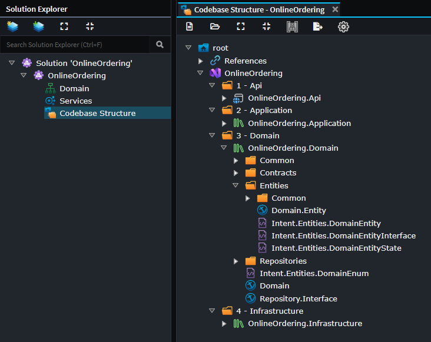

> [!TIP]
>
> `Application Template`s typically fully configure this layout for you. However, you can reconfigure or adjust this designer if you want to customize the structure of your application's code generation.

### Adding a New Project

1. Right-click on the `Visual Studio Solution` element or a `Folder` under it and select `C# Project (.NET)`.
2. Enter the name of your C# project.
3. *(Optional)* Configure any project options in the Property Pane, such as `Target Framework`.
4. *(Optional)* Customize your project by configuring `Output Anchor`s, `Folder`s, `Template Output`s, etc.

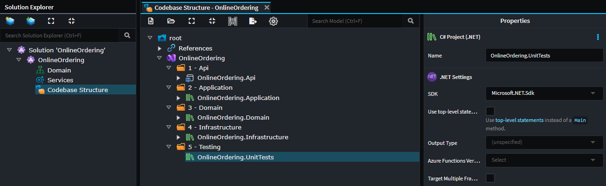

### Customizing your Visual Studio Codebase Structure

If you want to change where Intent Architect generates code within Visual Studio solution and projects, you can do so by making changes in this designer. Here are some examples of how this can be achieved.

#### Moving a File to a Different Location

Given the following setup:

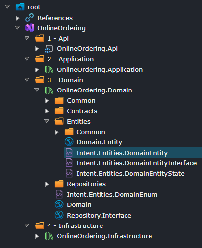

Modeled domain entities are generated into the `Entities` folder. These entities may be things like `Customer` or `Order`, depending on what `Entity`s you have modeled in the **Domain Designer**.

If you drag the **Intent.Entities.Entity** `Template Output` to the root folder of the C# project, the entities will now be generated directly into the project's root folder.

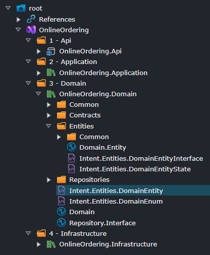

Alternatively, you could create a new folder, say `My Folder`, and move `Intent.Entities.Entity` into that folder. Now, the entities will be generated into a folder named `My Folder`.

#### Restructuring Projects

You can reorganize your Visual Studio solution structure by consolidating projects, splitting them apart, or creating entirely new projects. This section demonstrates common restructuring scenarios.

##### Consolidating Projects

In this example, let's assume you do not want four projects and prefer to consolidate the `Application` and `Domain` projects.

To consolidate the `Domain` project into the `Application` project:

1. Move all `Template Output`s from the `Domain` project into the `Application` project, placing them where you want the code to go.
2. Delete the `Domain` project.

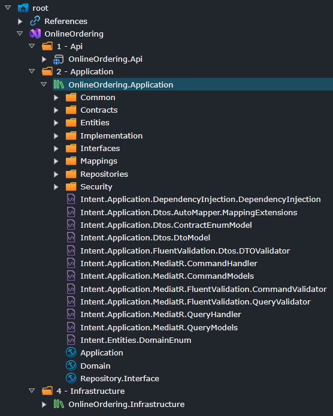

*Visual Studio solution with Domain project consolidated into Application project.*

Now, your Visual Studio solution will have three projects instead of four.

##### Adding Projects

In this example, we have a Standalone Blazor application, and we don't want HTTP Client information in our Client application but would prefer to split it out into its own project.

The existing structure of the solution. In this example, we want to move the `Intent.Blazor.HttpClients.ServiceContract` template to a separate project.

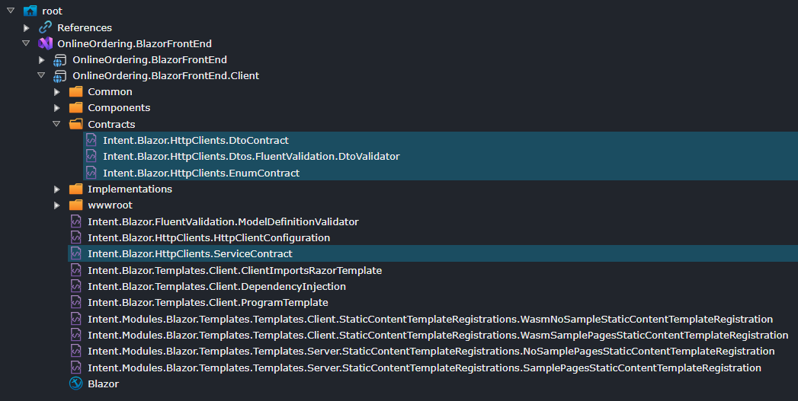

*Original Blazor project structure with the ServiceContract template in the main Client project.*

To split out templates into a separate project:

1. Create a new project, as per the steps described in the [Add a New Project](#adding-a-new-project) section.
2. Move the `Intent.Blazor.HttpClients.ServiceContract` template from the existing project to the new project, placing it where you want the code to go.

  > [!WARNING]
  > Templates that `Intent.Blazor.HttpClients.ServiceContract` depends on also need to be moved to avoid circular dependencies. The Software Factory will throw errors if projects have circular references.

3. Move dependent templates to the new project. In this example, the entire `Contracts` folder also needs to be moved to the new project to prevent the Client project from depending on the New project while the New project depends on the Client project.

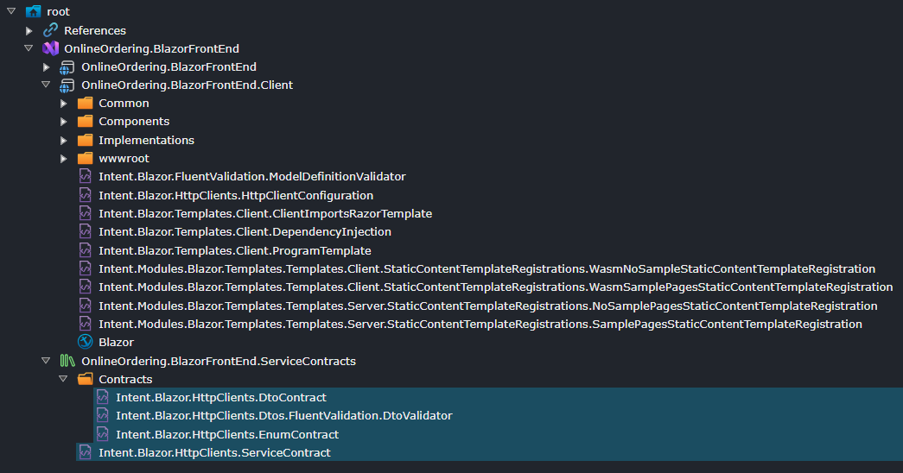

*Refactored structure with HttpClients in a separate project.*

## Folder Options

### Namespace Provider

The `Namespace Provider` option controls whether a folder's name contributes to generated code namespaces.

- **Enabled**: The folder name is included in the namespace.
- **Disabled**: Files are still generated into the folder, but the folder name is excluded from the namespace.

This is useful when you want to organize files on disk without forcing that structure into your code namespaces.

For example, if `Orders` is marked as a namespace provider and `Internal` is not, a class in `Orders/Internal` would use a namespace like `MyApp.Orders` (not `MyApp.Orders.Internal`).

This option is available on folders in **all designers**. Configure it in the designer where the folder is modeled to control which parts of the folder hierarchy participate in namespaces.

## Stereotype details

### The *.NET Settings* stereotype

#### The `Suppress Warnings` property

Adds  a [`<NoWarn />`](https://learn.microsoft.com/dotnet/csharp/language-reference/compiler-options/errors-warnings#nowarn) element to the `.csproj` file with the specified value of semi-colon separated codes of warnings to suppress.

By default, this is populated with the value `$(NoWarn)` which will apply the [default suppressed warnings](https://github.com/dotnet/sdk/blob/2eb6c546931b5bcb92cd3128b93932a980553ea1/src/Tasks/Microsoft.NET.Build.Tasks/targets/Microsoft.NET.Sdk.CSharp.props#L16). While this value is set to `$(NoWarn)`, no `<NoWarn />` element will be added to the `.csproj` file.

`;1561` is automatically appended by some Intent Architect application templates to suppress the [Missing XML comment for publicly visible type or member 'Type_or_Member'](https://learn.microsoft.com/dotnet/csharp/language-reference/compiler-messages/cs1591) warning.

#### Use top-level statements

When enabled the `Program.cs` will no longer generate a class and instead use [top-level statements](https://learn.microsoft.com/dotnet/csharp/fundamentals/program-structure/top-level-statements).

> [!NOTE]
> Requires at least version `6.0.0` of the `Intent.Modules.AspNetCore` to be installed in order for changes to take effect.

#### Use minimal hosting model

When enabled `Startup.cs` will no longer be generated, and all start-up will be performed in `Program.cs` by of the [new minimal hosting model](https://learn.microsoft.com/aspnet/core/migration/50-to-60#use-startup-with-the-new-minimal-hosting-model) introduced with .NET 6.

> [!NOTE]
> Requires at least version `6.0.0` of the `Intent.Modules.AspNetCore` to be installed in order for changes to take effect.

### The *Visual Studio Solution Options* stereotype

This stereotype is applied to **Visual Studio Solution** elements.

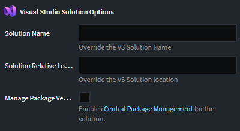

#### Solution Name

By default, your **Visual Studio Solution** name will be the same as your `Visual Studio Package` name. These properties allow you to explicitly specify the name without changing the package name. This is useful for scenarios where you have a shared VS Solution across Applications.

#### Solution Relative Location

By Default, your **Visual Studio Solution** will be placed in Application's `Relative Output Location`, this setting allows you to adjust the location of the solution relative to it's default location.

### The *Folder Options* stereotype

This stereotype is applied to **Solution Folder** elements.

### Materialize Folder

When checked, this option will materialize your logical **Visual Studio Solution** folders as actual folders on disk.

### Central Package Management

In .NET, [Central Package Management (CPM)](https://learn.microsoft.com/nuget/consume-packages/central-package-management) allows management of NuGet package versions for multiple `.csproj` from a central `Directory.Packages.props` file and an MSBuild property.

To have Intent Architect automatically create and manage a `Directory.Packages.props` file for a solution, on the *Visual Studio Solution Options* stereotype, check the *Manage Package Versions Centrally* property.

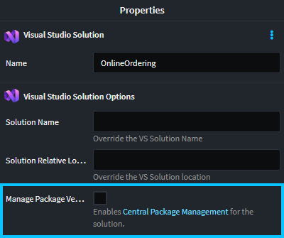

Once enabled, `PackageReference` items `.csproj` files will by default no longer add a `Version` attributes added to them and any existing ones will be removed.

Once `Manage Package Versions Centrally` is enabled, several options become available to control *where* the `Directory.Packages.props` file is output.

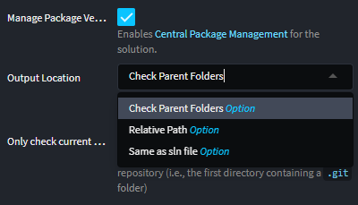

#### Available Output Location Options

- **Same as .sln file** (default):  
  The `Directory.Packages.props` file will be placed in the same directory as the solution (`.sln`) file.

- **Relative Path**:  
  The `Directory.Packages.props` file will be placed at the specified *relative path* field value, which is resolved against the solution (.sln) file location.
  - **Relative Path** field:  
    This field is only available when the **Output Location** is set to *Relative Path*. For example, setting the value to `../` will result in the output folder being one folder higher than the solution file location.

- **Check Parent Folders**:  
  The system will check parent directories (starting from the solution file's location) for an existing `Directory.Packages.props` file. If found, that file will be used; otherwise, a new one will be created in the solution (.sln) file's directory.
  - **Only Check Current Git Repository** (checkbox):  
    This option is available when **Check Parent Folders** is selected. If enabled, the search will stop at the root of the current Git repository (i.e., the first directory containing a `.git` folder).

#### Managing Project Package Versions

It is also possible to control the behaviour of a single project by setting the *Manage Package Versions* property on its stereotype:

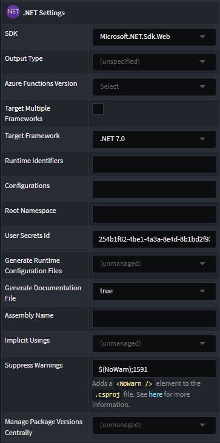

The following options are available:

- **(unmanaged)** - Intent will not add, change or remove the `ManagePackageVersionsCentrally` property in the `.csproj` file.

- **(unspecified)** - Intent will ensure there is no `ManagePackageVersionsCentrally` property in the `.csproj` file removing it if necessary. `Version` attributes will be added to `PackageReference` items depending on whether the Solution has the CPM option set.

- **false** - Intent will ensure the `ManagePackageVersionsCentrally` property is present with a value of `false` and regardless of the the Solution's CPM setting, `Version` attributes will always be added to `PackageReference` items.

- **true** - Intent will ensure the `ManagePackageVersionsCentrally` property is present with a value of `true` and regardless of the the Solution's CPM setting, `Version` attributes will be removed from `PackageReference` items.

> [!NOTE]
> Regardless of the project level's *Manage Package Versions* setting, unless the solution has *Manage Package Versions Centrally* set, Intent will not update or manage `PackageVersion` items for a `Directory.Packages.props` file.
