# Update AI skill descriptions across six modules

## Context

The `description:` frontmatter of a generated `SKILL.md` is what a coding agent reads when deciding
whether to load that skill. The current descriptions were written as prose blurbs ("Implement or fix
business logic in ... Use when ..."), and two of them (`domain-entity`,
`fluent-validation-custom-validation`) are all-lowercase run-on paragraphs. They describe the skill
rather than instructing the agent, so agents under-load them.

The new wording follows a fixed two-sentence shape: a declarative *what it implements*, then a
`MUST load before ...` trigger naming the concrete file the agent is about to touch. The user has
already applied this to `application-service-implementation` in the working tree; this plan applies
it to the remaining five named skills, plus the two Wolverine handler siblings that the repo has
historically kept in lockstep with the MediatR pair (commit `ae02134b1e`).

Each description lives in a C# raw-string literal inside the template's constructor. Every one of
these constructors is `IntentManaged` with the body ignored, so the edits land in hand-maintained
regions and survive regeneration.

## Approach

Eight one-line string edits across seven template files in six modules, each module getting a patch
version bump and one release-notes bullet. No designer *model* changes to any of the six modules'
own template structure — only the `Module Settings` → `Version` property, which is the only
supported way to move a module version.

```mermaid
flowchart LR
  subgraph M["Module templates (edited)"]
    SI["ServiceImplementationSkill<br/>application-service-implementation"]
    MC["MediatR CommandHandlerSkill<br/>mediatr-command-handler"]
    MQ["MediatR QueryHandlerSkill<br/>mediatr-query-handler"]
    DE["DomainEntitySkill<br/>domain-entity"]
    EF["EFRepositorySkill<br/>ef-repository"]
    FV["CustomValidationSkill<br/>fluent-validation-custom-validation"]
    WC["Wolverine CommandHandlerSkill<br/>wolverine-command-handler"]
    WQ["Wolverine QueryHandlerSkill<br/>wolverine-query-handler"]
  end
  M -->|"Software Factory"| OUT["&lt;app&gt;/.agents/skills/&lt;name&gt;/SKILL.md<br/>(frontmatter + contentHash)"]
  OUT --> AG["Coding agent skill discovery"]
```

**Version first, then implement, then docs** — the order `module-building-workflow` Phase 2/3/4
requires. The version has to move before the templates are rebuilt, otherwise a rebuild at an
already-published number is shadowed by the published copy.

**Patch, not minor.** A frontmatter description tweak changes nothing already generated beyond one
line of text and adds no new capability dimension — the `module-version-increment` impact table puts
that squarely at the third component. Modules already sitting on a prerelease move the prerelease
component only.

**Modules only — `Tests/` is deliberately out of scope.** The ~909 generated `SKILL.md` files under
`Tests/` are produced from module versions pinned per-app in `Tests/*/modules.config`. Because those
pins stay at the currently published versions, the test apps keep generating the old text and the
`ensure-no-outstanding-sf-changes` check on the Tests solution still passes clean. This matches
commit `e90e481703`, which made the same kind of change without touching `Tests/`. Propagating the
pins (~750 files) is a separate dependency-sync pass.

## Model changes

For each of the six modules, in its own **Module Builder** designer, on the module package:

- `Module Settings` stereotype → `Version` property — set to the target below.

| Module | `.imodspec` now | `.csproj` now | Target |
| --- | --- | --- | --- |
| `Intent.Application.ServiceImplementations` | `4.7.3` | `4.7.4-pre.0` *(uncommitted)* | `4.7.4-pre.0` |
| `Intent.Application.MediatR` | `4.7.3` | `4.7.3` | `4.7.4-pre.0` |
| `Intent.Application.FluentValidation` | `3.12.2` | `3.12.2` | `3.12.3-pre.0` |
| `Intent.Entities` | `5.3.3-pre.0` | `5.3.3-pre.0` | `5.3.3-pre.1` |
| `Intent.EntityFrameworkCore.Repositories` | `4.8.5-pre.0` | `4.8.5-pre.0` | `4.8.5-pre.1` |
| `Intent.Application.Wolverine` | `1.0.3-pre.0` | `1.0.2` | `1.0.3-pre.1` |

Two notes on that table:

- **ServiceImplementations is already half-moved.** Its `.csproj` was hand-edited to `4.7.4-pre.0`
  but the designer (and therefore `.imodspec`) is still `4.7.3`. The designer needs to come *up* to
  the csproj value, not the reverse.
- **Wolverine's `.csproj` is behind its `.imodspec`** (`1.0.2` vs `1.0.3-pre.0`) — a pre-existing
  drift. Bring it to `1.0.3-pre.1` as part of this change; a stale csproj version is the documented
  cause of `NU1605` downgrade errors.

Never hand-edit `.imodspec` — it is regenerated from the model on every Software Factory run and the
edit is silently reverted, which would also surface as an outstanding-changes failure in the
pre-commit check.

## Code changes

Seven template files, eight `description:` lines. The name/`SkillName`/`template-id` lines are
untouched — only the description text changes.

### The six descriptions supplied by the user

- `Modules/Intent.Modules.Application.ServiceImplementations/Templates/ServiceImplementationSkill/ServiceImplementationSkillTemplatePartial.cs`
  — **already applied in the working tree**, no further edit needed:

  > Implements business logic in traditional (non-CQRS) application services. MUST load before creating or editing a traditional application service class in the Application layer.

- `Modules/Intent.Modules.Entities/Templates/DomainEntitySkill/DomainEntitySkillTemplatePartial.cs` (line 31)

  > Implements domain behaviour, invariants, and constructors on entities and aggregates. MUST load before creating or editing any entity, aggregate, or value object.

- `Modules/Intent.Modules.EntityFrameworkCore.Repositories/Templates/EFRepositorySkill/EFRepositorySkillTemplatePartial.cs` (line 33)

  > Extends EF repository contracts and implementations with new query or persistence methods. MUST load before creating or editing any I*Repository.cs or its Infrastructure implementation.

- `Modules/Intent.Modules.Application.FluentValidation/Templates/CustomValidationSkill/CustomValidationSkillTemplatePartial.cs` (line 31)

  > Implements custom and async FluentValidation rules. MUST load before creating or editing any validator e.g. *Validator.cs.

- `Modules/Intent.Modules.Application.MediatR/Templates/CommandHandlerSkill/CommandHandlerSkillTemplatePartial.cs` (line 35)

  > Implements business logic in MediatR command handler Handle methods. MUST load before creating or editing any command handler e.g. *CommandHandler.cs.

- `Modules/Intent.Modules.Application.MediatR/Templates/QueryHandlerSkill/QueryHandlerSkillTemplatePartial.cs` (line 33)

  > Implements business logic in MediatR query handler Handle methods. MUST load before creating or editing any query handler e.g. *QueryHandler.cs.

### The two Wolverine mirrors (wording authored here, mirroring the MediatR pair)

- `Modules/Intent.Modules.Application.Wolverine/Templates/CommandHandlerSkill/CommandHandlerSkillTemplatePartial.cs`

  > Implements business logic in Wolverine command handler Handle methods. MUST load before creating or editing any command handler e.g. *CommandHandler.cs.

- `Modules/Intent.Modules.Application.Wolverine/Templates/QueryHandlerSkill/QueryHandlerSkillTemplatePartial.cs`

  > Implements business logic in Wolverine query handler Handle methods. MUST load before creating or editing any query handler e.g. *QueryHandler.cs.

### Release notes

Format is fixed: `### Version X.Y.Z` (h3, `-pre.N` stripped), reverse chronological, single-line
`- Improvement:` bullets, no prose outside bullets.

**New heading** — these three modules are moving off a released version, so their new version line
does not exist yet:

- `Intent.Modules.Application.ServiceImplementations/release-notes.md` → new `### Version 4.7.4`
- `Intent.Modules.Application.MediatR/release-notes.md` → new `### Version 4.7.4`
- `Intent.Modules.Application.FluentValidation/release-notes.md` → new `### Version 3.12.3`

**Fold into the existing heading** — these three are mid-prerelease and already have an unreleased
version line with content in it, so the bullet joins it rather than creating a new heading:

- `Intent.Modules.Entities/release-notes.md` → existing `### Version 5.3.3`
- `Intent.Modules.EntityFrameworkCore.Repositories/release-notes.md` → existing `### Version 4.8.5`
- `Intent.Modules.Application.Wolverine/release-notes.md` → existing `### Version 1.0.3`

One bullet per module, both MediatR skills and both Wolverine skills grouped into a single bullet
(`module-docs-chore`: group related changes, split only when a consumer would act on each
differently). MediatR's `4.7.3` line already carries "Tweaked Command and Query Handler skill
descriptions" — the new bullet must read as a distinct, later change, not a duplicate of it.

Note `Intent.Modules.Application.MediatR.CRUD/release-notes.md` uses `> ⚠️ **WARNING**` where the
canonical format is `> ⚠️ **NOTE**`; not our concern here, no breaking-change callout is needed for
any of these six.

## Steps

1. **Bump all six module versions first.** For each module's Module Builder designer, set
   `Module Settings` → `Version` to its target from the table above, then run the Software Factory
   over `Modules/Intent.Modules.NET.isln` and confirm via diffs that only the `<version>` line of
   each `.imodspec` changed.

2. **Reconcile the `.csproj` `<Version>` values.** After the SF run, check whether each
   `.csproj` picked up the new version. Where it did not (Wolverine is known to be drifted at
   `1.0.2`, and ServiceImplementations is already at `4.7.4-pre.0` from the user's edit), edit the
   `<Version>` element directly so manifest, project file, and designer all agree.

3. **Edit the five remaining user-supplied descriptions.** One-line replacements in the
   `DomainEntitySkill`, `EFRepositorySkill`, `CustomValidationSkill`, MediatR `CommandHandlerSkill`
   and MediatR `QueryHandlerSkill` template partials. Leave `name:`, `SkillName`, `relativeLocation`
   and `template-id` untouched. The ServiceImplementations edit is already present — verify it, do
   not reapply.

4. **Edit the two Wolverine descriptions** in that module's `CommandHandlerSkill` and
   `QueryHandlerSkill` template partials.

5. **Write the six release-notes bullets** — three under a new heading, three folded into an
   existing one, per the split above.

6. **Build and verify.** Build the modules solution, then run the modules-side outstanding-changes
   check to confirm nothing else regenerates unexpectedly.

## Critical files / elements

- Designer `Module Builder`, package `Module Settings` stereotype → `Version` property, on each of
  the six module packages — the only authoritative version location; `.imodspec` is generated from it.
- The seven `*SkillTemplatePartial.cs` files listed under **Code changes** — each holds its
  description in a `.FromMarkdown($""" ... """)` raw-string literal inside the constructor.
  Constructor bodies are `IntentManaged` body-ignored (EFRepository's whole constructor is
  `Mode.Ignore`), so these edits are safe.
- The six `release-notes.md` files.
- `Modules/Intent.Modules.NET.isln` — the solution the Software Factory and pre-commit checks run over.
- `Modules/.agents/instructions/module-building-workflow.instructions.md` — the phase ordering this
  plan follows.

## Verification

1. **Templates carry the new text** — grep `^description: ` across
   `Modules/**/*Skill*TemplatePartial.cs` and confirm all eight lines read the new wording and that
   no `name:` line changed.
2. **Versions agree in all three places** — for each of the six modules, `.imodspec` `<version>`,
   `.csproj` `<Version>`, and the designer `Module Settings` → `Version` are identical and equal to
   the target.
3. **No stray regeneration** — the Software Factory run over the modules solution produces version
   line changes only; nothing else in `.imodspec` or the module projects moves.
4. **Build is green** — `PipelineScripts/build-all.ps1` over `Modules/`, exit 0. Note that a green
   build proves syntax only; steps 1 and 3 are what prove the change.
5. **Release notes lint** — each new/updated bullet is single-line, prefixed `- Improvement:`, sits
   under the correctly stripped `### Version X.Y.Z` heading, and MediatR's new bullet is
   distinguishable from the `4.7.3` description-tweak bullet already there.
6. **Emission spot-check (optional, if end-to-end proof is wanted)** — bump one test app's pins in
   `Tests/CleanArchitecture.Comprehensive/modules.config` locally and regenerate to see the new
   frontmatter and a changed `contentHash` in its `.agents/skills/*/SKILL.md`, then revert. Not part
   of the committed change.

## Open questions resolved

- **Q:** Minor bumps, as originally asked, or patch? **A:** Patch everywhere — a description tweak is
  narrow by the `module-version-increment` impact table. Prerelease modules advance the prerelease
  component only.
- **Q:** Include the Wolverine handler skill siblings, which the user did not list? **A:** Yes —
  propagate matching wording and bump `Intent.Application.Wolverine` too, as commit `ae02134b1e` did.
- **Q:** How far does the change reach into `Tests/`? **A:** Modules only. The ~750 `modules.config`
  pins and ~909 generated `SKILL.md` files are left to a separate dependency-sync pass.

## Deliberately not done

- No `Tests/` regeneration or `modules.config` pin updates.
- No restyling of the other AI skill descriptions in the repo (DomainServices, MediatR.DomainEvents,
  Wolverine.DomainEvents, AspNetCore.IntegrationTesting, Blazor/MudBlazor). The house style will be
  split until a follow-up pass covers them.
- No `docs/README.md` updates — none of the six modules' READMEs mention their skills.
- No `CONTEXT.md` work; none of the six modules has one, and `module-context-capture` is explicit
  that the file is maintained, not introduced.
