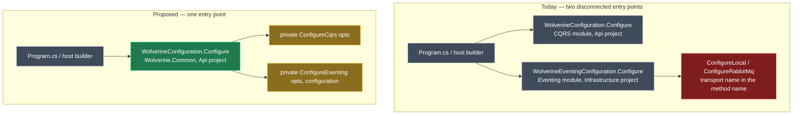
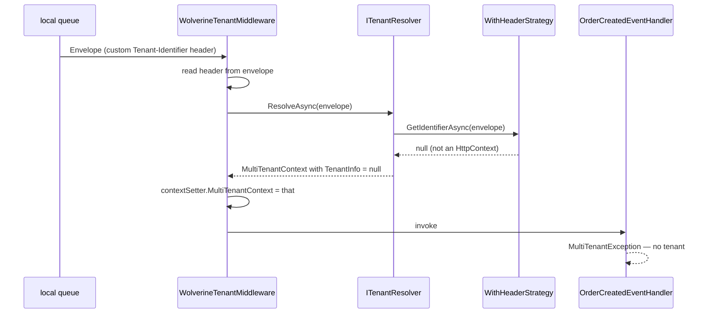
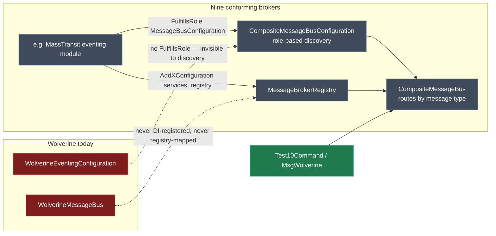

# Wolverine module foundations

Five foundation defects in the Wolverine module family, fixed before any further runtime testing.

## Approach

| # | Problem | Owning module | Fix |
| --- | --- | --- | --- |
| 1 | `IMessageBus` is ambiguous in every Wolverine-dispatched handler — the app does not compile | `Intent.Application.Wolverine`, `Intent.AspNetCore.Controllers.Dispatch.Wolverine` | Delete one redundant `AddUsing` per module |
| 2 | Generated `WolverineEventingConfiguration` has body text at column 0 | `Intent.Eventing.Wolverine` | Replace two raw multi-line strings with builder constructs |
| 3 | Eventing configuration is a second, disconnected class in the wrong project | `Intent.Wolverine.Common` (new owner) | One `WolverineConfiguration`; eventing reached by private method |
| 4 | Tenancy invented its own header and middleware instead of using Finbuckle + Wolverine natives | `Intent.Eventing.Wolverine` | `WithStrategy<T>` + `Envelope.TenantId`; delete the custom header |
| 5 | Wolverine is the one broker with no `CompositeMessageBus` test case and no conformance to the pattern | `Intent.Eventing.Wolverine` + test app model | Add `Test10Command`/`MsgWolverine`, implement the six conformance points |

---

### 1. `IMessageBus` resolves to the wrong type — the handler does not compile

#### The issue

A handler that dispatches over Wolverine *and* publishes an integration event needs two unrelated types
that happen to share a name: the eventing module's `IMessageBus` contract, and Wolverine's own
`Wolverine.IMessageBus`. The generated file pulls both namespaces into scope unqualified, so the bare
name is ambiguous.

```csharp
// Tests/WolverineEventing.Coexist.Cqrs/…Application/Orders/CreateOrder/CreateOrderCommandHandler.cs
using Wolverine;                                                    // ← the culprit
using WolverineEventing.Coexist.Cqrs.Application.Common.Eventing;

public class CreateOrderCommandHandler
{
    private readonly IMessageBus _messageBus;                       // ← CS0104: ambiguous
    private readonly Wolverine.IMessageBus _sender;                 // ← already correct

    public CreateOrderCommandHandler(IMessageBus messageBus, Wolverine.IMessageBus sender)
    { ... }
}
```

- **Line 1** is emitted by the interaction strategy. Nothing in the file needs it — every Wolverine
  reference is already fully qualified.
- **Line 6** was correct until line 1 appeared.
- **Line 7** shows `UseType` detected the clash and qualified itself. It needed no `using` to do that.

#### Where it lives, and what is related

Five components meet in this file. Three are already right — the break is entirely in the two that add
a `using` they do not use.

| Component | What it contributes | Correct? |
| --- | --- | --- |
| `Modules/Intent.Modules.Application.Wolverine/InteractionStrategies/SendOnWolverineInteractionStrategy.cs:32` | `template.CSharpFile.AddUsing("Wolverine")` | **No** — this is the defect |
| `…/SendOnWolverineInteractionStrategy.cs:42,44` | `template.UseType("Wolverine.IMessageBus")` for the ctor parameter | Yes — self-qualifying |
| `Modules/Intent.Modules.AspNetCore.Controllers.Dispatch.Wolverine/FactoryExtensions/WolverineControllerDispatchExtension.cs:56` | `file.AddUsing("Wolverine")` before the same `UseType` at line 62 | **No** — same defect, latent |
| `Modules/Intent.Modules.FastEndpoints.Dispatch.Wolverine/FactoryExtensions/WolverineEndpointExtension.cs:49` | The identical `UseType`, and no `AddUsing` | Yes — **this is the reference shape** |
| Eventing module's `IMessageBus` contract template | `…Application.Common.Eventing.IMessageBus`, imported by namespace | Yes — unchanged |

The FastEndpoints sibling is decisive: same job, same way, no `AddUsing`, and its generated output
compiles. The two broken modules are the outliers.

#### The fix

```diff
  // Modules/Intent.Modules.Application.Wolverine/InteractionStrategies/SendOnWolverineInteractionStrategy.cs
- template.CSharpFile.AddUsing("Wolverine");
  template.AddNugetDependency(NugetPackages.WolverineFx(template.OutputTarget));
```

The same deletion at `WolverineControllerDispatchExtension.cs:56`. Both modules get a version bump —
this changes generated output.

> **Decision — the rule this establishes.** Never call `AddUsing(ns)` for a namespace whose types you
> obtain through `UseType`/`GetTypeName`. `UseType` owns the import decision and will fully qualify when
> it must; a manual `AddUsing` removes that freedom and reintroduces the clash it was avoiding. Recorded
> in the module `CONTEXT.md` files.

---

### 2. Generated configuration has body text at column 0

#### The issue

Two places in the eventing configuration template emit multi-line raw strings. The C# file builder
re-indents **per logical statement**, not per physical line, so the second and later lines of an
unterminated statement land wherever the template's own string literal put them — column 0.

```diff
  opts.UseRabbitMq(rabbitMqSettings =>
  {
- rabbitMqSettings.HostName = configuration["Wolverine:RabbitMq:HostName"];
- rabbitMqSettings.UserName = configuration["Wolverine:RabbitMq:UserName"];
- rabbitMqSettings.Password = configuration["Wolverine:RabbitMq:Password"];
+     rabbitMqSettings.HostName = configuration["Wolverine:RabbitMq:HostName"];
+     rabbitMqSettings.UserName = configuration["Wolverine:RabbitMq:UserName"];
+     rabbitMqSettings.Password = configuration["Wolverine:RabbitMq:Password"];
  });
```

#### Where it lives, and what is related

Both sites are in `WolverineEventingConfigurationTemplatePartial.cs`:

| Lines | What it emits today | Replacement construct |
| --- | --- | --- |
| 342–353 | Raw string containing the whole `UseRabbitMq` lambda | `CSharpInvocationStatement` + `CSharpLambdaBlock`, one `AddStatement` per assignment |
| 241–246 | Raw string spanning the `ParseDelays` local-function body | A builder-constructed local function, one `AddStatement` per line |

> **Why only two sites, when the file emits many raw strings.** The other raw strings are each a
> complete, semicolon-terminated statement. The builder indents those correctly because it never has to
> reason about a continuation. Only an unterminated construct — a lambda body, a local function body —
> exposes the per-statement rule. Two targeted rewrites, not a sweep of the file.

---

### 3. Eventing configuration is a second class, disconnected, in the wrong project

#### The issue

Two configuration classes doing one job. `WolverineConfiguration` wires CQRS handler discovery;
`WolverineEventingConfiguration` separately wires transports, routing and eventing handler discovery.
They do not call each other — both are reached independently from the host builder — and the eventing
one carries method names (`ConfigureLocal`, `ConfigureRabbitMq`) that leak the transport choice into the
public shape of generated code.



#### Where it lives, and what is related

The obstacle is ownership, not shape. `WolverineConfiguration` belongs to the CQRS module, which is not
installed everywhere the eventing module is.

| App group | CQRS module installed | `WolverineConfiguration` | `WolverineEventingConfiguration` |
| --- | --- | --- | --- |
| `WolverineEventing.Coexist.Cqrs` | Yes | Yes | Yes |
| `WolverineEventing.ErrorPolicy.*` (×4) | No | **No** | Yes |
| `WolverineEventing.Outbox.SqlServer.*` (×2) | No | **No** | Yes |
| `WolverineEventing.MultiTenancy` | No | **No** | Yes |
| `CompositeMessageBus` | No | **No** | Yes |
| CQRS/dispatch samples (no eventing) | Yes | Yes | No |

Five of the twelve Wolverine apps have `WolverineConfiguration`; seven have no `Configuration/` folder at
all. So the merged class cannot live in the CQRS module — it would vanish from the seven apps that need
eventing configuration. `Intent.Wolverine.Common` is installed in **all twelve** and currently has
**zero templates**, which makes it the correct owner and gives it a reason to exist.

#### The proposed solution

`Intent.Wolverine.Common` owns `WolverineConfiguration`. Each dependent module contributes into it by
statement-metadata anchor, the mechanism already used across this family.

```csharp
// Tests/…/Api/Configuration/WolverineConfiguration.cs — target generated shape
public static class WolverineConfiguration
{
    public static void Configure(WolverineOptions opts, IConfiguration configuration)
    {
        ConfigureCqrs(opts);                        // ← private calls only
        ConfigureEventing(opts, configuration);
    }

    private static void ConfigureCqrs(WolverineOptions opts)
    {
        // contributed by Intent.Application.Wolverine
    }

    private static void ConfigureEventing(WolverineOptions opts, IConfiguration configuration)
    {
        // contributed by Intent.Eventing.Wolverine:
        // transport setup, publish/send rules, handler type registrations
    }
}
```

- **Single public entry point**, owned by Wolverine.Common, present in every Wolverine app.
- **Both helpers are emitted unconditionally** with empty bodies; each module fills its own, so an app
  with only one module installed still compiles.
- **`ConfigureLocal` / `ConfigureRabbitMq` collapse to one `ConfigureEventing`.** The transport choice
  becomes a body detail, not part of the method name.

`Program.cs` is unchanged — the host registration already lives in Wolverine.Common and already calls
this signature, so consuming apps see the consolidation as a shrinking file set, not a migration:

```csharp
builder.Host.UseWolverine((context, opts) =>
    WolverineConfiguration.Configure(opts, context.Configuration));   // identical before and after
```

> **Tradeoff — `WolverineEventingConfiguration.cs` is deleted from seven apps.** Regeneration removes a
> file that currently exists in the seven eventing-only apps and moves its content into
> `Api/Configuration/WolverineConfiguration.cs`. That is a destructive diff and the Software Factory will
> report it as such. Accepted because these are golden-sample test apps with no hand-written code in that
> file — but a real consumer upgrading across this version needs it in the release notes as a breaking
> change, not a bullet.

---

### 4. Tenancy went its own direction instead of using Finbuckle and Wolverine as designed

#### The issue

The consuming side cannot resolve a tenant, and worse, it destroys the one that was already ambient. The
middleware calls `ITenantResolver.ResolveAsync(envelope)`, but the only registered Finbuckle strategy is
`WithHeaderStrategy(...)`, whose `GetIdentifierAsync` returns `null` for anything that is not an
`HttpContext`. Finbuckle then returns a **non-null** `MultiTenantContext` with a **null** `TenantInfo`,
which the middleware assigns over the top of the real one.



> **Risk — this is genuinely missing generated output.** The MassTransit module generates a Finbuckle
> `IMultiTenantStrategy` **and** injects a `WithStrategy<T>(ServiceLifetime.Scoped)` registration into the
> foreign Finbuckle builder chain. The Wolverine module generates neither. Nothing that can answer for a
> message context is registered, so no amount of header plumbing on the publish side can work.

#### Where it lives, and what is related

| Role | MassTransit module | Wolverine module today | Wolverine module proposed |
| --- | --- | --- | --- |
| Strategy — answers *what tenant is this context* | `FinbuckleMessageHeaderStrategy : IMultiTenantStrategy` | **absent** | `WolverineTenantStrategy : IMultiTenantStrategy` |
| Registration — puts the strategy in the chain | `WithStrategy<T>(ServiceLifetime.Scoped)` via `InsertAbove` | **absent** | same mechanism |
| Seam — runs per consumed message | consuming filter | `WolverineTenantMiddleware` (broken) | `WolverineTenantMiddleware` (simplified, kept) |

Everything the custom header machinery was built to do, Wolverine already does natively:

| Concern | Custom mechanism today | Wolverine native |
| --- | --- | --- |
| Carry the tenant on the wire | `Wolverine:TenantHeader` app setting, default `Tenant-Identifier`, read via `ResolveHeaderName(configuration)` | `Envelope.TenantId`, wire header `tenant-id` — framework-owned |
| Set it when publishing | manual header dictionary write | `new DeliveryOptions { TenantId = … }` |
| Read it when consuming | manual header dictionary read | `Envelope.TenantId` |

#### The proposed solution

Mirror MassTransit's wiring exactly, and delete the custom header entirely.

**New — `WolverineTenantStrategy.cs`.** A simple storage mechanism: reads the envelope, nothing more.
Returns null for an `HttpContext`, letting the HTTP strategy answer instead. Finbuckle handles store
lookup, context construction and priority order.

```csharp
public class WolverineTenantStrategy : IMultiTenantStrategy
{
    public Task<string?> GetIdentifierAsync(object context)
        => Task.FromResult((context as Envelope)?.TenantId);
}
```

**Registration — into the foreign `MultiTenancyConfiguration` chain.**

```diff
  services.AddMultiTenant<TenantInfo>()
      .WithInMemoryStore(...)
+     .WithStrategy<WolverineTenantStrategy>(ServiceLifetime.Scoped)
      .WithHeaderStrategy("X-Tenant-Identifier");
```

`InsertAbove`, not append — the foreign module terminates the chain with the semicolon on the HTTP
strategy, so appending would place the new call after a semicolon and not compile. The mechanism is
copied verbatim from `Modules/Intent.Modules.Eventing.MassTransit/FactoryExtensions/FinbuckleConfiguratorExtension.cs`:

```csharp
var chain = method.FindStatement(p => p.HasMetadata("add-multi-tenant")) as CSharpMethodChainStatement;
var firstStrategy = chain.Statements.First(stmt => stmt.GetText("").Contains("Strategy("));
firstStrategy.InsertAbove($"WithStrategy<{name}>(ServiceLifetime.Scoped)");
```

**Middleware — sync-over-async and manual header reading removed.**

```diff
- public static void Before(Envelope envelope, ITenantResolver tenantResolver,
-     IMultiTenantContextSetter contextSetter, IConfiguration configuration)
- {
-     var header = WolverineTenantHeaderStrategy.ResolveHeaderName(configuration);
-     if (!envelope.Headers.TryGetValue(header, out var tenantId)) return;
-     var ctx = tenantResolver.ResolveAsync(envelope).GetAwaiter().GetResult();
-     contextSetter.MultiTenantContext = ctx;
- }
+ public static async Task BeforeAsync(Envelope envelope, ITenantResolver tenantResolver,
+     IMultiTenantContextSetter contextSetter)
+ {
+     if (string.IsNullOrEmpty(envelope.TenantId)) return;
+     contextSetter.MultiTenantContext = await tenantResolver.ResolveAsync(envelope);
+ }
```

**Publish side — `WolverineMessageBus` switches to `DeliveryOptions.TenantId`.** Returning null means
the publish call passes no `DeliveryOptions` at all, so a non-tenanted app is unaffected.

```diff
- private void ApplyTenantHeader(DeliveryOptions options)
- {
-     var header = _tenantHeaderStrategy.ResolveHeaderName();
-     var id = _multiTenantContextAccessor.MultiTenantContext?.TenantInfo?.Identifier;
-     if (id is not null) options.Headers[header] = id;
- }
+ private DeliveryOptions? BuildDeliveryOptions()
+ {
+     var tenantIdentifier = _multiTenantContextAccessor.MultiTenantContext?.TenantInfo?.Identifier;
+     return tenantIdentifier is null ? null : new DeliveryOptions { TenantId = tenantIdentifier };
+ }
```

**What is deleted:**

| Deleted | Why it existed | Why it can go |
| --- | --- | --- |
| `WolverineTenantHeaderStrategy` template | Owned `ResolveHeaderName` and the publish-side header write | Its whole job is `DeliveryOptions.TenantId` now |
| `Wolverine:TenantHeader` appsettings entry | Made the header name configurable | Wolverine owns the wire header. Configurability here bought nothing and diverged from the Finbuckle standard |
| `ContainerRegistrationRequest` for the old strategy | Registered it by concrete type for `WolverineMessageBus` | The new strategy is registered *only* via `WithStrategy<T>` |

> **Tradeoff — the middleware is kept, not deleted.** The instruction was to get rid of
> `WolverineTenantMiddleware`. It cannot go yet: **nothing else in the three Wolverine modules runs per
> consumed message.** The CQRS module's `ApplicationHandlerPolicy` chain is gated on `ICommand`/`IQuery`,
> so it never sees an integration event. Something has to call `ResolveAsync` and set the ambient context
> before the handler runs, and middleware is the only seam available. What *is* deleted is everything it
> was doing beyond that — the header name resolution, the configuration dependency, the sync-over-async —
> leaving two lines.

> **Risk — middleware ordering versus handler dependency resolution, open.** Whether Wolverine
> guarantees `BeforeAsync` runs before the handler's own scoped dependencies are resolved is not
> documented. JasperFx's codegen places a variable-creating frame before its first use, which suggests it
> is safe, but that is inference from the frame model rather than a stated guarantee. **Decision: ship on
> the default ordering and pivot if runtime testing shows otherwise.** Note the `MultiTenancy` sample
> cannot exercise this today — its `ApplicationDbContext` has no `DbSet`s and its Domain package has no
> entities, so nothing resolves a tenant-scoped dependency.

---

### 5. Wolverine has no `CompositeMessageBus` test case and does not conform to the pattern

#### The issue

`CompositeMessageBus` proves that N brokers can coexist in one app, each addressed by its own message
type. Nine of the ten broker slots are exercised. Wolverine is installed in the app but has no modelled
message, and the module does not implement the contract the aggregator depends on — so even with a
message it would not appear.

| Message | Broker | Modelled | Module conforms |
| --- | --- | --- | --- |
| `Test1Command` … `Test9Command` | the nine existing brokers | Yes | Yes |
| `Test10Command` | `MsgWolverine`, Local transport | **No — to add** | **No — to fix** |

#### Where it lives, and what is related



#### The proposed solution

- [ ] Declare `FulfillsRole(TemplateRoles.Application.Eventing.MessageBusConfiguration)` on the eventing
      configuration template — without it, role-based discovery cannot see Wolverine at all
- [ ] Emit an `AddWolverineEventingConfiguration` extension method — the shape every conforming broker exposes
- [ ] Register `WolverineMessageBus` in DI — `services.AddScoped<WolverineMessageBus>()`
- [ ] Map it in `MessageBrokerRegistry` — `registry.Register<MsgWolverine, WolverineMessageBus>()`
- [ ] Honour `RequiresCompositeMessageBus()` when deciding what to emit — composite mode changes who owns
      the registration call
- [ ] Model `Test10Command` against `MsgWolverine` with the Local transport, in the CompositeMessageBus
      app's Services designer

```csharp
public static IServiceCollection AddWolverineEventingConfiguration(this IServiceCollection services,
    IConfiguration configuration, MessageBrokerRegistry registry)
{
    services.AddScoped<WolverineMessageBus>();
    registry.Register<MsgWolverine, WolverineMessageBus>();
    return services;
}
```

> **Decision — this method belongs to the eventing module, not Wolverine.Common.** The dependency
> boundary is the module boundary. `AddWolverineEventingConfiguration` references `MessageBrokerRegistry` and the
> eventing contracts, so placing it on `Intent.Wolverine.Common` would force `Intent.Eventing.Contracts`
> onto every app that installs Wolverine for CQRS dispatch alone — five of the twelve. It stays on
> `Intent.Eventing.Wolverine`, which already depends on the contracts.

## Model changes

| Element | Designer | Change | Detail |
| --- | --- | --- | --- |
| `Test10Command` | Services (`CompositeMessageBus`) | added | Send Command interaction over `MsgWolverine`, Local transport |
| `Intent.Wolverine.Common` | Module Builder | modified | Gains its first template (`WolverineConfiguration`); `Version` incremented |
| `Intent.Eventing.Wolverine` | Module Builder | modified | `WolverineTenantStrategy` added, `WolverineTenantHeaderStrategy` removed; `Version` incremented |
| `Intent.Application.Wolverine` | Module Builder | modified | `Version` incremented |
| `Intent.AspNetCore.Controllers.Dispatch.Wolverine` | Module Builder | modified | `Version` incremented |

## Code changes

Module code only — nothing hand-written into a generated app.

| File | Change | Why |
| --- | --- | --- |
| `Modules/Intent.Modules.Application.Wolverine/InteractionStrategies/SendOnWolverineInteractionStrategy.cs` | modified | Point 1 — delete the `AddUsing` at line 32 |
| `Modules/Intent.Modules.AspNetCore.Controllers.Dispatch.Wolverine/FactoryExtensions/WolverineControllerDispatchExtension.cs` | modified | Point 1 — delete the `AddUsing` at line 56 |
| `Modules/Intent.Modules.Eventing.Wolverine/Templates/WolverineEventingConfiguration/WolverineEventingConfigurationTemplatePartial.cs` | modified | Points 2, 3, 5 — indentation, contribute into the merged class, role + `Add*Configuration` |
| `Modules/Intent.Modules.Wolverine.Common/Templates/WolverineConfiguration/` | **added** | Point 3 — the merged configuration class, this module's first template |
| `Modules/Intent.Modules.Eventing.Wolverine/Templates/WolverineTenantStrategy/` | **added** | Point 4 — the Finbuckle strategy |
| `Modules/Intent.Modules.Eventing.Wolverine/Templates/WolverineTenantHeaderStrategy/` | **removed** | Point 4 — superseded by `Envelope.TenantId` |
| `Modules/Intent.Modules.Eventing.Wolverine/Templates/WolverineTenantMiddleware/WolverineTenantMiddlewareTemplatePartial.cs` | modified | Point 4 — `BeforeAsync`, two lines |
| `Modules/Intent.Modules.Eventing.Wolverine/FactoryExtensions/WolverineFinbuckleConfiguratorExtension.cs` | modified | Point 4 — add the `WithStrategy<T>` insertion beside the existing `AddMiddleware` wiring |

Reference implementations to copy rather than reinvent:
[FinbuckleConfiguratorExtension.cs](../../Modules/Intent.Modules.Eventing.MassTransit/FactoryExtensions/FinbuckleConfiguratorExtension.cs)
for the `add-multi-tenant` / `InsertAbove` mechanism, and
[WolverineEndpointExtension.cs](../../Modules/Intent.Modules.FastEndpoints.Dispatch.Wolverine/FactoryExtensions/WolverineEndpointExtension.cs)
for the correct `UseType`-without-`AddUsing` shape.

## Execution order

1. **Read each module's `CONTEXT.md`** — `Intent.Modules.Eventing.Wolverine`,
   `Intent.Modules.Wolverine.Common`, `Intent.Modules.Application.Wolverine`. Surface any recorded
   constraint this plan contradicts before editing.
2. **Increment all four module versions up front**, via the `Version` property in the Module Builder
   model — never by hand-editing an `.imodspec`. A rebuild at an unchanged version serves a stale
   `.imod` extraction; clear `Modules/.cache/modules` rather than bumping again.
3. **Point 1** — delete both `AddUsing` calls. Regenerate `Coexist.Cqrs` and confirm the handler compiles.
4. **Point 2** — replace the two raw strings with builder constructs. Verify against generated output,
   not against the template source.
5. **Point 3a** — add `WolverineConfiguration` to `Intent.Wolverine.Common` with both private helpers
   emitted unconditionally.
6. **Point 3b** — move the eventing module's contributions into `ConfigureEventing`; delete
   `WolverineEventingConfiguration`; drop the transport-named methods.
7. **Point 4a** — add `WolverineTenantStrategy`; wire `WithStrategy<T>(ServiceLifetime.Scoped)` into the
   foreign chain via `InsertAbove`.
8. **Point 4b** — simplify the middleware to `BeforeAsync`; switch the bus to `DeliveryOptions.TenantId`;
   delete `WolverineTenantHeaderStrategy` and the `Wolverine:TenantHeader` setting.
9. **Point 5a** — add `FulfillsRole`, `AddWolverineEventingConfiguration`, the DI registration and the registry
   mapping; honour `RequiresCompositeMessageBus()`.
10. **Point 5b** — model `Test10Command` / `MsgWolverine` in `CompositeMessageBus` and regenerate.
11. **Regenerate every Wolverine app**, inspecting diffs via `get_file_diffs` before applying. Expect the
    destructive `WolverineEventingConfiguration.cs` removal in seven of them.
12. **Close out** — `module-dependency-audit` across all four modules, then `module-docs-chore` for
    release notes and `docs/README.md`, then `module-context-capture` for the durable findings.

## Verification

- [ ] **Software Factory gate** — per app: `run_software_factory` → `get_file_diffs` →
      `apply_staged_file_changes`. Any unexpected destructive change stops the run for a diff-level decision.
- [ ] **Designer gate** — `get_designer_validation_errors` clean for `CompositeMessageBus` and
      `WolverineEventing.MultiTenancy`.
- [ ] **Build gate** — `dotnet build` each affected solution. `Coexist.Cqrs` currently fails with CS0104;
      it must build. **Point 1 is only proven here.**
- [ ] **One `WolverineConfiguration` per app, no `WolverineEventingConfiguration` anywhere** — and
      `ConfigureEventing` present in all twelve, `ConfigureCqrs` non-empty only in the five.
- [ ] **Indentation** — read the generated configuration file: the `UseRabbitMq` lambda body and
      `ParseDelays` body are indented inside their braces.
- [ ] **Tenancy runtime** — MultiTenancy app, `POST /api/orders` with `X-Tenant-Identifier: tenant1`.
      Handler runs and reports `tenant1`; no `MultiTenantException`.
- [ ] **Repeat with `tenant2`** — not redundant. Finbuckle's accessor is `AsyncLocal`-backed, so a
      single-tenant run can pass on leaked execution context rather than on the envelope. Two tenants each
      reporting their own identifier is what proves `Envelope.TenantId` is the source.
- [ ] **Composite runtime** — dispatch `Test10Command`; `CompositeMessageBus` routes to
      `WolverineMessageBus` and the Local handler runs, with the other nine brokers unaffected.
- [ ] **Regression** — `ErrorPolicy.None` and `ErrorPolicy.Retry` attempt counts unchanged: 1 for None,
      1 + 3 for Retry.

## Decisions locked

| Decision | Chosen | Why not the alternative |
| --- | --- | --- |
| Owner of the merged configuration class | `Intent.Wolverine.Common` | The CQRS module is installed in only five of twelve Wolverine apps; the class would vanish from the other seven |
| Eventing reached from the merged class | Private `ConfigureEventing` method | A second public entry point is what the consolidation exists to remove |
| Handler `using Wolverine` contamination | Delete the `AddUsing`, record the rule | Aliasing or renaming a contract would push the cost onto every consuming app |
| Strategy shape | Read `Envelope.TenantId` directly, no mutable carrier | MassTransit's carrier exists because its filter has no framework-owned tenant field; Wolverine does, so priming state per message is unnecessary |
| Strategy class name | `WolverineTenantStrategy` | — |
| Ambient-context restore after the message | Dropped | No consumer requirement, and `FinallyAsync` plumbing to carry the previous context is cost without a caller |
| Configurable envelope header | Removed | Wolverine owns the wire header; configurability diverged from the Finbuckle standard for no gain |
| `WolverineTenantMiddleware` | Kept, reduced to two lines | Nothing else in the three modules runs per consumed message |
| Middleware ordering guarantee | Ship on the default, pivot on evidence | Undocumented; the JasperFx frame model suggests it is safe but that is inference |
| Owner of `AddWolverineEventingConfiguration` | `Intent.Eventing.Wolverine` | On Common it would force `Intent.Eventing.Contracts` onto CQRS-only apps |
| Scope | All five points, sequenced | Points 3 and 5 both rewrite the same template; splitting them doubles the regeneration cost |

### Out of scope

- **Runtime testing beyond the verification gates above.** The foundations come first; the broader
  runtime pass resumes once these five are in.
- **`IMissingHandler` generation.** A publish with no local handler stays an Information-level log — that
  is inherent Wolverine behaviour, and a catch-all across every transport is a separate call.
- **`opts.PublishMessage<T>().ToLocalQueue(...)` emission.** Verified to make no observable difference:
  with or without an explicit rule, Wolverine logs at Information.
- **Creating a `CONTEXT.md` for the MassTransit module.** It has none; this change does not add one.
