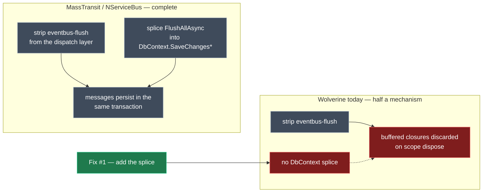

# Wolverine durable-outbox defects

Five defects in the Wolverine module family: four that make eventing over Azure Service Bus with the
durable transactional outbox silently discard every published message, and one that leaves a subscriber
unable to commit what it handles. The first four were diagnosed against a live `SourceApp`/`DestApp`
pair and each moves from an `[IntentManaged(Mode.Ignore)]` pin in those apps into the owning module;
the fifth was found while planning and has no pin.

## Approach

| # | Problem | Owning module | Fix |
| --- | --- | --- | --- |
| 1 | Every published message is discarded — the flush is stripped and nothing replaces it | `Intent.Eventing.Wolverine` | Splice `FlushAllAsync` into `ApplicationDbContext.SaveChanges*`, as MassTransit and NServiceBus already do |
| 2 | Wolverine's eager EF transaction collides with the `TransactionScope` — every command throws | `Intent.Eventing.Wolverine` | Emit `UseEntityFrameworkCoreTransactions(TransactionMiddlewareMode.Lightweight)` |
| 3 | Wolverine's unit of work is not at parity with MediatR's — it lacks the `HasDbTransaction()` guard | `Intent.Modules.EntityFrameworkCore` | Patch `UnitOfWorkMiddleware.Before` alongside the existing MediatR patch |
| 4 | ASB subscribers listen on a queue nothing publishes to | `Intent.Eventing.Wolverine` | `ListenToAzureServiceBusSubscription(...).FromTopic(...)` for subscribed events |
| 5 | Integration event handlers have no unit-of-work seam at all — a subscriber that writes may never commit | `Intent.Eventing.Wolverine` | Supply `IntegrationEventConsumer`'s save/flush responsibilities without a consumer class |

Handover Defects 1 and 4 are one defect and are merged into **#1** below. Handover Defect 2 → **#2**,
Defect 3 → **#3**, Defect 5 → **#4**. **#5 is new** — not in the handover, found while checking whether
`TransactionMiddlewareMode.Lightweight` would weaken integration event handlers. It turns out they have
no transaction to weaken. `Intent.Application.Wolverine` needs **no code change** — its template, its
gate and its registration ordering are all already correct.

The handover assumed `Intent.Eventing.Wolverine` was feed-only. **It is in this repo**
(`Modules/Intent.Modules.Eventing.Wolverine`, `1.0.0-pre.0`), alongside a newer `Intent.Wolverine.Common`
that now owns the shared `WolverineConfiguration`. Every fix is a source change in this worktree.

---

### 1. Every published message is silently discarded under the durable outbox

#### The issue

An order is placed. `CreateOrderCommandHandler` publishes `OrderPlacedEvent`, the handler returns,
`SaveChangesAsync` commits the `Order` row — and the event is gone. No error, no log, no outbox row,
no dead letter. The subscriber never hears anything.

The handover attributed this to a role-constant mismatch on the `hasBusFlush` gate. **That is not what
happened.** The roles match exactly, and the template emits the registration correctly:

```csharp
// Modules/…/Templates/ApplicationHandlerPolicy/ApplicationHandlerPolicyTemplatePartial.cs:68-73
if (hasBusFlush)
{
    method.AddStatement($"opts.Policies.AddMiddleware<{busFlushMiddleware}>(IsApplicationMessage);",
        cfg => cfg.AddMetadata("eventbus-flush", true));   // ← emitted, and tagged for removal
}
```

What removes it is the eventing module's own interop extension, whenever the outbox is Durable:

```csharp
// Modules/…/FactoryExtensions/WolverineMessageBusInteropExtension.cs:81-90
var statementsToRemove = method.FindStatements(stmt => stmt.HasMetadata("eventbus-flush")).ToList();
foreach (var statement in statementsToRemove) { statement.Remove(); }
```

Its XML doc states the premise: *"Wolverine's own AutoApplyTransactions/durable-outbox policies already
dispatch messages on SaveChanges … so the application layer's explicit `_messageBus.FlushAllAsync(...)`
call becomes redundant and would double-flush if left in place."*

**The premise is false, and the generated bus proves it.**

```csharp
// Tests/WolverineEventing.Outbox.SqlServer.Publish/…/Eventing/WolverineMessageBus.cs
private readonly List<Func<WolverineBus, ValueTask>> _pendingActions = new();

public void Publish<TMessage>(TMessage message) where TMessage : class
{
    _pendingActions.Add(bus => bus.PublishAsync(message));   // ← buffered; Wolverine never sees it
}

public async Task FlushAllAsync(CancellationToken cancellationToken = default)
{
    foreach (var action in toFlush) { await action(_bus); } // ← only here does Wolverine see it
}
```

Wolverine's outbox dispatches messages that reached Wolverine's own `IMessageContext`. These never do
until `FlushAllAsync` runs. Remove the flush with no replacement and the closures are discarded when
the scope disposes. The symptom is observationally identical to a failed gate, which is why the
handover misattributed it.

#### Where it lives, and what is related

Five components meet here. Four are correct — the gap is a missing fifth that both sibling eventing
modules have.

| Component | What it contributes | Correct? |
| --- | --- | --- |
| `ApplicationHandlerPolicyTemplatePartial.cs:45-49,68-73,84-87` | The `hasBusFlush` gate and both tagged statements | Yes |
| `MessageBusFlushMiddlewareTemplatePartial.cs:51-55` | `CanRunTemplate()` on the same role probe | Yes |
| `WolverineMessageBusInteropExtension.InstallMessageBusForWolverineDispatch` | Strips both tagged statements when Durable | Yes — **but only half a mechanism** |
| `Intent.Eventing.MassTransit/…/MessageBusInteropExtension.InstallMessageBusForDbContextForTransactionalOutboxPattern` | Injects the bus into the DbContext and flushes before `base.SaveChanges*` | Yes — **this is the reference shape** |
| The same method on `Intent.Eventing.Wolverine` | — | **Absent — this is the defect** |



#### The fix

Add `InstallMessageBusForDbContextForTransactionalOutboxPattern` to
`WolverineMessageBusInteropExtension`, mirroring MassTransit:

- New `OnAfterTemplateRegistrations` override — MassTransit deliberately splits phases (strips in
  `OnBeforeTemplateExecution`, injection in `OnAfterTemplateRegistrations`).
- Gate on the existing `IsTransactionalOutboxPatternSelected(application)`.
- Locate the DbContext by role `TemplateRoles.Infrastructure.Data.DbContext` — no template id.
- `CSharpFile.OnBuild(..., 10)`: inject the bus constructor parameter (`IntroduceReadonlyField()`,
  guarded by `Any(p => p.Type == busInterface)`), then insert `FlushAllAsync` **below**
  `DispatchEventsAsync` where a domain-event dispatch exists, otherwise **above** `base.SaveChanges*`.
  Both the sync and async overloads.

```diff
  // generated ApplicationDbContext.cs
  public override async Task<int> SaveChangesAsync(CancellationToken cancellationToken = default)
  {
      await DispatchEventsAsync(cancellationToken);
+     await _messageBus.FlushAllAsync(cancellationToken);
      return await base.SaveChangesAsync(cancellationToken);
  }
```

`GetSaveChangesMethod()` / `GetSaveChangesAsyncMethod()` in
`Modules/Intent.Modules.EntityFrameworkCore.Shared/DbContextHelpers.cs` are fetch-or-create, and the
created body's `return base.SaveChanges…` carries metadata `save-changes`, so the `InsertAbove` target
always exists.

> **Reuse — call the helper both siblings ignore.** `GetBusInterfaceName()` and `GetBusVariableName()`
> live in `Modules/Intent.Modules.Eventing.Contracts/Templates/MessageBusExtensions.cs`. MassTransit and
> NServiceBus both re-derive the `eventBus`/`messageBus` ternary inline instead of calling
> `GetBusVariableName()`, and both call `GetSaveChangesAsyncMethod()` then immediately discard the result
> with a `FindMethod("SaveChangesAsync")` reassignment. Copy the shape, not these two warts.

> **Tradeoff — this contradicts `CONTEXT.md` D5, and D5 should be amended rather than deleted.** D5
> states *"This module supplies the bus and its flush method; it does not call it"* — the flush seam
> belongs to the dispatch mechanism. But the two `CONTEXT.md` files already disagree:
> `Intent.Application.Wolverine`'s (line 86) describes the durable-outbox case as *"the flush is spliced
> directly into `DbContext.SaveChanges`/`SaveChangesAsync` instead (dispatcher-agnostic…)"* — written as
> though the splice exists. D5's rationale is that the seam is *per-dispatch-mechanism*; the DbContext
> splice is precisely the dispatcher-agnostic case D5 did not account for, which is why both sibling
> modules put it in the eventing module. Add that carve-out to D5.

> **Tradeoff — the flush becomes bound to `SaveChanges`.** Any path that publishes without saving no
> longer flushes under a durable outbox: the strip covers queries as well as commands, and EF bulk
> operations (`ExecuteUpdate`/`ExecuteDelete`) bypass `SaveChangesAsync` entirely. This is an
> acknowledged upstream limitation of using `SaveChangesAsync` as the transactional boundary
> ([JasperFx/wolverine #1735](https://github.com/JasperFx/wolverine/issues/1735), still open) and is
> exact parity with MassTransit — accept and document, do not work around.

> **Risk — a new module reference.** The `DbContextHelpers` dependency introduces a reference from
> `Intent.Modules.Eventing.Wolverine` onto `Intent.Modules.EntityFrameworkCore.Shared`, which
> `module-dependency-audit` must pick up at close-out. It does not warrant a companion module —
> `CONTEXT.md` D2 rules that out, and durability here is already a set of conditional registrations.

---

### 2. Wolverine's eager EF transaction collides with the `TransactionScope`

#### The issue

`UnitOfWorkMiddleware.Before` opens a `TransactionScope`. Wolverine's EF Core transactional middleware
then calls `Database.BeginTransactionAsync()` inside the chain, *after* custom middleware `Before`
methods have run. Every locally-invoked command throws:

```
System.InvalidOperationException: An ambient transaction has been detected…
```

A runtime `HasDbTransaction()` guard cannot fix this — verified live, the guarded version still threw.
Wolverine's transaction does not exist yet when `Before` runs, so there is nothing for the guard to see.

#### Where it lives, and what is related

```csharp
// Modules/…/FactoryExtensions/WolverineEventingRegistrationExtension.cs
// AddApplyTransactionalOutboxMethod, ~line 690
method.AddStatement("opts.UseEntityFrameworkCoreTransactions();");   // ← defaults to Eager
method.AddStatement("opts.Policies.AutoApplyTransactions();");
```

| Mode | What it does | Effect with an ambient `TransactionScope` |
| --- | --- | --- |
| `Eager` (current default) | Calls `Database.BeginTransactionAsync()` before the handler | **Throws** — ambient transaction detected |
| `Lightweight` | No explicit transaction; `SaveChangesAsync()` is the boundary | Enlists cleanly in the ambient scope |

> **Grounded, not assumed.** `TransactionMiddlewareMode` and `Lightweight` are present in
> `Wolverine.dll` 5.39.5 under namespace `Wolverine.Persistence` (net8.0/net9.0/net10.0), and the
> `TransactionMiddlewareMode`-taking `UseEntityFrameworkCoreTransactions` overload is present in
> `Wolverine.EntityFrameworkCore.dll` 5.39.5. Outbox atomicity survives the change — Wolverine persists
> outgoing envelopes on the DbContext's own connection as part of the same `SaveChangesAsync`.

#### The fix

```diff
- opts.UseEntityFrameworkCoreTransactions();
+ opts.UseEntityFrameworkCoreTransactions(TransactionMiddlewareMode.Lightweight);
```

plus `using Wolverine.Persistence`.

> **Decision — condition it on a `TransactionScope` emitter, and note this is broader than the handover
> assumed.** The handover framed this as "required when `UnitOfWorkMiddleware` is present". **Both**
> dispatch stacks emit a `TransactionScope`: `Intent.Application.Wolverine.UnitOfWorkMiddleware` *and*
> MediatR's `Intent.Application.MediatR.Behaviours.UnitOfWorkBehaviour`. The two golden samples being
> re-pointed below are MediatR apps, so they hit this collision too. Probe for either template. Emitting
> it unconditionally is a defensible simplification — essentially every Intent app has one of the two —
> but conditioning keeps the blast radius minimal.

> **Decision — no WolverineFx version floor, and the question is moot.** `NugetPackages.cs` pins every
> WolverineFx package to an exact `5.39.5` in both this module and `Intent.Wolverine.Common`, and throws
> otherwise; 5.39.5 demonstrably carries the API. The handover's "added in 5.15, issue #2086 / PR #2160"
> attribution is not repeated — it was not confirmed, and the exact pin makes when-it-landed irrelevant.
> Revisit only if the pin is ever relaxed to a range.

---

### 3. Wolverine's unit of work is not at parity with MediatR's

**Target: `UnitOfWorkMiddleware` should be behaviourally equivalent to MediatR's `UnitOfWorkBehaviour`.**
Measured against that bar, exactly one thing diverges — the guard. Breadth already matches: MediatR's
behaviour is declared `where TRequest : notnull, ICommand`, and the Wolverine middleware is registered
with `c => typeof(ICommand).IsAssignableFrom(c.MessageType)`. Both deliberately exclude integration
events, which are covered separately (see #5).

| Aspect | MediatR `UnitOfWorkBehaviour` | Wolverine `UnitOfWorkMiddleware` | At parity? |
| --- | --- | --- | --- |
| Coverage | `where TRequest : notnull, ICommand` | `typeof(ICommand).IsAssignableFrom(...)` | Yes |
| `TransactionScope`, ReadCommitted, async flow | Yes | Yes | Yes |
| `SaveChangesAsync` then `Complete()` | Yes | Yes | Yes |
| Skip the scope when an external EF transaction is active | Yes — `HasDbTransaction()` guard | **No** | **No — this is the defect** |

#### The issue

`UnitOfWorkExternalTransactionExtension` exists so that when an external party (NServiceBus
`ITransactionalSession`, etc.) already owns an EF transaction, the unit of work skips its
`TransactionScope` rather than escalating to MSDTC. Steps 1–3 add `HasDbTransaction()` to `IUnitOfWork`,
the DbContext interface and the DbContext — for any app, including every Wolverine one. Step 4 then
patches only MediatR:

```csharp
// Modules/Intent.Modules.EntityFrameworkCore/FactoryExtensions/UnitOfWorkExternalTransactionExtension.cs
var template = application.FindTemplateInstance<ICSharpFileBuilderTemplate>(
    "Intent.Application.MediatR.Behaviours.UnitOfWorkBehaviour");   // ← Wolverine has no equivalent
if (template == null) return;
```

So a Wolverine-dispatch app gets the method and never the guard.

> **This is not made redundant by #2.** #2 stops *Wolverine's own* transaction from colliding, by never
> opening one. #3 stops an *external* owner's transaction from colliding, by skipping the scope when
> someone else already holds one. Under Lightweight, `HasDbTransaction()` is correctly `false` and the
> scope is still created — which is what enlistment needs. The two fixes are complementary.

#### Where it lives, and what is related

| Concern | MediatR | Wolverine today | Wolverine proposed |
| --- | --- | --- | --- |
| `HasDbTransaction()` on `IUnitOfWork` / DbContext | Steps 1–3, universal | Present already | unchanged |
| Guard in the unit-of-work seam | `Handle`, early-return block at index 0 | **absent** | `Before`, `return null` at index 0 |
| Seam shape | instance method, `_dataSource` field | static `Before(IUnitOfWork dataSource)` → `TransactionScope?` | same |

#### The fix

Add a sibling to `ModifyUnitOfWorkBehaviour` targeting
`Intent.Application.Wolverine.UnitOfWorkMiddleware`, keeping the three reusable patterns from the
existing method — hard-coded foreign template id with a **null-guard, not a throw**; the pre-flight
DbContext-role capability check; and an idempotency guard.

```diff
  public static TransactionScope? Before(IUnitOfWork dataSource)
  {
+     if (dataSource.HasDbTransaction())
+     {
+         // External EF transaction active — skip TransactionScope to avoid MSDTC escalation.
+         return null;
+     }
      return new TransactionScope(
          TransactionScopeOption.Required, …);
  }
```

Nothing else changes, and the null return lands exactly on MediatR's semantics. MediatR's guarded path
is *"run the handler, `SaveChangesAsync`, return — no scope"*:

```csharp
if (_dataSource.HasDbTransaction())
{
    var result = await next(cancellationToken);
    await _dataSource.SaveChangesAsync(cancellationToken);
    return result;
}
```

Wolverine's `AfterAsync` already calls `SaveChangesAsync` unconditionally and null-guards the scope
(`tx?.Complete()` / `tx?.Dispose()`), so `Before` returning `null` produces the same three effects in
the same order. No second code path is needed.

> **Decision — the shared EF Core module is the right owner, despite the blast radius.** It is where
> `HasDbTransaction()` and the MediatR precedent already live, and the new path is inert unless
> `Intent.Application.Wolverine` is installed. Emitting the guard from the Wolverine module instead
> would duplicate EF-specific knowledge into a dispatch module and break the MediatR/Wolverine symmetry.

---

### 4. Azure Service Bus subscribers listen on a queue nothing publishes to

#### The issue

The publish side sends Integration Events to a **topic**. The listen side listens on a **plain queue**
with nothing binding the two. Messages leave the outbox and vanish.

```csharp
// publisher — AddConfigurePublishingMethod, via line 405
opts.PublishMessage<OrderPlacedEvent>().ToAzureServiceBusTopic("order-placed");

// subscriber — ConfigureListeners, lines 416-420
opts.ListenToAzureServiceBusQueue("dest-app-order-placed");   // ← unrelated queue
```

`ListenToAzureServiceBusSubscription` appears **nowhere in the repo**. The handover flagged this claim
as unverified; it is confirmed from source.

The comment that produced the gap is still there, and is wrong:

```csharp
// Modules/…/WolverineEventingRegistrationExtension.cs:375-377
// Transport = Azure Service Bus. No exchange-to-queue binding step - AzureServiceBusTransport
// exposes no equivalent to RabbitMQ's transport.BindExchange, so ConfigureListeners here needs
// no reference to the transport object at all.
```

#### Where it lives, and what is related

Azure Service Bus is the only fan-out transport of the three that does not close the loop.

| Transport | Publish side | Subscriber binding | Correct? |
| --- | --- | --- | --- |
| RabbitMQ | `ToRabbitExchange(...)` | `transport.BindExchange(...).ToQueue(...)` then `ListenToRabbitQueue(...)` | Yes |
| Amazon SQS/SNS | `ToSnsTopic(...)` | `.SubscribeSqsQueue(...)` chained onto the publish rule | Yes |
| Azure Service Bus | `ToAzureServiceBusTopic(...)` | `ListenToAzureServiceBusQueue(...)` — binds nothing | **No — this is the defect** |

> **Grounded, not assumed.** `ListenToAzureServiceBusSubscription`, `FromTopic` and
> `AzureServiceBusSubscriptionListenerConfiguration` are all present in `Wolverine.AzureServiceBus.dll`
> 5.39.5, and `FromTopic` chains directly onto the subscription call. `AutoProvision()` — already emitted
> by `ConfigureAzureServiceBusTransport` — creates both the topic and the subscription at startup.

#### The fix

For each `ctx.SubscribedMessages`, bind topic → subscription instead of a plain queue:

```diff
- opts.ListenToAzureServiceBusQueue("dest-app-order-placed");
+ opts.ListenToAzureServiceBusSubscription("dest-app-order-placed")
+     .FromTopic("order-placed");
```

Topic name from `ResolvePublishName(ctx, message)` — the same resolver the publish side uses, so both
sides agree by construction. Subscription name from the existing `GetSubscriberQueueName(ctx, message)`.
`ctx.ReceivedCommands` stay on `ListenToAzureServiceBusQueue`: point-to-point, matching the publish
side's `ToAzureServiceBusQueue`. Correct the comment at lines 375–377.

---

### 5. Integration event handlers have no unit-of-work seam at all

#### The issue

Every Intent integration event handler lives in the Application layer and takes **repositories**, never
a `DbContext`. It is written on the assumption that something outside it opens a transaction and calls
`SaveChangesAsync` — which is why the generated handler body contains no save. In the MassTransit stack
that "something" is a generated consumer wrapper:

```csharp
// Intent.Eventing.MassTransit.IntegrationEventConsumer — the seam Wolverine has no equivalent of
using (var transaction = new TransactionScope(TransactionScopeOption.Required,
    new TransactionOptions { IsolationLevel = IsolationLevel.ReadCommitted }, TransactionScopeAsyncFlowOption.Enabled))
{
    await handler.HandleAsync(context.Message, context.CancellationToken);
    await _unitOfWork.SaveChangesAsync(context.CancellationToken);
    transaction.Complete();
}
await messageBus.FlushAllAsync(context.CancellationToken);
```

Wolverine invokes `OrderCreatedEventHandler.HandleAsync` **directly** — by design, `CONTEXT.md` R5.2
forbids a generated intermediate consumer class between transport and handler. And `UnitOfWorkMiddleware`
is `ICommand`-gated, so it never sees an integration event. Nothing else in the three Wolverine modules
runs per consumed message except `WolverineTenantMiddleware`, which does tenancy only.

So a Wolverine subscriber whose handler mutates domain state appears to have **no transaction, no
automatic `SaveChangesAsync`, and no post-commit flush**. Silent data loss, not an exception.

> **Why no sample caught this.** Every integration event handler across all thirteen `WolverineEventing.*`
> apps only calls `_logger.LogInformation(...)`. Not one writes to the database, so the missing save has
> never had anything to drop.

#### Where it lives, and what is related

| Concern | MediatR + MassTransit | Wolverine today | Wolverine proposed |
| --- | --- | --- | --- |
| `ICommand` unit of work | `UnitOfWorkBehaviour` (dispatch module) | `UnitOfWorkMiddleware` (dispatch module) | unchanged — see #3 |
| Integration event unit of work | `IntegrationEventConsumer` (**eventing** module) | **absent** | eventing-module middleware, gated on subscribed message types |
| Post-commit bus flush | `IntegrationEventConsumer`, after `Complete()` | absent for events | same middleware, or #1's DbContext splice under a durable outbox |

Note the ownership precedent: in the MassTransit stack the integration-event unit of work belongs to the
**eventing** module, not the dispatch module. That is why #3 leaves `UnitOfWorkMiddleware` at MediatR
parity rather than widening its gate — widening it would move a responsibility across a module boundary
that both other stacks keep on the eventing side.

#### The proposed solution

Have `Intent.Eventing.Wolverine` contribute a second `AddMiddleware` registration, gated on its own
subscribed message types, performing `IntegrationEventConsumer`'s work minus the consumer class:
`Before` opens the `TransactionScope` (with the same `HasDbTransaction()` guard as #3), `AfterAsync`
calls `SaveChangesAsync` then `Complete()`. Middleware is not a handler, so R5.2 is not violated.

> **Verify before building — Wolverine may already cover part of this.** `AutoApplyTransactions()` may
> or may not attach its own transactional middleware to a handler that persists through a repository
> rather than a `DbContext` parameter; the detection rule is not documented, and I could not settle it
> from the upstream source. **Do not infer it.** Wolverine writes its generated handler code to
> `Internal/Generated/WolverineHandlers/` — model one event handler that writes via a repository,
> generate, run, and read whether a transaction frame and a `SaveChangesAsync` are present. Build the
> middleware only for whatever that check shows is genuinely missing. This check is a task in its own
> right and gates the rest of #5.

> **Risk — scope.** This is a fifth defect found during planning, on the subscribe side rather than the
> publish side that motivated the handover. It is independent of #1–#4 and could ship separately; it is
> included because a durable-outbox subscriber that cannot commit is the same class of silent failure
> the other four fixes exist to remove.

---

## Model changes

| Element | Designer | Change | Detail |
| --- | --- | --- | --- |
| `Intent.Eventing.Wolverine` | Module Builder | modified | `Version` `1.0.0-pre.0` → `1.0.0-pre.1` (fixes #1, #2, #4, #5) |
| `Intent.Modules.EntityFrameworkCore` | Module Builder | modified | `Version` minor bump from `5.1.1-pre.0` (fix #3); confirm the component via `module-version-increment` |
| `WolverineEventing.Outbox.SqlServer.Publish` | Eventing / module settings | modified | Transport RabbitMQ → Azure Service Bus; `Transactional Outbox = Durable` unchanged |
| `WolverineEventing.Outbox.SqlServer.Subscribe` | Eventing / module settings | modified | Same |
| `Intent.Application.Wolverine` | — | unchanged | Templates already correct; `CONTEXT.md` note only |
| `Intent.Wolverine.Common` | — | unchanged | — |

## Code changes

Module code only — nothing hand-written into a generated app.

| File | Change | Why |
| --- | --- | --- |
| `Modules/Intent.Modules.Eventing.Wolverine/FactoryExtensions/WolverineMessageBusInteropExtension.cs` | modified | #1 — add the DbContext splice; correct the false XML doc on the three strip methods |
| `Modules/Intent.Modules.Eventing.Wolverine/FactoryExtensions/WolverineEventingRegistrationExtension.cs` | modified | #2 (~line 690), #4 (lines 375–377, 411–429), and #5's middleware registration + `AddTransient` — three separate edits to one file |
| `Modules/Intent.Modules.EntityFrameworkCore/FactoryExtensions/UnitOfWorkExternalTransactionExtension.cs` | modified | #3 — sibling to `ModifyUnitOfWorkBehaviour`, bringing Wolverine to MediatR parity |
| `Modules/Intent.Modules.Eventing.Wolverine/Templates/WolverineEventUnitOfWorkMiddleware/` | **added** | #5 — the integration-event unit-of-work seam, gated on subscribed message types. Scope depends on step 8 |
| `Modules/Intent.Modules.Eventing.Wolverine/Intent.Eventing.Wolverine.imodspec` | modified | #1 — new `Intent.Modules.EntityFrameworkCore.Shared` reference, via the designer not by hand |
| `Tests/WolverineEventing.Outbox.SqlServer.Publish/Tests/…` | **removed** | Nested duplicate project tree; will otherwise be regenerated against and confuse every diff |

Reference implementations to copy rather than reinvent:
[MessageBusInteropExtension.cs](../../Modules/Intent.Modules.Eventing.MassTransit/FactoryExtensions/MessageBusInteropExtension.cs)
for #1's splice, and
[MessageBusExtensions.cs](../../Modules/Intent.Modules.Eventing.Contracts/Templates/MessageBusExtensions.cs)
for the bus-name helpers both siblings fail to call.

## Sample changes

Re-point the two durable-outbox samples from RabbitMQ to Azure Service Bus, keeping Durable + SQL
Server. That yields the ASB + durable-outbox combination that has never been generated here, and the
repo's first ASB subscriber.

> **Risk — these samples are stale, and the first regeneration will be noisy.** Both still contain
> `WolverineEventingConfiguration.cs`, the per-transport class retired at `1.0.0-pre.1` in favour of
> `Intent.Wolverine.Common`'s shared `WolverineConfiguration`. They have not been regenerated since that
> consolidation, so the first diff carries a large amount unrelated to these fixes. Review it separately
> from the fix diff, or the fix diff cannot be read.

> **Risk — these samples are MediatR dispatch, so they cannot prove #3 or #5.** They prove #1 (the splice
> is dispatcher-agnostic), #2 (MediatR's `UnitOfWorkBehaviour` emits the colliding `TransactionScope`) and
> #4. They exercise neither the Wolverine-dispatch strip path nor the `Before` guard. **Recommended
> addition, flagged because it widens what was asked for:** switch `Tests/WolverineEventing.Coexist.Cqrs`
> — the only Wolverine-eventing + Wolverine-dispatch app — to `Transactional Outbox = Durable`, **and give
> its `OrderCreatedEventHandler` a real repository write instead of a log line.** That one app then covers
> both #3 and #5, and the write is what makes #5 observable at all. Without it, #3 ships verified by
> generated-output inspection only and #5 cannot be tested — the exact failure mode `CONTEXT.md` records
> three separate times. Drop it if you would rather keep the scope tight, but #5's gating check (step 8)
> needs a writing handler somewhere regardless.

> **Tradeoff — RabbitMQ + durable outbox stops being covered.** RabbitMQ transport itself remains
> covered by `WolverineEventing.Publish.RabbitMQ` / `…Subscribe.RabbitMQ` at `Outbox = None`.

## Execution order

1. **Read each module's `CONTEXT.md`** — `Intent.Modules.Eventing.Wolverine`,
   `Intent.Modules.Application.Wolverine`, `Intent.Modules.EntityFrameworkCore`. Resolve the D5 conflict
   recorded under #1 before editing.
2. **Increment both module versions up front**, via the `Version` property in the Module Builder model —
   never by hand-editing an `.imodspec`. A rebuild at an unchanged version serves a stale `.imod`
   extraction; clear `Modules/.cache/modules` rather than bumping again.
3. **Capture current generated output** for the two outbox samples, so the fix diff is provable against
   a stale-but-known baseline.
4. **#1** — the DbContext splice, plus the corrected XML doc on the strip methods.
5. **#2** — `TransactionMiddlewareMode.Lightweight`, conditioned on either UnitOfWork `TransactionScope`
   emitter.
6. **#3** — the `Before` guard in the EF Core extension, bringing Wolverine to MediatR parity.
7. **#4** — the topic-subscription binding, and the corrected comment.
8. **#5a — settle the open question first.** Model an integration event handler that writes via a
   repository, generate, run, and read `Internal/Generated/WolverineHandlers/` to establish what
   `AutoApplyTransactions` already supplies. This gates step 9 and may shrink or remove it.
9. **#5b** — build only the part of the integration-event unit-of-work seam step 8 shows to be missing.
10. **Re-point both outbox samples to ASB**, regenerate, remove the nested duplicate tree, and review the
    consolidation diff separately from the fix diff.
11. **Close out** — `module-dependency-audit` (the new `EntityFrameworkCore.Shared` reference), then
    `module-docs-chore`, then `module-context-capture` including D5's carve-out.

## Verification

Regeneration and a green build are necessary and not sufficient — every defect here survived both.

- [ ] **Software Factory gate** — per app: `run_software_factory` → `get_file_diffs` →
      `apply_staged_file_changes`. Any unexpected destructive change stops the run for a diff-level decision.
- [ ] **Generated-output gate** — the diff shows `FlushAllAsync` in `ApplicationDbContext.SaveChanges*`,
      `TransactionMiddlewareMode.Lightweight`, `ListenToAzureServiceBusSubscription(...).FromTopic(...)`
      rather than a plain queue, and `WolverineFx.EntityFrameworkCore` / `WolverineFx.SqlServer` in the `.csproj`.
- [ ] **Build gate** — `dotnet build` both samples.
- [ ] **Round trip** — against real ASB and SQL Server: `POST` an order on the publisher → 201 (an
      "ambient transaction has been detected" here means #2 regressed) → the subscriber's row appears within
      ~5s → `wolverine_outgoing_envelopes` drains, `wolverine_dead_letters` stays 0.
- [ ] **No escalation** — logs contain no `MSDTC` / `Distributed` / `ambient` entries.
- [ ] **Rollback atomicity** — force a handler exception after `Publish` but before completion; assert
      neither an entity row nor an envelope row persists. **This is the outbox's whole purpose and has never
      been tested.**
- [ ] **Subscriber actually commits (#5)** — give a subscribed integration event handler a real
      repository write, not a log line. The row must exist after the message is consumed. **Every existing
      Wolverine sample handler only logs, so this gap is invisible until one writes.**
- [ ] **Subscriber rolls back (#5)** — throw from that handler after the write; assert no row persists
      and the message goes to retry/dead-letter rather than half-committing.
- [ ] **Unit-of-work parity (#3)** — the generated Wolverine `UnitOfWorkMiddleware.Before` and MediatR's
      `UnitOfWorkBehaviour.Handle` guard on `HasDbTransaction()` with the same three effects in the same
      order (run, save, no scope).
- [ ] **Stale-pin sweep** — strip `WolverineFx.EntityFrameworkCore` / `WolverineFx.SqlServer` from a
      sample `.csproj` before regenerating. `CONTEXT.md` records that stale hand-pins masked exactly this class
      of bug, and that NuGet references SF writes are additive-only and never pruned.
- [ ] **Pin removal** — remove each `[IntentManaged(Mode.Ignore)]` pin from `SourceApp`/`DestApp` and
      confirm regeneration reproduces the hand-written code.

> **Environment note.** A stray ASB topic named `order-placed` exists in the `dandre-test` namespace from
> an earlier attempt. ASB forbids a queue and a topic sharing a name — that collision is why the
> workaround queue was named `order-placed-queue`. Delete the stray topic before testing topics.

## Evidence

Every load-bearing claim is verified against repo source or the pinned WolverineFx 5.39.5 assemblies.
Nothing rests on the handover alone.

| Claim | How it was verified | Result |
| --- | --- | --- |
| The `hasBusFlush` gate and role constants are correct | Read the template; compared `TemplateRoles.cs` against `Intent.Eventing.Contracts.imodspec` `<role>` declarations | Roles match exactly — handover's hypothesis disproved |
| The strip is what removes the registration | Read `InstallMessageBusForWolverineDispatch` | Confirmed, gated on `TransactionalOutbox.IsDurable()` |
| The strip's stated premise is false | Read generated `WolverineMessageBus.cs` | Confirmed — `Publish` only appends to `_pendingActions` |
| MassTransit/NServiceBus splice into the DbContext | Read both interop extensions | Confirmed; Wolverine has no equivalent |
| `TransactionMiddlewareMode.Lightweight` exists in `Wolverine.Persistence` | Symbol scan of `Wolverine.dll` 5.39.5 (net8/9/10) + docs | Confirmed |
| The `TransactionMiddlewareMode` overload exists | Symbol scan of `Wolverine.EntityFrameworkCore.dll` 5.39.5 | Confirmed |
| Eager calls `BeginTransactionAsync`; Lightweight does not | Wolverine transactional-middleware docs | Confirmed — explains the collision |
| Outbox stays atomic under Lightweight | Wolverine EF Core outbox docs | Confirmed — envelopes persist on the DbContext connection in the same `SaveChangesAsync` |
| `ListenToAzureServiceBusSubscription(...).FromTopic(...)` is correct | Symbol scan of `Wolverine.AzureServiceBus.dll` 5.39.5 + ASB topics docs | Confirmed, including `AutoProvision` creating both |
| The ASB listen side never binds a subscription | Read `AddAzureServiceBusBody`; repo-wide search | Zero occurrences — defect confirmed |
| EF Core's guard only patches MediatR | Read `UnitOfWorkExternalTransactionExtension` | Confirmed — steps 1–3 universal, step 4 MediatR-only |
| Both outbox samples are MediatR dispatch | Searched for `AddMediatR` and for Wolverine dispatch templates | Confirmed — no `ApplicationHandlerPolicy.cs` present |
| MediatR's unit of work is `ICommand`-scoped, so #3 is a guard fix not a breadth fix | Read generated `UnitOfWorkBehaviour.cs` | Confirmed — `where TRequest : notnull, ICommand` |
| Wolverine's unit of work is `ICommand`-gated, so it never covers integration events | Read generated `ApplicationHandlerPolicy.cs` | Confirmed — `typeof(ICommand).IsAssignableFrom(c.MessageType)` |
| MassTransit covers the integration-event unit of work in its **eventing** module | Read generated `IntegrationEventConsumer.cs` | Confirmed — scope → `HandleAsync` → `SaveChangesAsync` → `Complete` → `FlushAllAsync` |
| Wolverine generates no equivalent seam | `CONTEXT.md` R5.2 forbids an intermediate consumer class; no such file in any sample | Confirmed — defect #5 |
| No existing sample would catch #5 | Read every `WolverineEventing.*` integration event handler | Confirmed — all log-only, none writes to the database |
| `[Transactional(Mode = …)]` and `[NonTransactional]` per-handler overrides exist | Symbol scan of `Wolverine.dll` 5.39.5 + docs | Confirmed — available if a specific handler needs Eager back |
| Whether `AutoApplyTransactions` attaches without a `DbContext` in the signature | Docs silent; upstream source inconclusive | **Unresolved — step 8 settles it by reading generated handler code** |

Sources: [Transactional Middleware](https://wolverinefx.net/guide/durability/efcore/transactional-middleware.html) ·
[EF Core Outbox and Inbox](https://wolverinefx.net/guide/durability/efcore/outbox-and-inbox.html) ·
[Azure Service Bus Topics and Subscriptions](https://wolverinefx.net/guide/messaging/transports/azureservicebus/topics) ·
[JasperFx/wolverine #1735](https://github.com/JasperFx/wolverine/issues/1735)

## Decisions locked

| Decision | Chosen | Why not the alternative |
| --- | --- | --- |
| Where the durable-outbox flush seam lives | DbContext splice in the eventing module | Keeping the middleware instead flushes after the UoW commits, so envelopes persist outside the entity transaction — the outbox stops being atomic, which is the only reason it exists |
| Whether to keep the strip | Keep it | Removing it as well as adding the splice double-dispatches on the EF path |
| `CONTEXT.md` D5 | Amend with a carve-out | Deleting it loses the genuine per-dispatch-mechanism reasoning, which still holds for the non-durable path |
| Owner of the `HasDbTransaction()` guard | `Intent.Modules.EntityFrameworkCore` | Emitting it from the Wolverine module duplicates EF-specific knowledge into a dispatch module and breaks the MediatR symmetry |
| `TransactionMiddlewareMode` conditioning | Probe for either UnitOfWork `TransactionScope` emitter | Unconditional is simpler and nearly always right, but changes behaviour for apps that have neither |
| WolverineFx version floor | None added | The pin is exact at 5.39.5, which carries the API; a floor is unreachable code until the pin is relaxed to a range |
| ASB subscription vs queue for Integration Commands | Commands stay on `ListenToAzureServiceBusQueue` | They are published point-to-point via `ToAzureServiceBusQueue`; a subscription would not match |
| Subscription and topic naming | Reuse `GetSubscriberQueueName` and `ResolvePublishName` | A new resolver risks the two sides disagreeing; reusing the publish-side resolver makes them agree by construction |
| Test strategy | Re-point the two durable-outbox samples to ASB | A new sample pair costs more and duplicates modelled content; extending the existing ASB sample would lose its `Outbox = None` coverage |
| Publish-without-save edge | Accept and document | Exact parity with MassTransit and an open upstream limitation; working around it means re-introducing a second flush seam |
| Bar for the Wolverine unit of work | Behavioural equivalence with MediatR's `UnitOfWorkBehaviour` | Inventing different semantics for the two dispatch stacks means every EF-interop fix has to be reasoned about twice |
| Whether #3 should widen the `ICommand` gate to cover integration events | No — leave it at MediatR parity | MediatR's behaviour is `where TRequest : notnull, ICommand` too; in both other stacks the integration-event unit of work belongs to the **eventing** module, and widening the gate moves a responsibility across a module boundary |
| Owner of the integration-event unit of work (#5) | `Intent.Eventing.Wolverine` | Matches where MassTransit puts it (`IntegrationEventConsumer`); the dispatch module has no knowledge of subscribed message types |
| Form it takes (#5) | Middleware gated on subscribed message types | A generated consumer class is what `CONTEXT.md` R5.2 forbids; middleware delivers the same three effects without being a handler |
| Whether to build #5 before verifying | No — the generated-code check gates it | `AutoApplyTransactions` may already supply part of it; building blind risks a second competing transaction, which is the exact failure #2 exists to fix |

### Out of scope

- **NServiceBus has no Wolverine-dispatch strip.** `NServiceBusMessageBusInteropExtension` strips
  `eventbus-flush` from the MediatR and controller paths but has no Wolverine equivalent, so NServiceBus
  + Wolverine dispatch + DB outbox may leave the flush middleware in place where MassTransit removes it.
  Plausible parallel gap; not investigated.
- **Stale test-app housekeeping.** Three `WolverineEventing.Transport.*` folders carry duplicate project
  trees under the old `Wolverine.Transport.*` name; `WolverineEventing.Transport.RabbitMQ.Publish` and
  `…Subscribe` have no `.application.config`, `.sln` or `modules.config` and are not runnable Intent
  applications.
- **Stale doc claim.** `Tests/WolverineEventing.Coexist.Cqrs/README.md` says the two Wolverine modules do
  not declare `Intent.Wolverine.Common` as an `.imodspec` dependency. Both now do — a one-line correction
  if the docs chore touches that file.
- **MSDTC promotion.** Never definitively falsified; needs an elevated shell (stop MSDTC, run a round
  trip — promotion would throw). Two-minute check for whoever has admin.
- **Wolverine 6.0 deprecation warnings.** The module's `IUnitOfWork` / `IMessageBus` lambda-factory DI
  registrations will need explicit registrations before a Wolverine 6 bump.
