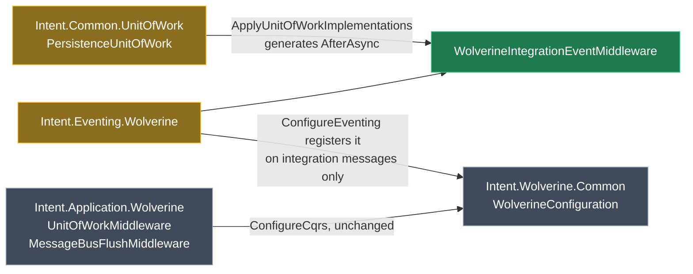

# Wolverine eventing: one consume-path middleware for `Transactional Outbox = None`

## Context

An application installs `Intent.Eventing.Wolverine`, subscribes to `OrderShippedEvent`, and its handler writes an `Order` through a repository and publishes an `OrderProcessedEvent`.

- With **`Transactional Outbox = Durable`** it works.
- With **`Transactional Outbox = None`** the handler runs, logs, returns — **no row written, no event published**. No exception, no warning, green build.

Under `Durable` the module emits two dispatcher-agnostic seams of its own: `opts.Policies.AutoApplyTransactions()` wraps every handler, and `FlushAllAsync` is spliced into `ApplicationDbContext.SaveChangesAsync`. Under `None` it emits neither and silently relies on whichever CQRS module is installed — and every one of those seams is gated on `ICommand` / `IQuery` or on an inbound HTTP call. **An integration event message is none of those**, so a subscriber falls through all of them, with or without `Intent.Application.Wolverine` present.

Nothing exercises this today: all twelve `WolverineEventing.*` samples install either `Intent.Application.Wolverine` or the MediatR stack, so the broken cell has never been generated. `Intent.Eventing.MassTransit` covers the equivalent cell — `Tests/Publish.AspNetCore.MassTransit.OutBoxNone.TestApplication` and `Tests/Subscribe.MassTransit.OutboxMemory` both run eventing with no CQRS module.

<Callout id="scope-boundary" tone="decision" title="Scope boundary this plan is built to">

This is **purely an eventing concern**. Concretely:

- `Intent.Application.Wolverine` is **not touched** — `MessageBusFlushMiddleware`, `UnitOfWorkMiddleware` and `ApplicationHandlerPolicy` all stay exactly as they are.
- `Intent.Wolverine.Common` is **not touched** — nothing moves into it.
- Exactly **one** new middleware is introduced, owned by `Intent.Eventing.Wolverine`, covering every consume-path concern in a single class.
- It applies **only to this application's integration messages**, never to application dispatch.
- Wolverine's own configuration keeps owning what it already owns well — `AutoApplyTransactions()` and the durable in/outbox policies stay the `Durable` mechanism, untouched.

</Callout>

## What "all the same concerns" means, concretely

`Intent.Eventing.MassTransit` generates an intermediate `IConsumer<TMessage>` wrapper; `Intent.Eventing.NServiceBus` generates an `IHandleMessages<TMessage>` wrapper. Both wrap the real `IIntegrationEventHandler<T>` and take responsibility for the whole consume path. `Intent.Eventing.Wolverine` deliberately generates **no** wrapper — CONTEXT.md R5.2: a second class implementing a `HandleAsync` convention is discovered by Wolverine as a genuine second handler alongside the real one, because `Intent.Application.Wolverine` turns on conventional assembly discovery. So the same responsibilities have to be expressed as Wolverine middleware.

Here is the full concern list, taken from `Tests/Subscribe.MassTransit.OutboxMemory/…/Eventing/IntegrationEventConsumer.cs` and `NServiceBusMessageHandlerTemplatePartial.cs:90-116`:

<Table
  id="concern-parity"
  caption="Consume-path concerns — the parity contract for the new middleware"
  columns={["#", "Concern", "MassTransit (Outbox = None)", "NServiceBus", "New Wolverine middleware"]}
  rows={[
    ["1", "Point the buffered bus at the active consume context", "`messageBus.ConsumeContext = context;`", "`_messageBus.ActiveContext = context;`", "`WolverineMessageBus.ActiveContext` set from the middleware — see the callout below"],
    ["2", "Open an ambient transaction", "`TransactionScope(Required, ReadCommitted, AsyncFlow)`", "n/a (NSB owns the session)", "`Before()` returns it"],
    ["3", "Invoke the handler", "explicit call", "explicit call", "Wolverine invokes it — nothing to generate"],
    ["4", "Persist the unit of work", "`await _unitOfWork.SaveChangesAsync(ct);`", "`await _dbContext.SaveChangesAsync(ct);`", "`AfterAsync`, one call per detected provider"],
    ["5", "Commit", "`transaction.Complete();`", "NSB session commit", "`AfterAsync`"],
    ["6", "Roll back on failure", "`using` disposes without Complete", "NSB session", "`FinallyAsync` — see the callout below"],
    ["7", "Flush the buffered bus, outside the scope", "`await messageBus.FlushAllAsync(ct);` after the `using`", "`await _messageBus.FlushAllAsync(ct);`", "`FinallyAsync`, after dispose, only when committed"],
  ]}
/>

## Approach

One template, `WolverineIntegrationEventMiddleware`, in `Intent.Eventing.Wolverine`, generated into the same `Eventing` output location and the same static-class-with-DI-parameters shape as the module's existing `WolverineTenantMiddleware`. Registered from `ConfigureEventing`, on a predicate built from this application's own Wolverine-designated message types. Emitted only when `Transactional Outbox = None`.

Its `AfterAsync` body is generated by `ApplyUnitOfWorkImplementations` on the shared unit-of-work component, `Intent.Modules.Common.UnitOfWork` — the same `PersistenceUnitOfWork` that already drives the MassTransit consumer, the MediatR `UnitOfWorkBehaviour`, the ServiceContract controllers, the Grpc services and the Lambda/Azure Functions consumers. Everything that decides *what* to emit is reused as-is: the eight-provider detection chain, `SystemUsesPersistenceUnitOfWork()`, the unit-of-work module settings (`AutomaticallyPersistUnitOfWork`, `UseAmbientTransactions`), the SQLite ambient-transaction exclusion, the `Domain.UnitOfWork` → `Application.Common.DbContextInterface` → `Infrastructure.Data.DbContext` role fallback, and the constructor parameters with their null guards.

Two things make that reuse possible with almost no change to the shared component:

- **The middleware class is non-static.** Wolverine injects constructor arguments into a non-static middleware with the same rules as a handler, and `ApplicationHandlerPolicy` already registers its own middlewares with `opts.Services.AddTransient<T>()`. That gives `ApplyUnitOfWorkImplementations` a real `CSharpConstructor` to inject the detected providers into — no `UseServiceProvider` workaround.
- **`WithTransactionScope(false)`** tells the component to emit the per-provider `SaveChangesAsync` calls *without* wrapping them in a scope, because `Before` has already opened one.

### The generated middleware

<AnnotatedCode
  id="middleware"
  filename="…Infrastructure/Eventing/WolverineIntegrationEventMiddleware.cs"
  language="csharp"
  code={`public class WolverineIntegrationEventMiddleware
{
    private readonly WolverineMessageBus _messageBus;
    private readonly IUnitOfWork _unitOfWork;

    public WolverineIntegrationEventMiddleware(WolverineMessageBus messageBus, IUnitOfWork unitOfWork)
    {
        _messageBus = messageBus;
        _unitOfWork = unitOfWork ?? throw new ArgumentNullException(nameof(unitOfWork));
    }

    public sealed class Scope
    {
        public TransactionScope Transaction { get; init; } = null!;
        public bool Committed { get; set; }
    }

    public Scope Before(IMessageContext context)
    {
        _messageBus.ActiveContext = context;

        return new Scope
        {
            Transaction = new TransactionScope(
                TransactionScopeOption.Required,
                new TransactionOptions { IsolationLevel = IsolationLevel.ReadCommitted },
                TransactionScopeAsyncFlowOption.Enabled)
        };
    }

    public async Task AfterAsync(Scope scope, CancellationToken cancellationToken)
    {
        await _unitOfWork.SaveChangesAsync(cancellationToken);

        scope.Transaction.Complete();
        scope.Committed = true;
    }

    public async Task FinallyAsync(Scope scope, CancellationToken cancellationToken)
    {
        scope.Transaction.Dispose();

        if (scope.Committed)
        {
            await _messageBus.FlushAllAsync(cancellationToken);
        }
    }
}`}
  annotations={[
    { lines: "1-10", label: "Non-static, with a constructor", note: "This is what unlocks the reuse: Wolverine injects constructor arguments into a non-static middleware, so ApplyUnitOfWorkImplementations has a real CSharpConstructor to add its detected providers to — parameters, readonly fields and null guards all generated by the shared component. Registered the way ApplicationHandlerPolicy already registers its own middlewares." },
    { lines: "12-16", label: "Why a state object", note: "Wolverine passes whatever Before returns to both After and Finally. The flush has to know whether the handler succeeded, and there is no hook that runs only-after-a-successful-dispose — so success is carried on the object rather than inferred." },
    { lines: "20", label: "Concern 1, matching both siblings", note: "MassTransit sets ConsumeContext, NServiceBus sets ActiveContext. Same idea: publishes buffered during the handler flush through the current message context rather than a separately-resolved bus." },
    { lines: "31-37", label: "Concerns 4 and 5", note: "Line 33 is the shared component's entire contribution in an EF-only app. On an app with EF plus MongoDB plus a distributed cache it becomes three constructor parameters and three ordered SaveChangesAsync calls, and it keeps tracking providers added to the shared chain later. Hand-rolling this is how the eventing middleware ends up EF-only forever — which is where Intent.Application.Wolverine's UnitOfWorkMiddleware is today." },
    { lines: "39-47", label: "Concerns 6 and 7, and the ordering invariant made structural", note: "Finally is the only hook Wolverine runs when the handler throws — After does not run. Disposing here rolls back on failure and disposes exactly once on success, and because the flush is below the dispose the broker call can never happen inside the ambient scope. Registration order stops being load-bearing." },
  ]}
/>

### The template that produces it

<Code id="template-partial" filename="Modules/Intent.Modules.Eventing.Wolverine/Templates/WolverineIntegrationEventMiddleware/WolverineIntegrationEventMiddlewareTemplatePartial.cs" language="csharp" caption="Constructor body — the shared component generates AfterAsync outright"
  code={`CSharpFile = new CSharpFile(this.GetNamespace(), this.GetFolderPath())
    .AddClass("WolverineIntegrationEventMiddleware", @class =>
    {
        // Foreign types resolved INSIDE AddClass, never before it - see CONTEXT.md.
        var hasBus = TryGetTypeName(WolverineMessageBusTemplate.TemplateId, out var busType);
        var wrapInTransaction = this.SystemUsesPersistenceUnitOfWork()
            && ExecutionContext.Settings.GetUnitOfWorkSettings().UseAmbientTransactions()
            && ProviderSupportsAmbientTransactions();

        var ctor = @class.AddConstructor();
        if (hasBus)
        {
            ctor.AddParameter(busType, "messageBus", p => p.IntroduceReadonlyField());
        }

        if (wrapInTransaction)
        {
            @class.AddNestedClass("Scope", nested =>
            {
                nested.Sealed();
                nested.AddProperty(UseType("System.Transactions.TransactionScope"), "Transaction");
                nested.AddProperty("bool", "Committed");
            });

            @class.AddMethod("Scope", "Before", method => { /* ActiveContext, open the scope */ });
        }

        @class.AddMethod(UseType("System.Threading.Tasks.Task"), "AfterAsync", method =>
        {
            method.Async();
            if (wrapInTransaction) method.AddParameter("Scope", "scope");
            method.AddParameter(UseType("System.Threading.CancellationToken"), "cancellationToken");

            // --- the shared component generates this entire body ---
            method.ApplyUnitOfWorkImplementations(this, ctor, cfg => cfg
                .UseCancellationToken("cancellationToken")
                .WithTransactionScope(false)   // Before() owns the scope
                .WithComments(false)
                .UseConstructorInjection());
            // -------------------------------------------------------

            if (wrapInTransaction)
            {
                method.AddStatement("scope.Transaction.Complete();", s => s.SeparatedFromPrevious());
                method.AddStatement("scope.Committed = true;");
            }
        });

        @class.AddMethod(UseType("System.Threading.Tasks.Task"), "FinallyAsync", method => { /* dispose, then flush if committed */ });
    });`}
/>

`WithTransactionScope(false)` is the pivot: it tells the shared component to emit the per-provider `SaveChangesAsync` calls without wrapping them in a scope, because `Before` has already opened one. `AddNestedClass` is already in the builder (`OcelotConfigurationTemplatePartial.cs:59`), and `UseAmbientTransactions()` / `AutomaticallyPersistUnitOfWork()` are already public on `UnitOfWorkSettings`.

<Callout id="shared-component-ask" tone="decision" title="The ask on `Intent.Common.UnitOfWork` is two small things, not a new emitter">

Working the template through concretely shrinks this considerably. What is actually missing:

1. **A no-invocation overload.** Every current overload requires an `invocationStatement` to nest — the handler call, which Wolverine generates rather than us. Passing an empty `List&lt;CSharpStatement&gt;` to the existing list overload happens to produce exactly the right output, but only because `stackAtDeepest` goes unused when `ReturnType` is null. That is incidental, not a contract. A three-line delegating overload makes it supported: `ApplyUnitOfWorkImplementations(block, template, constructor, configure)`.

2. **The ambient-transaction predicate.** `Before` hand-writes the `TransactionScope`, so it needs the gate the EF chain applies internally — `EFProviderSupportsAmbientTransactions` at `PersistenceUnitOfWork.cs:661`, private, and amounting to `provider != "sql-lite"`. Make it public rather than re-deriving the settings read locally, which is the thing that drifts.

Both are additive; no existing caller's output changes.

</Callout>

<Callout id="after-not-run-on-throw" tone="warning" title="`After` does not run when the handler throws — this is why disposal lives in `Finally`">

Wolverine generates `middleware.Before(); try { handler(); middleware.After(); } finally { middleware.Finally(); }`. Only `Finally` is guaranteed. Putting `Dispose()` in an `AfterAsync` `finally` block — which is what `Intent.Application.Wolverine`'s existing `UnitOfWorkMiddleware` does — means a throwing handler never disposes the `TransactionScope`, leaving `Transaction.Current` set on the async context while Wolverine's retry policy runs the next attempt.

That is a latent defect in `Intent.Application.Wolverine`, and this plan deliberately does **not** fix it — that module is out of scope by instruction. Flagged so it is a known, recorded issue rather than something the new middleware silently diverges from. Worth its own ticket.

</Callout>

<Callout id="active-context" tone="risk" title="`ActiveContext` — matching the siblings, but not yet measured on Wolverine">

Both sibling modules hand the broker's current consume context to their bus before the handler runs, and both would silently lose correlation and in-flight semantics without it. Wolverine's own best-practice guidance says an `IMessageBus` resolved from the container "will give you a completely different object than the current `MessageContext`" — which is the same failure mode — but `WolverineMessageBus` today injects `Wolverine.IMessageBus` in its constructor and flushes through that.

Adding a settable `ActiveContext` (typed `Wolverine.IMessageBus`, which `IMessageContext` implements) and flushing through `_activeContext ?? _bus` mirrors the siblings exactly and costs almost nothing. **It is listed as a concern rather than a settled fix because it has not been measured on Wolverine specifically** — step 4 makes proving or disproving it an explicit task, and if it turns out to be inert it should be dropped rather than kept as cargo cult.

There is a wiring wrinkle: the middleware needs the concrete `WolverineMessageBus`, not the contracts `IMessageBus`, to set the property — and `RegisterWolverineMessageBus` currently registers only the interface mapping. `WolverineCompositeConfiguration` already does `services.AddScoped&lt;WolverineMessageBus&gt;()` for the composite case; the non-composite case needs the same.

</Callout>

### Registration

<Diff
  id="configure-eventing-diff"
  filename="…Infrastructure/Configuration/WolverineConfiguration.cs (Outbox = None)"
  before={`private static void ConfigureEventing(WolverineOptions opts, IConfiguration configuration)
{
    ConfigureListeners(opts);

    ApplyErrorHandlingPolicy(opts, configuration);
}`}
  after={`private static void ConfigureEventing(WolverineOptions opts, IConfiguration configuration)
{
    ConfigureListeners(opts);

    ApplyErrorHandlingPolicy(opts, configuration);

    ApplyIntegrationEventPolicy(opts);
}

private static void ApplyIntegrationEventPolicy(WolverineOptions opts)
{
    opts.Policies.AddMiddleware<WolverineIntegrationEventMiddleware>(IsIntegrationMessage);
}

private static bool IsIntegrationMessage(HandlerChain chain)
{
    return chain.MessageType == typeof(OrderShippedEvent) ||
        chain.MessageType == typeof(ProcessOrderCommand);
}`}
  annotations={[
    { side: "after", lines: "12-15", label: "One registration, no ordering to get wrong", note: "The previous draft needed two middlewares registered in a specific order so the flush wrapped the unit of work. Consolidating them removes that constraint entirely — Finally runs after the scope is disposed by construction. This is the main reason the single-middleware shape is better, not just smaller." },
    { side: "after", lines: "17-21", label: "Disjoint from application dispatch by construction", note: "Built from this application's Wolverine-designated subscribed message types, deduplicated and ordered the same way AddHandlerTypeRegistrations already builds its IncludeType list. An integration message is never an ICommand or IQuery, so this can never overlap Intent.Application.Wolverine's IsApplicationMessage — no coexistence guard is needed." },
    { side: "after", lines: "13", label: "A static middleware needs no DI registration", note: "Unlike ApplicationHandlerPolicy's AddTransient calls: the class is static, so opts.Services gains nothing. Matches WolverineTenantMiddleware, which is registered the same way today." },
  ]}
/>

### Behaviour across the four combinations

<Table
  id="coexistence"
  caption="After the change"
  columns={["Configuration", "Application dispatch (commands / queries)", "Integration event and command handlers"]}
  rows={[
    ["`None` + `Intent.Application.Wolverine`", "**unchanged** — `UnitOfWorkMiddleware` + `MessageBusFlushMiddleware` on `ICommand`/`IQuery`", "**new** — one consolidated middleware"],
    ["`None` + MediatR", "**unchanged** — `UnitOfWorkBehaviour` + `MessageBusPublishBehaviour`", "**new** — one consolidated middleware"],
    ["`None`, no CQRS module at all", "n/a — publish from a controller still uses the dispatch module's own `eventbus-flush` statement", "**new** — one consolidated middleware"],
    ["`Durable` (any)", "**unchanged**", "**unchanged** — `AutoApplyTransactions()` plus the `SaveChangesAsync` splice"],
  ]}
/>

<Callout id="durable-untouched" tone="warning" title="Nothing is emitted under `Durable`, which leaves one narrower hole open">

Under `Durable`, `AutoApplyTransactions()` already wraps every handler whose DI graph reaches a `DbContext`, and the `ApplicationDbContext` splice flushes on save. Emitting this middleware there too would double-wrap the transaction and double-flush, so it is `None`-only.

The hole that leaves: a `Durable` subscriber that publishes but never touches the `DbContext` gets no `AutoApplyTransactions` wrap, therefore no `SaveChangesAsync`, therefore no flush — the same silent-drop class of defect, in a narrower case. It is out of scope here because the fix is a different one (a flush that does not depend on a save), and closing it badly risks the `Durable` path that currently works. Recorded in CONTEXT.md rather than fixed.

</Callout>

<Callout id="distributedcache-gap" tone="warning" title="One unit-of-work provider cannot be expressed in the Before/Finally split">

`PersistenceUnitOfWork.AddDistributedCacheToChain` wraps the invocation in `using (_distributedCacheWithUnitOfWork.EnableUnitOfWork())`. In `AfterAsync` that is the wrong place — the enable is meant to wrap the handler, and enabling it immediately before saving buffers nothing. So this provider has to be **actively excluded** from the call, not merely left unsupported: reused as-is it emits code that compiles, runs, and silently drops the cache writes the handler made.

Carrying a second disposable through the `Before`/`Finally` split is possible — it would ride on the same `Scope` object — but its disposal ordering relative to the `TransactionScope` has no precedent to copy and no sample to prove it against. Accepted because a Wolverine plus distributed-cache-unit-of-work application has never existed in this repo, and inventing the semantics unverified is worse than declaring the gap. It needs an explicit skip plus a note, and step 2 owns both.

</Callout>

<Callout id="context-conflict" tone="decision" title="This reverses a decision recorded in the module's own CONTEXT.md">

`Modules/Intent.Modules.Eventing.Wolverine/CONTEXT.md` currently records the opposite conclusion — that a subscriber under `Outbox = None` having no unit-of-work safety net is *"consistent with what 'None' means, not a gap this module needs to close"* — and explicitly says not to build a middleware for it *"without a new, specific reason."*

The new, specific reason: `None` is not "no durability guarantee", it is currently "the handler's work is discarded". `Intent.Eventing.MassTransit` reaches the opposite conclusion for the identical setting. The module-building workflow requires this be surfaced rather than quietly resolved — rewriting that section is part of step 6.

The same file's *"LOAD-BEARING INVARIANT — the flush seam must stay OUTSIDE the unit-of-work `TransactionScope`"* section is **satisfied more strongly** by this design than by the current one, and its note that registration order is what protects it needs updating: here the ordering is structural.

</Callout>

## Model changes

New templates are modelled in the Module Builder designer, never hand-created as loose `*TemplatePartial.cs` files.

<ModelChanges id="module-builder-changes" caption="Module Builder designer changes" changes={[
  { element: "WolverineIntegrationEventMiddleware", designer: "Module Builder (Intent.Eventing.Wolverine)", change: "added", note: "Mirrors the existing `WolverineTenantMiddleware` element exactly — same templating method, same location, same lookup-type source",
    fields: [
      { label: "Templating Method", after: "C# File Builder" },
      { label: "Role", after: "`Infrastructure.Eventing.WolverineIntegrationEventMiddleware`" },
      { label: "Default Location", after: "`Eventing`" },
      { label: "Source / Model Name", after: "Lookup Type / `object`" },
    ] },
  { element: "Module Settings — Version", designer: "Module Builder (Intent.Common.UnitOfWork)", change: "modified", note: "Published at `1.0.4` and gains public API, so the version gate applies",
    fields: [{ label: "Version", before: "1.0.4", after: "1.1.0-pre.0" }] },
]} />

<Callout id="version-gate" tone="info" title="Version gate — only the shared component moves">

`Intent.Eventing.Wolverine` (`1.0.0-pre.0`) is still in flight on this version line, so per the standing agreement on this work it is **not** bumped again. `Intent.Wolverine.Common` and `Intent.Application.Wolverine` are not changed at all. `Intent.Common.UnitOfWork` is at a released `1.0.4` and gains a new public method, which is a minor bump.

</Callout>

## Code changes

<FileTree
  id="files"
  title="Module source"
  entries={[
    { path: "Modules/Intent.Modules.Common.UnitOfWork/Shared/PersistenceUnitOfWork.cs", change: "modified", note: "Two additions only: a no-invocation `ApplyUnitOfWorkImplementations` overload, and `EFProviderSupportsAmbientTransactions` made public. Existing overloads must emit byte-identical output." },
    { path: "Modules/Intent.Modules.Eventing.Wolverine/Templates/WolverineIntegrationEventMiddleware/WolverineIntegrationEventMiddlewareTemplatePartial.cs", change: "added", note: "The single consolidated middleware — the whole consume path in one class" },
    { path: "Modules/Intent.Modules.Eventing.Wolverine/Templates/WolverineMessageBus/WolverineMessageBusTemplatePartial.cs", change: "modified", note: "Settable `ActiveContext`; `FlushAllAsync` uses it in preference to the injected bus — only if step 4 proves it matters" },
    { path: "Modules/Intent.Modules.Eventing.Wolverine/FactoryExtensions/WolverineEventingRegistrationExtension.cs", change: "modified", note: "New `AddApplyIntegrationEventPolicyMethod`, called from `ConfigureEventing` when the outbox is None; concrete-type bus registration alongside the interface mapping" },
    { path: "Modules/Intent.Modules.Eventing.Wolverine/Intent.Modules.Eventing.Wolverine.csproj", change: "modified", note: "ProjectReference to Intent.Modules.Common.UnitOfWork, PrivateAssets=All — the pattern MediatR.Behaviours, Controllers.Dispatch.ServiceContract, Grpc and the Functions modules all already use" },
    { path: "Modules/Intent.Modules.Eventing.Wolverine/CONTEXT.md", change: "modified", note: "Rewrite the 'no middleware needed' section; update the LOAD-BEARING INVARIANT section; record the Durable no-DbContext hole" },
    { path: "Modules/Intent.Modules.Eventing.Wolverine/docs/README.md", change: "modified", note: "The Transactional Outbox settings table must describe what None now generates" },
  ]}
/>

## Steps

1. **Bump `Intent.Common.UnitOfWork` and add the two small pieces.** Set Version to `1.1.0-pre.0` through the Module Builder designer, then add the no-invocation `ApplyUnitOfWorkImplementations` overload and make `EFProviderSupportsAmbientTransactions` public. Both are additive; **no existing caller's output may change**, which is what verification v1 checks first.

2. **Model `WolverineIntegrationEventMiddleware` in `Intent.Eventing.Wolverine`'s Module Builder designer**, generate, then implement the partial as sketched above. Add the `PrivateAssets="All"` ProjectReference to `Intent.Modules.Common.UnitOfWork`. Explicitly skip the distributed-cache provider and comment why. The template must degrade cleanly through all four shapes: full (scope, saves, flush); no ambient transactions (saves and flush, no `Before`, no `Scope`); no persistence unit of work (flush only); no bus registered (saves only); and neither, where `CanRunTemplate` returns false.

3. **Emit the registration.** In `WolverineEventingRegistrationExtension.cs`, add `AddApplyIntegrationEventPolicyMethod` alongside the existing `AddApplyErrorHandlingPolicyMethod` and `AddApplyTransactionalOutboxMethod`, called from `ConfigureEventing` when `!ctx.TransactionalOutbox.IsDurable()` and the application has at least one subscribed handler. Build `IsIntegrationMessage` from `ctx.SubscribedHandlers`' message types, deduplicated and ordered the way `AddHandlerTypeRegistrations` already does so the output is idempotent.

4. **Settle `ActiveContext` empirically, then implement or drop it.** Generate the new standalone sample, have its subscriber publish a second event, and inspect the published envelope's correlation/causation headers with the middleware setting `ActiveContext` and without. If the headers differ, add the property to `WolverineMessageBusTemplate` and register the concrete bus type alongside the interface. If they are identical, drop it and record the measurement in CONTEXT.md so nobody re-adds it.

5. **Add the missing golden sample.** `WolverineEventing.Standalone` — `Intent.Eventing.Wolverine` + `Intent.AspNetCore.Controllers` + `Intent.AspNetCore.Controllers.Dispatch.ServiceContract` + `Intent.EntityFrameworkCore.Repositories`, **no** `Intent.Application.Wolverine`, **no** MediatR, `Transport = Local`, `Outbox = None`. Modelled on `Tests/Publish.AspNetCore.MassTransit.OutBoxNone.TestApplication`, with `Tests/Subscribe.MassTransit.OutboxMemory`'s consumer as the behavioural target. It must publish **and** subscribe, and its subscriber must write through a repository without calling `SaveChangesAsync` itself and publish a second event.

6. **Documentation and CONTEXT.md, in the same turn as the behaviour.** The three CONTEXT.md edits named above, the `docs/README.md` outbox table, and release notes.

7. **Regenerate and inspect.** In order: the shared component's existing callers (must be byte-identical), the two `Durable` eventing apps (must be byte-identical), the three CQRS-only Wolverine apps (must be byte-identical — this module is not installed there), the ten `Outbox = None` eventing apps, and the new sample.

## Critical files / elements

- `Modules/Intent.Modules.Common.UnitOfWork/Shared/PersistenceUnitOfWork.cs` — `SystemUsesPersistenceUnitOfWork` at line 20, `AddEntityFrameworkToChain` with the `TransactionScope` at line 553, `EFProviderSupportsAmbientTransactions` at line 661.
- `Modules/Intent.Modules.Eventing.Wolverine/Templates/WolverineTenantMiddleware/WolverineTenantMiddlewareTemplatePartial.cs` — the shape to mirror: static class, DI-parameter methods, `Eventing` location, registered into `ConfigureEventing` by a factory extension.
- `Modules/Intent.Modules.Eventing.Wolverine/FactoryExtensions/WolverineEventingRegistrationExtension.cs` — `AddConfigureEventing` at line 244 is where the call statement lands; `AddHandlerTypeRegistrations` at line 631 is the dedup/order pattern to copy; `RegisterWolverineMessageBus` at line 69 is where the concrete-type registration would go.
- `Modules/Intent.Modules.Eventing.Wolverine/Templates/WolverineMessageBus/WolverineMessageBusTemplatePartial.cs` — `FlushAllAsync` at line 111, including the ASB `TransactionScope(Suppress)` insurance.
- `Tests/Subscribe.MassTransit.OutboxMemory/…/Eventing/IntegrationEventConsumer.cs` — the behavioural parity target for concerns 1 to 7.
- `Modules/Intent.Modules.Eventing.Wolverine/CONTEXT.md` — the "no middleware needed" and "LOAD-BEARING INVARIANT" sections.

## Verification

<Checklist
  id="verify"
  items={[
    { id: "v1", label: "The shared component's existing callers regenerate byte-identical", note: "`Standard.AspNetCore.TestApplication`, `Subscribe.MassTransit.OutboxMemory`, one MediatR app. Any diff means step 1's refactor changed the existing overloads — stop and fix before going further." },
    { id: "v2", label: "`Intent.Application.Wolverine`'s output is untouched", note: "`Wolverine.AspNetCore.Controllers`, `.FastEndpoints`, `Wolverine.Mapperly` regenerate with zero diff. `UnitOfWorkMiddleware.cs` and `MessageBusFlushMiddleware.cs` still present and unchanged in every app that had them." },
    { id: "v3", label: "`Durable` apps regenerate byte-identical", note: "`WolverineEventing.Coexist.Cqrs`, `.Outbox.SqlServer.Publish`, `.Outbox.SqlServer.Subscribe`." },
    { id: "v4", label: "`Outbox = None` apps gain exactly the one middleware file and the one registration method", note: "Ten apps, each diff read individually." },
    { id: "v5", label: "**`WolverineEventing.Standalone` run end to end**", note: "POST an order → 201; the subscriber's row is present in the database AND its cascading event reaches the local queue. This is the only check that proves the fix — a green build proves nothing here." },
    { id: "v6", label: "Throwing subscriber rolls back and publishes nothing", note: "Make the standalone sample's handler write, publish, then throw. Expect: no row committed, no message published, no `Transaction.Current` leaked into the retry attempt. This is what `FinallyAsync` exists for and it is not covered by the happy path." },
    { id: "v7", label: "`WolverineEventing.Subscribe.RabbitMQ` run end to end against a real broker", note: "Proves the alongside-`Intent.Application.Wolverine` case: CQRS middleware and eventing middleware both fire, on disjoint messages, no double transaction." },
    { id: "v8", label: "No DTC / ambient-transaction error on the Azure Service Bus app", note: "`WolverineEventing.Transport.AzureServiceBus` (`Outbox = None`, real ASB). A `Local transactions are not supported with other resource managers/DTC` in the log means the flush ended up inside the scope." },
    { id: "v9", label: "`ActiveContext` measurement recorded either way", note: "Step 4's envelope-header comparison, written into CONTEXT.md whether it changed the outcome or not." },
    { id: "v10", label: "Build exits 0 with `dotnet build --no-incremental`, and `.imodspec` dependency audit passes", note: "`Intent.Eventing.Wolverine` gains `Intent.Common.UnitOfWork`; confirm the Software Factory emitted it rather than hand-editing." },
  ]}
/>

## Open questions resolved

- **Q:** Move the Wolverine middlewares into `Intent.Wolverine.Common` and share them with `Intent.Application.Wolverine`? **A:** No. `Intent.Application.Wolverine` and `Intent.Wolverine.Common` are untouched; this is purely an eventing concern.
- **Q:** Two middlewares (unit of work + flush) or one? **A:** One consolidated middleware covering every consume-path concern, matching what the MassTransit and NServiceBus consumer wrappers each do in a single class. It also removes the registration-order constraint the two-middleware shape would have needed.
- **Q:** Blanket `AutoApplyTransactions()` under `None`, or a scoped middleware? **A:** Scoped middleware — integration messages only, zero change to application dispatch.
- **Q:** Hand-roll the transaction handling? **A:** No — reuse `Intent.Common.UnitOfWork`'s `PersistenceUnitOfWork`, the same shared component the MassTransit and NServiceBus consumer templates use.

<QuestionForm
  id="open-questions"
  questions={[
    {
      id: "q1", title: "The two additions to Intent.Common.UnitOfWork mean bumping a released module used by ~10 others. Confirm?", mode: "single",
      options: [
        { id: "extend", label: "Add both — overload plus public predicate", recommended: true, detail: "A three-line delegating overload and one private method made public. Nothing existing changes shape, so every current caller regenerates byte-identical (verification v1). Costs a 1.0.4 → 1.1.0-pre.0 bump and a regen sweep of its callers." },
        { id: "overload-only", label: "Overload only — re-derive the SQLite check locally", detail: "Skips making EFProviderSupportsAmbientTransactions public by re-reading the Database Provider setting in the Wolverine template. Two fewer lines changed in the shared module, at the cost of a duplicated rule that will drift the next time a provider is added to the exclusion." },
        { id: "public-only", label: "Neither — use only what is already public", detail: "Pass an empty statement list to the existing overload and re-derive the SQLite check. Zero change to the shared module and no bump — but it depends on incidental behaviour (an unused stackAtDeepest) that nothing guarantees, so a future refactor there breaks the Wolverine template silently." },
      ],
    },
    {
      id: "q2", title: "Should the middleware also cover Integration Commands this application receives, or only subscribed Integration Events?", mode: "single",
      options: [
        { id: "both", label: "Both events and commands", recommended: true, detail: "ctx.SubscribedHandlers already covers both, and a received Integration Command needs a unit of work every bit as much as an event. Matches MassTransit, whose consumer is generic over the message type." },
        { id: "events", label: "Subscribed Integration Events only", detail: "Narrower first cut. Leaves a received Integration Command with the same silent-drop defect this plan exists to fix, so it would need a follow-up." },
      ],
    },
    { id: "q3", title: "Anything about the middleware's shape, its name, or the WolverineEventing.Standalone sample's transport and module set?", mode: "freeform" },
  ]}
/>
