# Fix expired-token handling in `Intent.Blazor.Authentication`

## Context

In production, once a WebAssembly client's access token expires, API calls fail and the user sees a blank `Severity.Error` snackbar instead of being redirected to log in. The attached investigation (`module-fix-blazor-auth-token-expiry.md`) names three root causes across `Intent.Blazor.Authentication` and `Intent.Blazor`. I re-derived each one against the actual code on this branch and the actual shipped SDK (decompiled via `ilspycmd`, and verified live via a throwaway reflection harness) rather than assuming the writeup's diagnosis was current — the branch already carries WIP expiry-check work from an earlier session, and one of the three claims does not hold up under the real framework's behaviour. Two are confirmed and in scope; one is confirmed **not** to apply and is being explicitly documented rather than "fixed", per your answers above.

<Callout id="scope-correction" tone="info" title="Scope is narrower than the attached document implies">

The document frames this as a two-module fix (`Intent.Blazor.Authentication` **and** `Intent.Blazor`). It isn't: the client DI wiring that registers `PersistentAuthenticationStateProvider` lives in `Intent.Blazor.Authentication`'s `ClientAddAuthentication` factory extension, which reaches into `Intent.Blazor`'s already-built `ProgramTemplate` output — `Intent.Blazor`'s own `ProgramTemplate` needs no change. Every change in this plan is in **`Intent.Modules.Blazor.Authentication`** only.

</Callout>

## What actually happens today (confirmed)

<Table id="root-causes" columns={["Root cause", "Document's claim", "What I found", "Verdict"]} rows={[
  ["#1 `RequestAccessToken` never checks expiry", "Missing entirely", "Already implemented on this branch (expiry check, `RequiresRedirect` branch, JWT refresh) — but returns it via the wrong `AccessTokenResult` constructor overload", "**Real bug, different shape — fix below**"],
  ["#2 `IAccessTokenProvider` DI override missing/order-sensitive", "Must register `AuthenticationStateProvider` and `IAccessTokenProvider` explicitly, after `AddApiAuthorization()`", "`AddApiAuthorization()` registers both via `TryAddScoped` (net6-net10, decompiled); its `IAccessTokenProvider` registration is a lazy factory `sp => (IAccessTokenProvider)sp.GetRequiredService<AuthenticationStateProvider>()`. `ClientAddAuthentication` already registers the custom provider as `AuthenticationStateProvider` via plain `AddSingleton` (not Try), which always wins as the final descriptor regardless of call order — so the factory already resolves to the custom provider today.", "**Not reproducible — document, don't change** (per your answer)"],
  ["#3 `Redirect()` + stale `NavigationManager.Uri` infinite-reload trap", "Lives in hand-written app code; worth documenting", "Confirmed as a real, separate trap in Blazor WASM navigation — out of this module's generated code by construction", "**Document only** (per your answer)"],
]} />

### Root cause #1, precisely

The already-present `RequestAccessToken` returns its redirect via:

```csharp
new AccessTokenResult(AccessTokenResultStatus.RequiresRedirect, null, loginUrl, null)
```

That's the **4-argument** constructor `(status, token, interactiveRequestUrl, interactiveRequest)`. I instantiated both overloads against the real `Microsoft.AspNetCore.Components.WebAssembly.Authentication` assembly (8.0.11) and drove `AccessTokenNotAvailableException.Redirect()` against a capturing `NavigationManager`:

<Table id="ctor-probe" columns={["Constructor called", "RedirectUrl", "InteractiveRequestUrl", "Where Redirect() actually navigates"]} rows={[
  ["3-arg `(status, token, redirectUrl)` - Obsolete", "`/login-3arg?returnUrl=x`", "(empty)", "**`/login-3arg?returnUrl=x`** - correct"],
  ["4-arg `(status, token, interactiveRequestUrl, null)` - current code", "(empty)", "`/login-4arg?returnUrl=x`", "**empty string** - navigates nowhere"],
]} />

So today, once a token expires, `RequestAccessToken` correctly decides to redirect, builds the right login URL, but hands it to `AccessTokenResult` in a shape that `Redirect()` silently discards — landing exactly on the symptom (blank error, no redirect, no visible failure). The obsolete 3-arg constructor is the one that works; the fix wraps it in `#pragma warning disable/restore CS0618` as the document suggested, since it is genuinely still the correct call for this case.

## Approach

```mermaid
sequenceDiagram
    participant App as WASM page (HttpClient call)
    participant AMH as AuthorizationMessageHandler
    participant Provider as PersistentAuthenticationStateProvider
    participant Ex as AccessTokenNotAvailableException
    participant Nav as NavigationManager

    App->>AMH: outbound request
    AMH->>Provider: RequestAccessToken()
    Note over Provider: token expired
    Provider-->>AMH: AccessTokenResult(RequiresRedirect, ...)
    AMH->>Ex: throw AccessTokenNotAvailableException
    Ex->>Nav: Redirect() navigates to result's URL

    rect rgb(80,30,30)
    Note over Provider,Nav: TODAY: 4-arg ctor leaves RedirectUrl empty -> Redirect() navigates to "" -> blank error, stuck on page
    end
    rect rgb(30,60,40)
    Note over Provider,Nav: AFTER FIX: 3-arg ctor sets RedirectUrl -> Redirect() navigates to /Account/Login?returnUrl=... -> user reaches login
    end
```



The fix is a single-file, single-method change: swap the `AccessTokenResult` constructor call used on the `RequiresRedirect` path in `PersistentAuthenticationStateProviderTemplatePartial.cs` from the 4-arg to the 3-arg (obsolete) overload, suppressing CS0618 around that one `return`. Nothing else about the already-implemented expiry-check logic, the JWT refresh branch, or the OIDC/Identity no-refresh decision changes.

Root cause #2 gets no code change (confirmed not reproducible — see table above), but the reasoning is recorded as a new dated decision in `CONTEXT.md` so a future contributor who reads the same external document doesn't "fix" working code back into a redundant explicit registration without first checking whether the framework's `TryAddScoped` behaviour has changed.

Root cause #3 gets a documentation-only addition: a short "Handling token expiry" section in `docs/README.md` showing the correct catch-and-navigate pattern for `AccessTokenNotAvailableException`, plus a `CONTEXT.md` decision note capturing *why* (the stale-`Uri`-after-`Redirect()` trap), since this module doesn't generate the consuming app's HTTP error handler and can't fix the trap in code.

## Code changes

<FileTree id="files-touched" title="Files touched" entries={[
  { path: "Modules/Intent.Modules.Blazor.Authentication/Templates/Templates/Client/PersistentAuthenticationStateProvider/PersistentAuthenticationStateProviderTemplatePartial.cs", change: "modified", note: "Fix #1: use the 3-arg AccessTokenResult constructor for RequiresRedirect" },
  { path: "Modules/Intent.Modules.Blazor.Authentication/CONTEXT.md", change: "modified", note: "Record the AccessTokenResult ctor gotcha and the fix #2 non-finding" },
  { path: "Modules/Intent.Modules.Blazor.Authentication/docs/README.md", change: "modified", note: "Document the Redirect()/stale-Uri consumer pattern" },
  { path: "Modules/Intent.Modules.Blazor.Authentication/release-notes.md", change: "modified", note: "New Fixed entry" },
  { path: "Modules/Intent.Modules.Blazor.Authentication/Intent.Blazor.Authentication.imodspec (Module Builder designer)", change: "modified", note: "Version bump (2.0.3-pre.0 -> 2.0.3-pre.1)" },
]} />

<Diff id="diff-requires-redirect" filename="Modules/Intent.Modules.Blazor.Authentication/Templates/Templates/Client/PersistentAuthenticationStateProvider/PersistentAuthenticationStateProviderTemplatePartial.cs" before={`                            // The IAccessTokenProvider contract is to RETURN the status and URL and let
                            // the caller navigate (AuthorizationMessageHandler ->
                            // AccessTokenNotAvailableException -> .Redirect()). Navigating inline here
                            // would tear the page out from under in-flight requests.
                            @if.AddStatements($@"var current = _nav.ToBaseRelativePath(_nav.Uri);
                var returnUrl = ""/"" + current;
                var loginUrl = ""{loginRoute}?returnUrl="" + Uri.EscapeDataString(returnUrl);".ConvertToStatements());
                            @if.AddReturn(WrapReturn(isJwt, "new AccessTokenResult(AccessTokenResultStatus.RequiresRedirect, null, loginUrl, null)"));`} after={`                            // The IAccessTokenProvider contract is to RETURN the status and URL and let
                            // the caller navigate (AuthorizationMessageHandler ->
                            // AccessTokenNotAvailableException -> .Redirect()). Navigating inline here
                            // would tear the page out from under in-flight requests.
                            //
                            // The 3-arg (obsolete) AccessTokenResult constructor is required here: it is
                            // the one that populates RedirectUrl, which is what Redirect() actually reads.
                            // The 4-arg overload only sets InteractiveRequestUrl, which Redirect() ignores
                            // when InteractiveRequestOptions is null - confirmed by reflection against the
                            // real SDK assembly, not just by reading its source.
                            @if.AddStatements($@"var current = _nav.ToBaseRelativePath(_nav.Uri);
                var returnUrl = ""/"" + current;
                var loginUrl = ""{loginRoute}?returnUrl="" + Uri.EscapeDataString(returnUrl);".ConvertToStatements());
                            @if.AddStatements($@"#pragma warning disable CS0618 // Type or member is obsolete
                {WrapReturn(isJwt, "return new AccessTokenResult(AccessTokenResultStatus.RequiresRedirect, null, loginUrl);")}
#pragma warning restore CS0618".ConvertToStatements());`} annotations={[{ side: "after", lines: "9-11", label: "constructor swap", note: "3-arg ctor + CS0618 suppression, still routed through WrapReturn so the JWT vs OIDC ValueTask wrapping is unaffected" }]} />

This changes the *generated* output for every non-JWT-refresh redirect path (JWT's own refresh-failure redirect goes through the same statement, so it's fixed too) from:

```csharp
return ValueTask.FromResult(
    new AccessTokenResult(AccessTokenResultStatus.RequiresRedirect, null, loginUrl, null));
```

to:

```csharp
#pragma warning disable CS0618 // Type or member is obsolete
return ValueTask.FromResult(new AccessTokenResult(AccessTokenResultStatus.RequiresRedirect, null, loginUrl));
#pragma warning restore CS0618
```

<Callout id="wrapreturn-detail" tone="warning" title="WrapReturn's signature doesn't fit a bare expression once a pragma is involved">

`WrapReturn(bool isJwt, string expression)` currently wraps an *expression* and the caller does `@if.AddReturn(WrapReturn(...))`. A `#pragma` is a directive, not an expression, so it can't be threaded through `WrapReturn` unchanged — the exact statement text above (built via `AddStatements(...).ConvertToStatements()`, matching the pattern already used elsewhere in this same constructor for multi-line blocks) is the concrete target, but the implementing agent should feel free to reshape `WrapReturn` itself (e.g. have it return the full statement including `return`) if that reads cleaner in context — the only hard requirement is that the emitted C# matches the "after" block above for both the JWT (`async`, bare `return new AccessTokenResult(...)`) and non-JWT (`return ValueTask.FromResult(new AccessTokenResult(...))`) variants.

</Callout>

### Documentation additions

**`CONTEXT.md`** — add a dated decision entry (following the file's existing "Decision:" / "Invariant:" style) covering both findings from this fix:

- The `AccessTokenResult` 3-arg-vs-4-arg gotcha, stated as a rule future edits to this file must respect: *"Any `AccessTokenResult` constructed with `AccessTokenResultStatus.RequiresRedirect` that a consumer will reach via `AccessTokenNotAvailableException.Redirect()` must use the 3-arg (obsolete) constructor — the 4-arg overload leaves `RedirectUrl` unset and `Redirect()` navigates to an empty string when `InteractiveRequestOptions` is null. Confirmed by reflection against the shipped SDK, net6 through net10."*
- The fix #2 non-finding, so it isn't silently lost: *"`AddApiAuthorization()`'s `AuthenticationStateProvider` and `IAccessTokenProvider` registrations both use `TryAddScoped`, and the latter is a lazy factory resolving `AuthenticationStateProvider` at call time. Because `ClientAddAuthentication` registers the custom provider via a plain `AddSingleton` (not Try), it always wins as the final descriptor regardless of call order relative to `AddApiAuthorization()` — so `IAccessTokenProvider` already resolves to the custom provider today. Do not add an explicit `IAccessTokenProvider` override on the strength of an external bug report alone — re-verify against the then-current SDK first, since this depends on `TryAddScoped` semantics that could change."*

**`docs/README.md`** — new subsection under "Third-Party API Authentication", e.g. "Handling token expiry", covering:

- When `RequestAccessToken` decides the token is missing or expired, it returns `AccessTokenResultStatus.RequiresRedirect`; the framework surfaces this to calling code as a thrown `AccessTokenNotAvailableException`.
- **Do not** call `tokenException.Redirect()` and then `Navigation.NavigateTo(Navigation.Uri, forceLoad: true)` — `NavigationManager.Uri` does not update synchronously after `Redirect()`'s JS interop call, so this reloads the *current, still-expired* page and loops indefinitely (it looks like a flicker between two pages, but it's the same page reloading itself).
- Correct pattern: compute the login URL directly and navigate to it, the same way `RequestAccessToken` does — shown as a short code sample.

## Steps

1. **Fix the `AccessTokenResult` constructor** in `PersistentAuthenticationStateProviderTemplatePartial.cs` per the diff above, for the shared (JWT + non-JWT) `RequiresRedirect` branch.
2. **Record the two decisions in `CONTEXT.md`** — the ctor gotcha as a rule, and the fix #2 investigation as a non-finding — so this document's reasoning survives past this session.
3. **Add the "Handling token expiry" section to `docs/README.md`** with the correct catch/navigate sample and the stale-`Uri` warning.
4. **Bump the module version** (`Intent.Blazor.Authentication`'s Module Builder package stereotype, `Module Settings.Version`, currently `2.0.3-pre.0`) and **add a `Fixed:` entry to `release-notes.md`** describing the redirect fix, following the existing entry style.
5. **Regenerate and reconcile the checked-in test applications.** Per `CONTEXT.md`'s own verification guidance, `dotnet build` proves nothing about generated output — run the Software Factory against the applications under `Tests/` that install this module (`Blazor.Interactive{Server,Auto,WebAssembly}.{AspNetCoreIdentity,Jwt,Oidc}`, `BlazorNoMudBlazor`, `BlazorServerTests`) and apply the resulting diffs, since their checked-in `PersistentAuthenticationStateProvider.cs` currently embeds the same 4-arg-constructor bug (confirmed by reading `Tests/Blazor.InteractiveWebAssembly.Oidc/.../PersistentAuthenticationStateProvider.cs`). Because JWT and Identity share the same template branch as OIDC, all three authentication modes need regenerating, not just OIDC.

<Callout id="no-scope-creep" tone="warning" title="What this plan deliberately leaves alone">

- No change to `ClientAddAuthentication.cs` (fix #2 — investigated, not applicable today; see `CONTEXT.md` note).
- No new helper/extension method shipped for the `Redirect()` consumer pattern (your choice: document only).
- No change to `Intent.Modules.Blazor`'s `ProgramTemplate` — it was never the source of the DI wiring in question.
- The JWT refresh path (`TryRefreshAccessTokenAsync`) and the OIDC/Identity no-refresh decision are untouched; this fix only changes how the *already-decided* redirect result is constructed.

</Callout>

## Critical files / elements

- `Modules/Intent.Modules.Blazor.Authentication/Templates/Templates/Client/PersistentAuthenticationStateProvider/PersistentAuthenticationStateProviderTemplatePartial.cs` — the `RequestAccessToken` method, `RequiresRedirect` branch and `WrapReturn` helper.
- `Modules/Intent.Modules.Blazor.Authentication/CONTEXT.md` — durable-reasoning doc; add both decisions here.
- `Modules/Intent.Modules.Blazor.Authentication/docs/README.md` — user-facing module docs; add the token-expiry section.
- `Modules/Intent.Modules.Blazor.Authentication/release-notes.md` — version history.
- Module Builder designer, `Intent.Blazor.Authentication` package element, `Module Settings` stereotype — version bump.
- `Tests/Blazor.Interactive{Server,Auto,WebAssembly}.{AspNetCoreIdentity,Jwt,Oidc}`, `Tests/BlazorNoMudBlazor`, `Tests/BlazorServerTests` — regenerate and apply.

## Verification

1. Regenerate all listed test applications via the Software Factory; confirm each `Common/PersistentAuthenticationStateProvider.cs` now emits the 3-arg constructor with the CS0618 pragma, for both the OIDC/Identity path and the JWT refresh-failure path.
2. `dotnet build` each regenerated test application to confirm the pragma suppresses the obsolete-member warning cleanly (no new warnings/errors introduced).
3. Manual/functional check, following the attached document's own suggested acceptance test: shorten the server-side `expires_at` claim at sign-in time (not a client-side recompute, which resets on every WASM reboot) in one of the WebAssembly test apps, log in, wait past expiry, then trigger an authenticated API call both via a fresh reload and via in-app navigation while already running — both should land cleanly on the login page once, with no reload loop.
4. Confirm `docs/README.md` renders correctly and the new section reads coherently alongside the existing "Third-Party API Authentication" content.

## Open questions resolved

- **Q:** Root cause #2 (explicit `IAccessTokenProvider` DI registration) was investigated and found not to reproduce against the actual framework behaviour — skip the code change, or add it anyway as defense-in-depth? **A:** Skip the code change; document the investigation in `CONTEXT.md` instead.
- **Q:** Root cause #3 (`Redirect()` + stale `Uri` trap) — document only, or also ship a helper for consuming apps? **A:** Document only, in `docs/README.md` and `CONTEXT.md`.
