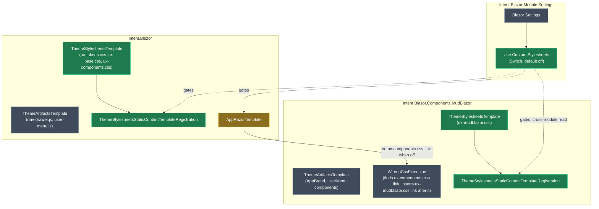

# Add a "Use Custom Stylesheets" setting to skip the default Blazor theme CSS

## Context

The `Intent.Blazor` module always outputs four stylesheets — `ux-tokens.css`, `ux-base.css`, `ux-components.css` (from `Intent.Blazor`) and `ux-mudblazor.css` (from `Intent.Blazor.Components.MudBlazor`, when installed) — and always links them into `App.razor`. An application whose stylesheets don't build on this token/utility-class system currently has no way to turn that off: the files still land in `wwwroot`, and the `<link>` tags still render, regardless of whether anything in the app actually uses them.

**Worked example:** a consumer with their own design system enables **Use Custom Stylesheets** in Application Settings for the `Blazor` module. On the next regeneration: `wwwroot/ux-tokens.css`, `ux-base.css`, `ux-components.css` and (if `Blazor.Components.MudBlazor` is installed) `ux-mudblazor.css` are no longer written, and `App.razor`'s `<head>` no longer contains their `<link>` tags. Everything else — the theme toggle, `nav-drawer.js`, `user-menu.js`, the MudBlazor layout components — is untouched, since none of those are CSS.

## Approach

`Intent.Blazor` already has exactly this shape of toggle: <ModelRef application="Blazor" name="Enable Theme Toggle" designer="Module Builder" type="Module Settings Field Configuration" /> is a `Switch` field on the `Blazor Settings` module settings group, read in <ModelRef application="Blazor" name="AppRazorTemplate" designer="Module Builder" type="Razor Template" /> and used to gate both generated markup and a `Static Content Template`'s registration. This change reuses that exact pattern for the CSS files — no new mechanism, one more field and one more gated template.

The one real complication: the CSS files are not generated by their own template today. In both `Intent.Blazor` and `Intent.Blazor.Components.MudBlazor`, the `ux-*.css` file(s) are bundled into the same `Static Content Template` (`ThemeArtifactsTemplate`) as unrelated files that must keep generating unconditionally — `nav-drawer.js`/`user-menu.js` in `Intent.Blazor`, and the `AppBrand`/`UserMenu` layout components in `Intent.Blazor.Components.MudBlazor`. A `Static Content Template`'s registration gate is all-or-nothing for its whole content subfolder, so the CSS has to move into its own template before it can be turned off independently.

`WireupCssExtension` needs **no code change**: it already only inserts the `ux-mudblazor.css` `<link>` when it can find the `ux-components.css` `<link>` as an anchor (`SingleOrDefault(...)`, silently no-ops if not found). Once `AppRazorTemplate` stops emitting that anchor, the MudBlazor link disappears for free — the same cascade that already protects against a missing `App.razor` entirely.

<Callout id="ai-skills-scope" tone="warning" title="AI authoring skills are out of scope for this change">

`Intent.Blazor` and `Intent.Blazor.Components.MudBlazor` generate several AI skill files (`blazor-ux-theme-sync`, `mudblazor-ux-theme-sync`, the page/dialog generation skills, `BlazorGeneralInstructions`, `DefaultDesignMd`) that assume the `ux-*.css` files exist and instruct the AI to style pages using their utility classes. This change does **not** touch them — with **Use Custom Stylesheets** on, those skills still get generated and still reference `ux-*` classes that no longer exist in the app. Accepted for this first cut per explicit product decision; a consumer who both turns the setting on and uses those AI skills will need to adjust the guidance themselves until a follow-up addresses it.

</Callout>

<Callout id="unstyled-not-broken" tone="info" title="Effect is visual only">

Turning the setting on does not remove any HTML structure, the theme-toggle JavaScript/cookie logic, or MudBlazor's layout components — only the stylesheets and their `<link>` tags. Standard Blazor account/identity pages and MudBlazor components keep working, just unstyled by the default theme; the app's own stylesheets take over from there. If **Enable Theme Toggle** is also on, the `data-theme` attribute and cookie still get set — dark/light mode has no visual effect unless the consumer's own CSS implements it.

</Callout>

## Model changes

<ModelChanges id="model-changes" caption="Proposed designer changes" changes={[
  { element: "Use Custom Stylesheets", designer: "Module Builder", change: "added",
    fields: [
      { label: "Parent", after: "Blazor Settings (Module Settings Configuration)" },
      { label: "Control Type", after: "Switch" },
      { label: "Default Value", after: "false" },
      { label: "Hint", after: "Skip generating the default ux-tokens.css, ux-base.css and ux-components.css stylesheets (and MudBlazor's ux-mudblazor.css, if installed) and their <link> tags in App.razor. Enable when the application supplies its own stylesheets instead of building on the default theme system." }
    ] },
  { element: "ThemeStylesheetsTemplate", designer: "Module Builder", change: "added", note: "New Static Content Template in Intent.Blazor, sibling of the existing ThemeArtifactsTemplate",
    fields: [
      { label: "Content Subfolder", after: "ThemeStylesheets" },
      { label: "Role", after: "Blazor.ThemeStylesheets" }
    ] },
  { element: "ThemeArtifactsTemplate", designer: "Module Builder", change: "modified", note: "Intent.Blazor — loses the 3 CSS files, keeps nav-drawer.js / user-menu.js",
    fields: [ { label: "Content", before: "nav-drawer.js, user-menu.js, ux-base.css, ux-components.css, ux-tokens.css", after: "nav-drawer.js, user-menu.js" } ] },
  { element: "ThemeStylesheetsTemplate", designer: "Module Builder", change: "added", note: "New Static Content Template in Intent.Blazor.Components.MudBlazor",
    fields: [
      { label: "Content Subfolder", after: "ThemeStylesheets" },
      { label: "Role", after: "Blazor.ThemeStylesheets" }
    ] },
  { element: "ThemeArtifactsTemplate", designer: "Module Builder", change: "modified", note: "Intent.Blazor.Components.MudBlazor — loses ux-mudblazor.css, keeps AppBrand.razor / UserMenu.razor",
    fields: [ { label: "Content", before: "AppBrand.razor(.css), UserMenu.razor(.cs/.css), ux-mudblazor.css", after: "AppBrand.razor(.css), UserMenu.razor(.cs/.css)" } ] },
]} />

## Code changes

- `Intent.Modules.Blazor/content/Theme/wwwroot/{ux-tokens.css,ux-base.css,ux-components.css}` → move to `Intent.Modules.Blazor/content/ThemeStylesheets/wwwroot/` (matches the new template's Content Subfolder). Pure file relocation, no content edit.
- `Intent.Modules.Blazor/Templates/Templates/Common/StaticContentTemplateRegistrations/ThemeStylesheetsStaticContentTemplateRegistration.cs` — **new**, mirrors <FileRef path="Modules/Intent.Modules.Blazor/Templates/Templates/Common/StaticContentTemplateRegistrations/ThemeStorageStaticContentTemplateRegistration.cs" /> exactly: overrides `Register` to `return` before calling `base.Register(...)` when `application.Settings.GetBlazor().UseCustomStylesheets()` is true.
- <FileRef path="Modules/Intent.Modules.Blazor/Templates/Templates/Server/AppRazor/AppRazorTemplatePartial.cs" change="modified" /> — wrap the three `head.AddHtmlElement("link", ...)` calls for `ux-tokens.css`, `ux-base.css`, `ux-components.css` (lines ~59-67) in `if (!ExecutionContext.Settings.GetBlazor().UseCustomStylesheets())`, following the existing `enableThemeToggle` conditional style already used lower in the same method.
- `Intent.Modules.Blazor.Components.MudBlazor/content/Theme/wwwroot/ux-mudblazor.css` → move to `Intent.Modules.Blazor.Components.MudBlazor/content/ThemeStylesheets/wwwroot/`.
- `Intent.Modules.Blazor.Components.MudBlazor/Templates/StaticContentTemplateRegistrations/ThemeStylesheetsStaticContentTemplateRegistration.cs` — **new**, same pattern, reading the same `Blazor Settings` group via `using Intent.Modules.Blazor.Settings;` and `application.Settings.GetBlazor().UseCustomStylesheets()` (cross-module read of a group `Intent.Blazor` already owns — the module already depends on `Intent.Blazor` for `AppRazorTemplate`, so the settings accessor is already reachable).
- <FileRef path="Modules/Intent.Modules.Blazor.Components.MudBlazor/FactoryExtensions/WireupCssExtension.cs" /> — **no change**; its existing `SingleOrDefault(...)` anchor lookup already no-ops safely when the `ux-components.css` link isn't present.

## Steps

1. **Add the `Use Custom Stylesheets` field** to the `Blazor Settings` Module Settings Configuration in `Intent.Blazor`'s Module Builder designer (Switch, default off, hint as above). This alone regenerates `ModuleSettingsExtensions.cs`'s `Blazor` class with a new `UseCustomStylesheets()` accessor — no hand-written code needed for that part.
2. **Split `Intent.Blazor`'s theme content.** Create the `ThemeStylesheetsTemplate` Static Content Template element (Content Subfolder `ThemeStylesheets`, Role `Blazor.ThemeStylesheets`), move the three CSS files on disk into `content/ThemeStylesheets/wwwroot/`, and remove them from the existing `ThemeArtifactsTemplate`'s folder so it only ships the two JS files.
3. **Gate the new template's registration** with `ThemeStylesheetsStaticContentTemplateRegistration.cs`, copying `ThemeStorageStaticContentTemplateRegistration`'s shape but checking `UseCustomStylesheets()` (inverted sense — skip when *true*, not when a toggle is *false*).
4. **Gate the `<link>` tags** in `AppRazorTemplatePartial.cs`.
5. **Repeat steps 2-3 for `Intent.Blazor.Components.MudBlazor`**: new `ThemeStylesheetsTemplate` holding only `ux-mudblazor.css`, existing `ThemeArtifactsTemplate` keeps the layout components, new registration class reading the same `Blazor Settings` group.
6. **Regenerate both modules' own sample/test applications** (or a scratch consumer application with `Blazor.Components.MudBlazor` installed) with the setting off (default) and confirm no output changes versus current generation, then with it on and confirm all four CSS files and their four `<link>` tags disappear while JS files, layout components and the theme toggle remain.
7. **Version and document** — bump both modules per `module-version-increment` (new setting is an additive, backward-compatible change — default `false` preserves current behaviour), and record the new setting in each module's `docs/README.md` / release notes per `module-docs-chore`.

## Critical files / elements

- Module Builder (`Intent.Blazor`), element `Blazor Settings` / `Use Custom Stylesheets` — the new setting.
- Module Builder (`Intent.Blazor`), elements `ThemeArtifactsTemplate` and new `ThemeStylesheetsTemplate` — the content split.
- Module Builder (`Intent.Blazor.Components.MudBlazor`), elements `ThemeArtifactsTemplate` and new `ThemeStylesheetsTemplate` — the mirrored split.
- <FileRef path="Modules/Intent.Modules.Blazor/Templates/Templates/Server/AppRazor/AppRazorTemplatePartial.cs" /> — gates the `<link>` tags.
- <FileRef path="Modules/Intent.Modules.Blazor/Templates/Templates/Common/StaticContentTemplateRegistrations/ThemeStorageStaticContentTemplateRegistration.cs" /> — the pattern being copied for both new registration classes.
- <FileRef path="Modules/Intent.Modules.Blazor/Settings/ModuleSettingsExtensions.cs" /> — Software-Factory-generated; will pick up `UseCustomStylesheets()` automatically once the field is modelled, never hand-edited.

## Verification

1. Build both modules (`dotnet build --no-incremental` per the known build gotchas — non-C# content changes need a forced rebuild to repackage).
2. Regenerate a consumer application with `Blazor.Components.MudBlazor` installed, setting off: diff against current output — expect **zero changes** (default preserves existing behaviour).
3. Flip **Use Custom Stylesheets** on, regenerate: confirm `ux-tokens.css`, `ux-base.css`, `ux-components.css`, `ux-mudblazor.css` are no longer written to `wwwroot`, and `App.razor`'s `<head>` has none of their four `<link>` tags — while `nav-drawer.js`, `user-menu.js`, `theme-storage.js`, `AppBrand.razor`, `UserMenu.razor` and the theme-toggle markup are unchanged.
4. Load the running app and confirm it still renders (unstyled by the default theme) with no 404s in the browser console for the removed stylesheet links.

## Open questions resolved

- **Q:** Should the setting also suppress or rewrite the AI authoring skills that assume the default CSS exists (theme-sync skills, page/dialog generation instructions)? **A:** No — out of scope for this change; called out as an accepted limitation (see Callout above).
- **Q:** What should the setting be called? **A:** `Use Custom Stylesheets`, a `Switch` defaulting to off, framed from the consumer's point of view.
