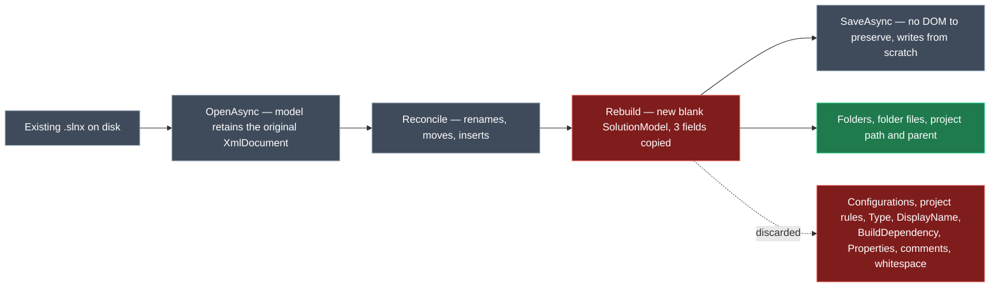

# Make the `.slnx` merge lossless

## Context

A client on `Intent.VisualStudio.Projects` 4.1.9 added `Release-Linux` and `Release-Windows` solution configurations to their Intent-generated `.slnx`. The next Software Factory run deleted them. They have stopped letting Intent manage the file.

The Software Factory diff shows exactly what survived and what did not:

<Table
  id="diff-evidence"
  caption="From the client's staged-changes diff"
  columns={["Content", "Outcome"]}
  rows={[
    ["`Folder` elements (nested, several levels)", "Preserved"],
    ["`File` entries under `0 - Solution Items` (`.gitignore`, pipeline yamls, `Directory.Build.props`, 16 `scripts/*.ps1`)", "Preserved"],
    ["`Project` path and parent folder", "Preserved"],
    ["The entire `Configurations` block — 3 `BuildType`, 3 `Platform`", "**Deleted**"],
    ["Every per-project `BuildType Solution=… Project=…` rule", "**Deleted**"],
  ]}
/>

That split is not arbitrary. It is precisely the boundary of what `SlnxMerger.Rebuild` copies.

<Callout id="contract" tone="decision" title="The contract this plan implements">

Preservation happens by default. Content is removed only when a structural change genuinely requires it — a project entry going away takes its own configuration rules with it, and nothing else is discarded.

This is deliberately broader than "fix build types". The client lost build types because build types are what they happened to have.

</Callout>

## Root cause

`SlnxMerger.Merge` ends with `Serialize(Rebuild(existingModel))`. `Rebuild` constructs a **brand new** `SolutionModel` and copies three things into it: solution folders, folder files, and each project's path and parent.

The damage is larger than those three omissions suggest, because of what `existingModel` actually is. From the library's own README:

> The SlnxSerializer preserves user added elements, comments and whitespace when possible. Updating only modifies changed elements to reduce chances of changing user content.

`SolutionSerializers.SlnXml.OpenAsync` retains the original `XmlDocument`, and saving applies only the deltas back onto that DOM. The library is built to round-trip losslessly. `Rebuild` takes a model carrying the user's original document and copies three fields into a blank model that has no document at all — throwing the library's entire preservation guarantee away, then reconstructing an approximation of the file from scratch.



### The full blast radius

Taken from the `.slnx` XSD, not from what this one client happened to lose:

<Table
  id="schema-loss"
  caption="Every construct the schema allows, versus what Rebuild carries"
  columns={["Element", "Carried by `Rebuild`?"]}
  rows={[
    ["`Solution` attributes — `Description`, `Version`", "No"],
    ["`Configurations` — `BuildType`, `Platform`, `ProjectType`", "No"],
    ["`Folder` `Name`, and its `File` children", "Yes"],
    ["`Folder` `Properties`", "No"],
    ["`Project` `Path` and parent folder", "Yes"],
    ["`Project` `Type`, `DisplayName`, and any other attribute", "No"],
    ["`Project` children — `BuildType`, `Platform`, `Build`, `Deploy`", "No"],
    ["`Project` `BuildDependency`", "No"],
    ["`Project` / `Solution` `Properties` and `Property`", "No"],
    ["XML comments and whitespace", "No"],
    ]}
/>

<Table
    id="schema-final"
    caption="Same rows, against what actually shipped — three passes, not one"
    columns={["Element", "Carried by the final fix?"]}
    rows={[
    ["`Solution` attributes — `Description`, `Version`", "Yes — DOM-patched directly, no restoration pass needed"],
    ["`Configurations` — `BuildType`, `Platform`, `ProjectType`", "Yes — RestoreOriginalConfigurations"],
    ["`Folder` `Name`, and its `File` children", "Yes — DOM-patched directly, unchanged from the one-line fix"],
    ["`Folder` `Properties`", "Not verified either way — see the callout above"],
    ["`Project` `Path` and parent folder", "Yes — unchanged from the one-line fix"],
    ["`Project` `Type`, `DisplayName`, and any other attribute", "Yes — RestoreOriginalProjectElements"],
    ["`Project` children — `BuildType`, `Platform`, `Build`, `Deploy`", "Yes — RestoreOriginalProjectElements splices the whole element, not just BuildType"],
    ["`Project` `BuildDependency`", "Yes — RestoreOriginalProjectElements"],
    ["`Project` `Properties` and `Property`", "Yes — RestoreOriginalProjectElements"],
    ["`Solution`-root `Properties` and `Property`", "Not verified either way — see the callout above"],
    ["XML comments and whitespace", "Yes — DOM-patched directly, unchanged from the one-line fix"],
    ]}
/>

## Approach

Stop calling `Rebuild` on the reconcile path. Serialize `existingModel` directly and let the library do what it was designed to do.

`Rebuild` stays on the first-generation path, where it is correct and necessary. That split is not a compromise — it *is* the contract, stated in code:

- **`existing == null`** — the output is entirely Intent's own. The template stamps Intent element guids onto `SolutionFolderModel.Id` / `SolutionProjectModel.Id` as merge bookkeeping, and those must never reach a user's file. `Rebuild(generatedModel)` strips them structurally. Unchanged.
- **`existing != null`** — the output is the *user's* file with Intent's deltas applied. Preserve it.

<Diff
  id="merge-diff"
  filename="Modules/Intent.Modules.VisualStudio.Projects/Templates/VisualStudioSolution/Merging/SlnxMerger.cs"
  before={`var existingModel = ParseExisting(existing);
var previousOutputModel = previousOutput == null ? null : TryParse(previousOutput);

Reconcile(generatedModel, existingModel, previousOutputModel);

// Rebuild fresh rather than serializing existingModel directly: this guarantees no Id
// attribute ever reaches the file a user opens, regardless of whether one was already
// present in Existing from some other source (e.g. a stray leftover from a different
// module version) that this reconciliation pass never had reason to touch.
return Serialize(Rebuild(existingModel));`}
  after={`var existingModel = ParseExisting(existing);
var previousOutputModel = previousOutput == null ? null : TryParse(previousOutput);

Reconcile(generatedModel, existingModel, previousOutputModel);

// Serialize the reconciled model directly. SlnXml retains the original XmlDocument from
// OpenAsync and applies only the deltas back onto it, so everything this pass had no
// reason to touch - build types, project configuration rules, properties, comments,
// whitespace - survives untouched. Reconcile never assigns an Id to anything in
// existingModel, so no Intent bookkeeping can leak in here.
return Serialize(existingModel);`}
  annotations={[
  { side: "after", lines: "6-10", label: "One line changes", note: "Necessary, but turned out not to be sufficient on its own - see the callout below." },
  ]}
  />

  <Callout id="rebuild-removal-insufficient" tone="risk" title="This one line did not finish the job">

  Dropping `Rebuild` fixed `Folder`, `File`, comments, whitespace, and `Solution` attributes immediately - those are DOM-patched by the library and were never routed through `Rebuild` in the first place once it was gone.

  It did **not** fix `Configurations` or anything inside a `Project` element. Live verification against a real application (not just the unit tests) showed both still being stripped after this change. The reason: `SolutionSerializers.SlnXml.SaveAsync` regenerates a `Project`'s own serialized attributes from its typed model, and regenerates `Configurations` from its typed `BuildTypes`/`Platforms` lists, **on every save** - whether `Reconcile` touched that project or not. That regeneration silently drops `Type`/`DisplayName` (no typed slot for either) and elides a per-project `BuildType` rule whose Solution and Project configuration names match, as "redundant" - the exact shape of the rules Visual Studio writes.

  Closing that required two more, narrower fixes - see `RestoreOriginalProjectElements` and `RestoreOriginalConfigurations` in the "Complication discovered during implementation" section below. The single-line change stayed in as the necessary first step; it just was not the whole fix.

  </Callout>

  <Callout id="id-tests" tone="decision" title="Two existing tests encode the opposite contract and must change">

`WhenExistingFileAlreadyHasAStrayIdAttribute_ShouldNeverSurviveToOutput` asserts that an `Id` already present in the user's file is deleted, calling it "a stray Id... from some other source". Under the contract above that is wrong: `Id` is a real `.slnx` attribute, and `Reconcile` never assigns one to `existingModel` — it sets `Name`, `FilePath` and parent, nothing else. So on the reconcile path every `Id` that gets deleted can only have come from the user.

Re-scope both tests to the first-generation path, where the guarantee is genuine and still holds. This is an intentional behaviour change and should be called out in the release notes, not slipped in.

Both also assert `result.ShouldNotContain("Id=")` — a whole-file substring check. `.slnx` has other attributes ending in `Id`, so this needs tightening to the actual `Id` attribute on `Folder` and `Project` regardless.

</Callout>

<Callout id="backoff" tone="warning" title="The back-off path leaves configuration rules on the old entry">

`WhenProjectRenamed_ButUserAlreadyEditedThatEntry_ShouldBackOffAndInsertFresh` pins existing behaviour: when Intent cannot resolve a renamed project against the file, it inserts a fresh entry rather than guessing. The user's original entry stays.

With preservation on, that original entry keeps its `BuildType` rules while the newly inserted one has none — so the solution briefly has two entries for conceptually the same project, one configured and one not. That is not a new bug (the duplicate entry already happens today), but preservation makes it more visible and more annoying to clean up.

Accepted for this fix: it only triggers when the user has already hand-edited the entry Intent wanted to rename, and silently merging the two would be worse than leaving both. Worth a follow-up.

</Callout>

<Callout id="renames" tone="success" title="Renames and moves carry their rules with no extra work">

`Reconcile` mutates the matched `SolutionProjectModel` in place — `ApplyProjectPlacement` sets `FilePath` and calls `MoveToFolder` on the existing object. The configuration rules hang off that same object, so they follow it through a rename or reparent automatically. This needs a test, not code.

</Callout>

## Complication discovered during implementation

The `Serialize(existingModel)` one-liner above is what shipped, but it was not the whole fix. Live verification against `Tests/MinimalHostingModel` — hand-adding the client's exact `Configurations`/`BuildType` shape and running the real Software Factory, not just the unit tests — showed `Configurations` and everything inside a `Project` element still being stripped after the one-line change alone.

The cause is `SolutionSerializers.SlnXml.SaveAsync` itself: it regenerates a `Project`'s attributes from its typed model, and regenerates `Configurations` from the typed `BuildTypes`/`Platforms` lists, on **every** save — independent of whether `Reconcile` touched that project, and independent of `Rebuild` being gone. Two consequences follow directly from that:

- A `Project`'s `Type`/`DisplayName` have no typed slot at all, so they are dropped unconditionally.
- A per-project `BuildType` rule whose Solution and Project configuration names match (`Solution="Debug|*" Project="Debug"`) is elided as a redundant identity mapping — which is exactly the shape Visual Studio's Configuration Manager writes, since it defaults each new solution configuration onto the identically-named project configuration.

<Diagram
id="restore-flow"
caption="Where the two restoration passes sit relative to the one-line fix"
data={{
    html: `<div class="wrap">
<div class="diagram-panel">
    <div class="diagram-node">Reconcile</div>
    <div class="diagram-arrow">&#8595;</div>
    <div class="diagram-node">Serialize(existingModel)</div>
    <div class="diagram-mono">the one-line fix - fixes Folder, File, comments, whitespace, Solution attrs</div>
    <div class="diagram-arrow">&#8595;</div>
    <div class="diagram-node diagram-accent">RestoreOriginalConfigurations</div>
    <div class="diagram-mono">splices the original &lt;Configurations&gt; block back in verbatim</div>
    <div class="diagram-arrow">&#8595;</div>
    <div class="diagram-node diagram-accent">RestoreOriginalProjectElements</div>
    <div class="diagram-mono">splices each original &lt;Project&gt; element back in verbatim (Path updated only if renamed)</div>
    <div class="diagram-arrow">&#8595;</div>
    <div class="diagram-node">Final .slnx text</div>
</div>
</div>`,
    css: `.wrap { display: flex; justify-content: center; }
.diagram-panel { display: flex; flex-direction: column; align-items: center; gap: 4px; padding: 12px; }`,
}}
/>

Both restorations work the same way: after `SaveAsync` produces its output, find the relevant element's ORIGINAL raw XML text in `existing` (via a small quote-aware tag scanner, not a full XML re-parse-and-re-render — re-rendering with `XDocument` would reformat everything else in the file too) and splice it back in verbatim, replacing whatever the typed serializer just wrote. For a `Project` that Reconcile renamed, only the `Path` attribute value is rewritten before splicing; every other attribute and every child element is untouched. `RestoreOriginalConfigurations` is Solution-scoped and singular, so it needs no rename tracking at all.

<Callout id="quarantine-gating" tone="info" title="A second, smaller fix: don't touch what isn't changing">

Before either restoration existed, `Reconcile`'s own rename-cycle protection (`QuarantineName`/`QuarantinePath`) unconditionally quarantined every resolved folder and project, even ones whose name/path was not actually changing. That is itself a case of "touching an entry mutates its serialized attributes", one level up — fixed by gating the quarantine step on `target.Name != generatedFolder.Name` / `!PathsEqual(target.FilePath, generatedProject.FilePath)`. `RestoreOriginalProjectElements` now covers `Project` content regardless of this gating, but the gating still avoids unnecessary object mutation and stayed in.

</Callout>

<Callout id="scope-boundary" tone="decision" title="Scoped to Configurations and Project elements - not a general-purpose restore">

The restoration mechanism could, in principle, be generalised to "splice back anything the serializer regenerates." It deliberately isn't. It targets exactly the two constructs proven to need it (`Configurations`, `Project`) rather than walking the whole document. `Folder` elements were never in question — `Folder` `Name` and `File` children survived from the original one-line fix onward, with no evidence they go through the same wholesale regeneration `Project` and `Configurations` do.

</Callout>

<Callout id="untested-edges" tone="warning" title="Two rows of the original blast-radius table remain unverified">

A `Folder`'s own `Properties` block, and a `Properties` block at the `Solution` root (as opposed to inside a `Project`, which is covered), were never exercised by a test or the live repro — neither the client's file nor `NewApplication.slnx` used either. They are very likely fine, since nothing found so far suggests `Folder` goes through the same per-save regeneration `Project` and `Configurations` do — but "likely fine" is not "confirmed." Worth a follow-up test before calling the blast-radius table fully closed.

</Callout>

<Callout id="cache-pitfall" tone="warning" title="Operational pitfall hit during live verification, not a code issue">

Iterating on an already-installed, unpublished pre-release version (`4.1.10-pre.0`) can serve a stale module build from `Modules/.cache/modules/<id>.<version>/lib/*.dll` even after rebuilding the `.csproj` — the running session had already extracted the old build into that folder and did not notice a newer one existed at the same version string. Symptom: a rebuilt fix appears to make no difference. Fix: delete that specific version's folder under `Modules/.cache/modules/` and re-run `install_or_update_modules` for the affected application to force re-extraction, rather than assuming the code change was wrong.

</Callout>

## Code changes

<FileTree
id="files"
title="Files touched"
entries={[
    { path: "Modules/Intent.Modules.VisualStudio.Projects/Templates/VisualStudioSolution/Merging/SlnxMerger.cs", change: "modified", note: "Drop Rebuild from the reconcile path, keep it for first generation, gate the quarantine step, and add RestoreOriginalConfigurations + RestoreOriginalProjectElements" },
    { path: "Modules/Intent.Modules.VisualStudio.Projects.Tests/Templates/SlnxFile/SlnxMergerTests.cs", change: "modified", note: "Preservation cases (including the typed-model API, not just raw-string fixtures), a literal real-world repro, and re-scoping the two Id tests" },
    { path: "Modules/Intent.Modules.VisualStudio.Projects/FactoryExtensions/VisualStudioSolutionSlnxWeaver.cs", change: "modified", note: "The HasDestructiveChanges.False assertion becomes true in fact — comment it against the tests that now enforce it" },
    { path: "Modules/Intent.Modules.VisualStudio.Projects/Intent.VisualStudio.Projects.imodspec", change: "modified", note: "Version bump from 4.1.9 to 4.1.10-pre.0" },
    { path: "Modules/Intent.Modules.VisualStudio.Projects/release-notes.md", change: "modified", note: "The fix, the intentional Id behaviour change, and the Type/DisplayName library limitation note" },
    { path: "Modules/Intent.Modules.VisualStudio.Projects/docs/README.md", change: "modified", note: "Replace the 'no configuration-platform boilerplate' framing" },
    { path: "Tests/MinimalHostingModel/modules.config", change: "modified", note: "Picked up the fixed module version during live end-to-end verification" },
]}
/>

## Steps

1. **Bump the version.** 4.1.9 is published, so the next version can't be published itself until it's actually released — a patch bump lands at `4.1.10-pre.0`, not `4.1.10` (the module-version pre-release convention: `.imodspec`/`pkg.config`/`modules.config` all carry `-pre.0`; `release-notes.md` headers stay on the plain `4.1.10`). Set it through the Module Builder model property, not by hand-editing the `.imodspec`.

2. **Build the fixture first**, modelled on the client's file but fully anonymised. It is the centre of this change, so it goes in before anything else:

```xml
<Solution>
  <!-- a comment, to prove comments survive -->
  <Configurations>
    <BuildType Name="Debug" />
    <BuildType Name="Release-Linux" />
    <BuildType Name="Release-Windows" />
    <Platform Name="Any CPU" />
    <Platform Name="x64" />
    <Platform Name="x86" />
  </Configurations>
  <Folder Name="/0 - Solution Items/">
    <File Path=".gitignore" />
    <File Path="Directory.Build.props" />
  </Folder>
  <Folder Name="/0 - Solution Items/Scripts/">
    <File Path="scripts/Build-Solution.ps1" />
  </Folder>
  <Folder Name="/1 - Server/" />
  <Folder Name="/1 - Server/1.a - API/">
    <Project Path="Acme.Portal.Api/Acme.Portal.Api.csproj" Type="C#" DisplayName="Portal API">
      <BuildType Solution="Release-Linux|*" Project="Release" />
      <BuildType Solution="Release-Windows|*" Project="Release" />
      <BuildDependency Project="Acme.Portal.Domain/Acme.Portal.Domain.csproj" />
      <Properties Name="Custom">
        <Property Name="DeployTarget" Value="linux-x64" />
      </Properties>
    </Project>
  </Folder>
  <Folder Name="/1 - Server/1.b - Domain/">
    <Project Path="Acme.Portal.Domain/Acme.Portal.Domain.csproj" />
  </Folder>
</Solution>
```

   This exercises every row of the loss table except the `Solution` attributes — add `Description` and `Version` to the root element too.

3. **Write the failing tests.** A round-trip test asserting the fixture survives a no-op merge unchanged, plus targeted cases that pin *why* each construct survives so a future regression names itself:
   - `Configurations` survives an unrelated Intent-driven change in the same run;
   - a project's `BuildType` rules survive that project being **renamed** by Intent;
   - the same, for being **reparented** to a different solution folder;
   - `BuildDependency`, `Properties`, `Type` and `DisplayName` each survive;
   - comments survive;
   - a project's rules disappear when its `Project` entry is removed from the file by hand.

   All should fail before step 4.

4. **Apply the fix** — `return Serialize(existingModel);`, plus the two restoration passes the "Complication discovered during implementation" section covers (`RestoreOriginalConfigurations`, `RestoreOriginalProjectElements`) once live verification showed the one-liner alone still lost `Configurations` and `Project` content. Rewrite the class-level comment: the original one claimed the merge "never discards user content", which is what made this bug invisible to review for four releases — the rewritten version is deliberately short (see the comment-trim note in Verification).

5. **Re-scope the two Id tests** per the callout above, and tighten the assertion from a raw substring to the actual attribute.

6. **Confirm the weaver's destructive-changes assertion.** It is currently false in fact and true after this change. Tie the comment to the tests rather than to a prose claim.

7. **Verify end to end, then document** — release notes covering both the fix and the Id behaviour change, and a `docs/README.md` correction. The README currently presents the absence of configurations as a *feature* of `.slnx` ("no configuration-platform boilerplate"); it should say Intent does not generate them while preserving whatever you or Visual Studio put there.

8. **Trim the comments.** The first pass over `SlnxMerger.cs` and `SlnxMergerTests.cs` left multi-line XML-doc paragraphs and multi-line inline comments throughout — largely re-explaining what the code and test names already said. Cut every comment to one line where one is warranted at all; several were removed entirely once the reason for a fixed test's own re-scope stopped needing restating twice.

## Critical files / elements

- <FileRef path="Modules/Intent.Modules.VisualStudio.Projects/Templates/VisualStudioSolution/Merging/SlnxMerger.cs" line={51} /> — the original one-line fix (`Merge`); `RestoreOriginalConfigurations` at line 54, `RestoreOriginalProjectElements` at line 85, `Reconcile`'s quarantine gating at line 191.
- <FileRef path="Modules/Intent.Modules.VisualStudio.Projects.Tests/Templates/SlnxFile/SlnxMergerTests.cs" line={953} /> — the two re-scoped Id tests, now `WhenNoExistingFile_RebuildStripsGeneratedIdRegardlessOfSource` (953) and `WhenNoExistingFile_RebuildStripsGeneratedIdsAcrossComplexFirstGeneration` (971).
- <FileRef path="Modules/Intent.Modules.VisualStudio.Projects/FactoryExtensions/VisualStudioSolutionSlnxWeaver.cs" line={55} /> — the unconditional non-destructive assertion that hid this from staged-changes review.

## Verification

<Checklist
id="verify"
items={[
    { id: "v1", label: "Reproduce the client's loss in a test before fixing it", checked: true, note: "Reproduced twice: an anonymised fixture, and the literal .slnx/previous-output pair from a real solution (NewApplication) supplied after the fact" },
    { id: "v2", label: "`Modules.VisualStudio.Projects.Tests` passes in full", checked: true, note: "144/144, including WhenNothingChanged_ShouldBeIdempotent and WhenProjectRemovedFromModel_ShouldPreserveExistingEntry, unmodified" },
    { id: "v3", label: "Hand-add the Configurations block to `Tests/MinimalHostingModel/MinimalHostingModel.slnx`, run the Software Factory, confirm it survives", checked: true, note: "Took three rounds: the one-line fix alone still lost it; a stale entry under Modules/.cache/modules/ then masked the real second-pass fix until cleared" },
    { id: "v4", label: "With that in place, rename a project in the Codebase Structure designer and re-run", checked: true, note: "Confirmed BuildType/BuildDependency/Properties/Type/DisplayName all follow the rename; renamed back and restored the fixture app to its original committed state afterward" },
    { id: "v5", label: "Confirm no diff for a `.slnx` containing only Intent-generated content", checked: true, note: "Tests/MinimalHostingModel and Tests/CleanArchitecture.Dapr both regenerate byte-identical" },
    { id: "v6", label: "Confirm with the client against their real solution before closing", note: "Not done in this session — the literal NewApplication.slnx/previous-output pair the client-facing user supplied stands in for it, but that is still once removed from the client's own environment" },
]}
/>

<Callout id="separate-bug" tone="risk" title="Separate defect found in SlnxSyncTarget — not fixed here">

`SlnxSyncTarget.GetExistingFilesWithFolders` reads `folderEl.Attribute("Path")`, and `InjectFilesIntoContent` creates `new XElement("Folder", new XAttribute("Path", folderPath))`. In `.slnx`, `Folder` takes a **`Name`** attribute — only `File` and `Project` use `Path`. So that code reads every folder's path as the fallback `"/"` and writes structurally invalid `Folder` elements.

It has a different trigger (disk-item preservation during solution-item sync) and a different fix, so folding it in here would blur a change that needs to be reviewable on its own. Raise separately.

</Callout>

## Open questions resolved

- **Q:** Is this a reproduction or a theory? **A:** A reproduction — a client on the latest version, with the Software Factory diff as evidence.
- **Q:** Was this the first run after switching format from `.sln` to `.slnx`? **A:** No. The solution items survived, which means `existing` was non-null and the format-switch branch did not run. Steady state.
- **Q:** Who wrote the build types? **A:** Visual Studio, at high confidence. Configuration Manager must map each new solution configuration onto an existing project configuration, and the `|*` wildcard is the shape the library's own rule distiller produces. Not confirmed by Microsoft documentation, which does not publish the `.slnx` schema — but it does not change the fix, only its severity.
- **Q:** What contract should the merge honour? **A:** Preservation by default; removal only when a structural change requires it.
- **Q:** Do we have the client's file for a fixture? **A:** No. An anonymised equivalent is authored in step 2. A second, literal repro (`NewApplication.slnx` and its previous-output pair) was supplied later and is now a permanent regression test.
- **Q:** Was `Serialize(existingModel)` the whole fix? **A:** No. It fixed everything DOM-patched by the library directly (`Folder`, `File`, comments, whitespace, `Solution` attributes), but `Configurations` and everything inside a `Project` element needed two further, narrower restoration passes — see "Complication discovered during implementation".
