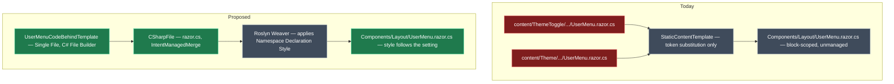

# `UserMenu.razor.cs` must honour the application's Namespace Declaration Style

## Context

`UserMenu.razor.cs` is the only hand-written C# file either Blazor module ships as **static content**. Static content is emitted verbatim — `StaticContentTemplate` does nothing but substitute `<#= Token #>` placeholders — so the block-scoped namespace baked into the content file is what lands on disk, regardless of the application's **Namespace Declaration Style** setting (owned by `Intent.OutputManager.RoslynWeaver`; values `default` / `prefer-file-scoped` / `disallow-file-scoped`).

Every other C# file these modules generate goes through `CSharpFile` and comes out weaver-managed — visible in any generated code-behind, which carries the `[assembly: DefaultIntentManaged(...)]` / `[assembly: IntentTemplate(...)]` header that marks a file the Roslyn Weaver owns (e.g. `MainLayoutHeader.razor.cs` in `Tests/MudBlazor.ExampleApp`). `UserMenu.razor.cs` carries no such header. That is the defect: it is the one C# file in the output the weaver never sees, so none of the weaver's C# style settings apply to it.

The same file ships from **two** places, byte-for-byte identical:

| File | When it ships |
| --- | --- |
| `Modules/Intent.Modules.Blazor/content/ThemeToggle/Components/Layout/UserMenu.razor.cs` | MudBlazor **not** installed, and Theme Toggle enabled |
| `Modules/Intent.Modules.Blazor.Components.MudBlazor/content/Theme/Components/Layout/UserMenu.razor.cs` | MudBlazor installed |

### Worked example

A developer sets **Namespace Declaration Style** to *Prefer use of file scoped namespace declarations* and runs the Software Factory. Every generated `.cs` file converts to `namespace MyApp.Api.Components.Layout;` — except `Components/Layout/UserMenu.razor.cs`, which stays block-scoped and fails the team's own StyleCop/`.editorconfig` rule on a file nobody wrote. After this change that file converts with the rest, because the weaver owns it like every other generated `.cs` file.

## Approach

Stop shipping `UserMenu.razor.cs` as static content. Model it as a **Single File C# Template** in `Intent.Modules.Blazor`, reusing:

- the element shape of the existing `ThemeServiceTemplate` (Single File, C# File Builder, `Default Location` on the `Template Settings` stereotype), and
- the `CSharpFile` body pattern of the existing `RazorComponentCodeBehindTemplate` (`.WithFileExtension("razor.cs")`, `.IntentManagedMerge()`, one partial class).

The genuinely new delta is small: a class with three `[Parameter]` members, plus a registration guard reproducing today's two shipping conditions.

Because the two content copies are identical, **one** template in the base module serves both cases — `Intent.Blazor.Components.MudBlazor` depends on `Intent.Blazor`, so the MudBlazor copy is simply deleted. That also removes a real duplication hazard: the two files had to be kept in sync by hand.



**The output target does not change.** `SingleFileTemplateRegistration` and `StaticContentTemplateRegistration` resolve to the same project in every render mode — verified against the checked-in test applications, where `ThemeService.cs` (single-file template) and `UserMenu.razor.cs` (static content) always land in the same project: `BlazorNoMudBlazor.Api` for single-project, `.Client` for `InteractiveAuto` and `InteractiveWebAssembly`.

### Decision: why not just add a replacement token for the namespace declaration

The obvious minimal fix — emit `namespace X;` or `namespace X { … }` from a token — fails on two counts. The block-scoped form needs a closing brace and an extra indent level on the body, which a flat token substitution cannot express. And there is no supported API in `Intent.Modules.Common.CSharp` for reading this setting at all (it belongs to `Intent.OutputManager.RoslynWeaver`, setting id `75da3fda-a64d-4161-a8a2-38614053fb1d`), so the module would be doing a raw string lookup into another module's settings. Generating through `CSharpFile` gets this setting — plus `Usings Placement`, `Usings Sorting`, `.editorconfig` formatting and every future weaver style setting — for free and permanently.

### Decision: merge-managed, not once-off

The two content copies disagree today about overwrite behaviour: MudBlazor's `ThemeArtifactsStaticContentTemplateRegistration` forces `OverwriteBehaviour.OverwriteDisabled` (write once, never again), while the base module's `ThemeToggleStaticContentTemplateRegistration` inherits the default (always overwrite). Consolidating forces one choice.

Recommendation: `.IntentManagedMerge()` with the default overwrite behaviour — the same choice `RazorComponentCodeBehindTemplate` already makes for user-facing code-behinds. Strictly better than either current behaviour: the three `[Parameter]` members stay correct on regeneration, and anything the developer adds to the class survives.

### Trade-off: existing applications see a one-time diff on this file

An application that already has `Components/Layout/UserMenu.razor.cs` on disk holds an unmanaged file. On the first run after this change the weaver takes ownership: the `[assembly: DefaultIntentManaged(Mode.Merge)]` / `[assembly: IntentTemplate(...)]` header appears, and the namespace converts if the setting calls for it. Member-level content is preserved by merge mode. This is expected, and it is what makes the setting apply retroactively rather than only to newly created applications — but it is a visible diff on a file some teams have edited, so it belongs in the release notes.

Choosing `OverwriteDisabled` instead would avoid that diff, at the cost of never fixing any existing application.

### Out of scope: the AI skill sample `.cs` files

`content/ComponentSkillSamples/**` in both modules also ships `.cs` / `.razor.cs` files as static content, with the same verbatim-emission property. They are reference samples written into `.agents/skills/` for AI consumption — not compiled application code, not part of the build, not covered by the report. Left alone.

## Model changes

- Designer `Module Builder` (application `Blazor`), package `Intent.Blazor`, folder `Templates/Common` — add a `C# Template` element typed **Single File**, named `UserMenuCodeBehindTemplate`, stereotyped exactly like its sibling `ThemeServiceTemplate`:

| Setting | Value |
| --- | --- |
| Type reference | `Single File` |
| `C# Template Settings` → Templating Method | `C# File Builder` |
| `Template Settings` → Source | `Lookup Type` |
| `Template Settings` → Role | `Blazor.UserMenu.CodeBehind` |
| `Template Settings` → Default Location | `Components/Layout` |

No model change is needed in `Blazor.Components.MudBlazor` — its `ThemeArtifactsTemplate` is a Static Content Template that enumerates its content folder, so deleting a file from that folder is enough.

## Code changes

| File | Change |
| --- | --- |
| `Modules/Intent.Modules.Blazor/Templates/Templates/Common/UserMenuCodeBehind/UserMenuCodeBehindTemplatePartial.cs` | **added** — scaffolded by the Software Factory from the new model element; hand-fill the `CSharpFile` body |
| `Modules/Intent.Modules.Blazor/Templates/Templates/Common/UserMenuCodeBehind/UserMenuCodeBehindTemplateRegistration.cs` | **added** — scaffolded; add the `Register` guard |
| `Modules/Intent.Modules.Blazor/content/ThemeToggle/Components/Layout/UserMenu.razor.cs` | **removed** — superseded by the template |
| `Modules/Intent.Modules.Blazor.Components.MudBlazor/content/Theme/Components/Layout/UserMenu.razor.cs` | **removed** — identical duplicate, superseded by the same template |
| `Modules/Intent.Modules.Blazor/Templates/Templates/Common/StaticContentTemplateRegistrations/ThemeToggleStaticContentTemplateRegistration.cs` | **modified** — drop the now-dead `Namespace` replacement and its comment |
| `Modules/Intent.Modules.Blazor.Components.MudBlazor/Templates/StaticContentTemplateRegistrations/ThemeArtifactsStaticContentTemplateRegistration.cs` | **modified** — drop the `Namespace` replacement (its comment already names a file that no longer ships there); keep `ApplicationName`, still used by `AppBrand.razor` |
| `Modules/Intent.Modules.Blazor/release-notes.md` | **modified** — add to the in-flight `2.0.5` section |
| `Modules/Intent.Modules.Blazor.Components.MudBlazor/release-notes.md` | **modified** — add to the in-flight `2.0.5` section |

Template body, mirroring `RazorComponentCodeBehindTemplate`:

```csharp
CSharpFile = new CSharpFile(this.GetNamespace(), this.GetFolderPath())
    .WithFileExtension("razor.cs")
    .IntentManagedMerge()
    .AddClass("UserMenu", @class =>
    {
        @class.Partial();

        @class.AddProperty("string", "Title", prop =>
        {
            prop.AddAttribute(UseType("Microsoft.AspNetCore.Components.Parameter"));
            prop.WithInitialValue(@"""Account menu""");
        });

        @class.AddProperty($"{UseType("Microsoft.AspNetCore.Components.RenderFragment")}?", "Trigger", prop =>
        {
            prop.AddAttribute(UseType("Microsoft.AspNetCore.Components.Parameter"));
            prop.WithComments("/// <summary>The trigger content shown in the closed menu (e.g. an icon).</summary>");
        });

        @class.AddProperty($"{UseType("Microsoft.AspNetCore.Components.RenderFragment")}?", "ChildContent", prop =>
        {
            prop.AddAttribute(UseType("Microsoft.AspNetCore.Components.Parameter"));
            prop.WithComments("/// <summary>The menu items rendered inside the dropdown panel.</summary>");
        });
    });
```

- `Default Location` on the model element supplies `Components/Layout`, exactly as `ThemeServiceTemplate` gets `Components/Services` — so `GetNamespace()` resolves to the same value the `<#= Namespace #>` token produced.
- `.IntentManagedMerge()` is the whole fix: merge-managed output is weaver-owned, so Namespace Declaration Style, usings placement/sorting and `.editorconfig` formatting all apply.
- The `?` is appended unconditionally, matching the current content file and the existing `ThemeServiceTemplate` precedent (`public event Action? OnChange;`).
- `DefineFileConfig()` returns `CSharpFile.GetConfig()`, as in `RazorComponentCodeBehindTemplate`.

Registration guard, reproducing exactly which applications get the file today:

```csharp
protected override void Register(ITemplateInstanceRegistry registry, IApplication application)
{
    // UserMenu.razor ships from MudBlazor's ThemeArtifacts unconditionally, and from this module's
    // ThemeToggle content only when Theme Toggle is enabled. The code-behind must follow the markup.
    var mudBlazorInstalled = application.InstalledModules
        .Any(module => module.ModuleId == "Intent.Blazor.Components.MudBlazor");

    if (!mudBlazorInstalled && !application.Settings.GetBlazor().EnableThemeToggle())
    {
        return;
    }

    base.Register(registry, application);
}
```

## Steps

1. **Model the template** — in the `Blazor` application's `Module Builder` designer, under `Intent.Blazor/Templates/Common`, add the `UserMenuCodeBehindTemplate` `C# Template` element with the type reference and stereotype values above. Copy `ThemeServiceTemplate`'s settings and change only `Role` and `Default Location`.
2. **Run the Software Factory on the `Blazor` module application** to scaffold `UserMenuCodeBehindTemplatePartial.cs` and `UserMenuCodeBehindTemplateRegistration.cs`; apply the staged changes.
3. **Fill in the template body and the registration guard** with the code above. Keep the `[IntentManaged]` attribute placement the scaffold generates — only the constructor body and the `Register` override are hand-written.
4. **Delete both static content copies** of `UserMenu.razor.cs`, and remove the now-dead `Namespace` entry from `ThemeToggleStaticContentTemplateRegistration.Replacements` and `ThemeArtifactsStaticContentTemplateRegistration.Replacements`. `ApplicationName` stays in the MudBlazor one — `AppBrand.razor` still uses it.
5. **Build both module projects** (`dotnet build`) and confirm green.
6. **Regenerate the test applications** that exercise each branch and inspect the diffs (see Verification).
7. **Documentation and versions** — both modules are already at `2.0.5-pre.0` on this branch with an open `### Version 2.0.5` release-notes section, so no further bump is needed; add an entry to each. Confirm the version at close-out per the `module-version-increment` skill, and record the "no hand-written C# file may ship as static content — it bypasses the weaver" rule in `Modules/Intent.Modules.Blazor/CONTEXT.md`.

## Critical files / elements

- Designer `Module Builder` (application `Blazor`), element `Intent.Blazor/Templates/Common/ThemeServiceTemplate` — the exact element shape to copy.
- Designer `Module Builder` (application `Blazor`), element `Intent.Blazor/Templates/Client/RazorComponentCodeBehindTemplate` — the `CSharpFile` body pattern for a merge-managed `.razor.cs`.
- `Modules/Intent.Modules.Blazor/Templates/Templates/Client/RazorComponentCodeBehind/RazorComponentCodeBehindTemplatePartial.cs` — `WithFileExtension("razor.cs")` + `IntentManagedMerge()` + `DefineFileConfig() => CSharpFile.GetConfig()`.
- `Modules/Intent.Modules.Blazor/Templates/Templates/Common/ThemeService/ThemeServiceTemplateRegistration.cs` — the `SingleFileTemplateRegistration` shape. The conditional `Register` override pattern lives in this module's AI skill registrations, e.g. `Modules/Intent.Modules.Blazor/Templates/Templates/AI/BlazorAppMenuSkill/BlazorAppMenuSkillTemplateRegistration.cs`.
- `Modules/Intent.Modules.Blazor/CONTEXT.md` — read before editing this module; note the standing rule that `Settings/ModuleSettingsExtensions.cs` must not be un-ignored (not touched here, but adjacent).

## Verification

- [ ] `dotnet build` green for `Intent.Modules.Blazor` and `Intent.Modules.Blazor.Components.MudBlazor`.
- [ ] Regenerate `Tests/MudBlazor.ExampleApp` (MudBlazor, InteractiveAuto, two projects) — `UserMenu.razor.cs` still lands at `MudBlazor.ExampleApp.Client/Components/Layout/`, same namespace as before, now with the `[assembly: DefaultIntentManaged(Mode.Merge)]` header.
- [ ] Regenerate `Tests/BlazorNoMudBlazor` (no MudBlazor, single project) — same file at `BlazorNoMudBlazor.Api/Components/Layout/`, proving the base-module template covers the non-MudBlazor branch.
- [ ] Regenerate `Tests/BlazorServerTests` (MudBlazor, InteractiveServer) — confirms the render-mode branch that previously resolved this file through `ThemeArtifacts`.
- [ ] **The actual fix:** temporarily set Namespace Declaration Style to `prefer-file-scoped` on one test application and regenerate — `UserMenu.razor.cs` converts to a file-scoped namespace along with every other generated `.cs` file. Revert afterwards; all test applications are on `default` and should stay there.
- [ ] The regenerated test solutions still compile — `<UserMenu>` consumers (`AppUserMenu` in `Intent.Blazor.Authentication`) still bind `Title`, `Trigger` and `ChildContent`.
- [ ] No application ends up with two templates claiming `Components/Layout/UserMenu.razor.cs`. Check `*.application.managed-files.xml`: the `templateId` for that path should change from a `StaticContentTemplateRegistration` to the new template id, with exactly one row.

**Watch for a destructive-change prompt on the first regeneration.** Ownership of `Components/Layout/UserMenu.razor.cs` moves between templates. If the Software Factory flags the change as destructive rather than as a normal merge, stop and inspect the diff before applying (the `resolve-destructive-changes` skill covers the decision). The file's member content should be preserved; only the assembly-attribute header and possibly the namespace style should change.

## Open questions resolved

None — the request was specific, and the two shipping paths were determined from the module registrations and the checked-in test applications. The one open judgement call (merge-managed vs once-off) is stated as a recommendation under *Decision: merge-managed, not once-off*, with its cost in the trade-off note beneath it.
