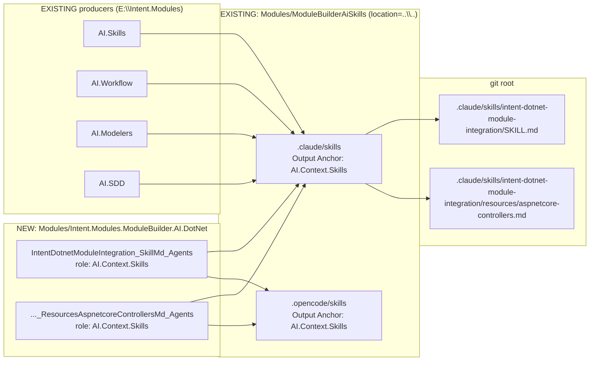

# Ship `Intent.ModuleBuilder.AI.DotNet` — a skill teaching AI how to integrate with .NET modules, starting with ASP.NET Core Controllers

## Context

A module-builder AI working in this repo currently has 21 skills covering **how to build a module** (file builders, metadata, orchestration, versioning, docs). It has nothing covering **what the individual .NET modules in this repo actually expose** — so when asked to "make my module hook into the generated controllers", it has to read `Intent.Modules.AspNetCore.Controllers` from scratch, and guesses wrong about the parts that aren't discoverable: that action-method bodies are deliberately empty, that the correlation key is builder metadata rather than a name match, and that there is no extension interface at all.

`E:\Intent.Modules` already solved the analogous problem for **designers**: `Intent.Modules.ModuleBuilder.AI.Modelers` ships one skill, `intent-modelers-integration`, whose SKILL.md is a thin index over five `resources/*.md` files — one per designer. This plan builds the same thing for **runtime .NET modules**, with the first reference file covering Controllers, derived from how `Intent.Modules.AspNetCore.Controllers.Dispatch.MediatR` really works.

You created an empty `Modules/Intent.Modules.NET.AI.isln` (commit `395292ecbf`) with no applications — this plan fills it.

### A worked example of what changes

Today, asked to *"write a module that adds `[ResponseCache(Duration = 60)]` to every generated GET controller action"*, an AI with the current skill set opens `Modules/Intent.Modules.AspNetCore.Controllers`, reads ~800 lines of template code, and typically produces one of three wrong answers: a decorator (Controllers declares `<decorators></decorators>` — there are none), an `ITemplateDecorator` registration, or a name-matched `FindMethod(m => m.Name == operation.Name)`.

After this change it loads `intent-dotnet-module-integration`, sees Controllers in the index, reads `resources/aspnetcore-controllers.md`, and writes the correct shape first time: a `PackageReference` to `Intent.Modules.AspNetCore.Controllers`, a `FactoryExtensionBase` on `OnAfterTemplateRegistrations`, `FindTemplateInstances<ControllerTemplate>(TemplateDependency.OnTemplate(TemplateRoles.Distribution.WebApi.Controller))`, then `file.Classes.First()` → `Methods` → `TryGetMetadata<IControllerOperationModel>("model", out var op)`.

---

## Decisions taken

| # | Decision | Chosen |
|---|---|---|
| 1 | Which repo hosts the module | **This repo** — `Modules/Intent.Modules.ModuleBuilder.AI.DotNet`. The content documents modules that live here, so it moves with them instead of drifting. |
| 2 | Skill identity | **`intent-dotnet-module-integration`** — one SKILL.md plus `resources/<module>.md` per target module, mirroring `intent-modelers-integration`. |
| 3 | First reference file scope | **Both** dispatch-module authoring *and* general controller enrichment. |
| 4 | Integration route taught | **The typed route, as the single sanctioned path** (your answer): reference the `Intent.Modules.AspNetCore.Controllers` **NuGet package**, use `IControllerModel` / `IControllerOperationModel`, walk the template's `Classes` and `Methods`, and match via metadata key — modelled on the MediatR implementation. |
| 5 | Starting version | **`1.0.0-pre.0`** — the consumer app has `Use Pre-release Versions = true`, and this repo keeps `-pre.#` in the `.imodspec` while `release-notes.md` headings use the plain version. |

> **Decision 4 supersedes an earlier design note** (from a prior session) that framed "cold integration — integrate with Controllers *without* it installed, via role strings only" as the goal. That framing is dropped. The skill teaches one route, and it presumes the package is referenced. I'll update that stored note once this is approved.

---

## Approach

Three moving parts, in dependency order: a new producer module, its content, and the consumer wiring that puts the output on disk.



**Reuse, not invention.** Every mechanism here already exists and ships:

- The producer module is a straight structural copy of `E:\Intent.Modules\Modules\Intent.Modules.ModuleBuilder.AI.Modelers` — same `Intent.ApplicationTemplate.ModuleBuilder`, same two designers, same `.csproj` package set, same flat `Templates/Skills/<Name>_<File>_Agents/` layout, same `MarkdownBaseTemplate<object>` + `SingleFileTemplateRegistration` pair per file.
- The consumer app is **not** created — `Modules/ModuleBuilderAiSkills` already exists with `.claude`/`.opencode` folders and `AI.Context.Skills` Output Anchors in place. The only change there is installing one more module and assigning two Template Outputs.
- The skill's *generic* mechanics (priority bands, request-publishing vs FileBuilder mutation, the `"model"` metadata bridge, callback ordering) are already in `intent-module-orchestrator`. The new content **cites it and does not restate it** — the delta is Controllers-specific fact: role strings, class/method naming, which metadata keys exist, what is empty by design.

**The one genuinely new design decision** is what a per-module reference file owes its reader. Fixed section shape, so the second and third files (EF Core, MediatR, MassTransit) are fill-in-the-blanks rather than re-argued:

1. What the module generates, and what it deliberately leaves empty
2. How to take the dependency — NuGet package, `.imodspec` entry, what that buys you
3. Template inventory — TemplateId, role constant, role string, model type
4. The shape of the generated file — class naming, method naming, what is guaranteed
5. The metadata contract — every `AddMetadata` key and the type it holds
6. Extension points
7. Worked example — the real module that does this today
8. Traps

---

## Model changes

All designer work. Two applications.

### A. New application `ModuleBuilder.AI.DotNet` (Module Builder designer)

From `Intent.ApplicationTemplate.ModuleBuilder`, at `Modules/Intent.Modules.ModuleBuilder.AI.DotNet`, `location="."`, designers `Module Builder` (order -1) + `Codebase Structure` (order 100).

- Package `Intent.ModuleBuilder.AI.DotNet` — `Module Settings → Version = 1.0.0-pre.0`
- Folder `Skills`
- File Template `IntentDotnetModuleIntegration_SkillMd_Agents` — type **Single File**; `File Settings(Output File Content = Text, Templating Method = Markdown File Builder)`; `Template Settings(Source = Lookup Type, Role = AI.Context.Skills)`; **`Default Location` left unset**
- File Template `IntentDotnetModuleIntegration_ResourcesAspnetcoreControllersMd_Agents` — identical settings

`Default Location` must stay empty: per `Intent.ModuleBuilder.AI.Skills`'s `CONTEXT.md` it only seeds the constructor argument at element-creation time and is dead thereafter, so leaving it set is misleading. The real output path goes in the `MarkdownFile` constructor's `relativeLocation`.

### B. Existing application `ModuleBuilderAiSkills` (Codebase Structure designer)

- Install `Intent.ModuleBuilder.AI.DotNet` `1.0.0-pre.0` through Intent's install flow — **never** hand-edit `modules.config`
- Assign both Template Outputs under `.claude/skills` (folder element `skills__2lgfpzbl.xml`, parent `.claude`)
- Assign both Template Outputs under `.opencode/skills` (folder element `skills__3t2ypfp7.xml`, parent `.opencode`)

Both assignments are required — this repo's consumer has two agent-flavour trees, and an output assigned to only one lands in only one.

### C. Solution registration

Add both applications to `Modules/Intent.Modules.NET.AI.isln` (currently `<applications />`):

- `ModuleBuilder.AI.DotNet`, solution folder `Modules`
- `ModuleBuilderAiSkills`, solution folder `AI Skills`

An application may appear in more than one `.isln` — `ModuleBuilderSkills` is in both `Intent.Modules.AI.isln` and `Intent.Modules.Tests.isln` — so listing `ModuleBuilderAiSkills` here does not remove it from wherever it is now.

---

## Code changes

Only the two `*TemplatePartial.cs` constructor bodies carry hand-written content; everything else in the module is Software-Factory-generated.

### `Templates/Skills/IntentDotnetModuleIntegration_SkillMd_Agents/...TemplatePartial.cs`

```csharp
internal const string SkillName = "intent-dotnet-module-integration";

WithContentHashing = true;
MarkdownFile = new MarkdownFile("SKILL", relativeLocation: SkillName)
    .FromMarkdown($$""""""
        ---
        name: {{SkillName}}
        description: "…single line, quoted…"
        template-id: {{TemplateId}}
        ---
        …
        """""");
```

### `Templates/Skills/IntentDotnetModuleIntegration_ResourcesAspnetcoreControllersMd_Agents/...TemplatePartial.cs`

```csharp
MarkdownFile = new MarkdownFile("aspnetcore-controllers",
    relativeLocation: "intent-dotnet-module-integration/resources")
```

The resource file's `relativeLocation` carries the `resources` segment; the skill folder name is not repeated as a const there, matching `IntentModelersIntegration_ResourcesDomainMd_Agents`.

### Non-negotiable authoring constraints

Recorded failures, not style preferences:

- **Never edit these raw strings with Intent's `patch_file` / `write_file`.** Their C# formatter re-indents the whole raw string to the constructor's nesting level, flattening every fenced code block — whole-file damage, silently reported as success. Use a plain text editor.
- **The closing `""""""` indentation is load-bearing** — it sets the de-indent column. Left at column 0, the module compiles and packages perfectly while emitting an effectively empty document.
- **The Markdown File Builder normalizer mangles content**: never start a line with `**` (becomes `- *bold**`); never use `---` horizontal rules (become `- --`); one line per paragraph and per bullet, never hard-wrap (a wrapped bullet gets a blank line injected that splits the list item). Bold is safe mid-sentence and after a list marker.
- **Frontmatter `description` must be a single-line quoted string** — a multi-line value is truncated to its first line by the parser, and the folded `>` form with no same-line text drops it entirely.
- `$$""""""` (double-`$`, six-quote) so `{{SkillName}}` / `{{TemplateId}}` interpolate while single `{` inside C# code samples stays literal.

---

## Content: what `resources/aspnetcore-controllers.md` must say

The deliverable's substance, so it is specified rather than left to discovery. Every fact below was verified against source in this worktree.

**1 — What it generates, what it leaves empty.** `ControllerTemplate` emits the class, `[ApiController]`, `[Route]` / `[Authorize]`, XML comments, method signatures and parameters. **Action-method bodies are empty by design.** That single sentence is the most valuable thing in the file — it is why a dispatch module exists, and why "the controller compiles but does nothing" is expected rather than a bug.

**2 — Taking the dependency.** Per decision 4, this is stated as the way in, not as one of two options:

```xml
<!-- .csproj -->
<PackageReference Include="Intent.Modules.AspNetCore.Controllers" Version="7.1.*" />
```
```xml
<!-- .imodspec -->
<dependency id="Intent.AspNetCore.Controllers" version="7.1.0" />
```

With the identity split spelled out, because it trips people: the **NuGet package id** is `Intent.Modules.AspNetCore.Controllers`, the **Intent module id** is `Intent.AspNetCore.Controllers` (no `Modules.`). A worked note that `Dispatch.MediatR` and `Dispatch.ServiceContract` use a `ProjectReference` only because they are in-repo siblings — `Dispatch.Wolverine` uses the `PackageReference` deliberately for package-boundary integrity, and that is the shape a module authored outside this repo should copy.

What the reference buys, and why it is worth it: `IControllerModel` / `IControllerOperationModel` / `IControllerParameterModel`, `ControllerTemplate` and `ControllerTemplate.TemplateId`, `GetReturnStatement(...)`, `FileTransferHelper`, and the ability to register your own controller models.

**3 — Templates.**

| TemplateId | Role constant | Role string |
|---|---|---|
| `Intent.AspNetCore.Controllers.Controller` | `TemplateRoles.Distribution.WebApi.Controller` | `Distribution.WebApi.Controller` |
| `Intent.AspNetCore.Controllers.ExceptionFilter` | *(none — string literal)* | `Distribution.ExceptionFilter` |
| `Intent.AspNetCore.Controllers.BinaryContentFilter` | *(none)* | `Distribution.BinaryContentFilter` |
| `Intent.AspNetCore.Controllers.BinaryContentAttribute` | *(none)* | `Distribution.Controller.BinaryContentAttribute` |
| `Intent.AspNetCore.Controllers.JsonResponse` | *(none)* | `Distribution.Controller.JsonResponse` |

Plus the trap: `TemplateRoles.Application.Services.Controllers` is `[Obsolete]` and its value is the *TemplateId*, not a role.

**4 — Generated shape.** Exactly one class per file, `file.Classes.First()`; name `{Model.Name.RemoveSuffix("Controller","Service")}Controller`; base `ControllerBase`; an **empty constructor deliberately present** for others to add parameters to; method name `operation.Name.ToPascalCase()`, always `async`, returning `Task<ActionResult>` / `Task<ActionResult<T>>`; **last parameter is always `CancellationToken cancellationToken = default`**.

**5 — The metadata contract.** The correlation mechanism, and the answer to "which designer element is this generated member?":

| Node | Key | Type |
|---|---|---|
| class | `model` / `modelId` | `IControllerModel` / `string` |
| method | `model` / `modelId` / `route` | `IControllerOperationModel` / `string` / `string` |
| parameter | `model` / `modelId` / `mappedPayloadProperty` | `IControllerParameterModel` / `string` / `ICanBeReferencedType` |

Always `TryGetMetadata`, never `GetMetadata`. **Never** correlate by name — names are transformed, de-duplicated and overloaded.

**6 — Extension points.** All on the typed route, all from a `FactoryExtensionBase` in `OnAfterTemplateRegistrations`:

- **Enrich an action method** — find templates, `CSharpFile.OnBuild(…, priority)`, then `foreach (var method in file.Classes.First().Methods)` with `method.TryGetMetadata<IControllerOperationModel>("model", out var op)`. Add attributes, parameters, statements.
- **Dispatch** — the same walk, plus discriminating on `template.Model is not CqrsControllerModel`, injecting the ctor dependency via `IntroduceReadonlyField`, and finishing every method with `template.GetReturnStatement(operationModel)`. Always delegate the return to the Controllers module.
- **Contribute new controller models** — ship your own `FilePerModelTemplateRegistration<IControllerModel>` whose `TemplateId` returns `ControllerTemplate.TemplateId`; Intent merges model sets across registrations, and your `.imodspec` declares **no** `<template>` entry. This is exactly how implicit CQRS controllers exist.
- **`Distribution.Custom.Dispatcher`** — publish a template with that role implementing `IControllerTemplate<IControllerModel>` and `Dispatch.ServiceContract` targets it instead of the real controller. Only ServiceContract honours it.
- **Chain onto `AddControllers()`** via the startup-invocation metadata tags `configure-services-controllers-generic` / `configure-endpoints-controllers-generic`, as `JsonOptionsExtension` does.

**7 — Worked example: `MediatRControllerInstaller`.** Quoted near-verbatim, in emission order: `AddTypeSource` ×3 → `ctor.AddParameter(UseType("MediatR.ISender"), "mediator", p => p.IntroduceReadonlyField((_, a) => a.ThrowArgumentNullException()))` → per method: upload prologue, route→payload back-fill, `BadRequest()` consistency guards, `await _mediator.Send(payload, cancellationToken)`, `GetReturnStatement`. With the three-way comparison against `ServiceContract` (validation, unit-of-work, event-bus flush, statement tagging) and `Wolverine` (ctor-vs-object-initializer detection).

**8 — Traps.**

- **Multi-host:** `FindTemplateInstance(templateId, modelId)` throws *"more than one instance"* when a folder has a controller per host project. Use `FindTemplateInstances` and filter on the model id yourself.
- **`IControllerModel.Folder` off-by-one:** `ServiceControllerModel.Folder` is the service's own folder; `CqrsControllerModel.Folder` is the *parent* of the grouping folder. A Registration Filter `np(Folder.Name) == "App"` therefore silently generates no controller for a Command sitting directly in `App`. Lift from `Dispatch.MediatR/CONTEXT.md`.
- `<decorators></decorators>` is empty — there is no decorator path and no extension interface. Do not look for one.
- **Auto-install:** Controllers' `<interoperability>` pulls in `Dispatch.MediatR` / `Dispatch.ServiceContract` / `Swashbuckle` on detection, so a consumer may already have a dispatch module they never installed.
- **You will see an untyped variant in this repo.** `OutputCaching.Redis`, `ODataQuery`, `Pagination` and `IdentityService` reach the controller through `ICSharpFileBuilderTemplate` and the raw `modelId` *string*, with no package reference. It works, but it forfeits `IControllerOperationModel`, `GetReturnStatement` and `FileTransferHelper`. Named here so the shape is recognised, not copied.

---

## Steps

1. **Version gate and scope** — `Intent.ModuleBuilder.AI.DotNet` is new, so it starts at `1.0.0-pre.0`; no published version exists to clear. `ModuleBuilderAiSkills` is a consumer app, not a module, so it has no version to gate. No other module changes.

2. **Create the producer application** from `Intent.ApplicationTemplate.ModuleBuilder` at `Modules/Intent.Modules.ModuleBuilder.AI.DotNet`, mirroring `Intent.Modules.ModuleBuilder.AI.Modelers`: `.csproj` referencing `Intent.Modules.Common`, `Intent.Packager`, `Intent.Persistence.SDK`, `Intent.RoslynWeaver.Attributes`, `Intent.SoftwareFactory.SDK`; the standard `tasks.json` Build task; `release-notes.md` marked `ignored;once-off-generated` in the output config.

3. **Model the two File Templates** under a `Skills` folder with the settings in *Model changes A*, run the Software Factory, and confirm the generated `.imodspec` carries `<role>AI.Context.Skills</role>` with empty `<location>` for both.

4. **Write `resources/aspnetcore-controllers.md`** — the long file, per the content spec above. Written first, because SKILL.md is an index *of* it.

5. **Write `SKILL.md`** — frontmatter, the `> [!TIP]` resource-pointer block naming the Controllers reference, then Musts / Must Nots. Keep it short: its job is routing, and it must point at `intent-module-orchestrator` for generic mechanics rather than restating them.

6. **Build and package** — `dotnet build --no-incremental` from the module folder. An incremental build may not repackage the `.imod` when only non-C# content changed, and templates then silently keep generating from previously packaged content.

7. **Wire the consumer** — install `Intent.ModuleBuilder.AI.DotNet` into `ModuleBuilderAiSkills` and assign both Template Outputs under **both** `.claude/skills` and `.opencode/skills`.

8. **Generate and inspect** — run the Software Factory on `ModuleBuilderAiSkills`, read the staged diff via `get_file_diffs` *before* applying, then apply. Confirm all four files (two trees × two files) appear in `ModuleBuilderAiSkills.application.managed-files.xml`.

9. **Register in the solution** — add both applications to `Modules/Intent.Modules.NET.AI.isln`.

10. **Close out** — `CONTEXT.md` for the new module (the per-module-reference section shape, the two-tree assignment requirement, why `Default Location` is unset, and decision 4's typed-route rule); `release-notes.md` under a `### Version 1.0.0` heading; `docs/README.md`; then audit `.imodspec` `<dependencies>` against what the module actually references — expected: `Intent.Common` and `Intent.Common.Types` only, since it has no factory extensions and reads no designer models.

---

## Critical files / elements

**New — producer module**
- `Modules/Intent.Modules.ModuleBuilder.AI.DotNet/Intent.ModuleBuilder.AI.DotNet.imodspec` — two `<template>` entries, role `AI.Context.Skills`, empty `<location>`
- `Modules/Intent.Modules.ModuleBuilder.AI.DotNet/Templates/Skills/IntentDotnetModuleIntegration_SkillMd_Agents/…TemplatePartial.cs`
- `Modules/Intent.Modules.ModuleBuilder.AI.DotNet/Templates/Skills/IntentDotnetModuleIntegration_ResourcesAspnetcoreControllersMd_Agents/…TemplatePartial.cs`
- `Modules/Intent.Modules.ModuleBuilder.AI.DotNet/CONTEXT.md`, `release-notes.md`, `docs/README.md`

**Modified — consumer + solution**
- `Modules/ModuleBuilderAiSkills/modules.config` — via Intent's install flow only
- `Modules/ModuleBuilderAiSkills/Intent.Metadata/Codebase Structure/root/Elements/Folder/skills__2lgfpzbl.xml` (`.claude/skills`) and `skills__3t2ypfp7.xml` (`.opencode/skills`)
- `Modules/Intent.Modules.NET.AI.isln`

**Read-only references — source of truth for the content**
- `Modules/Intent.Modules.AspNetCore.Controllers.Dispatch.MediatR/FactoryExtensions/MediatRControllerInstaller.cs` — the worked example
- `Modules/Intent.Modules.AspNetCore.Controllers/Templates/Controller/ControllerTemplatePartial.cs:61-141` — class/method conventions and every `AddMetadata` key
- `Modules/Intent.Modules.AspNetCore.Controllers/Templates/Controller/IControllerModel.cs` — the model contract
- `Modules/Intent.Modules.AspNetCore.Controllers.Dispatch.MediatR/CONTEXT.md` — the `Folder` off-by-one trap
- `Modules/Intent.Modules.AspNetCore.Controllers.Dispatch.Wolverine/` — the `PackageReference` precedent
- `Modules/Intent.Modules.Constants/TemplateRoles.cs:8-29` — role constants
- `E:\Intent.Modules\Modules\Intent.Modules.ModuleBuilder.AI.Modelers\Templates\Skills\**` — the structural template to copy

---

## Verification

1. **Module builds** — `dotnet build --no-incremental` exits 0 and reports `Successfully created module '<path>\Intent.ModuleBuilder.AI.DotNet.1.0.0-pre.0.imod'`. *A green build proves syntax only — a precondition, not evidence.*
2. **The `.imod` is discoverable** — check the reported drop path against this solution's `intent.repositories.config` / the global Asset Repositories. If neither matches, **report the path to you** rather than configuring it.
3. **Output lands, with content** — after generating `ModuleBuilderAiSkills`, these four files exist and are non-empty:
   - `.claude/skills/intent-dotnet-module-integration/SKILL.md`
   - `.claude/skills/intent-dotnet-module-integration/resources/aspnetcore-controllers.md`
   - the same two under `.opencode/skills/…`
4. **Frontmatter survived the parser** — each `SKILL.md` has a single-line `description:`, a `template-id:`, and an auto-injected `contentHash:`.
5. **The normalizer didn't mangle it** — `grep -n '^- \*\|^- --'` over the four generated files returns nothing. This catches leading-`**` and `---` damage, which is silent otherwise.
6. **Round-trip is clean** — a second Software Factory run reports no changes. The files were just created (not protected, not ignored), so a clean second run is meaningful here.
7. **The content is actually usable** — the real test. In a fresh session, ask an agent to *"add a module that puts `[ResponseCache(Duration = 60)]` on every generated GET controller action"* and confirm it reaches for the NuGet reference + `FactoryExtensionBase` + `Classes`/`Methods` + metadata-key matching without reading the Controllers module source. If it still goes to the source, the reference file is failing at its one job.

---

## Follow-ups, not in scope

- **`Intent.Modules.AspNetCore.Controllers` has no `CONTEXT.md`** — unlike its `Dispatch.MediatR` and `Dispatch.Wolverine` satellites. Arguably where several of these facts belong permanently. Say the word and it becomes step 11.
- **`Modules/CLAUDE.md` has four dangling imports** — it still `@`-imports `.agents/instructions/*.md`, which commit `ace3cb1048` deleted when it moved everything to the git root, so those four instruction files are not loading from that path. Flagging, not fixing.
- **Next reference files** — the shape is designed for reuse. Natural order after Controllers: `entityframeworkcore.md`, `application-mediatr.md`, `eventing-masstransit.md`. Deliberately deferred; one file proves the shape.
