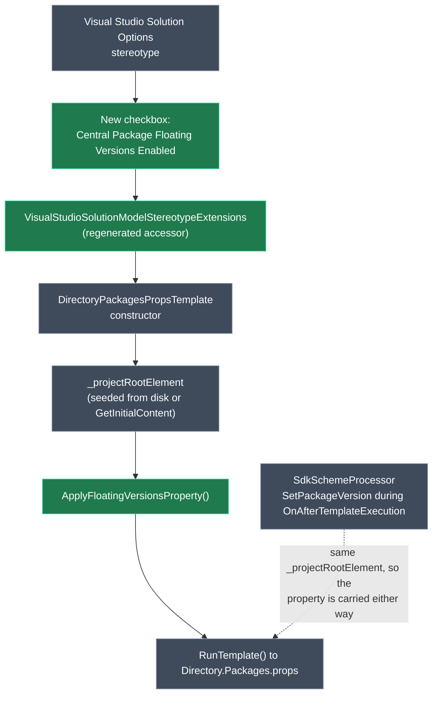

# Support `CentralPackageFloatingVersionsEnabled` in `Directory.Packages.props`

## Context

NuGet's Central Package Management rejects floating versions by default — a `PackageVersion` entry written as `Version="8.0.*"` fails the restore with **NU1011: Centrally defined floating package versions are not allowed**. The opt-out is a single MSBuild property in `Directory.Packages.props`:

```xml
<Project>

  <PropertyGroup>
    <ManagePackageVersionsCentrally>true</ManagePackageVersionsCentrally>
    <CentralPackageFloatingVersionsEnabled>true</CentralPackageFloatingVersionsEnabled>
  </PropertyGroup>

</Project>
```

The `Intent.VisualStudio.Projects` module owns that file but has no way to model that property. Its seed content — <FileRef path="Modules/Intent.Modules.VisualStudio.Projects/Templates/DirectoryPackagesProps/DirectoryPackagesPropsTemplate.cs" line={13} endLine={22} /> — emits `ManagePackageVersionsCentrally` and nothing else, and the partial never touches `PropertyGroup` at all. A developer who wants floating versions has to hand-add the property and hope nothing removes it.

**Worked example.** A developer checks _Manage Package Versions Centrally_ on their solution, then checks the new _Central Package Floating Versions Enabled_ box beside it. On the next Software Factory run, `Directory.Packages.props` gains `CentralPackageFloatingVersionsEnabled` set to `true` inside the same `PropertyGroup` that already carries `ManagePackageVersionsCentrally`. They can now write `Version="8.0.*"` against their own packages and `dotnet restore` succeeds instead of failing NU1011.

## Approach

This is a small, self-contained change with a very high reuse ratio: the stereotype exists, the accessor generation exists, the template already parses the file into an MSBuild `ProjectRootElement` and writes it back. The genuinely new delta is one stereotype property and one private method that asserts a `PropertyGroup` property.

Three decisions worth settling before implementation, because they are the expensive ones to undo:

- **The property is modelled on the solution stereotype, not as a module setting.** `Manage Package Versions Centrally` already lives on <ModelRef application="VisualStudio.Projects" name="Visual Studio Solution Options" designer="Module Builder" type="Stereotype Definition" />, and a Visual Studio designer can hold more than one solution. An application-level module setting could not express "floating on for this solution, off for that one".
- **The write happens in the template constructor, not in the NuGet factory extension.** `RunTemplate()` returns `_projectRootElement.RawXml`, so a constructor-time mutation flows through the normal template pipeline. Putting it in `SdkSchemeProcessor` would tie emission of a solution-level property to whether any package happened to change that run.
- **Unchecked means "leave it alone", not "write false".** The file is `UserControlledWeave` and is seeded from disk when it already exists, so the module can see a hand-written `CentralPackageFloatingVersionsEnabled`. Writing `false` when the box is unchecked would silently revert that developer's work on the first run after upgrading the module. Unchecked therefore writes nothing.



<Callout id="float-caveat" tone="warning" title="This flag makes floating versions legal — it does not make the module preserve them">

Turning the property on lets NuGet *accept* a floating `PackageVersion` entry. It does not change how this module writes versions, and there is a real limit a developer will hit:

- **A package no Intent module requests** — one the developer added to `Directory.Packages.props` by hand — is never visited by the `requestedPackages` loop in <FileRef path="Modules/Intent.Modules.VisualStudio.Projects/FactoryExtensions/NuGet/SchemeProcessors/SdkSchemeProcessor.cs" line={138} endLine={215} />, so its float survives untouched. This is the working use case.
- **A package an Intent module does request** will have its float rewritten to a pin. `VersionInfo.Version` returns `_versionRange.MinVersion.ToString()`, so `8.0.*` is read as a floor of `8.0.0`; any module requesting `8.0.11` then satisfies the `IfNewer` branch and calls `SetPackageVersion` with the pinned `8.0.11`.

Accepted for this change because the user's stated requirement is emitting the property, and the fix for the second case is a separate, larger change to `VersionInfo` and the overwrite branches. Worth documenting: setting the application's **Dependency Version Overwrite Behavior** to `Never` already preserves an existing float for module-requested packages too, because the `Never` branch only writes when the entry is absent.

</Callout>

## Model changes

<ModelChanges id="stereotype-change" caption="Module Builder designer, VisualStudio.Projects application" changes={[
  { element: "Visual Studio Solution Options", designer: "Module Builder", change: "modified",
    note: "New checkbox placed immediately after `Manage Package Versions Centrally`, so the two CPM toggles read together",
    fields: [
      { label: "Central Package Floating Versions Enabled", after: "`checkbox`, default `false`" },
      { label: "  Hint", after: "Allows floating versions (e.g. `8.0.*`) in `Directory.Packages.props`. Without this, NuGet fails restore with NU1011." },
      { label: "  Is Active Function", after: "`return ManagePackageVersionsCentrally;`" },
    ] },
]} />

Naming follows the module's existing convention of spelling the MSBuild property name out in words — `ManagePackageVersionsCentrally` is modelled as _Manage Package Versions Centrally_, so `CentralPackageFloatingVersionsEnabled` becomes _Central Package Floating Versions Enabled_.

Running the Software Factory over the `VisualStudio.Projects` application regenerates the typed accessor beside the existing `ManagePackageVersionsCentrally()`:

<Code id="accessor" filename="Modules/Intent.Modules.VisualStudio.Projects/Api/Extensions/VisualStudioSolutionModelStereotypeExtensions.cs" language="csharp"
  code={`public bool CentralPackageFloatingVersionsEnabled()
{
    return _stereotype.GetProperty<bool>("Central Package Floating Versions Enabled");
}`}
/>

No module migration is required. The property carries a default of `false`, so an application that installed an earlier version hydrates the missing property to `false` and keeps its current behaviour.

## Code changes

<FileTree id="files" title="Files touched" entries={[
  { path: "Modules/Intent.Modules.VisualStudio.Projects/Templates/DirectoryPackagesProps/DirectoryPackagesPropsTemplatePartial.cs", change: "modified", note: "Thread the flag through the constructor chain; add ApplyFloatingVersionsProperty()" },
  { path: "Modules/Intent.Modules.VisualStudio.Projects/Api/Extensions/VisualStudioSolutionModelStereotypeExtensions.cs", change: "modified", note: "Regenerated — do not hand-edit" },
  { path: "Modules/Intent.Modules.VisualStudio.Projects.Tests/Templates/DirectoryPackagesProps/DirectoryPackagesPropsTemplateTests.cs", change: "modified", note: "New facts over the existing IFileOperations seam" },
  { path: "Modules/Intent.Modules.VisualStudio.Projects/Intent.VisualStudio.Projects.imodspec", change: "modified", note: "Version bump" },
  { path: "Modules/Intent.Modules.VisualStudio.Projects/release-notes.md", change: "modified", note: "New Feature entry" },
  { path: "Modules/Intent.Modules.VisualStudio.Projects/docs/README.md", change: "modified", note: "New subsection under Central Package Management" },
  { path: "Modules/Intent.Modules.VisualStudio.Projects/CONTEXT.md", change: "added", note: "Module has none today; seed it with the decisions above" },
]} />

`DirectoryPackagesPropsTemplate.cs` (the `GetInitialContent()` stub) is deliberately **not** changed. Its content is static seed text used only when no file exists on disk, so it cannot express a per-solution choice — and it is `Mode.Ignore`, so editing it would drift from the designer. The conditional write belongs in the partial.

### The constructor change

The two model-driven constructors derive the flag the same way they already derive `canRunTemplate`; the two internal test constructors take it as an optional parameter defaulted to `false`, so all eight existing tests compile unchanged.

<Diff
  id="ctor-diff"
  filename="Modules/Intent.Modules.VisualStudio.Projects/Templates/DirectoryPackagesProps/DirectoryPackagesPropsTemplatePartial.cs"
  before={`public DirectoryPackagesPropsTemplate(IApplication application, VisualStudioSolutionModel model) : this(
    application: application,
    model: model,
    canRunTemplate: model.GetVisualStudioSolutionOptions()?.ManagePackageVersionsCentrally() == true,
    fileOperations: new StandardFileOperations())
{
}

// ...

internal DirectoryPackagesPropsTemplate(IApplication application, VisualStudioSolutionModel model, bool canRunTemplate,
    IFileOperations fileOperations, OutputLocationOptions outputLocationOptions)
{
    // ...
    _canRunTemplate = canRunTemplate;

    Model = model;
}`}
  after={`public DirectoryPackagesPropsTemplate(IApplication application, VisualStudioSolutionModel model) : this(
    application: application,
    model: model,
    canRunTemplate: model.GetVisualStudioSolutionOptions()?.ManagePackageVersionsCentrally() == true,
    fileOperations: new StandardFileOperations(),
    floatingVersionsEnabled: model.GetVisualStudioSolutionOptions()?.CentralPackageFloatingVersionsEnabled() == true)
{
}

// ...

internal DirectoryPackagesPropsTemplate(IApplication application, VisualStudioSolutionModel model, bool canRunTemplate,
    IFileOperations fileOperations, OutputLocationOptions outputLocationOptions, bool floatingVersionsEnabled = false)
{
    // ...
    _canRunTemplate = canRunTemplate;

    if (_canRunTemplate && floatingVersionsEnabled)
    {
        ApplyFloatingVersionsProperty();
    }

    Model = model;
}`}
  annotations={[
    { side: "after", lines: "5", label: "Same null-safe shape", note: "A solution with no stereotype applied resolves to false, exactly as ManagePackageVersionsCentrally does" },
    { side: "after", lines: "19-22", label: "Gated twice", note: "Never runs when CPM is off — the template emits nothing in that case anyway" },
  ]}
/>

### The new method

<AnnotatedCode
  id="apply-method"
  filename="Modules/Intent.Modules.VisualStudio.Projects/Templates/DirectoryPackagesProps/DirectoryPackagesPropsTemplatePartial.cs"
  language="csharp"
  code={`private const string FloatingVersionsPropertyName = "CentralPackageFloatingVersionsEnabled";

private void ApplyFloatingVersionsProperty()
{
    var existing = _projectRootElement.Properties
        .FirstOrDefault(x => string.Equals(x.Name, FloatingVersionsPropertyName, StringComparison.OrdinalIgnoreCase));

    if (existing != null)
    {
        existing.Value = "true";
        return;
    }

    var propertyGroup = _projectRootElement.PropertyGroups
            .FirstOrDefault(x => x.Properties.Any(p => string.Equals(p.Name, "ManagePackageVersionsCentrally", StringComparison.OrdinalIgnoreCase)))
        ?? _projectRootElement.PropertyGroups.FirstOrDefault()
        ?? _projectRootElement.AddPropertyGroup();

    propertyGroup.AddProperty(FloatingVersionsPropertyName, "true");
}`}
  annotations={[
    { lines: "5-12", label: "Idempotent", note: "A second run finds the element it wrote last time and re-asserts the value rather than appending a duplicate" },
    { lines: "14-17", label: "Placement, then fallbacks", note: "Prefers the group already holding ManagePackageVersionsCentrally so the two CPM properties sit together; falls back to the first group, then to creating one, for an existing file with an unusual shape" },
  ]}
/>

This reuses the same `ProjectRootElement` mutation style the file already uses for `AddItem` / `AddMetadata`, so it inherits the `preserveFormatting: true` behaviour established in `CreateProjectRootElement`.

## Steps

1. **Add the stereotype property** — in the Module Builder designer for the `VisualStudio.Projects` application, add a `checkbox` property _Central Package Floating Versions Enabled_ to the `Visual Studio Solution Options` stereotype, ordered immediately after _Manage Package Versions Centrally_, default `false`, with the hint and `isActiveFunction` above.

2. **Bump the version** — set the `.imodspec` version to `4.2.0-pre.0`. This adds a new modelled property, which is a feature, so it belongs on a new minor line rather than the in-flight `4.1.10` patch line. Per the repo convention the `.imodspec` carries the `-pre.#` suffix while the release-notes heading uses the plain `4.2.0`.

3. **Regenerate the module** — run the Software Factory over `VisualStudio.Projects` so `VisualStudioSolutionModelStereotypeExtensions.cs` and the `.imodspec` pick up the new property. Inspect the diff rather than assuming it; the accessor must appear before step 4 will compile.

4. **Implement the template change** — thread `floatingVersionsEnabled` through the four constructors and add `ApplyFloatingVersionsProperty()` as shown.

5. **Add tests** — extend `DirectoryPackagesPropsTemplateTests` over the existing `IFileOperations` seam: fresh file gains the property in the same group as `ManagePackageVersionsCentrally`; an existing file whose property reads `false` is raised to `true`; an existing `true` is left alone when the box is unchecked; running twice does not duplicate the element; CPM off emits nothing.

6. **Verify end-to-end** — the `Tests/CentralPackageManagement` application already exercises CPM including props imports. Enable the new checkbox on its solution, regenerate, and read the resulting `Directory.Packages.props`.

7. **Document** — a subsection under _Central Package Management_ in `docs/README.md` covering what the property does, the NU1011 error it avoids, and the limitation in the warning above. Add the `release-notes.md` entry under `### Version 4.2.0`.

8. **Seed `CONTEXT.md`** — the module has none. Record the three decisions from _Approach_, particularly why unchecked writes nothing.

<Callout id="screenshot" tone="warning" title="A docs screenshot will be stale">

`docs/images/cpm-solution-enabled.png` shows the options that appear once _Manage Package Versions Centrally_ is checked, and will be missing the new checkbox. Flag it for the maintainer to recapture — it cannot be regenerated from code, and shipping the doc with a stale image is a small but real inaccuracy.

</Callout>

## Critical files / elements

- Designer `Module Builder`, application `VisualStudio.Projects`, stereotype `Visual Studio Solution Options` — the only model element that changes.
- <FileRef path="Modules/Intent.Modules.VisualStudio.Projects/Templates/DirectoryPackagesProps/DirectoryPackagesPropsTemplatePartial.cs" /> — owns the props file's `ProjectRootElement`; all four constructors and the new method live here.
- <FileRef path="Modules/Intent.Modules.VisualStudio.Projects/Templates/DirectoryPackagesProps/DirectoryPackagesPropsTemplate.cs" /> — the static seed content; read it to confirm why it is not the right place for a conditional property.
- <FileRef path="Modules/Intent.Modules.VisualStudio.Projects/FactoryExtensions/NuGet/SchemeProcessors/SdkSchemeProcessor.cs" line={199} endLine={203} /> — the branch that rewrites a float to a pin; not changed here, but it is what the warning above is about.
- <FileRef path="Modules/Intent.Modules.VisualStudio.Projects.Tests/Templates/DirectoryPackagesProps/DirectoryPackagesPropsTemplateTests.cs" /> — existing 8 facts and the `IFileOperations` seam the new tests reuse.

## Verification

<Checklist
  id="verify"
  items={[
    { id: "v1", label: "`dotnet build` on `Intent.Modules.VisualStudio.Projects.csproj` exits 0", note: "Use `--no-incremental` — a designer-only change may not otherwise trigger repackaging of the `.imod`" },
    { id: "v2", label: "The regenerated `VisualStudioSolutionModelStereotypeExtensions.cs` diff contains `CentralPackageFloatingVersionsEnabled()`", note: "Read the diff; do not assume the Software Factory picked the property up" },
    { id: "v3", label: "All existing `DirectoryPackagesPropsTemplateTests` facts still pass unchanged", note: "The optional parameter is what makes this true — if any existing test needed editing, the signature change went wrong" },
    { id: "v4", label: "New tests pass: fresh file, pre-existing `false`, pre-existing `true` with the box unchecked, double-run idempotency, CPM off" },
    { id: "v5", label: "In `Tests/CentralPackageManagement`, enabling the checkbox produces `CentralPackageFloatingVersionsEnabled` set to `true` in the same `PropertyGroup` as `ManagePackageVersionsCentrally`" },
    { id: "v6", label: "Regenerating that application a second time leaves the file byte-identical", note: "Proves idempotency against a real on-disk file rather than the test seam" },
    { id: "v7", label: "Unchecking the box leaves the already-written property in place", note: "This is the deliberate non-destructive behaviour, not a bug" },
    { id: "v8", label: "A hand-written floating `PackageVersion` entry for a package no module requests restores without NU1011", note: "The actual user-facing outcome the feature exists for" },
  ]}
/>

## Open questions resolved

- **Q:** Should this also stop the module flattening floating versions to their floor? **A:** No — the user scoped this to emitting `CentralPackageFloatingVersionsEnabled` in `Directory.Packages.props`. The flattening is documented as a known limit in the warning above rather than fixed here.
