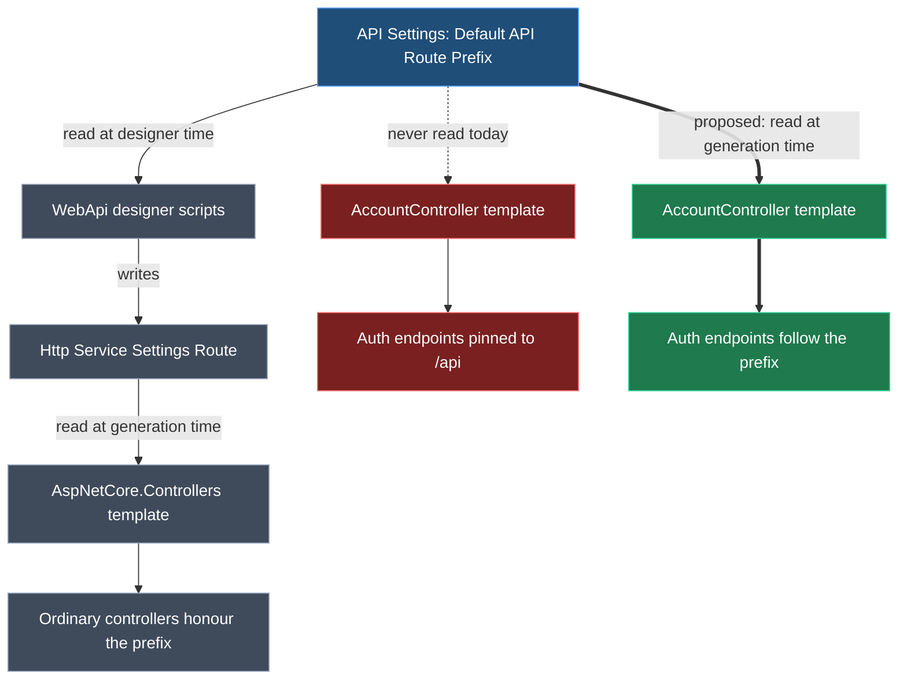

# Make the Identity AccountController honour Default API Route Prefix

## Context

Installing `Intent.AspNetCore.Identity.AccountController` always publishes the auth endpoints under `/api`, even when **API Settings → Default API Route Prefix** has been changed. Setting the prefix to `jps/` leaves the generated controller at `api/Account/Login`.

The cause is not a missing lookup — it is that the module never had one. The route is a hand-written string literal in the template, and the module reads no application settings at all today (`moduleSettings` is empty in its `.imodspec`, and no `.cs` file in it calls `ExecutionContext.Settings`).

Confirmed in committed output at <FileRef path="Tests/Application.Identity.AccountController/Application.Identity.AccountController.Api/Controllers/AccountController.cs" line={27} />:

```csharp
[Route("api/[controller]/[action]")]
```

### Why normal controllers already work

For an ordinary Service, the prefix is applied at **designer time**, not generation time. When you *Expose as HTTP Endpoint*, a script in `Intent.Metadata.WebApi` reads the setting and writes the result into the `Http Service Settings` → `Route` stereotype property. `Intent.AspNetCore.Controllers` then emits whatever that property says and nothing more — `ServiceControllerModel.cs` does `Route = GetControllerRoute(model.GetHttpServiceSettings()?.Route())`, whose only transform is swapping the service-name segment for `[controller]`.

The AccountController is generated from **no model at all** (`SingleFileTemplateRegistration`, `object model = null`), so it never passes through that designer-time path and nothing applies the prefix.



## Worked example

With **Default API Route Prefix** set to `jps/`, regenerating an application that has this module installed changes every auth endpoint:

<Table id="worked-example" caption="Endpoints before and after, with the prefix set to jps/" columns={["Endpoint", "Today", "After this change"]} rows={[
  ["Register / Login / Refresh / ConfirmEmail / Logout", "`api/Account/Login`", "`jps/Account/Login`"],
  ["Forgot password", "`api/Account/forgotPassword`", "`jps/Account/forgotPassword`"],
  ["Reset password", "`api/Account/resetPassword`", "`jps/Account/resetPassword`"],
  ["Manage info (GET and POST)", "`api/Account/manage/info`", "`jps/Account/manage/info`"]
]} />

An application left on the default `api/` generates byte-identical output to today.

## The five literals

Fixing only the class-level `[Route]` would be a half-fix. Four method routes are `~/`-prefixed — in ASP.NET Core `~/` means *ignore the controller route entirely and treat this as absolute* — so they carry their own copy of `api/` and would stay on `/api` regardless.

<Table id="literals" caption="All route literals in AccountControllerTemplatePartial.cs" columns={["Line", "Literal", "Kind"]} rows={[
  ["48", "`[Route(\"api/[controller]/[action]\")]`", "Class route — inherited by Register, Login, Refresh, ConfirmEmail, Logout"],
  ["254", "`[HttpPost(\"~/api/[controller]/forgotPassword\")]`", "Absolute — bypasses the class route"],
  ["277", "`[HttpPost(\"~/api/[controller]/resetPassword\")]`", "Absolute — bypasses the class route"],
  ["320", "`[HttpGet(\"~/api/[controller]/manage/info\")]`", "Absolute — bypasses the class route"],
  ["334", "`[HttpPost(\"~/api/[controller]/manage/info\")]`", "Absolute — bypasses the class route"]
]} />

## Approach

Read the existing **API Settings** group by GUID from the template, normalise it, and compose all five routes from it. This does not require a new module setting, and deliberately does not add a `<dependency>`.

<Callout id="no-dependency" tone="decision" title="Read the foreign setting by GUID, add no dependency">

The setting is owned by `Intent.AspNetCore.Controllers`, which is **not** currently a dependency of this module. Adding one would force-install Controllers on everyone who installs the auth module — including applications that generate no Services at all.

The repo already has this exact pattern. <FileRef path="Modules/Intent.Modules.Application.AutoMapper/DBSettingExtensions.cs" /> reads the Database Settings group by GUID, and `Intent.Application.AutoMapper.imodspec` declares no dependency on the module that owns it. <FileRef path="Modules/Intent.Modules.Application.DomainInteractions/QueryActionContext.cs" line={125} endLine={131} /> does the same with a fully null-conditional chain.

So: GUID lookup, null-safe, with a fallback that preserves today's behaviour when the group is absent.

</Callout>

### Normalisation rules

These must match the JavaScript helper the designer scripts use (`getDefaultRoutePrefix`), or auth endpoints will diverge from ordinary controllers in exactly the edge cases nobody tests:

<Table id="normalisation" caption="Prefix resolution, mirroring getDefaultRoutePrefix" columns={["Setting state", "Resolved prefix", "Resulting class route"]} rows={[
  ["Group absent (Controllers module not installed)", "`api`", "`api/[controller]/[action]`"],
  ["Default", "`api`", "`api/[controller]/[action]`"],
  ["`jps/` or `jps`", "`jps`", "`jps/[controller]/[action]`"],
  ["`v1/api/`", "`v1/api`", "`v1/api/[controller]/[action]`"],
  ["Explicitly blank", "*(empty)*", "`[controller]/[action]` — no empty leading segment"]
]} />

<Callout id="blank-prefix" tone="warning" title="Blank prefix must not produce a double slash">

A blank setting is a deliberate user choice meaning *no prefix*, and the designer helper honours it (`if (!route) route = ""`). Naive concatenation would emit `[Route("/[controller]/[action]")]` and `~//[controller]/forgotPassword`. The composition helper must drop empty segments rather than joining blindly — worth a unit-level check, since the default path never exercises it.

</Callout>

## Code changes

<FileTree id="files" title="Files this change touches" entries={[
  { path: "Modules/Intent.Modules.AspNetCore.Identity.AccountController/Settings/ApiRouteSettingExtensions.cs", change: "added", note: "GUID lookup + normalisation, modelled on DBSettingExtensions.cs" },
  { path: "Modules/Intent.Modules.AspNetCore.Identity.AccountController/Templates/AccountController/AccountControllerTemplatePartial.cs", change: "modified", note: "Compose all five routes from the resolved prefix" },
  { path: "Modules/Intent.Modules.AspNetCore.Identity.AccountController/release-notes.md", change: "modified", note: "Document 4.2.0" },
  { path: "Modules/Intent.Modules.AspNetCore.Identity.AccountController/docs/README.md", change: "modified", note: "Document the setting; fix the already-stale endpoint list" },
  { path: "Modules/Intent.Modules.AspNetCore.Identity.AccountController/CONTEXT.md", change: "added", note: "No CONTEXT.md exists for this module today" },
  { path: "Modules/Intent.Modules.AspNetCore.Identity.AccountController.Metadata/docs/README.md", change: "modified", note: "Record the proxy-route constraint below" },
  { path: "Modules/Intent.Modules.AspNetCore.Identity.AccountController.Metadata/release-notes.md", change: "modified", note: "Document 1.0.4" }
]} />

### The new settings accessor

<AnnotatedCode
  id="settings-helper"
  filename="Modules/Intent.Modules.AspNetCore.Identity.AccountController/Settings/ApiRouteSettingExtensions.cs"
  language="csharp"
  code={`internal static class ApiRouteSettingExtensions
{
    private const string ApiSettingsGroupId = "4bd0b4e9-7b53-42a9-bb4a-277abb92a0eb";
    private const string DefaultApiRoutePrefixId = "07c796c5-ff1c-4fb4-b9a4-bc9000439fec";
    private const string FallbackPrefix = "api";

    public static string GetApiRoutePrefix(this IApplicationSettingsProvider settings)
    {
        var group = settings.GetGroup(ApiSettingsGroupId);
        if (group == null)
        {
            return FallbackPrefix;
        }

        return (group.GetSetting(DefaultApiRoutePrefixId)?.Value ?? string.Empty).Trim().Trim('/');
    }

    public static string CombineRoute(params string[] segments) =>
        string.Join("/", segments.Where(s => !string.IsNullOrWhiteSpace(s)));
}`}
  annotations={[
    { lines: "9-13", label: "Group absent", note: "Controllers module not installed — fall back to `api`, preserving today's behaviour exactly." },
    { lines: "15", label: "Group present", note: "Honours a blank value as no prefix, matching the designer script. `Trim('/')` normalises `jps/` and `/jps/` alike." },
    { lines: "18-19", label: "Empty-segment safety", note: "Drops the prefix segment entirely when blank, so no `//` can appear in a route." }
  ]}
/>

### The template change

<Diff
  id="template-diff"
  filename="Modules/Intent.Modules.AspNetCore.Identity.AccountController/Templates/AccountController/AccountControllerTemplatePartial.cs"
  before={`.AddClass("AccountController", @class =>
{
    @class.AddAttribute("[Route(\\"api/[controller]/[action]\\")]");
    @class.AddAttribute("[ApiController]");

// ... later, on four methods:
method.AddAttribute("[HttpPost(\\"~/api/[controller]/forgotPassword\\")]");
method.AddAttribute("[HttpGet(\\"~/api/[controller]/manage/info\\")]");`}
  after={`var routePrefix = OutputTarget.ExecutionContext.Settings.GetApiRoutePrefix();
var classRoute = ApiRouteSettingExtensions.CombineRoute(routePrefix, "[controller]", "[action]");
string Absolute(string suffix) =>
    "~/" + ApiRouteSettingExtensions.CombineRoute(routePrefix, "[controller]", suffix);

// ...
.AddClass("AccountController", @class =>
{
    @class.AddAttribute($"[Route(\\"{classRoute}\\")]");
    @class.AddAttribute("[ApiController]");

// ... later, on four methods:
method.AddAttribute($"[HttpPost(\\"{Absolute("forgotPassword")}\\")]");
method.AddAttribute($"[HttpGet(\\"{Absolute("manage/info")}\\")]");`}
  annotations={[
    { side: "after", lines: "1", label: "Read in the constructor", note: "`CSharpFile` is built entirely in the constructor, so the prefix must resolve there. `OutputTarget.ExecutionContext` is available at that point — `BeforeTemplateExecution` in this same file already uses it." },
    { side: "after", lines: "3-4", label: "Covers the absolute routes", note: "The `~/` forms keep their absolute semantics but now carry the configured prefix instead of a literal `api`." }
  ]}
/>

## The proxy-metadata half

`Intent.AspNetCore.Identity.AccountController.Metadata` ships a Services package containing an `Account` Service element whose `Http Service Settings` → `Route` is hardcoded to `api/[controller]/[action]`, plus the same four `~/api/...` operation routes. **Service Proxies** and **Web Client** generate typed HTTP clients from it. If the controller moves and this does not, generated clients call a URL that no longer exists.

<Callout id="proxy-static" tone="warning" title="This package cannot track the setting — verified, not assumed">

The package is referenced read-only from the module, not copied into the application. In <FileRef path="Tests/CleanArchitecture.Comprehensive/Intent.Metadata/Service Proxies/CleanArchitecture.Comprehensive.ServiceProxies/CleanArchitecture.Comprehensive.ServiceProxies.pkg.config" /> it appears as:

```xml
<reference packageId="83443f65-0d69-4908-a7da-c786f8b51b74"
           include="AspNetCore.Identity.AccountController" isExternal="true">
  <module>Intent.AspNetCore.Identity.AccountController.Metadata</module>
</reference>
```

`isExternal="true"` with a `<module>` element and no `<path>` means it lives in the module and is shared by every consuming application. There is no per-application copy for a migration to rewrite, and static XML cannot read a setting. Changing its literal would only swap one fixed value for another.

So the proxy routes stay as they are, and the divergence is made **loud instead of silent**: the template emits `Logging.Log.Warning(...)` naming the mismatch when the resolved prefix is not `api`. This is the accepted cost of the chosen scope — proxies keep working on the default, and anyone who changes the prefix is told what it means for them rather than discovering it at runtime.

</Callout>

The durable fix — modelling the Account service in the Services designer so `AspNetCore.Controllers` generates it and one `Route` property drives both the controller and the proxies — is **deliberately deferred**. It removes the duplicated constant entirely, but it is a structural change to how this module generates, and it is not needed to fix the reported bug.

<Callout id="blazor-scope" tone="warning" title="Blazor.JwtAuth is knowingly out of scope">

<FileRef path="Modules/Intent.Modules.Blazor.JwtAuth/Templates/AuthServiceImplementation/AuthServiceImplementationTemplatePartial.cs" line={76} /> hardcodes `api/Account/Register`, `api/Account/Login`, `api/Account/Logout` and `api/Account/Refresh`.

It cannot be fixed the same way: the Blazor client is a **separate Intent application**, so its `ExecutionContext.Settings` are its own, not the API's. There is no supported way for it to read the API application's prefix — it would need its own setting. An application using both this module and Blazor JWT auth with a non-default prefix will have a client pointing at the old URLs. Calling it out here rather than half-fixing it.

</Callout>

## Versions and close-out

Both modules' current versions appear in their release notes, so both are published and must move before any change lands — the version gate runs **up front**, not at the end.

<Table id="versions" caption="Version gate" columns={["Module", "Current", "Target", "Why"]} rows={[
  ["`Intent.AspNetCore.Identity.AccountController`", "4.1.18", "**4.2.0**", "New setting-driven behaviour — minor, not patch"],
  ["`Intent.AspNetCore.Identity.AccountController.Metadata`", "1.0.3", "**1.0.4**", "Documentation only — the shipped routes do not change"]
]} />

Set the version through the **Module Builder** designer's version property and regenerate; do not hand-edit `<version>` in the `.imodspec`, which is generated from it.

No `<dependencies>` entry is added, per the decision above. The dependency audit at close-out should confirm that specifically, since a GUID-only reference is exactly the kind of thing that audit looks for — the justification is that the fallback handles the module's absence by design.

## Steps

1. **Run the version gate** — bump the main module to `4.2.0` and the Metadata module to `1.0.4` via the Module Builder designer, before touching any template.
2. **Capture current generated output** — this change affects generated output, so record the existing `AccountController.cs` from both test applications (`Tests/Application.Identity.AccountController` and `Tests/Application.Identity.AccountController.UserIdentity`) so the difference is provable afterwards.
3. **Add `ApiRouteSettingExtensions.cs`** with the GUID lookup, the fallback, and the empty-segment-safe `CombineRoute`.
4. **Rewrite the five literals** in `AccountControllerTemplatePartial.cs` to compose from the resolved prefix, reading the setting once in the constructor.
5. **Add the divergence warning** — `Logging.Log.Warning(...)` when the resolved prefix is not `api`, naming the shipped proxy metadata as the thing that will not follow.
6. **Build and regenerate** both test applications on the default prefix and confirm the output is unchanged, then re-run with a changed prefix and confirm every route moves.
7. **Documentation** — update both modules' release notes and READMEs. The main README's endpoint list is *already* wrong (it documents `/api/account/authenticate` and `/api/account/refresh-token`; the generated actions are `Login` and `Refresh`) — correct it while there.
8. **Write `CONTEXT.md`** for the main module recording the two-copies-of-the-route invariant, why no dependency was added, and why the proxy metadata cannot track the setting.

## Verification

<Callout id="green-build" tone="warning" title="A green build proves nothing here">

Every change in this plan is a string-composition change inside a template. The module will compile whether or not the prefix reaches the generated attribute. The only evidence that counts is the regenerated `[Route]` attribute in a consuming application — so the default-prefix run and the changed-prefix run below are both required, not optional.

</Callout>

<Checklist id="verify" items={[
  { id: "v1", label: "Default prefix produces byte-identical output", note: "Regenerate both test applications with the prefix left at `api/`. `AccountController.cs` must be unchanged — this is the no-regression gate for existing consumers." },
  { id: "v2", label: "Changed prefix moves all five routes", note: "Set the prefix to `jps/` and regenerate. Confirm the class route AND all four `~/` method routes move. Checking only the class attribute would pass while the absolute routes stayed broken." },
  { id: "v3", label: "Blank prefix produces no double slash", note: "Clear the setting and confirm `[Route(\"[controller]/[action]\")]` and `~/[controller]/forgotPassword` — not `/[controller]/...` or `~//...`." },
  { id: "v4", label: "Missing Controllers module falls back to api", note: "The setting group is absent when `Intent.AspNetCore.Controllers` is not installed. Confirm the fallback keeps the route at `api/[controller]/[action]` rather than emitting an empty prefix." },
  { id: "v5", label: "Endpoints actually respond on the new route", note: "Run a regenerated application with a non-default prefix and call one auth endpoint. Confirms routing, not just the emitted attribute text." },
  { id: "v6", label: "Warning fires only on a non-default prefix", note: "Confirm the Software Factory output carries the proxy-divergence warning when the prefix is changed, and stays quiet on the default." }
]} />

## Open questions resolved

- **Q:** Which setting should drive the prefix? **A:** Reuse the existing **Default API Route Prefix** from the API Settings group, read by GUID with an `api` fallback. No new module setting.
- **Q:** How much should this change cover? **A:** The controller template plus the proxy metadata. The proxy package turned out to be structurally unable to track the setting, so that half is delivered as a Software Factory warning plus documentation rather than a code change — see the callout above.
- **Q:** What about `Intent.Modules.Blazor.JwtAuth`? **A:** Out of scope by the same decision. It is a separate application and cannot read the API's setting; flagged above rather than partially addressed.
