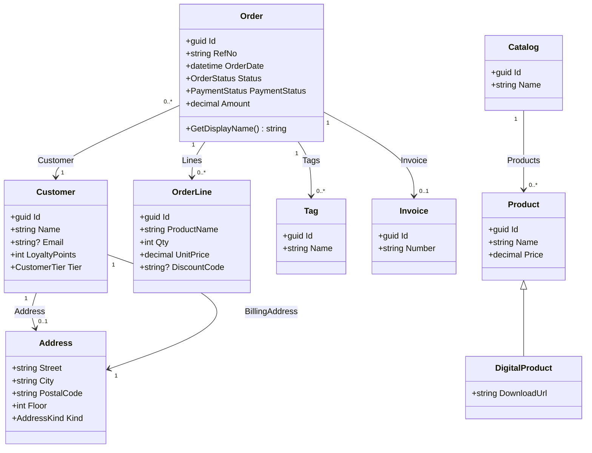

# Design

## Overview

This design spans three targets, which is unusual for a spec and worth stating up front:

1. **The Object Mapper module** — `Intent.Application.Dtos.ObjectMapping`. One Module Builder model change (a new application-level setting) and a rewrite of the expression-building helper behind <ModelRef application="Application.Dtos.ObjectMapping" name="MappingExtensions" designer="Module Builder" type="C# Template" />.
2. **The Domain Interactions module** — `Intent.Application.DomainInteractions`. Pure code: a third `IMappingStrategy`, registered inside <ModelRef application="Application.DomainInteractions" name="DomainInteractionRegistration" designer="Module Builder" type="Factory Extension" />.
3. **Two new Flavour Applications** — `ObjectMapping.Strict` and `ObjectMapping.Lenient`. Each gets a full Domain and Services model covering all 21 Mapping Shapes, plus an xUnit project.

Almost none of the work is in a designer. The Module Builder change is four elements; everything else is either module C# or the two new applications' models. That inversion is normal for a module-build spec and it is why the realization plan below is weighted to `[code]`.

<Callout id="scope-counts" tone="info" title="Scope in counts">

**Module Builder:** 1 new `Module Settings Configuration`, 1 field, 2 options — 4 elements, one designer, one application.

**Module code:** 4 files changed in the Object Mapper (2 source, 2 documentation), 2 files in Domain Interactions (1 new).

**Flavour Applications:** 2 applications × (9 Domain classes + 4 enums + 8 associations + 4 repositories + 10 DTOs + 2 DTO enums + 9 queries) + 1 xUnit project each — modelled by **2 saved scripts** run against both, not 4 scripts.

</Callout>

## Decisions confirmed with the user

<Callout id="d1" tone="decision" title="A third sibling mapping strategy, not a fallback or a bridge">

`ObjectMappingMappingStrategy` goes inside the Domain Interactions module alongside `AutoMapperMappingStrategy` and `MapperlyMappingStrategy`, matching on the `Intent.Application.Dtos.ObjectMapping` module id.

**Why:** the match is a module-id **string**, so no assembly or NuGet dependency is created in either direction — the dependency-boundary rule is not engaged at all. A role-based fallback would have been the better long-term design, but it changes `HasMappingStrategy` behaviour for every application in the repository rather than only ours; a bridging module would be inconsistent with how both existing providers are wired and adds a module a user must know to install.

</Callout>

<Callout id="d2" tone="decision" title="Expression mappings replicate AutoMapper exactly, bug included">

`src.` and `projectFrom.` are the two recognised Prefix Forms and are rewritten to `projectFrom`; anything else has `projectFrom.` prepended to the expression as a whole.

**Why:** neither incumbent supports unprefixed expressions — AutoMapper prepends its prefix to the whole string and leaves later identifiers unresolved, and Mapperly has no expression branch at all. Resolving bare identifiers against the entity's members would have needed a tokenizer that must not misfire on lambda parameters, string literals or `nameof`. For a drop-in replacement, generating the same thing beats generating the better thing — and dropping it removes the single riskiest piece of the implementation.

</Callout>

<Callout id="d3" tone="decision" title="Null Path Handling is one application-level module setting, defaulting to Strict">

A `Module Settings Configuration` on the module, one `Select` field, two options, `Strict` default. No per-element stereotype override.

**Why:** the module-building playbook maps application-wide behaviour to a module setting and element-level specialization to a stereotype. Null handling is a single house style per application, not a per-field decision, so the stereotype half of that pattern would be surface with no demand behind it.

</Callout>

<Callout id="d4" tone="decision" title="Strict fails at runtime, never at Software Factory time">

Strict emits a null-forgiving access; the failure is a `NullReferenceException` when the hop is genuinely null. Generation is never blocked.

**Why:** the designer already raises a validation warning for the nullability mismatch. Failing generation as well would block the modeller twice for one problem and would break existing models on upgrade.

</Callout>

<Callout id="d5" tone="decision" title="One saved script, run against both Flavour Applications">

Neither application copies designer metadata from `ObjectMappingTest`. The model is authored **once**, saved with `save_script`, and executed against each application in turn by passing it to `run_designer_script` via `includedScriptPaths` — two scripts in total, one for the Domain package and one for Services.

**Why:** R8.11 requires the models be built rather than copied, and a single saved script is what makes R8.10 hold structurally rather than by vigilance. The applications own duplicate metadata by decision (a9), which means a shape added to one and forgotten in the other is invisible to a green build — SM-4's output diff was the only defence, and it is a manual one with no owner. Running the *same* script against both makes divergence something you would have to do deliberately, and demotes the SM-4 diff from primary defence to backstop.

</Callout>

<Callout id="d6" tone="decision" title="Collections are List only">

R6 shape 20 became the nullable-collection case; array, `ICollection` and `IEnumerable` targets are out of scope.

**Why:** `DtoModelTemplatePartial.cs` calls `SetDefaultCollectionFormatter(CSharpCollectionFormatter.CreateList())` unconditionally, so a DTO collection field can only ever be `List<T>`. The other targets were untestable, not merely unimplemented.

</Callout>

<Callout id="d7" tone="risk" title="Existing installs change behaviour with no migration">

Applications already on `1.0.0-pre.3` pick up the `Strict` default and their generated mappings change on the next Software Factory run.

**Why:** the module is pre-release with no known external consumers, and a visible diff on regeneration is exactly when this should surface. A version migration writing `Lenient` was considered and declined — it would leave two cohorts on different defaults permanently.

</Callout>

## Module & architecture prerequisites

<Callout id="prereqs" tone="warning" title="No new module to build — but the Flavour Applications must be provisioned before any of their model work">

**No new Intent module is created, and none needs installing into the two modules being changed.**

The prerequisite is application provisioning. Both Flavour Applications must be created and have their modules installed **before** any Domain or Services modelling, because the designers do not exist until the architecture template has run:

- **Architecture template:** `Intent.ApplicationTemplate.AspNetCore6.0.CleanArchitecture`, version `5.2.7` — the same one `ObjectMappingTest` uses, with its creation settings (`top-level-statements=false`, DTO type `record`, `advanced` mapping mode).
- **Modules:** mirror `ObjectMappingTest`'s set, which already excludes AutoMapper. The ones this spec actually depends on:
  - `Intent.Application.Dtos.ObjectMapping` — the module under test (R1–R7, R9)
  - `Intent.Application.DomainInteractions` `1.2.7`+ — supplies the mapping strategy (R3, R4)
  - `Intent.Modelers.Services.DomainInteractions` `2.4.4` — lets the queries be modelled as interactions rather than convention CRUD (R3.1)
  - `Intent.Application.Dtos.Pagination` `4.2.0` — supplies `PagedResult`, `CursorPagedResult` and their mapping extensions (R4)
  - `Intent.Application.MediatR` + `Intent.EntityFrameworkCore.Repositories` — handlers and repositories to host the Call Sites

Both changed modules must also be rebuilt and their versions bumped before the Flavour Applications can consume them.

</Callout>

## Part A — the Object Mapper module

### Model changes

<ModelChanges id="mb-changes" caption="Module Builder — Intent.Application.Dtos.ObjectMapping" changes={[
  { element: "Object Mapping Settings", designer: "Module Builder", change: "added", note: "Module Settings Configuration, direct child of the Intent Module package — the same containment Application.AutoMapper uses for its AutoMapper Settings",
    fields: [{ label: "Configuration stereotype", after: "Settings Type = Application Settings" }] },
  { element: "Null Path Handling", designer: "Module Builder", change: "added", note: "Module Settings Field Configuration, child of the above",
    fields: [
      { label: "Field Configuration stereotype", after: "Control Type = Select" },
      { label: "Default Value", after: "strict" },
      { label: "Is Required", after: "false" },
      { label: "Hint", after: "How a mapping path that crosses an optional navigation into a non-nullable DTO field behaves at runtime." }
    ] },
  { element: "Strict", designer: "Module Builder", change: "added", note: "Module Settings Field Option — value strict" },
  { element: "Lenient", designer: "Module Builder", change: "added", note: "Module Settings Field Option — value lenient" }
]} />

Four elements, one script. The Software Factory then generates the settings accessor into the module's already-modelled `Settings` folder, following the `Intent.ModuleBuilder.Templates.Settings.ModuleSettingsExtensions` template — the same shape as `AutoMapperSettings.ProfileLocation()`, giving `GetObjectMappingSettings().NullPathHandling().IsStrict()`.

Nothing else in the Module Builder changes. <ModelRef application="Application.Dtos.ObjectMapping" name="MappingExtensions" designer="Module Builder" type="C# Template" /> keeps its role, its `Mappings` default location and its File-Per-Model cardinality.

### Code changes

<FileTree
  id="module-files"
  title="Object Mapper module"
  entries={[
    { path: "../../../Modules/Intent.Modules.Application.Dtos.ObjectMapping/Templates/MappingHelper.cs", change: "modified", note: "R1, R2, R6, R7.2 — null-path emission, prefix normalisation, shape branches" },
    { path: "../../../Modules/Intent.Modules.Application.Dtos.ObjectMapping/Templates/MappingExtensions/MappingExtensionsTemplatePartial.cs", change: "modified", note: "R5 guard removal, R7.1 ElementException, R7.3 namespace derivation, setting read" },
    { path: "../../../Modules/Intent.Modules.Application.Dtos.ObjectMapping/Intent.Application.Dtos.ObjectMapping.imodspec", change: "modified", note: "R8.12 — version bump and release notes; moduleSettings populated by the model change" },
    { path: "../../../Modules/Intent.Modules.Application.Dtos.ObjectMapping/docs/README.md", change: "modified", note: "R8.12 — Null Path Handling, prefix forms, call sites, IQueryable trade-off" }
  ]}
/>

**R1 — null-path emission.** `BuildPath` currently decides the separator from the previous hop's nullability alone, emitting `?.` unconditionally. It gains the setting and the target field's nullability, and returns one of three separators per hop. The guarded form must be a single expression so it can sit inside an object initializer entry (R9.8) — the same shape `AutoMapper`'s `BuildNullChecks` / `BuildNullCheckAlternative` pair already produces, so there is a working precedent for the string it has to build.

`BuildPath` is **not the only place a null-conditional is emitted**, and this is the single easiest thing to get wrong in the whole implementation. `MappingHelper` emits `?` from six independent sites that do not share a code path. Three are governed by R1 and three by R6.3 / R6.8, and changing only `BuildPath` leaves two R1 sites broken:

<Table
  id="null-sites"
  density="compact"
  caption="Every null-conditional emission site in MappingHelper, and which requirement governs it"
  columns={["Site", "Emits", "Governed by", "Changes"]}
  rows={[
    ["`BuildPath`, inter-hop separator", "`?.` between hops", "**R1**", "Yes — three-way per the diff below"],
    ["Nested-DTO branch", "`{nullConditional}.MapToXxx()`", "**R1**", "Yes — same three-way decision"],
    ["`BuildPkExpression`", "`{nullConditional}.Id`", "**R1**", "Yes — same three-way decision"],
    ["Nested-DTO collection branch", "`?.Select(...).ToList() ?? []`", "R6.3, R6.8", "Only for a nullable collection field"],
    ["`BuildMultiplePkExpression`", "`?.Select(x => x.Id).ToList() ?? []`", "R6.3, R6.8", "Only for a nullable collection field"],
    ["Collection multi-hop branch", "`?.Select(x => x.Prop).ToList() ?? []`", "R6.3, R6.8", "Only for a nullable collection field"]
  ]}
/>

Mapping Shape 8 lands on the second R1 site directly and is the reason it cannot be skipped: `OrderDto.InvoiceId` is a non-nullable `guid` read through `Order → Invoice (1 → 0..1)`, so `BuildPkExpression` produces `projectFrom.Invoice?.Id` — a `Guid?` assigned to a `Guid`. It fails to compile under **both** Flavours until that site takes the same three-way decision. The three R1 sites should therefore share one helper that takes the hop's nullability, the target field's nullability and the setting, rather than each deciding for itself.

<Diff
  id="null-path"
  filename="Modules/Intent.Modules.Application.Dtos.ObjectMapping/Templates/MappingHelper.cs"
  before={`if (i > 0)
{
    // null-conditional is based on the PREVIOUS element's nullability
    var prevIsNullable = filtered[i - 1].Element?.TypeReference?.IsNullable == true;
    sb.Append(prevIsNullable ? "?." : ".");
}`}
  after={`if (i > 0)
{
    var prevIsNullable = filtered[i - 1].Element?.TypeReference?.IsNullable == true;
    sb.Append(prevIsNullable ? NullableHopSeparator(targetIsNullable, isStrict) : ".");
}

// "?."  target field is nullable      - setting has no effect (R1.4)
// "!."  target non-nullable, Strict   - throws at runtime      (R1.2)
// "."   target non-nullable, Lenient  - caller wraps in a guard (R1.3)`}
  annotations={[
    { side: "after", lines: "4", label: "Three-way, not two", note: "R1.4 keeps null-conditional whenever the DTO field is itself nullable, so the setting genuinely has no effect there and the two Flavour Applications agree on those fields — which is what SM-4 measures." },
    { side: "after", lines: "8", label: "Lenient is built by the caller", note: "R1.3's guard spans the whole path, so it cannot be emitted hop-by-hop. BuildPath returns the plain path plus the list of nullable hops; the caller composes the single guarded expression." }
  ]}
/>

<Callout id="cast-guard" tone="risk" title="Where the enum cast meets the Lenient guard — Mapping Shape 19">

`BuildEntryExpression` tests its branches in order: expression, FK extraction, nested DTO, collection multi-hop, enum cast, default. The enum-cast branch wraps `path` in a cast. R1.3's Lenient form wraps the **whole** path in a guard. Shape 19 — `CustomerDto.AddressKind`, a non-nullable DTO enum reached across an optional navigation — is the one field where both apply, and the nesting order is not interchangeable:

```csharp
// Correct — the cast is inside the guard's true-branch
projectFrom.Address != null ? (AddressKindDto)projectFrom.Address.Kind : default

// Wrong — casts the ternary, and `default` has no type to bind to
(AddressKindDto)(projectFrom.Address != null ? projectFrom.Address.Kind : default)
```

Both forms compile in some contexts, which is what makes this worth pinning here rather than leaving to implementation: the wrong one changes what `default` binds to. The rule is that R1's guard is applied **last**, wrapping whatever expression the preceding branch produced, and never the other way round. The same ordering applies to `BuildPkExpression`'s trailing `.Id`.

</Callout>

**R2 — prefix normalisation.** `BuildEntryExpression`'s expression branch currently emits the joined path with no prefix handling at all, which is why a `src.`-authored expression generates an unresolved `src`. It becomes AutoMapper's algorithm with `projectFrom` substituted for `src`: recognise a leading `src.` or `projectFrom.`, rewrite it, otherwise prepend. No tokenizer, no member resolution.

**R5 — guard removal.** `CanRunTemplate()` drops the `InstalledModules.Any(m => m.ModuleId == "Intent.Application.Dtos.AutoMapper")` clause, keeping `base.CanRunTemplate() && Model.Mapping != null`.

**R7 — diagnostics and namespace.** `GetEntityTypeName()`'s `throw new System.Exception(...)` becomes an `ElementException` scoped to `Model.InternalElement`, per the repository's exception guidelines. The namespace derivation replaces `this.GetNamespace().Replace(".Mappings", "")` — a substring strip that corrupts any namespace containing that segment for an unrelated reason — with a derivation that removes only the template's own default-location segment.

## Part B — the Domain Interactions module

<FileTree
  id="di-files"
  title="Domain Interactions module"
  entries={[
    { path: "../../../Modules/Intent.Modules.Application.DomainInteractions/Strategies/ObjectMappingMappingStrategy.cs", change: "added", note: "R3, R4 — the third IMappingStrategy" },
    { path: "../../../Modules/Intent.Modules.Application.DomainInteractions/FactoryExtensions/DomainInteractionRegistration.cs", change: "modified", note: "R3.1 — one registration line in the merge-managed body" }
  ]}
/>

The new strategy is the AutoMapper strategy with the mapper removed. It is deliberately the smallest possible diff from a file that is known to work.

<AnnotatedCode
  id="new-strategy"
  filename="Modules/Intent.Modules.Application.DomainInteractions/Strategies/ObjectMappingMappingStrategy.cs"
  language="csharp"
  code={`internal class ObjectMappingMappingStrategy : IMappingStrategy
{
    public bool IsMatch(ICSharpClassMethodDeclaration method) =>
        method.File.Template.ExecutionContext.InstalledModules
            .Any(x => x.ModuleId == "Intent.Application.Dtos.ObjectMapping");

    public void ImplementMappingStatement(ICSharpClassMethodDeclaration method,
        List<CSharpStatement> statements, EntityDetails entity, ICSharpTemplate template,
        ITypeReference returnType, string? returnDto)
    {
        if (!template.TryGetTypeName("Intent.Application.Dtos.EntityDtoMappingExtensions",
                returnType.Element, out _))
        {
            return;
        }

        var nullable = returnType.IsNullable ? "?" : "";
        var list = returnType.IsCollection ? "List" : "";
        statements.Add($"return {entity.VariableName}{nullable}.MapTo{returnDto}{list}();");
    }

    public void ImplementPagedMappingStatement(ICSharpClassMethodDeclaration method,
        List<CSharpStatement> statements, EntityDetails entity, ICSharpTemplate template,
        ITypeReference returnType, string? returnDto, string? mappingMethod)
    {
        if (!returnType.GenericTypeParameters.Any() ||
            !template.TryGetTypeName("Intent.Application.Dtos.EntityDtoMappingExtensions",
                returnType.GenericTypeParameters.First().Element, out _))
        {
            return;
        }

        statements.Add($"return {entity.VariableName}.{mappingMethod}(x => x.MapTo{returnDto}());");
    }

    public bool HasProjectTo() => false;
}`}
  annotations={[
    { lines: "3-5", label: "R3.1 — module-id match", note: "A string comparison against InstalledModules. No assembly reference to the Object Mapper module is created, which is what keeps this from being a dependency-boundary violation." },
    { lines: "11-15", label: "R3.6 and R3.7 — guard, not side effect", note: "TryGetTypeName does two jobs: it registers the namespace so the Call Site resolves (R3.6), AND its result says whether a Mapping Extension Class exists for this DTO at all. R3.7 forbids emitting a Call Site to a method that was never generated, so the result is a guard. AutoMapper's strategy discards it; Mapperly's guards on it — Mapperly is the correct sibling to copy here." },
    { lines: "17-19", label: "R3.2, R3.3, R3.4", note: "The nullable and collection suffixes give all three non-paged Call Site shapes from one statement. No IMapper is injected anywhere, satisfying R3.5." },
    { lines: "26-31", label: "R3.7 again, on the paged path", note: "Same guard, plus an emptiness check on the generic parameters before First() is called. Without it a malformed paged return type throws during generation instead of being skipped." },
    { lines: "33", label: "R4.1, R4.3", note: "mappingMethod is passed in as MapToPagedResult or MapToCursorPagedResult by the caller, so one implementation covers both. The Pagination module owns those extensions and preserves the page metadata, satisfying R4.2 and R4.4." },
    { lines: "36", label: "R3.8 — no query pushdown", note: "false means Domain Interactions materializes before mapping. Matches what the Mapperly strategy reports." }
  ]}
/>

Registration is a single line added to the merge-managed `OnBeforeTemplateRegistrations` body, beside the two existing providers:

<Diff
  id="registration"
  filename="Modules/Intent.Modules.Application.DomainInteractions/FactoryExtensions/DomainInteractionRegistration.cs"
  before={`MappingStrategyProvider.Instance.Register(new AutoMapperMappingStrategy());
MappingStrategyProvider.Instance.Register(new MapperlyMappingStrategy());`}
  after={`MappingStrategyProvider.Instance.Register(new AutoMapperMappingStrategy());
MappingStrategyProvider.Instance.Register(new MapperlyMappingStrategy());
MappingStrategyProvider.Instance.Register(new ObjectMappingMappingStrategy());`}
  annotations={[
    { side: "after", lines: "3", label: "Default priority is correct", note: "All three register at priority 0 and their IsMatch predicates are mutually exclusive in practice, so no ordering is needed. If two providers are installed at once — which R5 now permits — GetMappingStrategy takes the first and logs the ambiguity, which is the pre-existing behaviour for AutoMapper plus Mapperly." }
  ]}
/>

## Part C — the two Flavour Applications

Both applications get an identical model, scripted rather than copied. The shape below is the Strict application's; the Lenient one is element-for-element the same.



Reading that back: `Customer` carries **two** navigations to `Address` — one optional, one required — which is what separates Mapping Shape 4 from shape 5 and gives shapes 18 and 19 a nullable hop to cross. `Order` reaches `Customer` many-to-one (a local foreign key, shape 7) and `Invoice` to-one-optional (a primary key read through a nullable navigation, shape 8), so the two foreign-key shapes are genuinely different paths rather than the same one twice. `Catalog` holds a collection typed to the **base** `Product`, which is what shape 16 needs; `DigitalProduct` specialises it for shapes 14 and 15.

**Aggregate roots and repositories.** The nine queries are modelled as Domain Interactions, which means each one reads through a repository — without one, the generated handler has nothing to inject and will not compile. Four classes are aggregate roots and each needs a repository modelled against it: `Customer`, `Order`, `Catalog` and `Product` (the base, which serves `DigitalProduct` through the generalization). `Address`, `OrderLine`, `Tag` and `Invoice` are not roots and get none.

The composition-versus-aggregation choice on the associations is not cosmetic here, because it decides which branch of `MappingHelper` a shape lands in:

<Table
  id="assoc-kinds"
  density="compact"
  caption="Association kind per navigation, and the Mapping Shape it enables"
  columns={["Association", "Kind", "Why", "Shape"]}
  rows={[
    ["`Order → Lines`", "Composition", "`OrderLine` has no independent lifetime and is only ever reached through its order", "6"],
    ["`Order → Tags`", "Aggregation", "Tags are shared across orders, so the DTO takes their identifiers rather than owning them", "9, 10"],
    ["`Order → Invoice`", "Aggregation", "Independent entity reached to-one, which is what routes shape 8 through `BuildPkExpression` rather than local foreign-key extraction", "8"],
    ["`Order → Customer`", "Aggregation, many-to-one", "Produces a local foreign key on `Order`, which is the whole point of shape 7", "7"],
    ["`Customer → Address` / `BillingAddress`", "Composition", "Addresses belong to their customer; two navigations to the same type is what separates shapes 4 and 5", "4, 5, 17, 18, 19"],
    ["`Catalog → Products`", "Aggregation, base-typed", "Products exist independently and the collection is typed to the base class", "16"]
  ]}
/>

### The entities that carry the awkward shapes

<DataModel
  id="dm-customer"
  entity="Customer — aggregate root"
  caption="The nullable-hop source. Its optional Address navigation is what R1 is tested through."
  fields={[
    { name: "Id", type: "guid", change: "added" },
    { name: "Name", type: "string", change: "added" },
    { name: "Email", type: "string?", change: "added", note: "Shape 2 — nullable scalar" },
    { name: "LoyaltyPoints", type: "int", change: "added" },
    { name: "Tier", type: "CustomerTier", change: "added", note: "Shape 11 — same enum on both sides" }
  ]}
/>

<DataModel
  id="dm-address"
  entity="Address — referenced class, optional from Customer"
  caption="Every field here is reached across a Nullable Hop, which is what makes it the R1 fixture."
  fields={[
    { name: "Street", type: "string", change: "added" },
    { name: "City", type: "string", change: "added", note: "Shape 17 — reached via Order to Customer to Address, a three-hop chain" },
    { name: "PostalCode", type: "string", change: "added" },
    { name: "Floor", type: "int", change: "added", note: "Shape 18 — nullable hop into a non-nullable value type. The shape that does not compile today." },
    { name: "Kind", type: "AddressKind", change: "added", note: "Shape 19 — nullable hop into a non-nullable enum, and shape 12's cast, in one field" }
  ]}
/>

<DataModel
  id="dm-order"
  entity="Order — aggregate root"
  caption="Source for OrderDto and OrderDetailDto, and the entity every query returns."
  fields={[
    { name: "Id", type: "guid", change: "added" },
    { name: "RefNo", type: "string", change: "added", note: "Shape 1 — flat primitive" },
    { name: "OrderDate", type: "datetime", change: "added" },
    { name: "Status", type: "OrderStatus", change: "added", note: "Shape 11 — mapped to the same Domain enum, no cast" },
    { name: "PaymentStatus", type: "PaymentStatus", change: "added", note: "Shape 12 — mapped to PaymentStatusDto, explicit cast" },
    { name: "Amount", type: "decimal", change: "added", note: "Referenced by both Expression Mappings, shape 21" },
    { name: "GetDisplayName()", type: "string", change: "added", note: "Shape 13 — parameterless operation in the path" }
  ]}
/>

The remaining entities — `OrderLine`, `Tag`, `Invoice`, `Product`, `DigitalProduct`, `Catalog` — are fully described by the class diagram above and carry no field-level subtlety, so they get no `<DataModel>` of their own. That is a judgement about signal, not an omission.

### The DTOs

<DataModel
  id="dm-customerdto"
  entity="CustomerDto — mapped from Customer"
  caption="Carries shapes 4, 5, 18 and 19 — the four that R1 governs."
  fields={[
    { name: "Id", type: "guid", change: "added" },
    { name: "Name", type: "string", change: "added" },
    { name: "Email", type: "string?", change: "added" },
    { name: "Address", type: "AddressDto?", change: "added", note: "Shape 4 — nullable navigation to nested DTO" },
    { name: "BillingAddress", type: "AddressDto", change: "added", note: "Shape 5 — non-nullable navigation to nested DTO" },
    { name: "AddressFloor", type: "int", change: "added", note: "Shape 18 — from Address.Floor across the optional navigation" },
    { name: "AddressKind", type: "AddressKindDto", change: "added", note: "Shape 19 — from Address.Kind across the optional navigation, with an enum cast" }
  ]}
/>

<DataModel
  id="dm-orderdto"
  entity="OrderDto — mapped from Order"
  caption="Carries both foreign-key shapes and all three collection shapes."
  fields={[
    { name: "Id", type: "guid", change: "added" },
    { name: "RefNo", type: "string", change: "added", note: "Shape 1" },
    { name: "OrderDate", type: "datetime", change: "added" },
    { name: "Status", type: "OrderStatus", change: "added", note: "Shape 11 — no cast" },
    { name: "PaymentStatus", type: "PaymentStatusDto", change: "added", note: "Shape 12 — cast" },
    { name: "CustomerId", type: "guid", change: "added", note: "Shape 7 — local foreign key, many-to-one, navigation not traversed" },
    { name: "InvoiceId", type: "guid", change: "added", note: "Shape 8 — primary key via a to-one navigation, and a Nullable Hop so R1 applies" },
    { name: "Lines", type: "List of OrderLineDto", change: "added", note: "Shape 6 — collection of nested DTOs" },
    { name: "TagIds", type: "List of guid", change: "added", note: "Shape 9 — primary keys via a to-many navigation" },
    { name: "OptionalTagIds", type: "List of guid, nullable", change: "added", note: "Shape 20 — nullable collection field, null rather than empty when the source is absent" }
  ]}
/>

<DataModel
  id="dm-orderdetaildto"
  entity="OrderDetailDto — mapped from Order"
  caption="The flattening DTO. Carries the deep chain, the operation call and both Expression Mappings."
  fields={[
    { name: "Id", type: "guid", change: "added" },
    { name: "CustomerName", type: "string", change: "added", note: "Shape 3 — non-nullable navigation then property, no guard" },
    { name: "CustomerCity", type: "string", change: "added", note: "Shape 17 — Order to Customer to Address to City, nullable in the middle only" },
    { name: "TagNames", type: "List of string", change: "added", note: "Shape 10 — collection navigation then trailing property" },
    { name: "DisplayName", type: "string", change: "added", note: "Shape 13 — parameterless operation invoked in the path" },
    { name: "DiscountLabel", type: "string", change: "added", note: "Shape 21a — Expression Mapping authored `src.Amount > 100 ? src.RefNo : string.Empty`" },
    { name: "SurchargeLabel", type: "string", change: "added", note: "Shape 21b — the same expression authored in the projectFrom form; must generate byte-identically per R2.5" }
  ]}
/>

<DataModel
  id="dm-catalogdto"
  entity="CatalogDto — mapped from Catalog"
  caption="The polymorphic collection case."
  fields={[
    { name: "Id", type: "guid", change: "added" },
    { name: "Name", type: "string", change: "added" },
    { name: "Products", type: "List of ProductDto", change: "added", note: "Shape 16 — base-typed collection, projected through the Mapping Method resolved for the declared element type" }
  ]}
/>

`AddressDto`, `OrderLineDto`, `TagDto`, `InvoiceDto`, `ProductDto` and `DigitalProductDto` are flat projections of their entities and are covered by the shape table below rather than a block each.

### Shape-to-field map

This is the table the tasks step should project its modelling work from. Every one of the 21 Mapping Shapes has exactly one nominated field, so SM-1 is countable rather than argued about.

<Table
  id="shape-map"
  density="compact"
  caption="R6.1, R8.2, R8.4 — which modelled field exercises each Mapping Shape"
  columns={["#", "Shape", "Exercised by", "Source path"]}
  rows={[
    ["1", "Flat primitive", "`OrderDto.RefNo`", "`RefNo`"],
    ["2", "Nullable scalar", "`OrderLineDto.DiscountCode`", "`DiscountCode`"],
    ["3", "Non-nullable nav then property", "`OrderDetailDto.CustomerName`", "`Customer` → `Name`"],
    ["4", "Nullable nav then nested DTO", "`CustomerDto.Address`", "`Address`"],
    ["5", "Non-nullable nav then nested DTO", "`CustomerDto.BillingAddress`", "`BillingAddress`"],
    ["6", "Collection of nested DTOs", "`OrderDto.Lines`", "`Lines`"],
    ["7", "Local foreign key, many-to-one", "`OrderDto.CustomerId`", "`Customer`"],
    ["8", "Primary key via to-one nav", "`OrderDto.InvoiceId`", "`Invoice`"],
    ["9", "Primary keys via to-many nav", "`OrderDto.TagIds`", "`Tags`"],
    ["10", "Collection nav then trailing property", "`OrderDetailDto.TagNames`", "`Tags` → `Name`"],
    ["11", "Enum, same type", "`OrderDto.Status`", "`Status`"],
    ["12", "Enum, different type", "`OrderDto.PaymentStatus`", "`PaymentStatus`"],
    ["13", "Parameterless operation", "`OrderDetailDto.DisplayName`", "`GetDisplayName()`"],
    ["14", "Inherited member via generalization", "`DigitalProductDto.Name`", "`Product` → `Name`"],
    ["15", "Derived entity to derived DTO", "`DigitalProductDto.DownloadUrl`", "`DownloadUrl`"],
    ["16", "Base-typed collection", "`CatalogDto.Products`", "`Products`"],
    ["17", "Deep chain, three hops", "`OrderDetailDto.CustomerCity`", "`Customer` → `Address` → `City`"],
    ["18", "Nullable hop into non-nullable value type", "`CustomerDto.AddressFloor`", "`Address` → `Floor`"],
    ["19", "Nullable hop into non-nullable enum", "`CustomerDto.AddressKind`", "`Address` → `Kind`"],
    ["20", "Nullable collection field", "`OrderDto.OptionalTagIds`", "`Tags`"],
    ["21", "Expression Mapping, both prefix forms", "`OrderDetailDto.DiscountLabel` and `.SurchargeLabel`", "free-form expression"]
  ]}
/>

### Queries

Nine queries per application, modelled as Domain Interactions `Query Entity Action` associations rather than convention CRUD — that is what routes them through `GetReturnStatements` and therefore through the new strategy. Five carry a distinct Call Site shape and are given below.

<ApiEndpoint id="q1" method="GET" path="/api/orders/{id}" change="added"
  caption="R3.2 — single mapped DTO. Returns OrderDto. Call Site must be `return order.MapToOrderDto();` with no arguments."
  params={[{ name: "id", type: "guid", required: true }]} />

<ApiEndpoint id="q2" method="GET" path="/api/customers/{id}/optional" change="added"
  caption="R3.4 — nullable single mapped DTO. Returns CustomerDto?. Call Site must be null-conditional and return null rather than throw."
  params={[{ name: "id", type: "guid", required: true }]} />

<ApiEndpoint id="q3" method="GET" path="/api/orders" change="added"
  caption="R3.3 — collection of a mapped DTO. Returns a list of OrderDto. Call Site must invoke the List Mapping Method with no arguments."
  params={[]} />

<ApiEndpoint id="q4" method="GET" path="/api/orders/paged" change="added"
  caption="R4.1, R4.2, R4.4 — paged result of OrderDto. Call Site must be MapToPagedResult with a per-item projection, metadata preserved, empty page safe."
  params={[{ name: "pageNo", type: "int", required: true }, { name: "pageSize", type: "int", required: true }]} />

<ApiEndpoint id="q5" method="GET" path="/api/orders/cursor" change="added"
  caption="R4.3 — cursor-paged result of OrderDto. Same shape via MapToCursorPagedResult, cursor metadata preserved."
  params={[{ name: "cursor", type: "string", required: false }, { name: "pageSize", type: "int", required: true }]} />

The other four — `GetOrderDetail`, `GetCustomerById`, `GetDigitalProductById`, `GetCatalogById` — are all the single-mapped-DTO shape already covered by `GetOrderById`. They exist to give `OrderDetailDto`, `CustomerDto`, `DigitalProductDto` and `CatalogDto` a Call Site so R8.8 can assert across every mapped DTO, and are not repeated as endpoint blocks.

## Realization plan

Every requirement's mechanism is one of: **module capability** (the Module Builder settings element), **modeled element** (Domain / Services elements the schema defines), or **code** (module C# and tests). No requirement needs a code-management *ignore* directive — the module's own source is ordinary C#, not generated output, and the one generated file being edited (`DomainInteractionRegistration.cs`) already has a merge-managed body that exists to be added to.

<Table
  id="realization"
  caption="Per-requirement realization. `[model]` is designer work the Software Factory turns into code; `[code]` is hand-written."
  columns={["Req", "[model]", "[code]", "Depends on"]}
  rows={[
    ["R1", "Module Builder: `Module Settings Configuration` + field + 2 options (4 elements)", "One shared three-way separator helper applied at **all three** R1 sites — `BuildPath`, the nested-DTO branch and `BuildPkExpression`; Lenient guard composed last in `BuildEntryExpression`; setting read in the template ctor", "— (fixture: R8-model)"],
    ["R2", "None", "`MappingHelper.BuildEntryExpression` expression branch — recognise and rewrite the two prefixes, else prepend", "— (fixture: R8-model)"],
    ["R3", "None", "New `ObjectMappingMappingStrategy`, guarding on `TryGetTypeName` per R3.7; one registration line in `DomainInteractionRegistration`", "—"],
    ["R4", "None", "`ImplementPagedMappingStatement` on the same strategy, with the same guard and an emptiness check on the generic parameters", "R3"],
    ["R5", "None", "Remove the AutoMapper clause from `CanRunTemplate()`", "—"],
    ["R6", "None (the shapes are modelled under R8-model)", "`MappingHelper` shape branches — collection materialization, nullable-collection handling per R6.8, enum cast composed inside the R1 guard, FK extraction", "R1 (fixture: R8-model)"],
    ["R7", "None", "`ElementException` in `GetEntityTypeName()`; namespace derivation without substring stripping", "—"],
    ["**R8-model**", "Two Flavour Applications: 9 Domain classes, 4 enums, 8 associations, 4 repositories, 10 DTOs, 2 DTO enums, 9 queries — authored as **one saved script per designer**, run against both applications", "Application creation and module installation only", "R1, R3, R4"],
    ["**R8-test**", "None", "Two xUnit projects; assertions per the shape map; Call Site, paged and regeneration assertions", "R1–R7, R9, R8-model"],
    ["R9", "None", "Preservation — no local variables or helpers introduced by R1.3's guard; `Mode.Fully` retained", "R1 (fixture: R8-model)"]
  ]}
/>

R8 is split in the table because its two halves sit on opposite sides of the build order. **R8-model** — creating the applications and scripting their models — is a *fixture* that R1, R2, R6 and R9 are iterated against, so it comes early. **R8-test** — the assertions — can only be written once those requirements are complete. The "fixture:" note in the Depends-on column marks requirements whose code cannot be meaningfully verified until R8-model exists, as distinct from a hard build-order dependency.

## Modelling order

```mermaid
flowchart LR
  A[R1 Module Builder setting - 4 elements] --> B[Regenerate module - settings accessor exists]
  B --> C[Rebuild and bump Object Mapper]
  D[R3 strategy] --> E[R4 paged mapping]
  E --> F[Rebuild and bump Domain Interactions]
  C --> G[Create both Flavour Applications]
  F --> G
  G --> H[Domain model - one saved script, run against both apps]
  H --> I[Services model - one saved script, run against both apps]
  I --> J[Software Factory both apps - the fixture now exists]
  J --> K[Iterate R1 R2 R6 R9 in MappingHelper against the fixture]
  K --> L[R5 guard removal and R7 diagnostics]
  L --> M[R8 xUnit suites]
  M --> N[Delete module-owned output and regenerate - R8.6]
```



Four orderings matter, and the first is the one an implementation plan naturally gets backwards:

- **The Flavour Applications come BEFORE the bulk of the module code, not after.** Only R1's Module Builder change and the Domain Interactions strategy genuinely have to precede them — R1 because the applications must pin a setting that exists, and the strategy because otherwise the first Software Factory run produces handlers with no Call Sites. Everything else in `MappingHelper` — R2, R6, R9, and R1's own emission logic — is written *against* the applications, one Mapping Shape at a time: change the helper, rebuild the module, run the Software Factory on both applications, read the generated expression, move to the next shape. Writing all 21 shapes' worth of helper code first and verifying it in one pass at the end is the failure mode the module-building increment loop exists to prevent, and with 21 shapes across two null-handling behaviours it would mean debugging 42 generated expressions simultaneously.
- **R1's model change must be generated before R1's code can compile.** The settings accessor (`GetObjectMappingSettings()`) does not exist until the Software Factory has run over the Module Builder change, so the four-element script and a module regeneration come strictly before any `MappingHelper` work that reads the setting.
- **Domain before Services, in both applications.** Services DTOs carry `[map from]` mappings that resolve against Domain elements, so a DTO cannot be mapped to an entity that has not been modelled yet. Within Services, the nested DTOs (`AddressDto`, `OrderLineDto`, `TagDto`, `ProductDto`) must exist before the DTOs that compose them.
- **R5 and R7 come last, and independently.** Neither needs a fixture: R5 removes a guard clause and R7 changes an exception type and a namespace derivation. They are the only items that could be done at any point, so they are placed where they cost nothing.

Both module rebuilds must complete before the Flavour Applications are created, or the applications will install the published feed versions and verify nothing.

## Code placement

`[code]` for R1–R7 and R9 is **module source** and is done immediately after R1's generation step, in one pass per file — `MappingHelper.cs` is touched by R1, R2 and R6 together, so splitting those across waves would mean three passes over the same file with three rebuilds.

`[code]` for R8 is **test source** and is necessarily interleaved: model a slice, run the Software Factory, write the assertions against what it produced, repeat. Writing all 21 shapes' assertions before any generation would mean writing them against a guess.

One placement constraint is worth stating because getting it wrong invalidates R8: the Flavour Applications' handler bodies are **merge-managed**. When the strategy first generates a Call Site into a handler that already has a body, the merge will preserve whatever is there. The verification pass therefore has to delete the module-owned output and regenerate (R8.6) rather than trusting an incremental run — and no assertion may be made green by editing a handler body.

The xUnit projects need one piece of care that `ObjectMappingTest` learned the hard way. Each is modelled in the Codebase Structure designer so it lands in the `.sln` — R8.3 exists precisely because that application's test project was **not** wired into its solution, so a solution-level `dotnet test` silently skipped it and only a direct run against the `.csproj` executed anything. Modelling it produces a `.sln` entry without the Software Factory taking ownership of the hand-authored `.csproj` content, which is the behaviour we want: Intent knows the project exists, the developer owns what is in it. R8.3's requirement that the folder name match the project name exactly removes the `Relative Location` override that made the original fragile.

## Assumptions

<Checklist
  id="design-assumptions"
  items={[
    { id: "da1", label: "Setting values are stored lowercase", note: "`strict` and `lenient` as the option values, with `Strict` and `Lenient` as the display names — matching how AutoMapper stores `profile-in-dto`. The requirements name the display values; this is the storage form." },
    { id: "da2", label: "Both modules get a version bump in this change", note: "Object Mapper from `1.0.0-pre.3`, and Domain Interactions from `1.2.7`, each with release notes. The Flavour Applications install the bumped local builds, not the published feed versions." },
    { id: "da3", label: "The Flavour Applications go under Tests/", note: "`Tests/ObjectMapping.Strict` and `Tests/ObjectMapping.Lenient`, registered in the same solution folder convention the other test applications use." },
    { id: "da4", label: "SM-4's flavour diff is a backstop, not the primary defence", note: "Drift between the duplicated models is prevented structurally by running one saved script against both applications (d5). The SM-4 directory diff between the two generated outputs remains as a manual check during verification, catching anything the shared script could not — a hand edit, or a script run against only one application." },
    { id: "da8", label: "Two saved scripts, one per designer", note: "One for the Domain package and one for Services, saved via `save_script` and passed to `run_designer_script` through `includedScriptPaths` for each application in turn. They live with the applications rather than in the spec folder, so they stay runnable after the spec is closed." },
    { id: "da5", label: "One expression pair covers shape 21", note: "`DiscountLabel` and `SurchargeLabel` are the same expression in the two prefix forms, so R2.5's byte-identical requirement is asserted by comparing two fields in one generated file." },
    { id: "da6", label: "Query Entity Action is the only interaction type modelled", note: "All nine queries read; none create, update or delete. Command-side interactions are out of scope because inbound mapping is a Non-Goal." },
    { id: "da7", label: "The strategy is internal, matching its siblings", note: "`ObjectMappingMappingStrategy` is `internal` like `AutoMapperMappingStrategy` and `MapperlyMappingStrategy`, so it is registered only from within the Domain Interactions module." }
  ]}
/>
