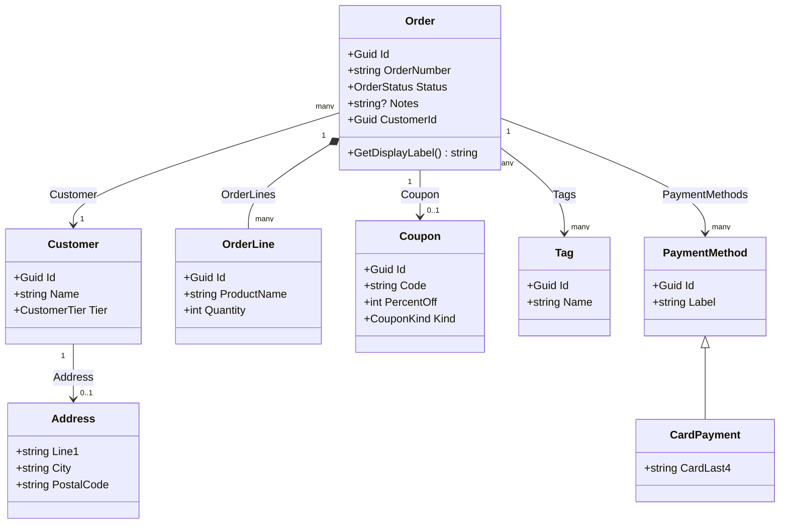
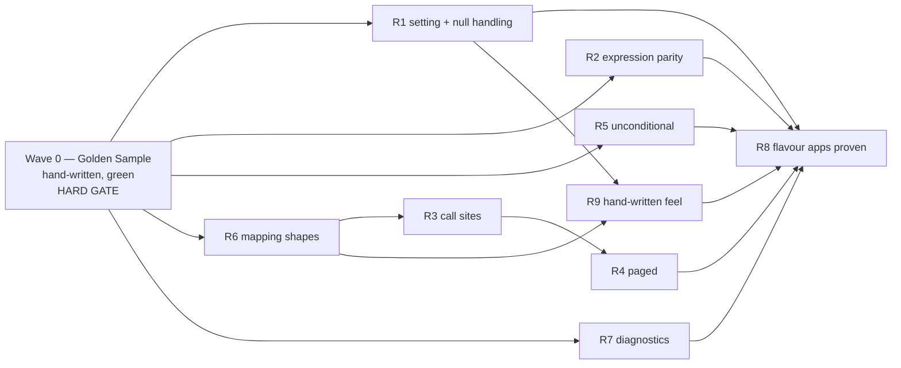

# Design — Object Mapper Hardening

## Overview

This is a **module-building** spec, not an application feature, so the design is partitioned the way module work actually proceeds: **Section A** fixes the exact C# the module must emit (the Golden Sample), and **Section B** says which metamodel element, template or factory extension produces each line of it. Section C ties them together requirement by requirement.

Three codebases change. `Intent.Application.Dtos.ObjectMapping` gains a setting and a corrected expression builder. `Intent.Application.DomainInteractions` gains a fourth mapping strategy so handlers actually invoke what the first module generates. And two new Intent-managed applications, `ObjectMapping.Strict` and `ObjectMapping.Lenient`, become the verification surface.

The single most important structural fact: today the Module Builder package for this module is **empty of elements** — the template was hand-authored straight into the `.imodspec`. So `Null Path Handling` is not a property added to an existing settings group; it is the first modelled element this module has ever had.

<Callout id="scope-counts" tone="info" title="Scope in counts">

2 modules changed · 1 new module setting · 1 new mapping strategy · 2 new applications · 6 Mapping Extension Classes per application · 21 Mapping Shapes · 9 requirements · 4 waves.

</Callout>

## Decisions confirmed with the user

<Callout id="d1" tone="decision" title="Lenient emits a null-conditional chain terminated by `?? default!`">

R1.3 and R9.8 together forbid a local variable or helper, so the fallback has to be one expression. The chosen form is the null-conditional chain already used for nullable targets, terminated with `?? default!` — for example `projectFrom.Customer.Address?.City ?? default!`. The ternary alternative was rejected because it restates the whole access path once per guarded hop, which gets unreadable at the three-plus-hop paths R1.8 requires.

**Why:** it is the shortest form that satisfies R9.1's one-line-per-field rule, it reads like code a person would write, and the trailing `!` is what keeps R1.9's "zero new nullability warnings" true when a non-nullable `string` target legitimately receives `null`.

</Callout>

<Callout id="d2" tone="decision" title="The Flavour Applications mirror `ObjectMappingTest`'s full stack">

Both new applications are built on the same module set the existing test application uses — Clean Architecture, MediatR CQRS, EF Core, Domain Interactions, Pagination, and the AspNetCore Api layer with controllers — rather than a trimmed Application-only stack.

**Why:** the module has to work in a real application, not a laboratory one. A trimmed stack would not have proven that nothing else in the pipeline breaks when the Mapping Provider changes, and R8.9's paged and cursor-paged journeys need the persistence and pagination layers to be genuinely present.

</Callout>

<Callout id="d3" tone="decision" title="Flavour equivalence is enforced by a repo script, not a test">

R8.10 and SM-4 are checked by a script that normalises the application-name prefix out of both applications' generated `Mappings` folders and reports every remaining difference. Differences that are not attributable to R1 are model drift.

**Why:** an xUnit test would have to reach across from one application's test project into the other application's output directory, coupling two solutions that are meant to be independent. A script sits outside both and is the only mechanism that catches a Mapping Shape added to one model and forgotten in the other.

</Callout>

<Callout id="d4" tone="decision" title="Call-site assertions are reflection plus behaviour, not source parsing">

R8.8 is satisfied by two assertions per handler: reflection over the handler type proves no constructor parameter is an `AutoMapper.IMapper`, and a behavioural test proves the returned DTO is correctly populated, which can only happen if the Mapping Method actually ran.

**Why:** it asserts the negative directly and the positive behaviourally, without any test depending on generated source text — which would break on a formatting change that harms nothing.

</Callout>

<Callout id="d5" tone="risk" title="Accepted: `default!` is a no-op on value-type targets">

Emitting one uniform `?? default!` means enum and numeric targets carry a null-forgiving operator that does nothing. It is legal C#, produces no warning, and keeps every Lenient entry a single recognisable shape.

**Why:** the alternative — `default!` for reference types and bare `default` for value types — means the generated file has two fallback idioms and the template needs a type-kind branch to choose between them. One idiom was judged the better trade against R9's hand-written-code bar. Flagged here because it is the one place the output is very slightly more verbose than a person would type.

</Callout>

## Module & architecture prerequisites

<Callout id="prereqs" tone="warning" title="Prerequisites — these block Wave 1">

**No new module needs to be authored**, but three installation facts gate the work:

- **`Intent.Application.DomainInteractions`** (currently `1.2.7`, in this repo as source) must be **changed, rebuilt and version-bumped** before either Flavour Application can generate a Call Site. R3 and R4 are unsatisfiable until it ships the new strategy.
- **`Intent.Application.Dtos.ObjectMapping`** (currently `1.0.0-pre.3`) must be version-bumped in the same change as its behaviour, across the `.imodspec`, the `.csproj` and the designer's Module Settings.
- **`Intent.Application.Dtos.ObjectMapping`'s `.imodspec` has no `interoperability` block.** `Intent.Application.Dtos.Mapperly` declares `detect id="Intent.Application.DomainInteractions"` so that installing the Mapping Provider pulls in the module that generates its Call Sites. This module must declare the same, otherwise R3.1 is satisfiable only by the user separately knowing to install a second module.

The two Flavour Applications install the module set listed in <FileRef path="../../../Tests/ObjectMappingTest/modules.config" label="ObjectMappingTest/modules.config" /> — that file is the authoritative list, and is the reason no module versions are enumerated here.

</Callout>

## Section A — The Golden Sample

This section is the ground truth. It is hand-written and proven green in Wave 0, **before** any module code is touched, and everything in Section B exists only to reproduce it.

### A.1 — The reference domain

One aggregate carries all 21 Mapping Shapes. Both Flavour Applications model it element-for-element identically (R8.2).

The two Nullable Hops that drive every R1 difference are `Order.Coupon` and `Customer.Address`. `Order.Customer` is deliberately required, so shape 3 proves the module does **not** guard a non-nullable hop (R1.8). `CardPayment` inheriting `PaymentMethod` carries shapes 14, 15 and 16.

<ModelChanges id="domain-changes" caption="Domain designer — created identically in both Flavour Applications" changes={[
  { element: "Order", designer: "Domain", change: "added", note: "Aggregate root; carries the parameterless operation for shape 13",
    fields: [{ label: "OrderNumber", after: "string" }, { label: "Status", after: "OrderStatus" }, { label: "Notes", after: "string?" }, { label: "GetDisplayLabel()", after: "string" }] },
  { element: "Customer", designer: "Domain", change: "added", note: "Required from Order — proves the non-guarded hop",
    fields: [{ label: "Name", after: "string" }, { label: "Tier", after: "CustomerTier" }] },
  { element: "Address", designer: "Domain", change: "added", note: "Optional from Customer — Nullable Hop #2, drives shape 17",
    fields: [{ label: "City", after: "string" }] },
  { element: "Coupon", designer: "Domain", change: "added", note: "Optional from Order — Nullable Hop #1, drives shapes 8, 18, 19",
    fields: [{ label: "PercentOff", after: "int" }, { label: "Kind", after: "CouponKind" }] },
  { element: "OrderLine", designer: "Domain", change: "added", note: "Composition — drives shapes 6, 9, 10" },
  { element: "Tag", designer: "Domain", change: "added", note: "Many-to-many — the only source for a nullable collection target, shape 20" },
  { element: "PaymentMethod", designer: "Domain", change: "added", note: "Base type — shape 16" },
  { element: "CardPayment", designer: "Domain", change: "added", note: "Derived type — shapes 14, 15" }
]} />

### A.2 — `OrderDto`, and the shape each field pins

Every field below exists to make exactly one Mapping Shape observable. This is what stops SM-C1 — no field is nullable or simplified to make generation easier.

<DataModel
  id="order-dto"
  entity="OrderDto (Services) — mapped from Order"
  caption="Each row names the R6 Mapping Shape it pins"
  fields={[
    { name: "OrderNumber", type: "string", change: "added", note: "Shape 1 — flat primitive" },
    { name: "Notes", type: "string?", change: "added", note: "Shape 2 — nullable scalar" },
    { name: "CustomerName", type: "string", change: "added", note: "Shape 3 — non-nullable navigation then property" },
    { name: "Coupon", type: "CouponDto?", change: "added", note: "Shape 4 — nullable navigation then nested DTO" },
    { name: "Customer", type: "CustomerDto", change: "added", note: "Shape 5 — non-nullable navigation then nested DTO" },
    { name: "Lines", type: "List of OrderLineDto", change: "added", note: "Shape 6 — collection of nested DTOs" },
    { name: "CustomerId", type: "Guid", change: "added", note: "Shape 7 — local foreign key, many-to-one" },
    { name: "CouponId", type: "Guid", change: "added", note: "Shape 8 — PK via to-one nav. **Nullable Hop into non-nullable — R1 applies**" },
    { name: "LineIds", type: "List of Guid", change: "added", note: "Shape 9 — PKs via to-many nav" },
    { name: "ProductNames", type: "List of string", change: "added", note: "Shape 10 — collection nav then trailing property" },
    { name: "Status", type: "OrderStatus", change: "added", note: "Shape 11 — enum, same type both sides" },
    { name: "StatusView", type: "OrderStatusDto", change: "added", note: "Shape 12 — enum, different type each side" },
    { name: "DisplayLabel", type: "string", change: "added", note: "Shape 13 — parameterless operation in the path" },
    { name: "Payments", type: "List of PaymentMethodDto", change: "added", note: "Shape 16 — base-typed collection of derived entities" },
    { name: "CustomerCity", type: "string", change: "added", note: "Shape 17 — deep chain. **Nullable Hop into non-nullable — R1 applies**" },
    { name: "CouponPercentOff", type: "int", change: "added", note: "Shape 18 — **Nullable Hop into non-nullable value type — R1 applies**" },
    { name: "CouponKind", type: "CouponKind", change: "added", note: "Shape 19 — **Nullable Hop into non-nullable enum — R1 applies**" },
    { name: "TagNames", type: "List of string, nullable", change: "added", note: "Shape 20 — nullable collection target, yields null not empty" },
    { name: "SrcFormLabel", type: "string", change: "added", note: "Shape 21a — Expression Mapping authored `src.`" },
    { name: "ProjectFromFormLabel", type: "string", change: "added", note: "Shape 21b — same expression authored `projectFrom.` — must be byte-identical to 21a" }
  ]}
/>

Shapes 14 and 15 live on `CardPaymentDto`, mapped from the derived `CardPayment`: an inherited `Label` reached through the generalization hop (14) alongside `CardLast4` declared on the derived type (15).

Four fields — `CouponId`, `CustomerCity`, `CouponPercentOff`, `CouponKind` — are the **only** places the two Flavour Applications' output may differ. That is R8.10 stated as a concrete, checkable list.

### A.3 — The Golden Sample under `Strict`

<AnnotatedCode
  id="golden-strict"
  filename="ObjectMapping.Strict.Application/Mappings/OrderDtoMappingExtensions.cs"
  language="csharp"
  code={`public static class OrderDtoMappingExtensions
{
    public static OrderDto MapToOrderDto(this Order projectFrom)
    {
        return new OrderDto
        {
            OrderNumber = projectFrom.OrderNumber,
            Notes = projectFrom.Notes,
            CustomerName = projectFrom.Customer.Name,
            Coupon = projectFrom.Coupon?.MapToCouponDto(),
            Customer = projectFrom.Customer.MapToCustomerDto(),
            Lines = projectFrom.OrderLines?.Select(x => x.MapToOrderLineDto()).ToList() ?? [],
            CustomerId = projectFrom.CustomerId,
            CouponId = projectFrom.Coupon!.Id,
            LineIds = projectFrom.OrderLines?.Select(x => x.Id).ToList() ?? [],
            ProductNames = projectFrom.OrderLines?.Select(x => x.ProductName).ToList() ?? [],
            Status = projectFrom.Status,
            StatusView = (OrderStatusDto)projectFrom.Status,
            DisplayLabel = projectFrom.GetDisplayLabel(),
            Payments = projectFrom.PaymentMethods?.Select(x => x.MapToPaymentMethodDto()).ToList() ?? [],
            CustomerCity = projectFrom.Customer.Address!.City,
            CouponPercentOff = projectFrom.Coupon!.PercentOff,
            CouponKind = projectFrom.Coupon!.Kind,
            TagNames = projectFrom.Tags?.Select(x => x.Name).ToList(),
            SrcFormLabel = projectFrom.OrderNumber + " / " + projectFrom.Status,
            ProjectFromFormLabel = projectFrom.OrderNumber + " / " + projectFrom.Status,
        };
    }

    public static List<OrderDto> MapToOrderDtoList(this IEnumerable<Order> projectFrom) =>
        projectFrom.Select(x => x.MapToOrderDto()).ToList();
}`}
  annotations={[
    { lines: "9", label: "Non-nullable collection target", note: "R6.3 — the trailing `?? []` is what stops a null source collection throwing." },
    { lines: "11", label: "Strict, per-hop", note: "R1.2 — a null-forgiving `!` on the Nullable Hop only. The following `.Id` is a plain access." },
    { lines: "19-21", label: "Nullable collection target", note: "R6.8 — shape 20 has NO `?? []`; a null source must yield null, which is the distinction today's code misses." },
    { lines: "22-23", label: "Byte-identical", note: "R2.5 — the two authored Prefix Forms must normalise to exactly the same text." },
    { lines: "27-28", label: "Expression-bodied", note: "R9.2 — the List Mapping Method is a single expression member, never a block." }
  ]}
/>

The whole method body is one object initializer with one entry per mapped field in declared order, and the class is a plain `static class` with no base type — that is R9.1, R9.3 and R9.4 made concrete rather than asserted.

### A.4 — The same file under `Lenient`

Only the four R1-governed entries move. Everything else is byte-identical, and any other difference is model drift.

<Diff
  id="strict-vs-lenient"
  filename="Mappings/OrderDtoMappingExtensions.cs — the only permitted divergence"
  before={`CouponId = projectFrom.Coupon!.Id,
CustomerCity = projectFrom.Customer.Address!.City,
CouponPercentOff = projectFrom.Coupon!.PercentOff,
CouponKind = projectFrom.Coupon!.Kind,`}
  after={`CouponId = projectFrom.Coupon?.Id ?? default!,
CustomerCity = projectFrom.Customer.Address?.City ?? default!,
CouponPercentOff = projectFrom.Coupon?.PercentOff ?? default!,
CouponKind = projectFrom.Coupon?.Kind ?? default!,`}
  annotations={[
    { side: "before", lines: "2", label: "Strict guards the hop, not the field", note: "`Customer` is required so it stays a plain `.`; only `Address` takes the `!`." },
    { side: "after", lines: "1-4", label: "One expression, no locals", note: "R9.8 — the guard is inline in the initializer entry, which is why the ternary form was rejected." }
  ]}
/>

### A.5 — The Golden Sample Call Sites

These are the statements no template in the repository generates today, which is the defect R3 exists to close.

<AnnotatedCode
  id="golden-callsites"
  filename="ObjectMapping.Strict.Application/Orders/GetOrderById/GetOrderByIdQueryHandler.cs"
  language="csharp"
  code={`// single mapped DTO — R3.2
return order.MapToOrderDto();

// collection of a mapped DTO — R3.3
return orders.MapToOrderDtoList();

// nullable single mapped DTO — R3.4
return order?.MapToOrderDto();

// paged — R4.1
return orders.MapToPagedResult(x => x.MapToOrderDto());

// cursor-paged — R4.3
return orders.MapToCursorPagedResult(x => x.MapToOrderDto());`}
  annotations={[
    { lines: "2", label: "No arguments, no field", note: "R3.5 — the handler must declare no `IMapper` parameter and inject no mapper field. This is what the reflection assertion in R8.8 proves." },
    { lines: "11-14", label: "Metadata untouched", note: "R4.2 and R4.3 — the projection is the only thing the strategy contributes; page and cursor metadata come from the pagination module unchanged." }
  ]}
/>

## Section B — Intent realization & metamodel

### B.1 — `[model]` The `Null Path Handling` setting

The module's Module Builder package gains its first elements: a **Settings Group** named `Object Mapping` containing one **select** setting.

<Table
  id="setting-shape"
  caption="R1.1 — the modelled setting, and the `.imodspec` it produces"
  columns={["Aspect", "Value"]}
  rows={[
    ["Group", "`Object Mapping` — a new group, not a `groupExtension` onto an existing one"],
    ["Setting title", "`Null Path Handling`"],
    ["Type", "`select`"],
    ["Options", "`strict` (description `Strict`), `lenient` (description `Lenient`)"],
    ["`defaultValue`", "`strict` — R1.1's \"absent means Strict\""],
    ["`isRequired`", "`false`"],
    ["Hint", "Governs what a mapping path that crosses a nullable hop into a non-nullable DTO field emits."],
    ["Generated accessor", "A settings class into the module's currently-empty `Settings/` folder, read as `ExecutionContext.Settings`"]
  ]}
/>

The mechanism is a **modelled element type the Module Builder schema defines**, and the Software Factory writes the `<moduleSettings>` block and the accessor class from it. The shape mirrors the `<setting type="select">` blocks already in <FileRef path="../../../Modules/Intent.Modules.EntityFrameworkCore/Intent.EntityFrameworkCore.imodspec" label="Intent.EntityFrameworkCore.imodspec" />, which is the working precedent for a select setting with options and a default.

### B.2 — `[code]` The expression builder

All of R1, R2, R6, R7 and R9 land in one file, <FileRef path="../../../Modules/Intent.Modules.Application.Dtos.ObjectMapping/Templates/MappingHelper.cs" label="MappingHelper.cs" />, plus a small change to its template.

<FileTree
  id="module-files"
  title="Object Mapper module"
  entries={[
    { path: "../../../Modules/Intent.Modules.Application.Dtos.ObjectMapping/Templates/MappingHelper.cs", change: "modified", note: "Per-hop null handling, prefix normalisation, collection nullability, multiplicity errors" },
    { path: "../../../Modules/Intent.Modules.Application.Dtos.ObjectMapping/Templates/MappingExtensions/MappingExtensionsTemplatePartial.cs", change: "modified", note: "Drop the AutoMapper stand-down guard; fix namespace derivation; ElementException on unresolved source" },
    { path: "../../../Modules/Intent.Modules.Application.Dtos.ObjectMapping/Intent.Application.Dtos.ObjectMapping.imodspec", change: "modified", note: "Version bump, moduleSettings, and the missing interoperability detect" },
    { path: "../../../Modules/Intent.Modules.Application.Dtos.ObjectMapping/docs/README.md", change: "modified", note: "R8.12 — setting, prefix forms, call sites, IQueryable trade-off" },
    { path: "../../../Modules/Intent.Modules.Application.Dtos.ObjectMapping/release-notes.md", change: "modified", note: "R8.12 — same change as the behaviour" }
  ]}
/>

**Per-hop null handling (R1).** `BuildPath` currently decides the separator from the previous hop's nullability alone, emitting `?.` unconditionally. It must instead take the target field's nullability and the setting, and choose per hop:

<Table
  id="separator-matrix"
  density="compact"
  caption="R1.2–R1.4, R1.8 — separator chosen per hop"
  columns={["Hop is nullable", "Target field nullable", "Setting", "Emitted"]}
  rows={[
    ["No", "any", "any", "`.` — never guarded (R1.8)"],
    ["Yes", "Yes", "either", "`?.` — setting has no effect (R1.4)"],
    ["Yes", "No", "`Strict`", "`!.` (R1.2)"],
    ["Yes", "No", "`Lenient`", "`?.`, and the whole entry gains a trailing `?? default!` (R1.3)"]
  ]}
/>

**Prefix normalisation (R2).** The current implementation only PascalCases; it assumes the author wrote `projectFrom.`. The replacement is the AutoMapper algorithm at <FileRef path="../../../Modules/Intent.Modules.Application.Dtos.AutoMapper/Templates/MappingHelper.cs" line={121} label="AutoMapper MappingHelper.cs:121" /> with one extra recognised prefix:

<Diff
  id="prefix-algorithm"
  filename="Templates/MappingHelper.cs — BuildEntryExpression, expression branch"
  before={`if (IsExpression(pathTargets))
{
    return PascalCasePropertyAccesses(string.Join(".", pathTargets.Select(p => p.Name)));
}`}
  after={`if (IsExpression(pathTargets))
{
    var expression = string.Join(".", pathTargets.Select(p => p.Name));
    var trimmed = expression.TrimStart();

    if (trimmed.StartsWith("src."))
    {
        expression = trimmed.Substring("src.".Length);
        return "projectFrom." + PascalCasePropertyAccesses(expression);
    }

    var prefix = trimmed.StartsWith("projectFrom.") ? string.Empty : "projectFrom.";
    return prefix + PascalCasePropertyAccesses(expression);
}`}
  annotations={[
    { side: "after", lines: "6-10", label: "R2.2 — rewrite, don't prepend", note: "`src.` is stripped and replaced, so `src.Amount` and `projectFrom.Amount` converge on identical text. That convergence IS R2.5." },
    { side: "after", lines: "12-13", label: "R2.4 — parity, not correctness", note: "Anything else gets the source parameter prepended to the expression AS A WHOLE, exactly as AutoMapper does — including the cases AutoMapper gets wrong." }
  ]}
/>

Note that only the **leading** `src.` is rewritten, but `PascalCasePropertyAccesses` still runs over the remainder — an expression like `src.Amount > 0 ? src.Amount : 0` has a second `src.` mid-expression. Prefix rewriting must therefore replace every occurrence of the recognised prefix token, not just the leading one, or R2.5's byte-identical guarantee fails on any multi-reference expression. This is the one place the algorithm must deliberately go beyond AutoMapper's literal implementation, because AutoMapper never had to rename anything.

**Collection nullability (R6.2, R6.3, R6.8).** Every collection projection today ends `?? []`. It must end `?? []` only when the DTO field is non-nullable, and end bare when it is nullable. Three call sites emit collections: the nested-DTO branch, `BuildMultiplePkExpression`, and the collection-with-trailing-property branch.

**Diagnostics (R7).** `GetEntityTypeName` currently throws a bare `System.Exception`; R7.1 requires an `ElementException` scoped to `Model.InternalElement` naming the DTO and its unresolved source. The existing `InvalidOperationException` on an unhandled multiplicity pair is already correct for R7.2 — that is a module bug, not a user error. Per the repository's exception guidelines, both messages stay plain prose with no Markdown.

**Namespace derivation (R7.3).** `this.GetNamespace().Replace(".Mappings", "")` corrupts any application with an unrelated `Mappings` path segment. It is replaced with derivation from the output structure that does no substring surgery.

**Unconditional generation (R5).** The `CanRunTemplate` clause excluding the module when AutoMapper is installed is deleted outright. `Model.Mapping != null` stays — that is R6.6, not a stand-down.

### B.3 — `[code]` The Domain Interactions call site

R3 and R4 are realized by a fourth implementation of the existing `IMappingStrategy` extension point — the same mechanism `AutoMapperMappingStrategy` and `MapperlyMappingStrategy` already use. No new abstraction is introduced.

<AnnotatedCode
  id="strategy"
  filename="Intent.Modules.Application.DomainInteractions/Strategies/ObjectMappingMappingStrategy.cs"
  language="csharp"
  code={`internal class ObjectMappingMappingStrategy : IMappingStrategy
{
    public bool IsMatch(ICSharpClassMethodDeclaration method) =>
        method.File.Template.ExecutionContext.InstalledModules
            .Any(x => x.ModuleId == "Intent.Application.Dtos.ObjectMapping");

    public void ImplementMappingStatement(ICSharpClassMethodDeclaration method, List<CSharpStatement> statements,
        EntityDetails entity, ICSharpTemplate template, ITypeReference returnType, string? returnDto)
    {
        if (!template.TryGetTypeName("Intent.Application.Dtos.EntityDtoMappingExtensions", returnType.Element, out _))
        {
            return;
        }

        var nullable = returnType.IsNullable ? "?" : "";
        var list = returnType.IsCollection ? "List" : "";
        statements.Add($"return {entity.VariableName}{nullable}.MapTo{returnDto}{list}();");
    }

    public void ImplementPagedMappingStatement(ICSharpClassMethodDeclaration method, List<CSharpStatement> statements,
        EntityDetails entity, ICSharpTemplate template, ITypeReference returnType, string? returnDto, string? mappingMethod)
    {
        statements.Add($"return {entity.VariableName}.{mappingMethod}(x => x.MapTo{returnDto}());");
    }

    public bool HasProjectTo() => false;
}`}
  annotations={[
    { lines: "10-13", label: "R3.6 and R3.7 together", note: "The `TryGetTypeName` call both registers the using directive for the extension class AND is the guard: no Mapping Extension Class means no Call Site referencing a method that does not exist. AutoMapper's strategy calls this for the using but ignores the result — here the result is load-bearing." },
    { lines: "16-18", label: "R3.2, R3.3, R3.4", note: "One statement covers all three shapes: `?` when the return is nullable, `List` when it is a collection, and never an argument." },
    { lines: "26", label: "R3.8", note: "Reporting false is what makes the existing ElementException in QueryActionContext fire with a clear message if the application is set to ProjectTo — rather than generating a query that cannot translate." }
  ]}
/>

Registration is one line added beside the existing two in <FileRef path="../../../Modules/Intent.Modules.Application.DomainInteractions/FactoryExtensions/DomainInteractionRegistration.cs" line={34} label="DomainInteractionRegistration.cs:34" />. Because `IsMatch` keys off the installed module and the three strategies are mutually exclusive in a well-formed application, no priority is needed; the accepted risk in R5's callout is exactly the case where two match, and the existing provider already logs it.

### B.4 — `[model]` + `[code]` The Flavour Applications

Each application is created from the same architecture as `ObjectMappingTest`, then modelled: Domain first, Services second (Domain must exist before a DTO can map from it). The `[code]` in these applications is only the xUnit suites — every handler, DTO, entity, DbContext and controller is Software Factory output and is never hand-written.

<Table
  id="flavour-apps"
  caption="R8.1–R8.3 — the two applications"
  columns={["Application", "Setting", "Test project", "Folder"]}
  rows={[
    ["`ObjectMapping.Strict`", "`Null Path Handling` = `Strict`", "`ObjectMapping.Strict.Application.Tests`", "Folder name matches the project name exactly — no relative-location override (R8.3)"],
    ["`ObjectMapping.Lenient`", "`Null Path Handling` = `Lenient`", "`ObjectMapping.Lenient.Application.Tests`", "Same"]
  ]}
/>

Neither application is copied from `ObjectMappingTest`. R8.11 forbids inheriting its generated files, deviations log, managed-file records or designer metadata, so both are created fresh and modelled from the Section A specification. `ObjectMappingTest` is read for reference only and is removed by the developer afterwards.

### B.5 — `[code]` The equivalence script

A script normalises the application-name prefix out of both `Mappings` folders and diffs them, exiting non-zero on any difference outside the four R1-governed entries listed in A.2. This is mechanism (c) — logic with no modeled home — and lives in the repository, not in either application's output, so no code-management directive is needed.

## Section C — Realization plan

Every requirement names its mechanism. `[model]` is designer work whose code the Software Factory then generates automatically; `[code]` is the only hand-written material.

<Table
  id="realization"
  caption="Per-requirement realization plan — the projection sdd-tasks builds its task list from"
  columns={["Req", "[model]", "[code]", "Mechanism", "Depends on"]}
  rows={[
    ["**R1** Null-safe paths", "Settings Group `Object Mapping` + select setting `Null Path Handling` in the module's Module Builder package", "`MappingHelper.BuildPath` per-hop separator + Lenient `?? default!` suffix; setting read from `ExecutionContext.Settings`", "Modelled element type (setting) + code", "—"],
    ["**R2** Expression parity", "None", "`BuildEntryExpression` expression branch — prefix normalisation for `src.` and `projectFrom.`, all occurrences", "Code", "—"],
    ["**R3** Call sites", "None", "`ObjectMappingMappingStrategy` + one registration line in `DomainInteractionRegistration`", "Existing `IMappingStrategy` extension point", "R6 (Mapping Method must exist to be called)"],
    ["**R4** Paged results", "Paged and cursor-paged queries modelled via Domain Interactions in both Flavour Applications", "`ImplementPagedMappingStatement` on the same strategy", "Existing extension point + modelled queries", "R3"],
    ["**R5** Unconditional generation", "None", "Delete the `CanRunTemplate` AutoMapper clause", "Code", "—"],
    ["**R6** Every mapping shape", "All 21 shapes modelled in both Flavour Applications' Domain + Services packages", "Collection nullability branches (R6.3 vs R6.8) in the three collection call sites", "Modelled elements + code", "—"],
    ["**R7** Diagnostics", "None", "`ElementException` on unresolved source; namespace derivation without substring replace", "Code", "—"],
    ["**R8** Two flavour applications", "Both applications created, module set installed, Domain then Services modelled identically, setting pinned per flavour", "Two xUnit suites; the equivalence script; README + release notes", "Modelled elements + code", "R1–R7 (there is nothing to assert until the module generates it)"],
    ["**R9** Hand-written feel", "None", "Verified by inspection of the Wave 0 baseline and by R8.6's zero-diff regeneration; no separate implementation", "Constraint on B.2, not its own change", "R1, R6"]
  ]}
/>

<Callout id="r9-note" tone="info" title="R9 is a constraint, not a task">

R9 adds no code of its own. It bounds how R1, R2 and R6 may be implemented — one object initializer, one entry per field, no locals, no helpers, expression-bodied list method, fully managed file. It is verified rather than built, which is why it has no `[model]` column entry and why its acceptance is folded into the Wave 3 gate.

</Callout>

### Cross-requirement dependencies and wave order

R1, R2, R5, R6 and R7 are mutually independent — they all touch the expression builder but none needs another's output. R3 genuinely depends on R6, because a Call Site cannot invoke a Mapping Method that is not being generated correctly, and R4 depends on R3 for the strategy it extends. R8 depends on everything, by construction.

**Modelling order within Wave 0 and Wave 1:** Domain before Services in both Flavour Applications, since a DTO's `[map from]` cannot be drawn until the entity exists. The module's own settings group has no ordering constraint against either.

### Wave assignment

<Table
  id="waves"
  caption="The four waves, and what gates each"
  columns={["Wave", "Contents", "Gate"]}
  rows={[
    ["**Wave 0** — Reference spike", "Create both applications with the `ObjectMappingTest` module set **without** `Intent.Application.Dtos.ObjectMapping`. Model Domain then Services in both. Hand-write the 6 Mapping Extension Classes and the handler Call Sites for Section A. Author both xUnit suites.", "`dotnet build` exits 0 and both suites pass. **Non-negotiable — Wave 1 does not start until this is green.**"],
    ["**Wave 1** — Metamodel", "Settings Group + `Null Path Handling` select setting in the module's Module Builder package. Version bumps. `interoperability` detect for Domain Interactions.", "Software Factory persists; the setting appears in both applications' settings UI."],
    ["**Wave 2** — Templates & builders", "`MappingHelper` rewrite (R1, R2, R6, R7), `CanRunTemplate` deletion (R5), `ObjectMappingMappingStrategy` + registration (R3, R4). Both modules rebuilt and reinstalled.", "Both modules compile."],
    ["**Wave 3** — Dogfood & SF parity", "Install the module into both applications, **delete the Wave 0 hand-written mapping files**, run the Software Factory, and diff against the Wave 0 baseline. Run the equivalence script. Update README and release notes.", "Zero unintended diffs vs Wave 0; second consecutive SF run proposes zero changes (R8.6); both suites pass; equivalence script exits 0."]
  ]}
/>

### Code placement

All `[code]` in the two modules is done **after** Wave 1's model work, because the Lenient branch reads the generated settings accessor and that accessor does not exist until the Software Factory has run over the new settings group.

The Flavour Applications' `[code]` splits across two waves deliberately. The xUnit suites are authored in **Wave 0**, against the hand-written Golden Sample — that is what makes them an independent oracle rather than a description of whatever the module happened to emit. They are not rewritten in Wave 3; they simply keep passing against generated code instead of hand-written code. If a suite has to change in Wave 3, that is a signal the module is not reproducing the Golden Sample, and the module is what gets fixed.

The Wave 0 hand-written mapping files are the one piece of code deliberately thrown away. They are copied into the spec folder as the comparison baseline before Wave 3 deletes them from the applications, so the Wave 3 diff has something to run against.

<Callout id="managed-mode" tone="risk" title="The merge-managed trap R8.7 exists to catch">

`MappingExtensionsTemplate` is declared `[IntentManaged(Mode.Fully, Body = Mode.Merge)]`. R9.6 requires the Mapping Extension Class to be **fully** managed with no merge-managed region, so a hand edit is reclaimed. Wave 2 must confirm the emitted file is fully managed — and Wave 3's delete-then-regenerate step is what proves it, because a merge-managed body would survive as a preserved edit and quietly pass a test it should fail. This is the exact failure mode the `ObjectMappingTest` handler described in R8's callout appears to exhibit.

</Callout>

## Assumptions

<Checklist
  id="design-assumptions"
  items={[
    { id: "a1", label: "The Template element stays unmodelled", note: "This module's Module Builder package has no Template element — the template is declared directly in the `.imodspec`. Only the Settings Group is added; retrofitting the template into the designer is not required by any requirement and is out of scope." },
    { id: "a2", label: "`default!` is emitted uniformly", note: "Including on value-type and enum targets where the null-forgiving operator is a legal no-op. Confirmed with the user; see the risk callout above." },
    { id: "a3", label: "Setting values are stored lowercase", note: "`strict` / `lenient` as option values with `Strict` / `Lenient` as descriptions, matching the `select` setting convention in Intent.EntityFrameworkCore." },
    { id: "a4", label: "Prefix rewriting replaces every occurrence", note: "Not just the leading one, so a multi-reference expression satisfies R2.5. This goes marginally beyond AutoMapper's literal implementation, which never renamed its own prefix." },
    { id: "a5", label: "Both module versions are bumped in the same change", note: "Object Mapper and Domain Interactions, across `.imodspec`, `.csproj` and the designer's Module Settings, with release notes under the current version." },
    { id: "a6", label: "`ObjectMappingTest` is not touched", note: "Read for reference, never modified, and removed by the developer after this spec completes. No task deletes it." },
    { id: "a7", label: "The Wave 0 baseline is retained until Wave 3 passes", note: "Copied into the spec folder before the hand-written files are deleted, so the parity diff has a comparison target." }
  ]}
/>
