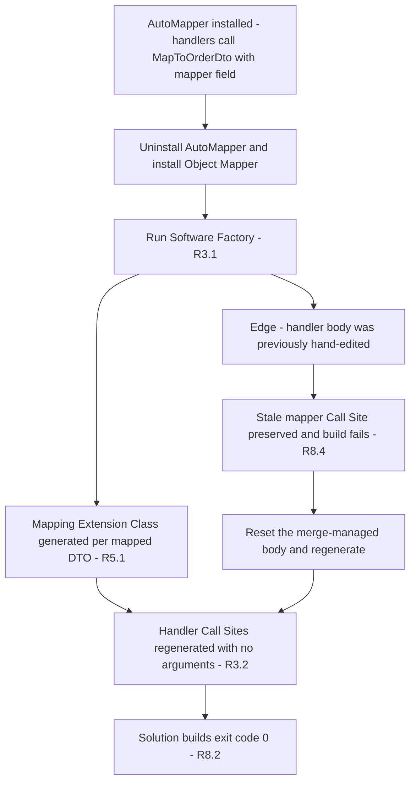
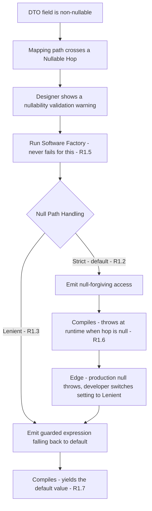
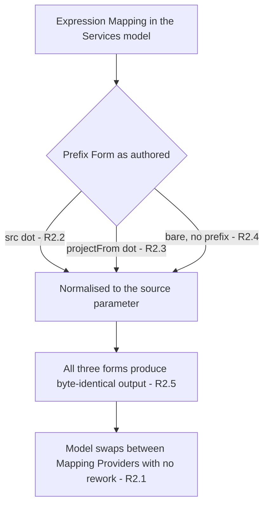
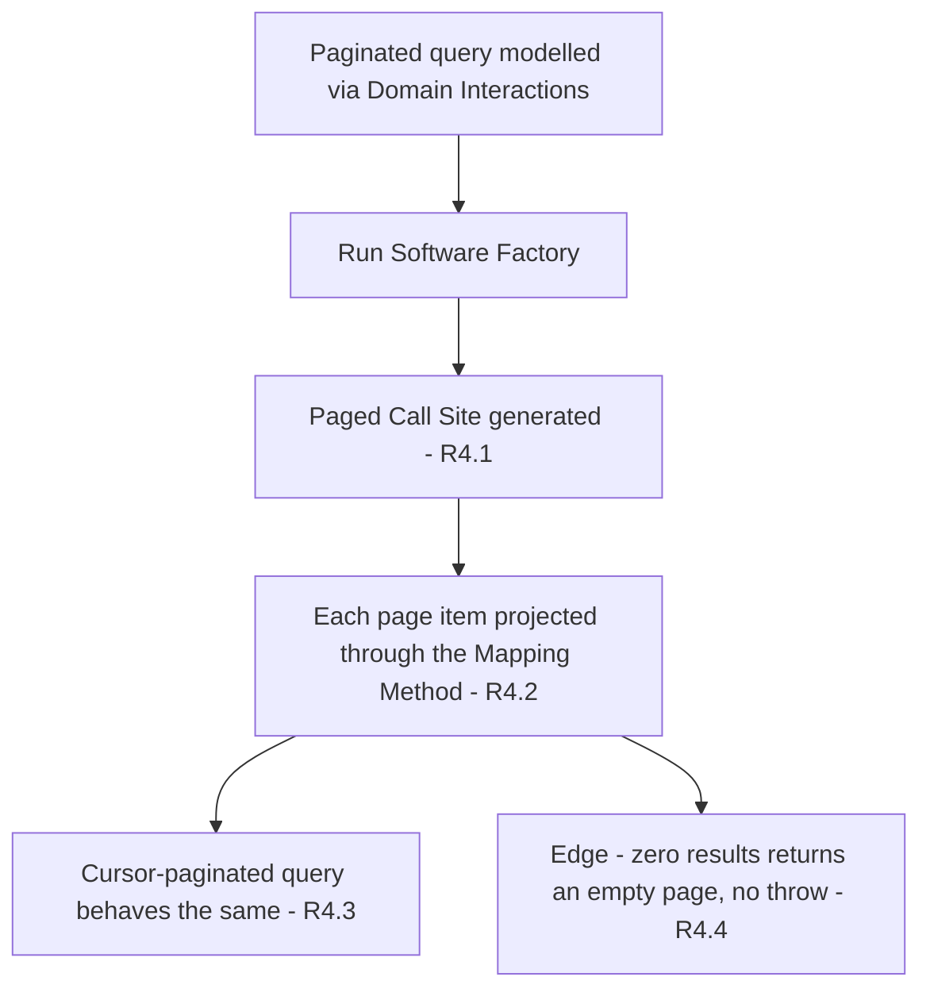
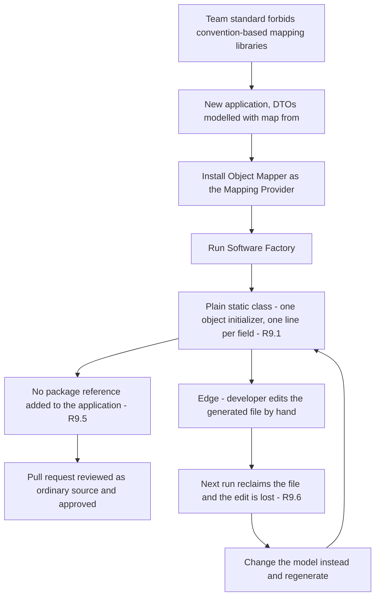

# Requirements Document

## Introduction

`Intent.Application.Dtos.ObjectMapping` generates explicit C# extension methods that map a Domain Entity to a mapped DTO, as a reflection-free alternative to AutoMapper and Mapperly. The module exists and generates files, but two classes of defect stop it being usable: mapping paths that cross a nullable hop into a non-nullable target field emit C# that does not compile, and **nothing in the Intent ecosystem generates a Call Site that invokes the generated Mapping Methods** — the CRUD modules hardcode AutoMapper, and the Domain Interactions module has no strategy registered for this Mapping Provider.

This feature hardens the module to production quality: every enumerated Mapping Shape generates compiling, correct C#; Domain Interactions generates working Call Sites including paged results; and free-form Expression Mappings become portable across Mapping Providers. The whole surface is proven by two new Flavour Applications — `ObjectMapping.Strict` and `ObjectMapping.Lenient` — each pinning one value of the null-handling setting, each with its own xUnit suite, and each regenerated from a deleted state rather than merge-preserved. The existing `ObjectMappingTest` application is reference material only and is retired by the developer separately.

## Vision

Today a developer who installs this module gets a folder of plausible-looking mapping classes that no handler calls. They discover this only when they read the generated handler, or when a nullable navigation makes the Application project fail to compile. The module reads as finished and behaves as a prototype.

Afterwards, installing the module is the whole job. Handlers come out calling the generated Mapping Methods with no arguments, paged queries project correctly, and a model authored against AutoMapper keeps working when the Mapping Provider is swapped. The developer gets mapping code they can step through in a debugger and refactor with confidence, and gives up nothing except the ability to push projection into the database — which is stated up front rather than discovered.

There is a second audience this serves, and it is not the disillusioned AutoMapper user. Plenty of teams simply will not have a convention-based mapping library in their codebase — they want every assignment visible in the file, reviewable in a pull request, and greppable when a field turns up wrong in production. Those teams write mappings by hand today and pay for it in tedium every time a DTO gains a field. This module's job for them is not to replace a library; it is to remove the typing while leaving them exactly the code they would have written. That is why the generated output has to read like a person wrote it, and why it must stay free of helper types, runtime packages and indirection.

## Target Users & Jobs To Be Done

- **Application developer using Intent Architect** — wants DTO mapping that they can read, breakpoint and refactor, without an AutoMapper dependency or its runtime configuration failures. Hires this module to be a drop-in swap for the Mapping Provider their architecture already uses.
- **Developer or team that rejects auto-mapping libraries on principle** — will not accept convention-based, reflection-driven mapping in their codebase at all, whether or not it has ever failed them. They want the mapping written out explicitly, and they want Intent to do the writing rather than typing it by hand for every DTO. Hires this module to be the tedium-remover for code they would otherwise have written themselves, line for line.
- **Developer migrating an existing application off AutoMapper** — has a Services model full of existing mappings, including free-form Expression Mappings, and needs them to keep producing the same DTO values after the swap. Cannot afford to re-author the model.
- **Intent Architect module maintainer** — owns this module and the Domain Interactions module. Needs both null-handling behaviours pinned by their own Flavour Application and xUnit suite, so a future change to either module cannot silently break generated mappings for one Flavour while the other stays green.

## Key User Journeys

- **UJ-1. Priya swaps an existing application from AutoMapper to the Object Mapper.**
  - **Persona + context:** Priya maintains a Clean Architecture Intent application with roughly 40 mapped DTOs. AutoMapper's runtime configuration validation has bitten her twice in production and she wants the mapping made explicit.
  - **Entry state:** Application builds green. `Intent.Application.Dtos.AutoMapper` installed. Handlers take `IMapper` in their constructors and call `MapToOrderDto(_mapper)`.
  - **Path:** She uninstalls the AutoMapper module and installs `Intent.Application.Dtos.ObjectMapping` → runs the Software Factory → reviews the staged diff → applies it.
  - **Climax:** The staged diff shows one Mapping Extension Class per mapped DTO **and** rewritten handler bodies whose Call Sites read `return order.MapToOrderDto();` with no `IMapper` parameter and no injected field. She knows it worked because the diff changed the handlers, not just added files.
  - **Resolution:** Solution builds with exit code 0, no AutoMapper package reference remains, and every query returns the same DTO values as before.
  - **Edge case:** One handler body was hand-edited previously and is merge-managed, so the Software Factory preserves the stale `_mapper` Call Site and the project fails to compile. She resets that body and regenerates.

- **UJ-2. Marcus maps a field through a navigation that can be absent.**
  - **Persona + context:** Marcus is modelling a flattened read DTO for an order screen. He maps `CustomerCity` from the order's customer, then that customer's address — and the address is optional.
  - **Entry state:** Services designer open, DTO field added, mapping path drawn through the optional navigation. The designer already shows a validation warning about the nullability mismatch.
  - **Path:** He leaves the DTO field non-nullable → runs the Software Factory → reads the generated expression → decides whether he wants a null there to blow up or to come through as a default.
  - **Climax:** The Software Factory completes without error and the generated expression reflects the application's Null Path Handling setting — fail-fast by default. He knows it worked because generation never blocked him and the emitted expression is unambiguous about which behaviour he gets.
  - **Resolution:** The Application project compiles. He can flip one application-level setting to change the behaviour for every mapping at once.
  - **Edge case:** A customer genuinely has no address in production. Under the default setting the request throws; he switches the setting to Lenient and the field comes through as its default value.

- **UJ-3. Priya's existing free-form expression mappings survive the swap.**
  - **Persona + context:** Same migration as UJ-1. Several of Priya's DTO fields use free-form Expression Mappings authored years ago against AutoMapper, in the `src.` Prefix Form.
  - **Entry state:** Those mappings sit unchanged in the Services designer.
  - **Path:** She swaps the Mapping Provider → regenerates → diffs the generated expressions against what AutoMapper produced.
  - **Climax:** Every Expression Mapping generates against this module's own source parameter regardless of which Prefix Form it was authored in. She knows it worked because she changed zero mappings in the designer.
  - **Resolution:** No designer rework, and the model can be swapped back to AutoMapper without touching it again.
  - **Edge case:** One expression was authored bare, with no prefix at all. It still resolves against the source parameter rather than generating an unresolved identifier.

- **UJ-4. Marcus models a paged query and gets a working projection.**
  - **Persona + context:** Marcus needs a paged order list for an admin grid.
  - **Entry state:** A paginated query modelled with Domain Interactions, returning a paged result of a mapped DTO.
  - **Path:** He runs the Software Factory → opens the generated handler.
  - **Climax:** The handler's Call Site projects each page item through the generated Mapping Method rather than returning an empty or unmapped result.
  - **Resolution:** The endpoint returns a correctly populated page. Cursor-paginated queries behave the same way.
  - **Edge case:** The page is empty. The Call Site returns an empty page rather than throwing.

- **UJ-5. Nadia's team bans mapping libraries, and adopts the Object Mapper anyway.**
  - **Persona + context:** Nadia is tech lead on a team whose code review standard forbids convention-based mapping libraries outright. Every mapping in their codebase today is typed by hand and reviewed line by line, and adding a field to a DTO means editing three files.
  - **Entry state:** A new Intent application. No Mapping Provider chosen yet. DTOs modelled with `[map from]` mappings to Domain Entities.
  - **Path:** She installs the Object Mapper as the Mapping Provider → runs the Software Factory → opens the generated Mapping Extension Class to see what her reviewers will see → raises the pull request.
  - **Climax:** The generated file is a plain static class: one object initializer, one line per field, nothing else. No base class, no helper type, no package reference added to the project. Her reviewer reads it as ordinary source and approves it without a single comment about generated code. She knows it worked because the review had nothing to argue about.
  - **Resolution:** The team keeps its standard and loses the tedium — adding a DTO field is now a model change rather than a typing task across three files.
  - **Edge case:** A developer tweaks a generated mapping directly in the file. The next Software Factory run reclaims it and the tweak is gone; the correct fix is to change the model.

## Glossary

- **Mapping Provider** — a module that satisfies an application's DTO-mapping need. Exactly one is active per application. AutoMapper, Mapperly and this Object Mapper module are the three that exist.
- **Domain Entity** — a class in an application's Domain designer, e.g. an `Order`. The Flavour Applications that will host these do not exist yet, so element names here are stated as plain text rather than live model references.
- **DTO** — a data contract in an application's Services designer. A **mapped DTO** is one carrying a `[map from]` mapping to a Domain Entity. One mapped DTO produces one Mapping Extension Class.
- **Mapping Extension Class** — the generated static class for one mapped DTO, containing exactly one Mapping Method and one List Mapping Method.
- **Mapping Method** — the generated extension method taking one Domain Entity instance and returning one DTO instance.
- **List Mapping Method** — the generated extension method taking a sequence of Domain Entities and returning a list of DTOs.
- **Mapping Path** — the ordered sequence of hops from the Domain Entity to the value a single DTO field takes. One or more hops.
- **Hop** — one step in a Mapping Path: a property, a navigation, an association end, or a parameterless operation.
- **Nullable Hop** — a Hop whose own type is nullable, so it can be absent at runtime.
- **Non-Nullable Target Field** — a DTO field whose declared type is not nullable.
- **Null Path Handling** — the application-level configuration option governing what the generated code does when a Mapping Path crosses a Nullable Hop on the way to a Non-Nullable Target Field. Two values: **Strict** (default) and **Lenient**.
- **Mapping Shape** — one distinct category of Mapping Path requiring its own generated expression form, e.g. local foreign key extraction, or a collection of nested DTOs.
- **Expression Mapping** — a free-form Mapping Path authored as a C# expression rather than a sequence of Hops, identified by containing expression characters.
- **Prefix Form** — how an Expression Mapping names the source object: `src.` (AutoMapper's convention), `projectFrom.` (this module's convention), or bare (no prefix).
- **Call Site** — a generated statement in a handler or service implementation that invokes a Mapping Method. Generated by a consuming module, not by this one.
- **Flavour** — one of the two values of Null Path Handling, `Strict` or `Lenient`.
- **Flavour Application** — one of the two new Intent-managed applications used to prove the module's generated output, each permanently pinned to one Flavour: `ObjectMapping.Strict` and `ObjectMapping.Lenient`. Each owns its own duplicate copy of the model; they share no packages.
- **`ObjectMappingTest`** — the existing single test application. It is reference material for writing this spec, not part of the verification surface, and is removed by the developer once the spec is complete.

## Non-Goals

- **Command or DTO to Domain Entity mapping.** This module maps Domain Entity to DTO only. Inbound mapping stays with the modules that own it.
- **DTO to DTO mapping.**
- **`IQueryable` projection.** No `ProjectTo` equivalent is generated, and this Mapping Provider reports that it cannot push projection into the database. Entities are materialized in full and mapped in memory. This is a deliberate, documented trade-off against AutoMapper.
- **Making the convention-based CRUD modules provider-agnostic.** `Intent.Application.MediatR.CRUD` and `Intent.Application.ServiceImplementations.CRUD` inject `AutoMapper.IMapper` unconditionally. They are out of scope; only Domain-Interactions-modelled operations get Call Sites.
- **Co-existence guards against other Mapping Providers.** No error, warning or stand-down when AutoMapper or Mapperly is also installed. Architecture Templates prevent the combination, and the existing providers already conflict with each other.
- **Completeness enforcement on DTO fields.** A DTO field with no mapping is not an error.
- **A runtime library or NuGet dependency.** The module stays template-only.

## Success Metrics

**Primary**

- **SM-1**: Mapping Shape coverage — the proportion of the Mapping Shapes enumerated in R6 that have at least one passing assertion, measured separately in each Flavour Application's test suite. Target: 100% in both. Validates R1, R2, R6.
- **SM-2**: Call Site coverage — the proportion of handlers in each Flavour Application whose return type is a mapped DTO and which contain a generated Call Site invoking a Mapping Method. Target: 100% in both. Validates R3, R4.
- **SM-3**: Regeneration idempotency — the number of changes a Software Factory run proposes immediately after a run that regenerated all module-owned output from a deleted state, measured per Flavour Application. Target: 0 in both. Validates R8.
- **SM-4**: Flavour equivalence — the number of differences between the two Flavour Applications' generated mapping output that are NOT attributable to a Mapping Path crossing a Nullable Hop into a Non-Nullable Target Field. Target: 0. Validates R8.10 — this is what detects drift between the two duplicated models.

**Counter-metrics (do not optimize)**

- **SM-C1**: Number of DTO fields in either Flavour Application made nullable, or Mapping Paths simplified, in order to make a shape pass. Target: 0. Counterbalances SM-1 — coverage must come from the module generating correct code, not from the test model avoiding the hard shapes.
- **SM-C2**: Number of merge-managed generated files in either Flavour Application containing hand-written edits that a full regeneration would not reproduce. Target: 0. Counterbalances SM-2 and SM-3 — a Call Site that only exists because someone typed it does not count as generated.
- **SM-C3**: Number of Mapping Shapes dropped from one Flavour Application's model in order to bring SM-4 to zero. Target: 0. Counterbalances SM-4 — equivalence must be achieved by keeping both models complete, never by deleting the shape that differs.

## Requirements

### Requirement 1: Null-safe mapping paths under an application-level setting

**User Story:** As an application developer, I want a mapping path that crosses an optional navigation to generate C# that compiles and whose null behaviour I chose, so that an optional relationship never produces a build error or a surprise in production.

**Realizes:** UJ-2

<Table
  id="r1-bounds"
  caption="R1.1 — Null Path Handling: the configuration surface"
  columns={["Property", "Value"]}
  rows={[
    ["Name", "`Null Path Handling`"],
    ["Scope", "Application-level, applies to every generated mapping in that application"],
    ["Allowed values", "`Strict`, `Lenient`"],
    ["Default", "`Strict`"],
    ["Required", "No — absent means `Strict`"]
  ]}
/>

<Table
  id="r1-matrix"
  caption="R1.2–R1.4, R1.6–R1.7 — generated expression and runtime behaviour, for a Mapping Path crossing a Nullable Hop"
  columns={["Target field type", "Strict output", "Lenient output", "Runtime result when the hop is null"]}
  rows={[
    ["Non-nullable value type, e.g. `int`", "Null-forgiving access on the Nullable Hop", "Guarded expression falling back to `default`", "Strict: `NullReferenceException`. Lenient: `0`"]
    ,["Non-nullable reference type, e.g. `string`", "Null-forgiving access on the Nullable Hop", "Guarded expression falling back to `default`", "Strict: `NullReferenceException`. Lenient: `null`"]
    ,["Non-nullable enum", "Null-forgiving access on the Nullable Hop", "Guarded expression falling back to `default`", "Strict: `NullReferenceException`. Lenient: the enum's zero value"]
    ,["Nullable target, e.g. `int?` or `string?`", "Null-conditional access — setting has no effect", "Null-conditional access — setting has no effect", "Both: `null`"]
  ]}
/>

#### Acceptance Criteria

1. THE Object Mapper module SHALL expose an application-level configuration option named `Null Path Handling` accepting exactly the values `Strict` and `Lenient`, defaulting to `Strict` when unset.
2. WHEN a Mapping Path crosses a Nullable Hop and the DTO field is a Non-Nullable Target Field AND `Null Path Handling` is `Strict`, THE Object Mapper module SHALL generate a null-forgiving member access on each Nullable Hop, producing an expression that compiles with no nullability warning and throws `NullReferenceException` at runtime if that hop is null.
3. WHEN a Mapping Path crosses a Nullable Hop and the DTO field is a Non-Nullable Target Field AND `Null Path Handling` is `Lenient`, THE Object Mapper module SHALL generate an expression guarded on each Nullable Hop being non-null, evaluating to `default` for the DTO field's type when any guarded hop is null.
4. WHEN a Mapping Path crosses a Nullable Hop AND the DTO field's declared type is nullable, THE Object Mapper module SHALL generate null-conditional member access on each Nullable Hop and SHALL produce identical output under both values of `Null Path Handling`.
5. THE Object Mapper module SHALL NOT fail Software Factory execution because a Mapping Path crosses a Nullable Hop into a Non-Nullable Target Field, under either value of `Null Path Handling` — the designer's own validation is the mechanism that warns the modeller.
6. IF `Null Path Handling` is `Strict` AND a Nullable Hop is null at runtime, THEN THE generated Mapping Method SHALL throw `NullReferenceException` and SHALL NOT return a partially populated DTO.
7. IF `Null Path Handling` is `Lenient` AND a Nullable Hop is null at runtime, THEN THE generated Mapping Method SHALL return a DTO whose affected field holds `default` for its type, and SHALL populate every other field normally.
8. WHEN a Mapping Path crosses three or more Hops with Nullable Hops at any positions, THE Object Mapper module SHALL apply R1.2 or R1.3 to every Nullable Hop in the path independently, and SHALL NOT apply it to non-nullable hops.
9. THE generated C# SHALL compile with zero errors and zero new nullability warnings for every combination in the R1 matrix, under both values of `Null Path Handling`.

<Callout id="r1-decision" tone="decision" title="Why Strict is the default, and why generation never blocks">

Fail-fast was chosen over silent defaults: a `NullReferenceException` naming the mapping is diagnosable, whereas a zero or empty string silently entering a report is not. Software Factory deliberately does not reject the model (R1.5) because the designer already surfaces the nullability mismatch as a validation warning — failing generation as well would block the modeller twice for one problem, and would break existing models on upgrade.

</Callout>

### Requirement 2: Expression mappings are portable across mapping providers

**User Story:** As a developer migrating off AutoMapper, I want my existing free-form expression mappings to generate correctly without editing them, so that swapping the Mapping Provider does not mean re-authoring the model.

**Realizes:** UJ-3

<Table
  id="r2-prefixes"
  caption="R2.2–R2.4 — Prefix Forms that must all normalise to this module's source parameter"
  columns={["Prefix Form as authored", "Origin", "Must generate against"]}
  rows={[
    ["`src.Amount > 0 ? src.Amount : 0`", "AutoMapper convention", "This module's source parameter"],
    ["`projectFrom.Amount > 0 ? projectFrom.Amount : 0`", "This module's own convention", "This module's source parameter"],
    ["`Amount > 0 ? Amount : 0`", "Bare, no prefix", "This module's source parameter"]
  ]}
/>

#### Acceptance Criteria

1. THE Object Mapper module SHALL generate a valid Expression Mapping for a Mapping Path authored in any of the three Prefix Forms in the R2 table, without the modeller editing the Services model.
2. WHEN an Expression Mapping is authored in the `src.` Prefix Form, THE Object Mapper module SHALL generate it against this module's source parameter.
3. WHEN an Expression Mapping is authored in the `projectFrom.` Prefix Form, THE Object Mapper module SHALL generate it against this module's source parameter.
4. WHEN an Expression Mapping is authored bare, with no Prefix Form, THE Object Mapper module SHALL qualify each member access with this module's source parameter.
5. THE Object Mapper module SHALL generate byte-identical output for three Expression Mappings that are semantically identical and differ only in Prefix Form.
6. THE Object Mapper module SHALL capitalize member-access identifiers inside an Expression Mapping to match the generated Domain Entity member names, and SHALL NOT capitalize lambda parameters or identifiers that are not member accesses.
7. IF an Expression Mapping contains a member access that resolves to no member on the source type, THEN THE Object Mapper module SHALL generate the expression unchanged, leaving the resulting compile error attributable to the authored expression.

### Requirement 3: Domain Interactions generates call sites for this mapping provider

**User Story:** As an application developer, I want handlers generated from my modelled interactions to actually call the generated mapping methods, so that installing this module is sufficient to get working queries.

**Realizes:** UJ-1

<Table
  id="r3-callsites"
  caption="R3.2–R3.4 — required Call Site shapes for non-paged returns"
  columns={["Modelled return", "Required Call Site shape", "Must NOT contain"]}
  rows={[
    ["A single mapped DTO", "Return the entity variable projected through its Mapping Method, invoked with no arguments", "An `IMapper` argument, parameter or injected field"],
    ["A collection of a mapped DTO", "Return the entity collection projected through its List Mapping Method, invoked with no arguments", "An `IMapper` argument, parameter or injected field"],
    ["A nullable single mapped DTO", "Null-conditional invocation of the Mapping Method on the entity variable", "An unguarded invocation on a possibly-null entity"]
  ]}
/>

#### Acceptance Criteria

1. WHEN the Object Mapper module is the active Mapping Provider, THE Domain Interactions module SHALL treat a mapping provider as available and SHALL generate a mapping Call Site for every modelled operation whose return type is a mapped DTO.
2. WHEN a modelled operation returns a single mapped DTO, THE Domain Interactions module SHALL generate a Call Site invoking that DTO's Mapping Method with no arguments.
3. WHEN a modelled operation returns a collection of a mapped DTO, THE Domain Interactions module SHALL generate a Call Site invoking that DTO's List Mapping Method with no arguments.
4. WHEN a modelled operation returns a nullable single mapped DTO, THE Domain Interactions module SHALL generate a null-conditional Call Site that returns `null` rather than throwing when the entity is absent.
5. THE generated handler SHALL NOT declare, inject or reference `AutoMapper.IMapper` in any form when the Object Mapper module is the active Mapping Provider.
6. THE generated handler SHALL resolve the Mapping Method without an explicit `using` directive for the Mapping Extension Class, or SHALL emit that directive.
7. IF a modelled operation's return type is a mapped DTO whose Mapping Extension Class was not generated, THEN THE Domain Interactions module SHALL NOT emit a Call Site referencing a non-existent method.
8. THE Object Mapper module SHALL report that it cannot push projection into the data source, so that consuming modules materialize entities before mapping rather than attempting query translation.

### Requirement 4: Paged and cursor-paged results map correctly

**User Story:** As an application developer, I want paged and cursor-paged queries to return correctly populated pages, so that pagination works without hand-written mapping code.

**Realizes:** UJ-4

#### Acceptance Criteria

1. WHEN a modelled operation returns a paged result of a mapped DTO, THE Domain Interactions module SHALL generate a Call Site that projects the paged entity result, mapping each item through that DTO's Mapping Method invoked with no arguments.
2. THE Call Site generated for a paged result SHALL preserve the page metadata produced by the pagination module — total count, page number and page size — unmodified.
3. WHEN a modelled operation returns a cursor-paged result of a mapped DTO, THE Domain Interactions module SHALL generate the cursor-paged equivalent of R4.1, preserving the cursor metadata unmodified.
4. IF a paged or cursor-paged query matches zero entities, THEN THE generated Call Site SHALL return an empty page with its metadata intact and SHALL NOT throw.
5. THE Domain Interactions module SHALL NOT generate a Call Site that silently omits the mapping for a paged return type, and SHALL NOT leave the handler returning an unmapped or default value.

### Requirement 5: The module generates unconditionally

**User Story:** As a developer, I want the module to generate its output whenever it is installed, so that a missing mapping class is never a silent, undiagnosable no-op.

**Realizes:** UJ-1

#### Acceptance Criteria

1. WHEN the Object Mapper module is installed, THE Object Mapper module SHALL generate one Mapping Extension Class for every mapped DTO, regardless of which other Mapping Provider modules are installed in the same application.
2. THE Object Mapper module SHALL NOT suppress its own output based on the presence of `Intent.Application.Dtos.AutoMapper` or `Intent.Application.Dtos.Mapperly`.
3. THE Object Mapper module SHALL NOT emit an error or warning that another Mapping Provider is installed.

<Callout id="r5-risk" tone="risk" title="Accepted risk: two providers installed at once">

Removing the stand-down guard means installing this module alongside AutoMapper produces two sets of mapping artifacts and, potentially, conflicting Call Sites. This is accepted: Architecture Templates prevent the combination at creation time, and AutoMapper and Mapperly already conflict with each other the same way. The alternative — silently generating nothing — was the harder failure to diagnose.

</Callout>

### Requirement 6: Every mapping shape generates correct C#

**User Story:** As an application developer, I want every kind of mapping I can draw in the designer to generate correct code, so that I do not have to check the generated output shape by shape.

**Realizes:** UJ-1, UJ-2

<Table
  id="r6-shapes"
  density="compact"
  caption="R6.1 — Mapping Shapes that must each generate correct C# and carry a passing assertion (SM-1)"
  columns={["#", "Mapping Shape", "Required generated form"]}
  rows={[
    ["1", "Flat primitive property", "Direct member access on the source parameter"],
    ["2", "Nullable scalar property", "Direct member access, null flowing through"],
    ["3", "Non-nullable navigation then property", "Chained member access, no null guard"],
    ["4", "Nullable navigation then nested DTO", "Null-conditional invocation of the nested Mapping Method"],
    ["5", "Non-nullable navigation then nested DTO", "Direct invocation of the nested Mapping Method"],
    ["6", "Collection of nested DTOs", "Projection of each item through the nested Mapping Method into the target collection type, empty when the source is null"],
    ["7", "Local foreign key, many-to-one", "The local foreign key member, without traversing the navigation"],
    ["8", "Primary key via a to-one navigation", "The related entity's identifier, honouring R1 for a Nullable Hop"],
    ["9", "Primary keys via a to-many navigation", "Projection of each related identifier into the target collection type, empty when the source is null"],
    ["10", "Collection navigation then trailing property", "Projection of the trailing property from each item into the target collection type"],
    ["11", "Enum, same type on both sides", "Direct member access, no cast"],
    ["12", "Enum, different type on each side", "Explicit cast to the DTO's enum type"],
    ["13", "Parameterless operation in the path", "Invocation of the operation"],
    ["14", "Inherited member via a generalization hop", "Member access with the generalization hop omitted from the path"],
    ["15", "Derived entity to derived DTO", "Mapping Method typed to the derived entity, including inherited and derived members"],
    ["16", "Base-typed collection of derived entities", "Projection through the Mapping Method resolved for the declared element type"],
    ["17", "Deep chain, three or more hops", "Chained access with R1 applied per Nullable Hop"],
    ["18", "Nullable hop into a non-nullable value-type field", "Per R1.2 or R1.3"],
    ["19", "Nullable hop into a non-nullable enum field", "Per R1.2 or R1.3"],
    ["20", "Collection field typed as array, `ICollection` or `IEnumerable`", "Materialization matching the DTO field's declared collection type"],
    ["21", "Expression Mapping in each of the three Prefix Forms", "Per R2"]
  ]}
/>

#### Acceptance Criteria

1. THE Object Mapper module SHALL generate C# matching the required form in the R6 table for each of the 21 Mapping Shapes listed.
2. WHEN a DTO collection field's declared type is an array, `ICollection`, `IEnumerable` or `List`, THE Object Mapper module SHALL materialize the projection to a value assignable to that declared type.
3. WHEN a source collection is null at runtime, THE generated Mapping Method SHALL assign an empty collection of the DTO field's declared type and SHALL NOT throw.
4. WHEN a DTO field has no mapping, THE Object Mapper module SHALL omit that field from the generated object initializer, leaving it at its CLR default, and SHALL NOT emit an error or warning.
5. WHEN a mapped DTO's source is a derived Domain Entity, THE Object Mapper module SHALL type the Mapping Method's parameter to that derived entity and SHALL map inherited members alongside members declared on the derived type.
6. THE Object Mapper module SHALL generate exactly one Mapping Method and exactly one List Mapping Method per mapped DTO, and SHALL NOT generate a Mapping Extension Class for a DTO with no mapping.
7. THE List Mapping Method SHALL project every element of its source sequence through the Mapping Method, preserving source order.

### Requirement 7: Design-time diagnostics are actionable

**User Story:** As a developer, I want a module failure to tell me which element in my model caused it, so that I can fix the model instead of reading a stack trace.

**Realizes:** Infrastructure — supports UJ-1 and UJ-2 rather than being a journey in its own right.

<Table
  id="r7-failures"
  caption="R7.1–R7.3 — failure matrix"
  columns={["Condition", "Required response", "State left behind", "Must NOT happen"]}
  rows={[
    ["A mapped DTO's source Domain Entity type cannot be resolved", "An element-scoped error naming the DTO and its unresolved source, highlighted in the designer", "No Mapping Extension Class generated for that DTO", "A raw stack trace with no element reference"],
    ["An association's multiplicity combination is not handled by the module", "A developer-facing error naming the combination", "Generation halted", "Silently emitting a wrong expression"],
    ["The generated namespace would collide with, or be corrupted by, a folder segment in the output path", "The namespace derived from the output structure without substring manipulation", "Correct namespace generated", "A namespace altered because an unrelated path segment matched a reserved word"]
  ]}
/>

#### Acceptance Criteria

1. IF a mapped DTO's source Domain Entity type cannot be resolved, THEN THE Object Mapper module SHALL raise an element-scoped error naming the DTO and its unresolved source so the designer highlights that element, and SHALL NOT surface a raw stack trace.
2. IF an association's multiplicity combination is not handled, THEN THE Object Mapper module SHALL raise a developer-facing error naming the combination and SHALL NOT emit a mapping expression for that field.
3. THE Object Mapper module SHALL derive each Mapping Extension Class's namespace from the output structure such that the namespace is unaffected by an unrelated folder segment whose name matches a segment the module strips.
4. THE Mapping Extension Class SHALL be resolvable from a Call Site in the same DTO's namespace without an explicit `using` directive, matching the placement convention the AutoMapper Mapping Provider already establishes.

### Requirement 8: Behaviour is proven by two flavour applications, regenerated from scratch

**User Story:** As the module maintainer, I want each value of the null-handling setting proven by its own application with its own test suite, so that both behaviours are continuously verified and a zero-change Software Factory run is genuine evidence rather than a preserved hand-edit.

**Realizes:** Infrastructure / NFR — this is the verification contract for R1 through R7.

<Table
  id="r8-apps"
  caption="R8.1–R8.3 — the two Flavour Applications"
  columns={["Application", "Null Path Handling", "Test project", "Model"]}
  rows={[
    ["`ObjectMapping.Strict`", "`Strict`", "`ObjectMapping.Strict.Application.Tests`", "Its own copy of all 21 Mapping Shapes"],
    ["`ObjectMapping.Lenient`", "`Lenient`", "`ObjectMapping.Lenient.Application.Tests`", "Element-for-element duplicate of the Strict model, not a shared package"]
  ]}
/>

#### Acceptance Criteria

1. THE verification surface SHALL consist of exactly two Flavour Applications, named `ObjectMapping.Strict` and `ObjectMapping.Lenient`, each pinning `Null Path Handling` to the value its name states.
2. EACH Flavour Application SHALL model at least one instance of each of the 21 Mapping Shapes in the R6 table, in its own Domain and Services packages, with element names identical to the other Flavour Application's.
3. EACH Flavour Application SHALL contain exactly one xUnit project, named for that application followed by `.Application.Tests`, located in a folder whose name matches the project name exactly and requiring no relative-location override.
4. EACH Flavour Application's test project SHALL contain at least one assertion per Mapping Shape that fails if that shape's generated expression is wrong.
5. EACH Flavour Application's solution SHALL build with exit code 0, and its test suite SHALL pass with zero failures, when run at solution level.
6. WHEN all module-owned generated files in a Flavour Application are deleted and the Software Factory is run, THE Software Factory SHALL reproduce every one of them, and a second consecutive run SHALL propose zero changes.
7. EACH Flavour Application SHALL contain zero merge-managed generated files whose content a full regeneration under R8.6 would not reproduce.
8. EACH Flavour Application's test suite SHALL assert, for every handler whose return type is a mapped DTO, that its Call Site invokes the Mapping Method with no arguments and that no `IMapper` is injected.
9. EACH Flavour Application SHALL exercise at least one paged and one cursor-paged query end to end, asserting both a populated page and an empty page.
10. THE generated mapping output of the two Flavour Applications SHALL differ only in the expressions R1 governs — a Mapping Path crossing a Nullable Hop into a Non-Nullable Target Field. Any other difference SHALL be treated as model drift between the two duplicated models.
11. NEITHER Flavour Application SHALL inherit generated files, deviations logs, managed-file records or designer metadata from the `ObjectMappingTest` application.
12. THE module's user documentation and release notes SHALL be updated in the same change as the behaviour they describe, covering `Null Path Handling`, the Prefix Form normalisation, the Call Site behaviour, and the `IQueryable` projection trade-off.

<Callout id="r8-risk" tone="risk" title="The two traps this requirement exists to close">

**Preserved edits masquerading as generated output.** The `ObjectMappingTest` application contains a handler whose body reads `return order.MapToOrderDto();` on a method whose body is merge-managed. No template in the repository generates that statement — the CRUD modules emit an `IMapper` argument, and Domain Interactions emits nothing without a registered strategy. It may therefore be a preserved hand-edit that makes the module look integrated when it is not. R8.6, R8.7 and R8.11 exist so this cannot recur: only output that survives full deletion and regeneration, in an application that inherited nothing, counts as generated.

**Drift between the two duplicated models.** Because the Flavour Applications each own a full copy of the model rather than sharing a package, a mapping shape can be added to one and forgotten in the other, and nothing about a green build would reveal it. R8.10 turns that risk into an assertion: the two applications' generated output must differ only where R1 says it should.

</Callout>

### Requirement 9: Generated mappings read as hand-written code

**User Story:** As a developer on a team that will not accept a convention-based mapping library, I want the generated mapping to be exactly the code I would have typed myself, so that it passes our code review as ordinary source rather than as generated machinery.

**Realizes:** UJ-5

<Table
  id="r9-constructs"
  density="compact"
  caption="R9.1–R9.7 — what may and may not appear in generated mapping output"
  columns={["Construct", "Permitted", "Criterion"]}
  rows={[
    ["A single object initializer as the whole Mapping Method body", "Required", "R9.1"],
    ["Exactly one initializer entry per mapped DTO field, in the DTO's declared field order", "Required", "R9.1"],
    ["An expression-bodied List Mapping Method", "Required", "R9.2"],
    ["Local variables in a Mapping Method body", "Not permitted", "R9.3"],
    ["Helper methods, nested types, or any type outside the Mapping Extension Class", "Not permitted", "R9.3"],
    ["A base class or interface on the Mapping Extension Class", "Not permitted", "R9.4"],
    ["A NuGet package reference added to the consuming application", "Not permitted", "R9.5"],
    ["Hand edits surviving a regeneration", "Not permitted", "R9.6"],
    ["Reflection, dynamic dispatch, runtime expression trees, or runtime configuration", "Not permitted", "R9.7"]
  ]}
/>

#### Acceptance Criteria

1. THE Mapping Method body SHALL consist of a single object initializer returning the DTO, containing exactly one entry per mapped DTO field, emitted in the DTO's declared field order.
2. THE List Mapping Method SHALL be a single expression-bodied member.
3. THE Object Mapper module SHALL NOT emit local variables, helper methods or nested types inside a Mapping Extension Class, and SHALL NOT emit any type outside it.
4. THE Mapping Extension Class SHALL be a static class with no base type and no implemented interface.
5. THE Object Mapper module SHALL NOT add a NuGet package reference to the consuming application, under any combination of Mapping Shapes or setting values.
6. THE Mapping Extension Class SHALL be fully managed — a hand edit within it SHALL be reclaimed by the next Software Factory run, and the file SHALL contain no merge-managed region.
7. THE generated code SHALL NOT use reflection, dynamic dispatch, runtime expression trees or runtime mapping configuration, and SHALL resolve every mapping at compile time.
8. WHEN `Null Path Handling` is `Lenient`, THE guarded expression required by R1.3 SHALL be emitted as a single expression within its initializer entry, and SHALL NOT be implemented via a local variable or a helper method — R9.3 binds R1.3.

<Callout id="r9-decision" tone="decision" title="Fully managed, and why the escape hatch was declined">

A partial-class extension point was considered so a developer could add custom mapping members without losing them. It was declined: it would put hand-written and generated mapping side by side in the same conceptual place, which is precisely the ambiguity R8.7 exists to eliminate. The model stays the single source of truth — if a mapping needs to change, the mapping changes in the designer. R9.6 makes that contract explicit rather than something a developer discovers by losing work.

</Callout>

## Assumptions

<Checklist
  id="assumptions"
  items={[
    { id: "a1", label: "Setting naming", note: "The configuration option is surfaced as `Null Path Handling` with values `Strict` and `Lenient`. Names chosen for readability; rename freely if the module's existing setting conventions differ." },
    { id: "a2", label: "Lenient means CLR default, not a modeller-supplied fallback", note: "Lenient falls back to `default` for the field's type. No per-field custom fallback value is offered." },
    { id: "a3", label: "Strict applies per hop, not per field", note: "In a multi-hop path, Strict is applied to every Nullable Hop. There is no way to be strict on one hop and lenient on another within the same path." },
    { id: "a4", label: "Existing generated output changes shape", note: "Applications already using the module will see diffs where a nullable hop previously emitted null-conditional access into a non-nullable field. This is a correctness fix, and the default of Strict makes the new behaviour fail-fast." },
    { id: "a5", label: "Prefix Form detection stays character-based", note: "An Expression Mapping continues to be identified by the presence of expression characters in the path, as it is today. No new authoring mode is introduced." },
    { id: "a6", label: "Collection materialization defaults to a list", note: "Where a DTO collection field's declared type is satisfied by a list, a list is produced. Array and read-only shapes get the materialization their declared type requires." },
    { id: "a7", label: "Module version is bumped in the same change", note: "Per the repository's module-versioning rules, across the imodspec, csproj and designer, with release notes under the current version." },
    { id: "a8", label: "One flavour application per setting value", note: "`ObjectMapping.Strict` and `ObjectMapping.Lenient` each pin one value of Null Path Handling permanently, rather than one application being reconfigured between runs. Both are continuously verified." },
    { id: "a9", label: "Duplicated models, deliberately not shared", note: "Each Flavour Application owns a full copy of the Domain and Services model. Duplication was chosen over a shared package; R8.10's output-diff assertion is what keeps the two copies honest." },
    { id: "a10", label: "The old application is yours to remove", note: "`ObjectMappingTest` is retained for reference while this spec is written and is removed by you afterwards. No task in this spec deletes it, and R8.11 requires the new applications to inherit nothing from it." },
    { id: "a11", label: "Existing assertions are a starting point, not a constraint", note: "The current `MappingExtensionsTests` and handler tests may be used as source material for the new suites, but the new suites are authored against the 21 shapes in R6 rather than reproducing the old coverage." }
  ]}
/>
