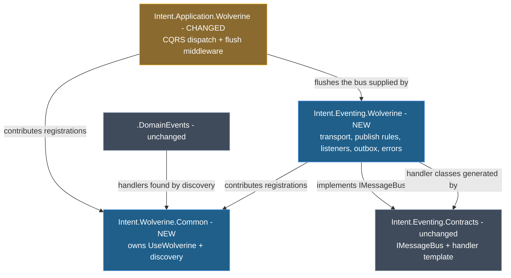
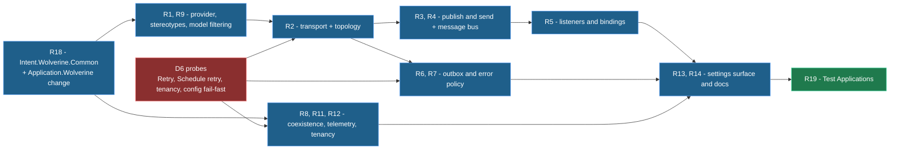

# Design Document

This design realizes the Wolverine eventing requirements as **Module Builder model changes across three modules** — two created, one changed — plus the Test Applications that are this feature's only automated regression signal.

It derives from the Golden Sample Reference at <FileRef path="golden-sample/GOLDEN-SAMPLE.md" label="golden-sample/GOLDEN-SAMPLE.md" />. Where the sample and this design differ, the difference is recorded as a decision below rather than left implicit.

## Overview

The Software Factory generates code from the Module Builder model, so almost everything here is `[model]` work: template elements, factory extensions, module settings, stereotype definitions and NuGet package registrations. The `[code]` bucket is the C# **inside** those templates and factory extensions — a module's templates are hand-written C# that emit code, so unlike an application spec this feature has a substantial code bucket that is not business logic.

The two existing eventing modules are the pattern to follow. <ModelRef application="Eventing.MassTransit" name="Intent.Eventing.MassTransit/Message Bus Providers/MassTransit" designer="Module Builder" type="Message Bus Provider" /> shows how a provider registers itself for the Message Bus stereotype, and <ModelRef application="Eventing.NServiceBus" name="Intent.Eventing.NServiceBus/NServiceBusConfiguration" designer="Module Builder" type="C# Template" /> shows the single-file configuration template shape. Wolverine's configuration template follows the latter; its provider element follows the former.

<Callout id="scope-counts" tone="info" title="Scope in counts">

**2 modules created**, **1 changed**, **1 read but untouched**. Inside the new eventing module: **4 C# templates**, **4 factory extensions**, **1 module settings configuration with 4 fields**, **1 message bus provider**, **3 stereotype definitions**, **7 NuGet package registrations**. The shared host module adds **1 factory extension** and **1 broadcast request type**. **17 Test Applications**, mirroring the coverage MassTransit and NServiceBus already carry.

</Callout>

## Decisions confirmed with the user

<Callout id="d1-discovery" tone="decision" title="D1 — Build the shared host module, but leave conventional discovery ON">

`Intent.Wolverine.Common` is created and owns the single `builder.Host.UseWolverine(...)` registration. It does **not** call `DisableConventionalDiscovery()`. Instead it guarantees that the application's Application-layer assembly is registered for discovery exactly once, so handler types from that layer are found whether or not the CQRS module is installed.

**Why:** R18 as approved had the shared module disable conventional discovery, with every module registering handlers per type. Three CONTEXT.md files contradict that. <FileRef path="../../../Modules/Intent.Modules.Application.Wolverine/CONTEXT.md" label="Intent.Application.Wolverine/CONTEXT.md" /> records the discovery model as assembly scanning by class-name suffix and emits `opts.Discovery.IncludeAssembly(typeof(ICommand).Assembly)`; <FileRef path="../../../Modules/Intent.Modules.Application.Wolverine.DomainEvents/CONTEXT.md" label=".DomainEvents/CONTEXT.md" /> records convention discovery with the instruction "This is Wolverine's native pattern — match it exactly". Disabling it is what stranded three CQRS handlers in the Golden Sample and forced its recorded known deviation. Leaving discovery on keeps both shipped modules working unchanged, and — because integration event handlers already live in the same Application assembly as `ICommand` and already end in `Handler` — they are discovered by the mechanism that is already there.

</Callout>

<Callout id="d1b-no-double-registration" tone="risk" title="D1 consequence — discovery is registered once, never twice">

Registering a handler type explicitly **and** having it discovered conventionally risks Wolverine seeing two handlers for one message and emitting a duplicate local in its runtime codegen — the exact `CS0128` failure the no-generated-consumer decision exists to avoid. The design forecloses it structurally: contributing modules declare the **assembly** they need discovered, `Intent.Wolverine.Common` de-duplicates those declarations and emits a single `IncludeAssembly` per distinct assembly. No module emits `IncludeType` for a type that the assembly registration already covers.

The cost, stated plainly: there is **no per-message Handler Type Registration**, so R5.1 and R5.5 must be read as "the subscribed message's handler is reachable by the host's discovery configuration" rather than "one explicit registration per message". R9's designation filtering therefore rests on **routing** — Wolverine has no listener bound for a message designated to another provider, so it never delivers one — rather than on registration. Flagged here because it weakens R9's stated mechanism and is the one place this design reinterprets an approved criterion.

</Callout>

<Callout id="d2-single-module" tone="decision" title="D2 — One eventing module, Intent.Eventing.Wolverine">

A single module covering all four Transports and both Transactional Outbox modes, named to match `Intent.Eventing.MassTransit` and `Intent.Eventing.NServiceBus`. No `.EntityFrameworkCore` companion.

**Why:** R14.1 promises exactly this — one install, no companion. MassTransit splits its durable outbox into a companion module, but that split predates the current packaging and buys nothing here: the durability packages are conditional NuGet registrations, which one module can carry.

</Callout>

<Callout id="d3-test-apps" tone="decision" title="D3 — Test App coverage mirrors the MassTransit and NServiceBus precedent">

17 Test Applications, including **one per Error Handling Policy** and a dedicated multi-tenancy app, with the durable-outbox scenarios split into publish/subscribe pairs.

**Why:** the precedent settles the scale rather than an abstract cost argument. `Tests/` already carries 16 MassTransit-related applications — including four separate retry-policy apps (`MassTransit.RetryPolicy.Immediate` through `.Exponential`) and `MassTransitFinbuckle.Test` — and 9 NServiceBus applications. NServiceBus's own acceptance matrix records that "separate Publish and Subscribe apps are needed to observe end-to-end behaviour" for outbox scenarios, which is why the durable pairs are split here.

</Callout>

<Callout id="d4-queue-name-placement" tone="decision" title="D4 — Destination Queue Name goes on the Integration Command, not on the send association">

The `Destination Queue Name` property is defined on a stereotype applicable to `Integration Command`. MassTransit puts its equivalent on the `Send Integration Command Target End` association.

**Why:** R4.3 requires it on the element itself, because the queue an Integration Command is delivered to is declared by the application that owns the Command and must be identical for every application that sends it. Putting it on the association would let two senders of the same Command resolve different queues, which R4.4's "resolved from the single place it is declared" forbids.

</Callout>

<Callout id="d5-flush-ownership" tone="decision" title="D5 — The eventing module supplies the bus; the dispatch module supplies the flush">

`Intent.Eventing.Wolverine` generates the buffered Message Bus implementation and its flush method, and generates **nothing** that calls it.

**Why:** the flush seam is per-dispatch-mechanism, not per-eventing-provider, and the precedent already exists on both sides. A Wolverine-CQRS application gets `MessageBusFlushMiddleware` from `Intent.Application.Wolverine`; a MediatR application gets `MessageBusPublishBehaviour`. `Intent.Application.Wolverine`'s CONTEXT.md records that its middleware only emits when an eventing module's bus interface resolves, so the two halves already find each other.

</Callout>

<Callout id="d6-uncited-first" tone="risk" title="D6 — Four criteria have no citation and are probe-gated before their templates are written">

`Retry` and `Schedule retry` (R7.1), the Finbuckle middleware shape (R12.2), and the fail-fast configuration read for Azure Service Bus and Amazon SQS (R2.6) have no line in the Golden Sample and no line in the committed probe. Each gets a **compile-only probe task that blocks the template that depends on it**, extending `golden-sample/probes/DurableAndTransportProbe/`.

**Why:** requirements assumption a16 made this ordering the mitigation, and it is cheap. Discovering during the parity wave that `RetryWithCooldown` has a sibling API shaped differently than assumed costs a wave; compiling four call sites first costs minutes. If a probe fails, R12 is the requirement to drop and the two retry policies are the ones to defer — that fallback is recorded now so implementation does not have to invent one.

</Callout>

## Module & architecture prerequisites

<Callout id="prerequisites" tone="warning" title="Two modules must be created and one incremented before any template work">

Nothing needs installing from the module marketplace — every dependency this feature needs is already in the repository. What blocks the first wave is **module creation and version increments**, which must happen before any template is authored, because a module rebuilt at an already-published version is ignored in favour of the published copy.

</Callout>

<Table
  id="module-prerequisites"
  caption="Modules this feature creates, changes and reads. Versions follow the repo's `-pre.#` imodspec convention."
  columns={["Module", "Action", "Version", "Requirements", "Why"]}
  rows={[
    ["`Intent.Wolverine.Common`", "**Create**", "`1.0.0-pre.0`", "R8.2, R18", "Owns the single `UseWolverine` host registration and the de-duplicated discovery contribution. A common module rather than shared code because two modules both binding their own copy of a shared DLL is a real version-skew hazard, and because it is the only place that can arbitrate a single registration."],
    ["`Intent.Eventing.Wolverine`", "**Create**", "`1.0.0-pre.0`", "R1 to R14", "The eventing provider itself. Single module per D2."],
    ["`Intent.Application.Wolverine`", "**Change**", "`1.0.3-pre.0` → `1.1.0-pre.0`", "R8.7, R18.4", "Must stop emitting its own host registration and consume the common module instead, and must stop registering Wolverine on the Azure Functions host. Minor rather than patch because generated output changes; see the risk note below."],
    ["`Intent.Eventing.Contracts`", "Read, unchanged", "`6.1.3`", "R5.4", "Already ships the `IIntegrationEventHandler<T>` handler template in a body-preserving mode. R5.4 is satisfied by not competing with it."],
    ["`Intent.Application.Wolverine.DomainEvents`", "Read, unchanged", "`1.0.0`", "—", "Untouched **because** of D1. Under the approved R18 it would have needed every implicit domain-event handler enumerated."]
  ]}
/>

<Callout id="af-removal-risk" tone="risk" title="R8.7's Azure Functions removal may warrant a major increment">

`1.1.0-pre.0` assumes removing the Azure Functions host registration is an additive-minor change with a release-note callout, which is what R8.7 asks for. It is genuinely a **removal of generated output** for any consumer who has `Intent.Application.Wolverine` on an Azure Functions host today. If any such consumer exists, `2.0.0-pre.0` is the honest number. The module's own CONTEXT.md records that serverless Wolverine never worked — every `TypeLoadMode` fails under Azure Functions — so the registration being removed is one that could not have been running successfully. On that basis minor is defensible, and the decision is recorded here rather than taken silently at close-out.

</Callout>

## Module topology

`Intent.Wolverine.Common` depends on neither sibling — it carries only the WolverineFx core package and the broadcast request type. Both `Intent.Eventing.Wolverine` and `Intent.Application.Wolverine` depend on it. That keeps each a root module in its own right: the eventing module works with no CQRS module installed (R8.5), and the CQRS module works with no eventing module installed.

## Model changes — Intent.Wolverine.Common (new)

<ModelChanges id="common-changes" caption="Intent.Wolverine.Common — Module Builder additions" changes={[
  { element: "Intent.Wolverine.Common", designer: "Module Builder", change: "added", note: "Intent Module package. `Module Settings` stereotype: Version `1.0.0-pre.0`, API Namespace `Intent.Wolverine.Common.Api`, Include Release Notes true.",
    fields: [{ label: "Version", after: "1.0.0-pre.0" }, { label: "API Namespace", after: "Intent.Wolverine.Common.Api" }] },
  { element: "WolverineHostRegistrationExtension", designer: "Module Builder", change: "added", note: "Factory Extension. Owns `ConfigureHostBuilderChainStatement` for `UseWolverine`, collects contributions, de-duplicates discovery assemblies, orders contributions deterministically." },
  { element: "WolverineFx", designer: "Module Builder", change: "added", note: "NuGet Package with a Package Version pinned to 5.39.5, Minimum Target Framework `.NETCoreApp,Version=v8.0`." }
]} />

The module has **no C# Template** — it emits no file of its own. It is a factory extension plus an API surface, which is the correct shape: a factory extension modifies another module's output, and the only output here is the AspNet Core `Program` file that `Intent.Modules.AspNetCore` owns.

The contribution mechanism is a **broadcast request** in the module's API namespace rather than a direct reference between modules, following the established `ContainerRegistrationRequest` / `AppSettingRegistrationRequest` pattern. A contributing module broadcasts a request carrying (a) statements to add inside the `UseWolverine` lambda, (b) an ordering priority, and (c) zero or more assemblies it needs registered for handler discovery. `WolverineHostRegistrationExtension` handles every such request, sorts by priority, de-duplicates the assembly set, and writes one lambda.

This is what makes R8.2 real. `ConfigureHostBuilderChainStatement` on <FileRef path="../../../Modules/Intent.Modules.AspNetCore/Templates/ProgramFile.cs" label="ProgramFile.cs" line={35} /> is already find-or-create — it reuses an existing `builder.Host.UseWolverine(` lambda rather than adding a second — so the platform already guarantees one call. What it does not guarantee is that two modules writing into that one lambda do not overwrite each other, and that is precisely what goes wrong today.

## Model changes — Intent.Eventing.Wolverine (new)

<ModelChanges id="eventing-templates" caption="Intent.Eventing.Wolverine — templates and factory extensions" changes={[
  { element: "WolverineEventingConfiguration", designer: "Module Builder", change: "added", note: "C# Template, C# File Builder, Single File. Role `Infrastructure.DependencyInjection.Wolverine.Eventing`, Default Location `Eventing`. Emits transport, publish rules, exchange-to-queue bindings, listeners, error handling and durability. Satisfies R2, R3.1 to R3.7, R4, R5.1, R5.6, R5.8, R6, R7." },
  { element: "WolverineMessageBus", designer: "Module Builder", change: "added", note: "C# Template, C# File Builder, Single File. Role `Infrastructure.Eventing.WolverineEventBus`, Default Location `Eventing`. The buffered Message Bus contract implementation with its flush method. Satisfies R3.8, R4.1, R8.8." },
  { element: "WolverineTenantHeaderStrategy", designer: "Module Builder", change: "added", note: "C# Template. Reads and writes the Tenant Identifier header. Emitted only when the multi-tenancy module is installed. Satisfies R12.1, R12.3." },
  { element: "WolverineTenantMiddleware", designer: "Module Builder", change: "added", note: "C# Template. Wolverine middleware establishing and restoring Finbuckle context around handler invocation, registered once at host scope. Satisfies R12.2, R12.4. Probe-gated per D6." },
  { element: "WolverineEventingRegistrationExtension", designer: "Module Builder", change: "added", note: "Factory Extension. Broadcasts the host-configuration request to Intent.Wolverine.Common; raises the DI registration for the bus and the appsettings registrations. Satisfies R2.3, R3.9, R7.2, R14.4." },
  { element: "WolverineMessageBusInteropExtension", designer: "Module Builder", change: "added", note: "Factory Extension. Composite Message Bus participation and the `eventbus-flush` tag handling when a durable outbox is selected. Satisfies R6.3 interop, R9.6." },
  { element: "WolverineTelemetryConfiguratorExtension", designer: "Module Builder", change: "added", note: "Factory Extension. Registers `Wolverine` as an OpenTelemetry source when Intent.OpenTelemetry is installed. Satisfies R11." },
  { element: "WolverineFinbuckleConfiguratorExtension", designer: "Module Builder", change: "added", note: "Factory Extension. Wires the tenancy templates when the multi-tenancy module is installed, and emits nothing when it is not. Satisfies R12.5." },
  { element: "Wolverine", designer: "Module Builder", change: "added", note: "Message Bus Provider under a `Message Bus Providers` folder. `Message Bus Provider Settings.Applicable Stereotypes` references the Wolverine Message stereotype. Satisfies R9.1 to R9.3." }
]} />

Four C# templates, not five. There is deliberately **no consumer template** — the counterpart of MassTransit's <ModelRef application="Eventing.MassTransit" name="Intent.Eventing.MassTransit/IntegrationEventConsumer" designer="Module Builder" type="C# Template" /> does not exist here, because the `IIntegrationEventHandler<T>` implementation is itself the Wolverine handler. That absence is the single largest structural difference from the MassTransit module and is what R5.2 forbids reintroducing.

### Module settings

<DataModel
  id="wolverine-settings"
  entity="Wolverine Message Bus Settings — Module Settings Configuration, Settings Type = Application Settings"
  caption="R14.2 — exactly four fields, each a Select control with Is Required true"
  fields={[
    { name: "Transport", type: "Select — Local, RabbitMQ, Azure Service Bus, Amazon SQS", change: "added", note: "Default `Local`. Four Module Settings Field Options. Realizes R2.1" },
    { name: "Transactional Outbox", type: "Select — None, Durable", change: "added", note: "Default `None`. Names no persistence technology; durable storage is derived from the modelled Database Provider. Realizes R6.1" },
    { name: "Error Handling Policy", type: "Select — None, Retry, Retry with cooldown, Schedule retry", change: "added", note: "Default `Retry with cooldown`. Realizes R7.1" },
    { name: "Broker Topology", type: "Select — Auto-provision, Externally owned", change: "added", note: "Default `Auto-provision`. Realizes R2.7" }
  ]}
/>

Each field is a `Module Settings Field Configuration` with a `Field Configuration` stereotype carrying `Control Type = Select`, `Is Required = true`, its `Default Value`, and a `Hint`. The Transport field's hint carries R2.5's obligation that Local is in-process only. Options are `Module Settings Field Option` children — the schema's own mechanism, so the option set is model-driven rather than a string parsed in a template.

No fifth setting is added. R14.2 forbids one for the Subscriber Queue naming rule, the serialization format and the durable storage technology, each of which is derived.

### Stereotype definitions

<Table
  id="stereotypes"
  caption="Three stereotype definitions, each created under a `Stereotypes` folder in the module package"
  columns={["Stereotype", "Applicable to", "Properties", "Realizes"]}
  rows={[
    ["`Wolverine Message`", "`Message`, `Integration Command`", "none — a marker", "R9.1. Referenced by `Message Bus Provider Settings.Applicable Stereotypes`, which is how the provider becomes selectable on the Message Bus stereotype"],
    ["`Message Topology Settings`", "`Message`", "`Topic Name` — text box, optional", "R3.3 to R3.6. Overrides the kebab-cased convention name; validated for emptiness and a 250-character ceiling by the template's `Validate Function`"],
    ["`Command Distribution`", "`Integration Command`", "`Destination Queue Name` — text box, optional", "R4.3 to R4.6. On the element itself per D4, not on the send association"]
  ]}
/>

The names `Message Topology Settings` and `Command Distribution` deliberately match MassTransit's equivalents so a migrator meets the same vocabulary, even though `Command Distribution` is attached to a different element type per D4.

### NuGet package registrations

Seven `NuGet Package` elements, each with a `Package Version` child pinned to `5.39.5` and `Minimum Target Framework` set to `.NETCoreApp,Version=v8.0`: `WolverineFx`, `WolverineFx.RabbitMQ`, `WolverineFx.AzureServiceBus`, `WolverineFx.AmazonSqs`, `WolverineFx.EntityFrameworkCore`, `WolverineFx.SqlServer`, `WolverineFx.Postgresql`. Templates add each conditionally on the selected Transport and Outbox setting, so an application never carries a transport package it does not use.

This model **is** R10's realization. The licence guarantee is verifiable by reading these seven registrations against the inventory in the requirements, and R10.4's re-check obligation attaches to changing a `Package Version` element.

## Model changes — Intent.Application.Wolverine (changed)

<ModelChanges id="cqrs-changes" caption="Intent.Application.Wolverine — the R18.4 change" changes={[
  { element: "Intent.Application.Wolverine", designer: "Module Builder", change: "modified", note: "Version increment and a new module dependency on Intent.Wolverine.Common.",
    fields: [{ label: "Version", before: "1.0.3-pre.0", after: "1.1.0-pre.0" }] },
  { element: "WolverineRegistrationFactoryExtension", designer: "Module Builder", change: "modified", note: "Stops calling `ConfigureHostBuilderChainStatement` directly. Broadcasts a host-configuration request to Intent.Wolverine.Common instead, declaring its own statement and the Application assembly it needs discovered. Drops the Azure Functions host loop per R8.7." }
]} />

The behavioural change is small and precisely located. Today the extension clears the lambda before writing into it:

<AnnotatedCode
  id="statements-clear"
  filename="Modules/Intent.Modules.Application.Wolverine/FactoryExtensions/WolverineRegistrationFactoryExtension.cs"
  language="csharp"
  code={`programTemplate.ProgramFile.ConfigureHostBuilderChainStatement("UseWolverine", new[] { "opts" },\n    (lambdaBlock, parameters) =>\n    {\n        var opts = parameters[0];\n        lambdaBlock.Statements.Clear();\n        lambdaBlock.AddStatement($"{wolverineConfigType}.Configure({opts});");\n    });`}
  annotations={[
    { lines: "6", label: "The line that forces the pre-module delta", note: "Clears every statement in the lambda before adding its own. Any contribution another module made is destroyed, and whether that happens depends on factory-extension execution order. This is why the Golden Sample's eventing registration had to be protected with `//IntentIgnore` rather than simply co-existing — R18.6's marker sweep cannot pass until this is gone." },
    { lines: "1", label: "Replaced, not deleted", note: "The call itself moves into Intent.Wolverine.Common. This extension broadcasts a request carrying the `Configure(opts)` statement and the Application assembly instead of writing the lambda itself." }
  ]}
/>

Both Azure Functions and ASP.NET host loops call this same helper today; the Azure Functions loop is removed outright per R8.7, and its removal is named in the module's release notes.

## Test Applications

<Table
  id="test-apps"
  density="compact"
  caption="R19 — 17 Test Applications with committed generated output, mirroring the MassTransit and NServiceBus coverage in `Tests/`"
  columns={["Test Application", "Configuration", "Requirements"]}
  rows={[
    ["`Wolverine.Transport.Local`", "Local, Outbox None", "R2.1, R2.2"],
    ["`Wolverine.Transport.RabbitMQ.Publish` · `.Subscribe`", "RabbitMQ, Outbox None, Auto-provision — the Golden Sample's own path, as a publish/subscribe pair", "R2, R3, R4, R5"],
    ["`Wolverine.Transport.AzureServiceBus`", "Azure Service Bus", "R2.1, R2.2, R2.6"],
    ["`Wolverine.Transport.AmazonSqs`", "Amazon SQS", "R2.1, R2.2, R2.6"],
    ["`Wolverine.Topology.ExternallyOwned`", "Externally owned, name overrides on every message", "R2.7, R3.3, R4.3"],
    ["`Wolverine.Outbox.SqlServer.Publish` · `.Subscribe`", "Outbox Durable, SQL Server", "R6.1, R6.3, R6.8"],
    ["`Wolverine.Outbox.Postgresql.Publish` · `.Subscribe`", "Outbox Durable, PostgreSQL", "R6.1, R6.3"],
    ["`Wolverine.ErrorPolicy.None` · `.Retry` · `.RetryWithCooldown` · `.ScheduleRetry`", "One per Error Handling Policy, matching the four MassTransit retry-policy apps", "R7.1, R7.2, R7.3, R7.5"],
    ["`Wolverine.Coexist.Cqrs`", "Eventing + Intent.Application.Wolverine on one shared host", "R8, R18"],
    ["`Wolverine.MultiProvider`", "Wolverine alongside MassTransit, messages designated to each", "R9 — sole evidence"],
    ["`Wolverine.MultiTenancy`", "Eventing + the Finbuckle multi-tenancy module", "R12 — sole evidence"]
  ]}
/>

Each carries a README describing infrastructure requirements and how to run it, matching what NServiceBus's acceptance matrix already requires of its test apps. The publish/subscribe splits exist because a subscriber-side discovery surface only appears across a process boundary — a pattern that holds in a single app can break across two.

## Realization plan

Every requirement names a concrete mechanism. `[model]` is Module Builder model work the Software Factory turns into the module's own scaffolding; `[code]` is the hand-written C# inside templates and factory extensions.

<Table
  id="realization-plan"
  caption="Per-requirement realization. Depends-on lists only genuine build-order dependencies."
  columns={["Req", "[model]", "[code]", "Depends on"]}
  rows={[
    ["R1", "Message Bus Provider element; `Wolverine Message` stereotype", "Model-filtering logic in `WolverineEventingConfiguration` reading the Services designer's existing message and subscription elements", "R9 (provider element)"],
    ["R2", "4-option Transport field; Broker Topology field; 4 transport NuGet packages", "Transport branch in `WolverineEventingConfiguration`; appsettings registration requests in `WolverineEventingRegistrationExtension`; R2.6 fail-fast read", "R18, D6 probe for R2.6"],
    ["R3", "`Message Topology Settings` stereotype; `WolverineMessageBus` template element", "Publish-rule emission; kebab-case convention; override validation; buffered bus with flush; conditional DI registration", "R1, R18"],
    ["R4", "`Command Distribution` stereotype on Integration Command", "Send-rule emission and override resolution from the single declaration site", "R1, R3"],
    ["R5", "None beyond R1 — no consumer template exists", "Listener and binding emission; Subscriber Queue naming; host-scope error policy placement", "R1, R2, R18"],
    ["R6", "Transactional Outbox field; 3 durability NuGet packages", "Durability registrations; Database Provider derivation; R6.4 and R6.8 stopping conditions as `FriendlyException`; `eventbus-flush` interop", "R2, R18"],
    ["R7", "Error Handling Policy field with 4 options", "Policy emission per option, each terminating in move-to-error-queue; empty-delay branch; appsettings keys", "R2, D6 probe for Retry and Schedule retry"],
    ["R8", "Module dependency on Intent.Wolverine.Common", "Type resolution for both `IMessageBus` interfaces via resolved type references, never literal name strings", "R18"],
    ["R9", "Message Bus Provider element with Applicable Stereotypes", "Designation filtering in the configuration template; Composite Message Bus participation in `WolverineMessageBusInteropExtension`", "R1"],
    ["R10", "7 NuGet Package elements with pinned Package Versions", "None — the model is the realization", "—"],
    ["R11", "`WolverineTelemetryConfiguratorExtension` element", "Conditional `AddSource(\"Wolverine\")` registration", "R18"],
    ["R12", "2 template elements; 1 factory extension element", "Header strategy; host-scope middleware; conditional emission", "R3, R5, D6 probe"],
    ["R13", "None", "Module docs — migration section, setting-equivalence table, artefact list", "R1 to R14 settled"],
    ["R14", "Module Settings Configuration with 4 fields; module dependency on Intent.Eventing.Contracts", "Uninstall behaviour; documentation of additive-only appsettings", "R2, R6, R7"],
    ["R18", "New Intent.Wolverine.Common package; 1 factory extension; 1 NuGet package; version increment on Intent.Application.Wolverine", "Broadcast request type; host registration extension; de-duplicated discovery; removal of `Statements.Clear()` and the Azure Functions loop; marker sweep", "— (first wave)"],
    ["R19", "17 Test Application models", "READMEs; committed generated output; clean re-run confirmation", "R1 to R14, R18"]
  ]}
/>

**Journey coverage.** UJ-1 runs through R1, R5 and R13; UJ-2 through R1 to R5 and R14; UJ-3 through R9; UJ-4 through R8 and R18; UJ-5 through R6 and R7; UJ-6 through R2.7, R3 and R4. No journey lacks a path, and no requirement in the plan falls outside a journey except R10, R11, R12 and R19, which the requirements already classify as cross-cutting or infrastructure.

## Modelling order

R18 is first and alone. Nothing else can be verified until one `UseWolverine` registration exists and the `Statements.Clear()` collision is gone — every other requirement writes into that lambda. The D6 probes run in parallel with R18 since they touch nothing the modules own.

The Domain → Services → UI ordering that governs application specs does not apply here: this feature mutates only the Module Builder designer. Where it reads other designers it reads the Services designer's **existing** message and subscription elements, adding nothing to them beyond the three stereotype definitions, which are declared in the Wolverine module's own package and attach by `applicableTo`.

## Code placement

`[code]` is interleaved per requirement, not deferred. A module's templates are C# that emits C#, so there is no useful "model everything then write the code" split — a template element with no partial class behind it generates nothing, and its correctness is only observable once it runs.

Two exceptions where code must lead the model:

- **The D6 probes** extend <FileRef path="golden-sample/probes/DurableAndTransportProbe/Probe.cs" label="probes/DurableAndTransportProbe/Probe.cs" /> and must compile before the templates that depend on their call shapes are authored. They are code-only and belong to no module.
- **The `Statements.Clear()` removal** in `WolverineRegistrationFactoryExtension` is a code change inside R18's wave that must land before any other module contributes to the lambda, otherwise contributions are silently destroyed depending on execution order.

The **marker sweep** is R18's completion evidence and is code work, not tidying: remove the `//IntentIgnore` directive and its `GOLDEN-SAMPLE:` marker from both `*.Api/Program.cs` files in the sample, regenerate, and confirm the template emits that exact line. Because the directives are ignore-style, leaving one in place suppresses the template's output and makes the parity check pass while proving nothing — so `grep -rn "GOLDEN-SAMPLE:"` returning nothing is part of the wave's report, not an afterthought.

Module documentation and version increments are not separate tasks. Each module's `release-notes.md`, `docs/README.md` and `CONTEXT.md` are updated in the same wave as the behaviour they describe, and the version increments in the prerequisites table happen before any template work in that module.

## Assumptions

<Checklist
  id="design-assumptions"
  items={[
    { id: "d-a1", label: "R5.1 and R5.5 are satisfied by discovery configuration rather than a per-message registration", note: "The direct consequence of D1. If you want the literal per-message Handler Type Registration those criteria describe, that is the approved-R18 path and it costs the breaking change to Intent.Application.Wolverine and .DomainEvents. Flagged because this is the one place the design reinterprets an approved criterion." },
    { id: "d-a2", label: "R9's designation filtering rests on routing, not on registration", note: "With conventional discovery on, a handler for a message designated to MassTransit is also registered with Wolverine. It receives nothing, because Wolverine has no listener bound for that message and the Composite Message Bus routes its publishes elsewhere. `Wolverine.MultiProvider` is the Test Application that has to demonstrate this holds." },
    { id: "d-a3", label: "Intent.Wolverine.Common ships as a module rather than a shared project", note: "Two modules each bundling their own copy of a shared DLL binds to whichever loads first and skews on version drift. A common module is the structural fix, and it is also the only place a single `UseWolverine` registration can be arbitrated." },
    { id: "d-a4", label: "The Azure Functions registration removal is a minor increment, not a major", note: "See the risk callout. It rests on the module's own CONTEXT.md recording that serverless Wolverine never worked under any `TypeLoadMode`, so the removed registration could not have been running successfully. Correct this to `2.0.0-pre.0` if any consumer is on it." },
    { id: "d-a5", label: "Module documentation stays in `docs/README.md` rather than modelled Documentation Topics", note: "Requirements assumption a12 decided this, but its stated rationale is wrong: `Intent.Eventing.MassTransit` DOES model a `Module Documentation` element with two Documentation Topics, so a12's claim that no eventing module does is inaccurate. NServiceBus does not. The decision stands as approved; the option remains open if you would rather match MassTransit." },
    { id: "d-a6", label: "Stereotype names match MassTransit's where the concept matches", note: "`Message Topology Settings` and `Command Distribution` carry the same names a migrator already knows, even though the latter attaches to a different element type per D4." },
    { id: "d-a7", label: "Test Application generated output is committed, and a clean re-run is confirmed rather than assumed", note: "R19.5's checks — right module version installed, provider designation present, file not ignored, code-management mode permits writing — are part of each Test Application task, because a clean run against a file no template was going to write proves nothing." }
  ]}
/>
