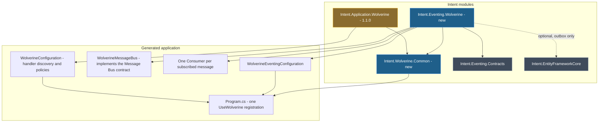
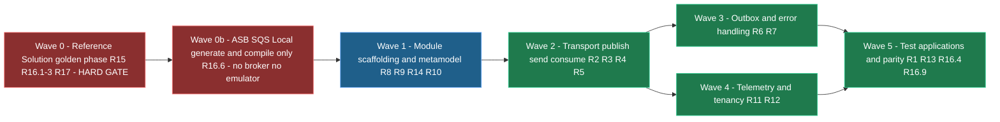

# Design Document

## Overview

This feature is built as **two new Intent modules plus changes to two existing ones**, verified against **one hand-written reference solution**.

- **`Intent.Wolverine.Common`** — a new, thin shared module that owns the single `builder.Host.UseWolverine(opts => ...)` registration for an application and exposes an ordered contribution point any Wolverine module can add to. This is what makes R8's "exactly one Wolverine Host Configuration" true by construction rather than by luck.
- **`Intent.Eventing.Wolverine`** — the new Eventing Provider. It reads the Integration Events, Integration Commands and subscriptions already modelled in the Services designer, registers itself with the Contracts module's `MessageBusRegistry`, and generates the transport registration, publishing rules, listeners, Consumers, durability and error handling.
- **`Intent.Application.Wolverine`** — the existing CQRS module, updated to consume the shared host module instead of registering the host itself.
- **`Intent.OpenTelemetry`** — the existing telemetry module, given a one-line Wolverine branch beside the MassTransit one it already carries. This is the only mechanism that actually works for R11; see the `d-telemetry` decision.
- **`Tests/Wolverine.Publish.RabbitMQ` + `Tests/Wolverine.Subscribe.RabbitMQ` + `Tests/Wolverine.Reference.Tests`** — the Reference Solution. Two Intent applications scaffolded with no Wolverine module installed, then hand-crafted until every Wolverine artefact is exactly what the modules must emit, plus a test solution proving it runs. Scope A. Green **before** any module artefact exists, and the pair later becomes the first entry in the permanent test estate.

The provider-designation machinery this feature needs already exists and is not rebuilt. <ModelRef application="Eventing.Contracts" name="Message Bus Provider" designer="Module Builder" /> is an element type the Contracts module contributes to the Module Builder designer; declaring one instance is what makes a module selectable on the Message Bus stereotype. <ModelRef application="Eventing.Contracts" name="CompositeMessageBus" designer="Module Builder" /> and <ModelRef application="Eventing.Contracts" name="MessageBrokerRegistry" designer="Module Builder" /> already route per-message across providers, and `MessageBusExtensions.FilterMessagesForThisMessageBroker(...)` already raises the `ElementException` R9.4 asks for. The Wolverine module's job is to register itself correctly and filter through that helper — not to reimplement any of it.

<Callout id="scope-counts" tone="info" title="Scope in counts">

2 new module applications · 2 existing modules changed · 4 module settings · 1 stereotype definition · 7 C# templates · 6 factory extensions (5 in the eventing module, 1 in Common) · 7 NuGet package declarations · 4 transports, 1 proven at runtime · 1 reference solution with 4 automated tests · 0 modelled documentation topics.

</Callout>

## Decisions confirmed with the user

<Callout id="d-shared-host" tone="decision" title="A shared host module owns the single UseWolverine registration">

A new module, `Intent.Wolverine.Common`, owns the one `builder.Host.UseWolverine(opts => ...)` chain statement in `Program.cs` and exposes an ordered contribution point. Transports, subscriptions, durability, discovery and policies stay in whichever module owns them; the shared module owns only the host hook.

**Why:** the alternative was for the eventing module to append into the chain statement that <FileRef path="../../../Modules/Intent.Modules.Application.Wolverine/FactoryExtensions/WolverineRegistrationFactoryExtension.cs" label="WolverineRegistrationFactoryExtension" /> creates. That works today only because that extension runs at `Order = 0` and calls `lambdaBlock.Statements.Clear()` before ours appends — R8.2 and R8.3 would then hold by ordering accident, and a future reorder would silently drop the eventing registrations. A single owner makes the invariant structural.

</Callout>

<Callout id="d-cqrs-change" tone="risk" title="Intent.Application.Wolverine changes in this spec, and it is already released">

`Intent.Application.Wolverine` goes from 1.0.2 to **1.1.0**: it takes a dependency on `Intent.Wolverine.Common`, stops calling `ConfigureHostBuilderChainStatement("UseWolverine", ...)` itself, instead contributes `WolverineConfiguration.Configure(opts)` through the shared contribution point, and **drops its own `WolverineFx` NuGet declaration** in favour of Common's. Since it depends on Common from here on, it consumes both the host registration and the framework pin rather than owning either.

**Why:** R8.2 to R8.4 are unachievable without it — two modules cannot both own one registration. The risk is real and is accepted deliberately: a released module changes host-wiring behaviour, so the coexistence test application is a required part of this work rather than a nice-to-have, and the CQRS module's existing test applications must be regenerated and diffed before release. That module lives in `Intent.Modules.NET.Dispatchers.isln`, which is why the shared module joins both solutions.

</Callout>

<Callout id="d-version" tone="decision" title="Common is the sole declarer of core WolverineFx, pinned to 5.39.5">

`Intent.Wolverine.Common` declares `WolverineFx` 5.39.5 with `locked: true`, and is the **only** module in the Wolverine suite that declares it. `Intent.Application.Wolverine` drops the declaration it carries today; `Intent.Eventing.Wolverine` never adds one. The rule that produces this, and that every future Wolverine module follows: **the module that emits code against a package declares and references that package.** Common writes the `UseWolverine` chain statement, so `WolverineOptions` — and therefore core `WolverineFx` — is genuinely its own dependency rather than a holding on behalf of its consumers.

Each root module still declares whatever its own generated patterns need *beyond* core: six satellites in `Intent.Eventing.Wolverine` (`.RabbitMQ`, `.AzureServiceBus`, `.AmazonSqs`, `.EntityFrameworkCore`, `.SqlServer`, `.Postgresql`, all `locked: true` at 5.39.5), and today nothing at all in `Intent.Application.Wolverine`. R15.5 holds against the union of the two — the reference solution declares exactly the versions the modules declare, one pin per package.

**Why:** `NugetRegistry` is keyed on package name and the Software Factory resolves competing requests by **selecting the highest version**, while `locked: true` only sets a ceiling. Two modules each declaring core `WolverineFx` therefore resolve quietly rather than erroring, and the day one of them moves to 6.x every application on the other is dragged past the .NET 8 ceiling with no signal but a failed restore in a consumer's solution. One owner makes the single-version invariant structural — the same argument as the single `UseWolverine` owner above, applied to the package axis, and the canonical justification for a common module: one authoritative version, centrally held, no skew.

**Accepted cost:** the six satellites must move in step with the core pin by hand, across two Module Builder models. That is a *loud* coupling where the original was a silent one — every `WolverineFx.*` satellite carries a transitive dependency on core at its own version, so drift surfaces as a restore conflict in the consumer rather than silent skew. Two things keep it reliable: each satellite declares `.WithNugetDependency("WolverineFx", "5.39.5")` explicitly, matching the pattern `MassTransit.AmazonSQS` already uses in this repository; and `Intent.Wolverine.Common/CONTEXT.md` records the invariant — Common is the sole declarer of core `WolverineFx`, no sibling may declare it, and moving the core pin obliges a matching move of every satellite in the same release.

**Wave 1 verification:** the eventing module's templates emit `WolverineOptions` code directly, so they reference Common's `WolverineFx` package constant across an assembly boundary and rely on a registry entry a *different* module registered. Prove that with a Software Factory run against a test application and check the resulting `.csproj` version. A green module build proves nothing about the resolution. R8.6 is the acceptance criterion this satisfies — the coexistence test application is where it is checked.

**The invariant has a transition window, and the coexistence test should cover it rather than assume it away.** "Common is the sole declarer" becomes true for an application only once it upgrades to `Intent.Application.Wolverine` 1.1.0. Until then that module still declares `WolverineFx` itself, so a mixed application briefly has two declarers and the highest-version-wins rule resolves it silently. That resolution is expected to be harmless — both declare 5.39.5, so highest-wins picks the same version either way — but "expected to be harmless" is precisely the sort of claim this spec is meant to convert into evidence. **A second coexistence test application therefore pins `Intent.Application.Wolverine` at 1.0.2 deliberately** alongside the new eventing module, and its committed `.csproj` shows which version won. If the pins ever diverge, that test is what turns a silent resolution into a visible diff.

</Callout>

<Callout id="d-durability" tone="decision" title="Outbox durability follows the Entity Framework provider setting">

The Transactional Outbox setting is exactly the two options R6.1 requires — **None and Durable**. It deliberately does not name a persistence technology. When it is Durable, the durability package is resolved from `Intent.EntityFrameworkCore`'s own **Database Provider** setting: `sql-server` gets `WolverineFx.SqlServer`, `postgresql` gets `WolverineFx.Postgresql`. Every other provider — `in-memory`, `cosmos`, `my-sql`, `oracle`, `sql-lite` — stops the Software Factory with a `FriendlyException` naming the provider and the two supported ones. Durable also implies Wolverine's durable endpoint mode; None implies buffered. That pairing is derived, not a fifth setting.

**Why:** the developer has already told Intent which database they use; asking again as a Wolverine setting would be a second source of truth that can disagree with the DbContext. Naming the option `Durable` rather than `Entity Framework` says what the developer gets rather than how it is stored, and means adding another durable-storage backing later needs no new option. Wolverine ships durable storage only for SQL Server and PostgreSQL, so the unsupported providers need a stopping condition either way, and a named error at generation time is better than a runtime failure in a consumer's application.

</Callout>

<Callout id="d-nongoal-reading" tone="decision" title="PostgreSQL durability is not the excluded Marten path">

The requirements' non-goal used to read "no Marten/PostgreSQL and no RavenDb persistence", which this design read as excluding **Marten's** document-store durability (and RavenDb), not PostgreSQL as a database. `WolverineFx.Postgresql` durability sitting behind the application's own EF Core DbContext is the durable outbox R6.3 requires, on a different database engine. That reading is no longer something the reader has to infer: the Non-Goals and Out-of-Scope entries were rewritten to say it outright, so a verifier reading the requirements at face value can no longer conclude the `WolverineFx.Postgresql` satellite breaks a non-goal.

**Why:** the alternative reading would make the chosen "follow the EF provider setting" answer contradict a non-goal. Marten remains out of scope: no `WolverineFx.Marten`, no document session, no `IDocumentStore`. The requirements' Non-Goals and Out-of-Scope entries were amended to say this outright rather than leaving it as a reading.

</Callout>

<Callout id="d-telemetry" tone="decision" title="R11 is a one-line change to Intent.OpenTelemetry, not a factory extension in this module">

Wolverine's `ActivitySource` is named `"Wolverine"` (`src/Wolverine/Runtime/WolverineTracing.cs`), so collecting its spans is exactly `.AddSource("Wolverine")` in the tracing builder — the same one-call shape as MassTransit. Because `WolverineTracing` lives in Wolverine core, no OpenTelemetry instrumentation package is needed, which is what makes R11.2's "no OpenTelemetry package reference" hold for free.

**The mechanism is the load-bearing part, and an earlier draft of this design had it wrong.** It planned a `TelemetryConfiguratorExtension` in the Wolverine eventing module that would reach into the OpenTelemetry template and insert the source. **That approach does not work, and the MassTransit module already proved it.** <FileRef path="../../../Modules/Intent.Modules.Eventing.MassTransit/FactoryExtensions/TelemetryConfiguratorExtension.cs" label="MassTransit's TelemetryConfiguratorExtension" /> is entirely commented out, with the reason recorded in the file: *"Until we can modify wrapped invocation statements we can't go with this solution."* The working path is the inverse — `Intent.OpenTelemetry`'s own template hardcodes the source, gated on the consuming module being installed:

```csharp
// TEMP FIX - also see TelemetryConfiguratorExtension
if (ExecutionContext.InstalledModules.Any(x => x.ModuleId == "Intent.Eventing.MassTransit"))
{
    traceChain = traceChain.AddInvocation("AddSource", inv => inv.AddArgument(@"""MassTransit""").OnNewLine());
}
```

So R11 is realized by adding a sibling branch for `Intent.Eventing.Wolverine` in <FileRef path="../../../Modules/Intent.Modules.OpenTelemetry/Templates/OpenTelemetryConfiguration/OpenTelemetryConfigurationTemplatePartial.cs" label="OpenTelemetryConfigurationTemplatePartial.cs" /> at the existing gate, and **no telemetry factory extension is written in the eventing module at all.** `Intent.OpenTelemetry` therefore gets a version increment and becomes the third existing module this spec changes.

**Verified, not assumed:** the generated proof is already in this repository — <FileRef path="../../../Tests/MassTransit.RabbitMQ/MassTransit.RabbitMQ.Api/Configuration/OpenTelemetryConfiguration.cs" label="the MassTransit test application's OpenTelemetryConfiguration.cs" /> contains `.AddSource("MassTransit")`. The source *name* for Wolverine still needs confirming against the pinned 5.39.5 assembly in Wave 0 rather than taken from documentation.

**Noted for later, not now:** Wolverine supports `.TelemetryEnabled(false)` per endpoint. No requirement asks for it; it is the natural home if suppressing tracing on one transport is ever requested.

</Callout>

<Callout id="d-serverless" tone="decision" title="Serverless hosts are out of scope, and the existing Azure Functions registration is removed">

`Intent.Wolverine.Common` registers the `UseWolverine` statement on the ASP.NET host (`App.Program`) **only**. The `Intent.AzureFunctions.Isolated.Program` loop that <FileRef path="../../../Modules/Intent.Modules.Application.Wolverine/FactoryExtensions/WolverineRegistrationFactoryExtension.cs" label="the CQRS module carries today" /> is dropped rather than moved into the shared module, and no eventing contribution is made to any serverless host.

**Why:** `Intent.Modules.Application.Wolverine/CONTEXT.md` records this as an abandoned, unresolved problem — every `TypeLoadMode` fails in Azure Functions (`Auto` triggers the file watcher and restarts the worker; `Static` needs a codegen CLI whose entry point the Functions host overrides; `Dynamic` uninvestigated), with the standing instruction not to build serverless dispatch modules until it is resolved. Carrying the loop forward would mean inheriting that hazard into every Functions application that installs the eventing module.

**Consequence, stated plainly:** an application on `Intent.Application.Wolverine` 1.0.2 with an Azure Functions host loses its `UseWolverine` registration on the next Software Factory run after upgrading to 1.1.0. That registration compiled but could not work at runtime for the reason above, so this removes a broken path rather than a working one — but it *is* an observable change to generated output.

**This is now contract, not just a design choice.** When this decision was first written it lived only here and in the Non-Goals, which meant the removal would have shipped with nothing asserting it. **R8.7** was added to close that: host registration is ASP.NET-only, no registration is emitted for an Azure Functions or AWS Lambda host, and the removal must be named in the CQRS module's release notes. So the release-note obligation in the paragraph above is an acceptance criterion rather than a note to self, and `/sdd-verify` has something to check.

</Callout>

<Callout id="d-reference" tone="decision" title="The Reference Solution is an Intent-scaffolded application pair, hand-crafted before the modules exist">

`Tests/Wolverine.Publish.RabbitMQ` and `Tests/Wolverine.Subscribe.RabbitMQ` are ordinary Intent Architect applications on the Clean Architecture template, scaffolded and generated with **no Wolverine module installed**, then hand-crafted until every Wolverine artefact is exactly what the module must later emit. RabbitMQ is started by Testcontainers so R17.1 to R17.4 run unattended, from a test solution of their own that references the application projects.

They **do** carry a `.application.config`. An earlier draft of this design made its absence the marker of hand-written ground truth; that is reversed. What distinguishes the Reference Solution from a Test Application is the **phase and the direction of correction**, not the file layout: in the golden phase the code is hand-written and the modules do not exist, and from the parity phase onward the module bends to match it, never the reverse.

**Why:** the scaffold is free and already idiomatic — correct project layout, namespaces, DI shape and layer boundaries — so each Golden Sample sits in exactly the path and shape the template will later target. A separate hand-written solution would have made every parity check a cross-solution comparison and would have let the hand-written code drift into a folder structure no template could reproduce, turning "does it match" into an argument about layout. Staying an Intent application also means the parity check is the Software Factory's own staged-changes diff rather than a bespoke comparison, and once parity is proven these two applications simply become the first two entries in the permanent test estate.

**Cost accepted:** the Software Factory will overwrite the hand-crafted files the first time it runs with the modules installed. R15.8 is the mitigation — commit, and copy to `intent/.specs/wolverine-eventing-module/baseline/rabbitmq/`, before any Wolverine module is installed. That baseline follows the pattern `intent/.specs/object-mapper-hardening/baseline/{lenient,strict}/` already established in this repository.

</Callout>

<Callout id="d-solutions" tone="decision" title="The shared module belongs to both eventing and dispatcher solutions">

`Intent.Wolverine.Common` is added as an application to both `Modules/Intent.Modules.NET.Eventing.isln` and `Modules/Intent.Modules.NET.Dispatchers.isln`.

**Why:** both of its consumers are edited by this spec — the eventing module in the first solution, the CQRS module in the second. Belonging to both means neither change needs a solution switch mid-wave.

</Callout>

<Callout id="d-consumer-shape" tone="decision" title="One concrete generated Consumer per subscribed message">

Each subscribed Integration Event or Integration Command gets its own generated `<MessageName>Consumer` class in the Infrastructure layer, discovered by Wolverine's naming convention, delegating to `IIntegrationEventHandler<T>`. There is no single open-generic consumer.

**Why:** this mirrors <ModelRef application="Eventing.MassTransit" name="IntegrationEventConsumer" designer="Module Builder" /> and satisfies R5.1's "exactly one Consumer" literally. It also avoids the trap the NServiceBus module hit, where an open generic handler is invisible to the framework's own discovery and needs explicit registry manipulation to compensate. Wolverine's convention-based discovery of concrete types is the documented path, and Wave 0 proves it before any template is written.

</Callout>

<Callout id="d-designation" tone="decision" title="Provider designation reuses the Contracts module's existing machinery">

R9 is realized entirely through capabilities that already exist: a `Message Bus Provider` element declares Wolverine selectable, a factory extension calls `MessageBusRegistry.Register(...)` at `OnAfterMetadataLoad`, and every message query in every template runs through `FilterMessagesForThisMessageBroker(...)`.

**Why:** that helper already implements inheritance from folder and package, already returns everything when only one provider is installed (R9.2), and already throws the element-highlighting exception R9.4 describes. Writing a Wolverine-specific equivalent would be a second implementation of a rule that must stay identical across six provider modules.

</Callout>

## Module & architecture prerequisites

<Callout id="prereqs" tone="warning" title="Prerequisites that block the first model wave">

**Nothing needs to be sourced from a module feed.** Every Intent module this work depends on is already in this repository or already installed.

Created before any model work:

1. **New application `Intent.Wolverine.Common`** — Module Builder architecture, output to `Modules/Intent.Modules.Wolverine.Common`, added to `Intent.Modules.NET.Eventing.isln` and `Intent.Modules.NET.Dispatchers.isln`.
2. **New application `Intent.Eventing.Wolverine`** — Module Builder architecture, output to `Modules/Intent.Modules.Eventing.Wolverine`, added to `Intent.Modules.NET.Eventing.isln`.

Declared module dependencies of `Intent.Eventing.Wolverine`: `Intent.Eventing.Contracts` (satisfies R14.4 — installing this module brings the message contracts with it), `Intent.Wolverine.Common`, `Intent.Modelers.Services`, `Intent.Common.CSharp`, `Intent.OutputManager.RoslynWeaver`. Minimum-compatible (not installed) entries: `Intent.EntityFrameworkCore` 5.0.47 for R6, `Intent.AspNetCore.MultiTenancy` for R12.

`Intent.OpenTelemetry` is deliberately **not** in either list. The R11 dependency runs the other way — that module gates on *this* one being installed (`d-telemetry`), so the minimum-compatible entry belongs in `Intent.OpenTelemetry`'s manifest against `Intent.Eventing.Wolverine`, not here. Getting this backwards would be harmless but misleading, since it would suggest the eventing module reads something from the telemetry module when it reads nothing at all.

Created **before** the module applications, in Wave 0: the Reference Solution pair `Tests/Wolverine.Publish.RabbitMQ` and `Tests/Wolverine.Subscribe.RabbitMQ`, plus `Tests/Wolverine.Reference.Tests`. These are Intent applications scaffolded with no Wolverine module installed, and they are the only pair that is ever hand-crafted.

Test applications for the rest of the acceptance matrix — each an Intent application, created in the dogfood wave and generated rather than hand-crafted: one Azure Service Bus pair, one Amazon SQS pair, one Local pair, one durable-outbox pair, one composite pair with MassTransit alongside, one coexistence application on `Intent.Application.Wolverine` 1.1.0, and a second coexistence application pinned at 1.0.2 to prove the NuGet transition window is benign (`d-version`). Two more cover the requirements that have no Golden Sample: a tenancy application with `Intent.AspNetCore.MultiTenancy` installed for R12, and a telemetry application with `Intent.OpenTelemetry` installed for R11. The RabbitMQ pair is not listed here because it already exists — once parity is proven it simply becomes the first Test Application in the estate, with its generated output committed like every other.

</Callout>

## Architecture



The shared module contributes the host statement once. Both Wolverine modules hand it a `WolverineOptions` contribution with an order, so the emitted lambda contains one call per installed module and nothing else. When only the eventing module is installed the lambda holds one call and the application is complete on its own (R8.5); when only the CQRS module is installed the lambda is exactly what it is today (R8.4).

## Scope A — the Reference Solution

Scope A is built first and is never edited to match generated output (R16.5). Every *Wolverine* artefact in it is hand-written (R15.6) — the surrounding application is scaffolded by Intent Architect from already-released modules, which is what keeps each Golden Sample in the exact path and shape the templates will later target.

<Table
  id="reference-projects"
  caption="R15.1 / R15.2 — Reference Solution composition"
  columns={["Application / solution", "Scaffolded by Intent", "Hand-crafted into it", "Declared packages"]}
  rows={[
    ["`Tests/Wolverine.Publish.RabbitMQ`", "Clean Architecture layers, DbContext, message contracts, DI — from AspNetCore, EF Core and Contracts modules", "Host registration, `WolverineEventingConfiguration`, `WolverineMessageBus`, `appsettings` sections", "`WolverineFx` 5.39.5; one transport package for the Transport under test; `WolverineFx.EntityFrameworkCore` + `WolverineFx.SqlServer` for the outbox run only"],
    ["`Tests/Wolverine.Subscribe.RabbitMQ`", "Same scaffold, plus the Integration Event Handler shells", "Host registration, `WolverineEventingConfiguration`, one Consumer per subscribed message", "Same as the publisher"],
    ["`Tests/Wolverine.Reference.Tests`", "Nothing — not an Intent application", "xUnit, Testcontainers for RabbitMQ and SQL Server, asserting R17.1 to R17.4 against both applications", "`xunit`, `Testcontainers.RabbitMq`, `Testcontainers.MsSql`, `Shouldly`"]
  ]}
/>

The test project lives in its **own** solution referencing the two applications' projects, rather than inside either application's Intent-managed `.sln`. Intent Architect manages those solution files, so a hand-added project inside one risks being dropped on a later Software Factory run. This needs confirming with one Software Factory run early in the golden phase, before much is built on top of it — if the managed `.sln` leaves foreign projects alone, the test project can move in beside the subscriber.

Every version declared here is the version the module declares (R15.5). The licence inventory R10.3 requires is produced from this project's package list, not from the module's — the reference solution is what proves the guarantee, and it runs with no licence key and no licence file present (R15.4).

### The golden-then-parity workflow

The same two applications pass through two phases. In the **golden phase** no Wolverine module exists and the code is hand-written. In the **parity phase** the modules are installed and must reproduce it. The direction of correction flips at the boundary and never flips back.

<Checklist
  id="golden-workflow"
  items={[
    { id: "p1", label: "Scaffold — create both applications with Intent, no Wolverine module installed", note: "Clean Architecture template. Install Contracts and Entity Framework Core. Run the Software Factory, apply, commit. This commit is the scaffold baseline." },
    { id: "p2", label: "Model the messages BEFORE hand-crafting anything (R15.7)", note: "Integration Events and Commands in the publisher, subscriptions in the subscriber. These come from the Services designer and the Contracts module, so they do not need the Wolverine module to exist. Skipping this is the tempting mistake: hand-craft without a model and the parity phase generates nothing to diff, and the model ends up reverse-engineered from the code it was supposed to drive." },
    { id: "p3", label: "Hand-craft every Wolverine artefact into the generated structure", note: "Host registration, WolverineEventingConfiguration, WolverineMessageBus, one Consumer per subscription, appsettings sections, package references. Then the test solution: four R17 tests on Testcontainers RabbitMQ and SQL Server. Get them green." },
    { id: "p4", label: "Capture the Baseline (R15.8) — commit, then copy to the spec folder", note: "`intent/.specs/wolverine-eventing-module/baseline/rabbitmq/`. This is the step with no natural prompt and the one whose absence is only discovered later, once the Software Factory has already overwritten the hand-crafted files and the diff has become the file against itself." },
    { id: "p5", label: "Install the modules and verify the model and settings BEFORE running the Software Factory", note: "Provider designation stereotypes and the four module settings — the only modelling that genuinely needs the modules installed. Getting this wrong produces an empty generation that looks like a passing run." },
    { id: "p6", label: "Run the Software Factory and read the staged diffs BEFORE applying", note: "`run_software_factory` then `get_file_diffs`. Staging is what makes this non-destructive: nothing touches the hand-crafted files until it is applied. Expect the overwrite to be reported as a destructive change — that is the correct alarm, not a fault. Triage every difference against the table below, fix the MODULE, re-run. Apply only once the diff is empty or every entry is justified." },
    { id: "p7", label: "Expand to the remaining configurations as Test Applications (R16.9)", note: "Clone the pair per Transport and per outbox setting, change the settings, generate, commit the output. No hand-crafting — parity is already proven for the transport-independent artefacts." }
  ]}
/>

<Table
  id="diff-triage"
  caption="R16.7 / R16.8 — how to read the staged diff in phase 6"
  density="compact"
  columns={["What the diff shows", "Reading", "Action"]}
  rows={[
    ["Roslyn Weaver code-management attributes appearing; formatting normalised; `using` set, order or aliasing changed; members reordered", "Expected. These are the four permitted classes in R16.7", "Record once as justified, then stop re-litigating them"],
    ["Different statements, type names, signatures or configuration values", "The modelling or the template is not meeting expectation", "Fix the module or the model. Never the application"],
    ["A file **added** rather than modified, with the hand-written one left orphaned", "The template's Role targets a different path than the one hand-crafted into", "Reconcile the path. This is the case that hides as a clean-looking pair of unrelated entries rather than a diff"],
    ["**No changes at all**", "Almost never good news. R16.8 makes verifying this mandatory", "Check, worst offender first: the module was rebuilt at an already-published version so Intent used the published copy; the message lacks the provider designation the templates filter on, so `FilterMessagesForThisMessageBroker` returned empty and the template emitted nothing; the file is in Intent's ignored-files list; the file's code-management mode forbids the write"]
  ]}
/>

The version trap in that last row is worth naming twice, because it is silent, it looks exactly like success, and it is the reason `module-building-workflow.instructions.md` requires versions to be incremented **up front** rather than at close-out. The designation trap beside it is this module's own specific hazard: `FilterMessagesForThisMessageBroker` returns an empty set rather than raising, and the known gotcha of passing `this` instead of `ExecutionContext` to it compiles cleanly and fails silently.

### Golden Sample correspondence

R16.2 requires each Golden Sample to name exactly one generated artefact. That correspondence is this table, and it is the verification contract for the whole of Scope B.

<Table
  id="golden-samples"
  caption="R16.1 / R16.2 — Golden Sample to generated artefact correspondence"
  columns={["Golden Sample (hand-written)", "Generated counterpart", "Owned by", "Variants", "Requirements verified"]}
  rows={[
    ["`Program.cs` host registration", "The single `UseWolverine` chain statement", "`Intent.Wolverine.Common` factory extension", "1 — transport-independent", "R8.2, R8.3, R8.5"],
    ["`WolverineEventingConfiguration.cs` — transport registration seam", "The transport branch of the `WolverineEventingConfiguration` template", "`Intent.Eventing.Wolverine`", "**4 — one per Transport**", "R2.2"],
    ["`WolverineEventingConfiguration.cs` — publish rules, send rules, listeners, durability, policies", "The remainder of the `WolverineEventingConfiguration` template", "`Intent.Eventing.Wolverine`", "1 — transport-independent", "R3.1, R4.1, R6.3, R7.2, R9.3"],
    ["`WolverineMessageBus.cs`", "`WolverineMessageBus` template", "`Intent.Eventing.Wolverine`", "1 — transport-independent", "R3.1, R4.1, R9.6, R12.1"],
    ["One `<Message>Consumer.cs` per subscribed message", "`IntegrationEventConsumer` template, one instance per subscription", "`Intent.Eventing.Wolverine`", "1 — transport-independent", "R5.1, R5.2, R5.5, R5.6, R12.2"],
    ["`appsettings.json` transport and error-handling sections", "`AppSettingRegistrationRequest` emissions", "`Intent.Eventing.Wolverine` factory extension", "**3 — Local has no section**", "R2.3, R7.2"],
    ["The failing-handler and rollback test fixtures", "Nothing — they stay hand-written proof", "`Tests/Wolverine.Reference.Tests`", "1", "R17.3, R17.4"]
  ]}
/>

R16.2's per-variant rule bites on exactly two rows. Splitting `WolverineEventingConfiguration` into its transport seam and its remainder is what makes that honest: without the split, "zero unintended diffs" on one artefact would silently mean "verified on RabbitMQ only" for the four-way branch inside it, while the transport-independent bulk of the file — where most of the requirements land — was genuinely proven. The two bold rows are the only Golden Samples the per-Transport work in R16.6 and R16.10 exists to cover.

**Three requirements deliberately have no Golden Sample, and saying so is better than implying coverage.** R11 (telemetry) and R12 (tenancy) are both conditional on other modules the Reference Solution does not install, so there is nothing hand-written for them to be diffed against — an earlier draft claimed R12.3 against the `appsettings.json` row, which was wrong for exactly this reason. R13 is documentation. All three are verified in the dogfood wave instead: a tenancy Test Application and a telemetry Test Application, each generated and its output committed. If either is skipped, those requirements are verified by inspection only, and that should be recorded rather than left ambiguous.

## Scope B — model changes

All model work is in the **Module Builder** designer of the three module applications. There is no Domain or Services model change anywhere in this feature: R1.1 explicitly forbids introducing a designer or a message element type, so the Services designer is only ever read.

### `Intent.Wolverine.Common`

<ModelChanges id="mc-common" caption="New module application — Intent.Wolverine.Common" changes={[
  { element: "Intent.Wolverine.Common", designer: "Module Builder", change: "added", note: "Intent Module package, version 1.0.0",
    fields: [{ label: "Module id", after: "`Intent.Wolverine.Common`" }, { label: "Output", after: "`Modules/Intent.Modules.Wolverine.Common`" }] },
  { element: "WolverineFx", designer: "Module Builder", change: "added", note: "NuGet Package declaration — the suite's ONLY declaration of core WolverineFx; no sibling Wolverine module declares it",
    fields: [{ label: "net8.0 and above", after: "5.39.5, locked" }] },
  { element: "WolverineHostRegistrationExtension", designer: "Module Builder", change: "added", note: "Factory Extension — owns the single UseWolverine chain statement and exposes the ordered contribution point. Must run AFTER every contributor, so it does NOT sit at Order 0" }
]} />

The contribution point is the only public surface: a static registry a Wolverine module calls at `OnAfterTemplateRegistrations` with a statement factory and an order. The host extension gathers every contribution, then writes one `UseWolverine` chain statement per host program template, appending contributions in order and clearing nothing. Registration targets the ASP.NET host only (`d-serverless`), and an application with two ASP.NET hosts gets one registration each, matching the plural-lookup pattern the CQRS module already uses.

**Two ordering details this design got wrong in an earlier draft, both now fixed.**

*The host extension cannot be Order 0.* Contributors register during `OnAfterTemplateRegistrations`, and the host extension consumes what they registered — so it must run strictly after all of them. The existing CQRS extension is itself `Order = 0`, so leaving the host extension there makes the outcome depend on tie-breaking between two extensions at equal order, and it could write the chain statement before a single contribution had arrived. That is the same "holds by ordering accident" failure `d-shared-host` exists to eliminate, reintroduced one layer down. The host extension therefore takes a deliberately high order, and the ordering requirement is stated in `Intent.Wolverine.Common/CONTEXT.md` so a future contributor cannot quietly outrun it.

*The registry must be keyed, not append-only.* The house pattern for a cross-module static registry is <FileRef path="../../../Modules/Intent.Modules.Eventing.Contracts/MessageBusRegistry.cs" label="MessageBusRegistry" /> — a static `Dictionary` whose `Register` uses `TryAdd`, so a repeated registration is idempotent and no reset is ever needed. An append-only `List` does not have that property: the same contributor registering twice appends twice and the emitted lambda gains a duplicate call. Keying each contribution by its module id gives the contribution point the same idempotence the precedent relies on, at no cost.

### `Intent.Eventing.Wolverine`

<ModelChanges id="mc-eventing" caption="New module application — Intent.Eventing.Wolverine" changes={[
  { element: "Intent.Eventing.Wolverine", designer: "Module Builder", change: "added", note: "Intent Module package, version 1.0.0-pre.0" },
  { element: "WolverineFx.RabbitMQ, .AzureServiceBus, .AmazonSqs, .EntityFrameworkCore, .SqlServer, .Postgresql", designer: "Module Builder", change: "added", note: "Six satellite NuGet Package declarations — the packages this module's own generated patterns need. Core WolverineFx is NOT declared here; it comes from Intent.Wolverine.Common",
    fields: [{ label: "net8.0 and above", after: "5.39.5, locked, each with an explicit WithNugetDependency on WolverineFx 5.39.5" }] },
  { element: "Wolverine", designer: "Module Builder", change: "added", note: "Message Bus Provider element — its element id becomes the WolverineMessageBusId passed to MessageBusRegistry.Register",
    fields: [{ label: "Applicable Stereotypes", after: "Wolverine Message" }] },
  { element: "Wolverine Message Bus Settings", designer: "Module Builder", change: "added", note: "Module Settings Configuration — application settings, exactly four fields. NOT a stereotype" },
  { element: "Wolverine Message", designer: "Module Builder", change: "added", note: "The module's ONE Stereotype Definition, on Message and Integration Command. Doubles as the provider designation marker and the owner-declared destination override. Demands no input — applied with everything blank it designates the provider and nothing else",
    fields: [{ label: "Destination", after: "string, optional, placeholder `(default)` — the exchange/topic an Integration Event is published to, or the queue an Integration Command is delivered to" }] }
]} />

There is exactly **one** stereotype definition, and it is named for Wolverine's own concept rather than MassTransit's. An earlier draft had four, mirroring the MassTransit module name-for-name; that is reversed. Note that `Wolverine` above is a Message Bus Provider element and `Wolverine Message Bus Settings` is a Module Settings Configuration — neither is a stereotype.

<Callout id="d-metamodel" tone="decision" title="The metamodel follows Wolverine's ownership model, not MassTransit's stereotype names">

`Message Topology Settings`, `Command Distribution` and `Command Consumption` are gone. One stereotype replaces all three: `Wolverine Message` on the Message or Integration Command element, carrying the destination. Nothing sits on an association end.

**Why the names changed:** every other eventing module in this repository names its stereotypes after its *own* framework's concepts — Solace has `Publishing`/`Subscribing`/`Queue Config`, Kafka has `Kafka Message`/`Key`, NServiceBus has one `NServiceBus`. MassTransit's `Message Topology Settings` → `Entity Name` is MassTransit's own API vocabulary (`cfg.Message<T>(x => x.SetEntityName(...))`). Copying it into a Wolverine module breaks the house convention rather than following it.

**Why the placement changed — this is the load-bearing part.** In Intent, a Message or Integration Command lives in the owning application's package and is *referenced* by other applications, which are consumers with no ownership. The owner publishes Integration Events and receives Integration Commands, so in both cases the destination is declared by the owner and must be identical for every counterparty. Declaring it on the send association end (as `Command Distribution` did) lets two senders disagree about where one command goes. Wolverine's own API agrees: `PublishMessage<T>().ToRabbitQueue(...)` is a per-message-type routing rule, not a per-sender one.

One thing does genuinely vary per consumer: an event subscriber's own listening queue, because fan-out gives each subscriber its own queue bound to the shared exchange. That is handled **entirely by convention** — `{application-name}-{message-name}` — with no modelling surface at all. An Integration Command needs nothing either, because its listening queue *is* the owner-declared destination.

So there is no stereotype on any association end. A subscribe-side override is deferred until someone asks for it; the limitation that creates is recorded below.

**Deferred, not declined:** `[MessageIdentity]` alias and message versioning are out for this round. No requirement asks for them, wire-format compatibility with MassTransit is an explicit non-goal, and the attribute would have to be written onto a message class that `Intent.Eventing.Contracts` owns — which is a cross-module decoration problem worth solving on its own rather than as a rider here. When it is picked up, it belongs as two more optional properties on `Wolverine Message` (`Alias`, `Version`), which is why that stereotype sits on the element and not on an association end. The shape already accommodates it.

</Callout>

<Callout id="d-conventions" tone="decision" title="The module computes the convention itself and always emits routing explicitly">

Wolverine offers `UseConventionalRouting()`. This design does **not** use it. The module derives every destination name itself and emits `PublishMessage<T>().To…` / `ListenTo…` explicitly, exactly as the MassTransit module already does (`ServiceIntegrationCommandSendProducerFactory.cs:29-38` — read the override, fall back to a computed name).

**Why:** Wolverine's RabbitMQ conventional routing creates an exchange *and* a queue per message type with a binding between them. Two consequences would break requirements. An Integration Command handled by two applications would fan out through that exchange and be processed twice, breaking R4.1's exactly-once. Worse, the conventional queue name derives from the message type alone, so two applications subscribing to one Integration Event would compute the *same* queue name and become competing consumers — each event handled once across the pair rather than once per application, breaking R3.1's "every subscribed application receives its own copy".

Computing the names in the module avoids depending on those semantics at all, and lets the subscriber-queue convention include the subscribing application, which Wolverine's own convention cannot do.

**The conventions.** Destination for an Integration Event is the kebab-cased message type name; for an Integration Command, the kebab-cased command type name. A subscriber's listening queue is `{application-name}-{message-name}`, kebab-cased — the application segment is what keeps fan-out working and is not overridable. The stereotype's one property is optional with a `(default)` placeholder, so a developer sees the convention is in force and types a name only to override it.

**Known limitation — externally-owned subscribing.** With Broker Topology set to `Externally owned` the module uses destinations without declaring them, and there is no way to name a subscriber's listening queue. An application joining a platform-owned estate can therefore publish and send to the platform's exact names, but can only *consume* from a queue whose name matches the module's own convention. If the platform team names subscriber queues itself, that application listens on a queue that does not exist and cannot be created — it starts cleanly and receives nothing. This is accepted for now rather than solved: the fix is a one-property stereotype on the subscribe target end, deferred until someone asks. The configuring-Wolverine topic must state the limitation, because the failure is silent.

**Accepted trade:** the convention uses the short type name, not the fully-qualified name the MassTransit module uses. Intent's package namespacing does not reach the wire, so two applications with identically-named Integration Events in different packages resolve to the same destination. Documented, not invisible.

</Callout>

<DataModel
  id="module-settings"
  entity="Wolverine Message Bus Settings — the four module settings (R14.2)"
  caption="Each is a select field on the application settings group"
  fields={[
    { name: "Transport", type: "select — `local`, `rabbitmq`, `azure-service-bus`, `amazon-sqs`", change: "added", note: "Default `local`. Hint must state that Local is in-process only and non-durable (R2.5)" },
    { name: "Transactional Outbox", type: "select — `none`, `durable`", change: "added", note: "Default `none`. Deliberately does NOT name a persistence technology — when `durable`, the durable storage is derived from the persistence the application already has modelled, so adding another storage option later needs no new setting. Hint must state that Wolverine has no in-memory outbox (R6.7)" },
    { name: "Error Handling Policy", type: "select — `none`, `retry`, `retry-with-cooldown`, `schedule-retry`", change: "added", note: "Default `retry-with-cooldown`" },
    { name: "Broker Topology", type: "select — `auto-provision`, `externally-owned`", change: "added", note: "Default `auto-provision`. R2.7 — `externally-owned` maps to Wolverine's `ExternallyOwned()`, which uses a destination without declaring or deleting it. This is what serves UJ-6, where the platform team owns the namespace and the application has no configure permission" }
  ]}
/>

<DataModel
  id="stereotype-properties"
  entity="Stereotype properties — one stereotype, one property, optional"
  caption="R3.3 / R4.3 — placement follows ownership: the destination is owner-declared, so it lives on the element"
  fields={[
    { name: "`Wolverine Message.Destination`", type: "string, optional, placeholder `(default)`", change: "added", note: "On Message and Integration Command. The exchange/topic an event is published to, or the queue a command is delivered to. Owner-declared, so every counterparty resolves the same name from one place. Left blank, the convention applies and the stereotype's only effect is provider designation" }
  ]}
/>

Both name overrides are validated at Software Factory time, in the template that reads them, with an `ElementException` carrying the offending element: empty-after-trim stops generation and never falls back to the convention name (R3.5, R4.5), and over 250 characters stops generation naming the limit (R3.6, R4.6). Two messages resolving to one destination is explicitly allowed and generates without complaint (R3.7, R4.7).

**Unset and empty are different, and the distinction is load-bearing.** `Wolverine Message` demands no input, so in a composite-broker application it is applied purely to designate the provider with `Destination` left untouched — that must read as "use the convention". A value that was deliberately typed and then blanked must still trip R3.5/R4.5. So the template tests for the property being *absent* before it tests for whitespace, and never conflates the two. This is the one place provider designation and destination override overlap, and getting it backwards would either break composite mode or silently swallow a mistake.

### Templates

<Table
  id="templates"
  caption="C# templates in Intent.Eventing.Wolverine — all C# File Builder"
  density="compact"
  columns={["Template", "Cardinality", "Role", "Generates"]}
  rows={[
    ["`WolverineEventingConfiguration`", "One per application", "`Infrastructure.DependencyInjection.Wolverine`, plus `FulfillsRole(TemplateRoles.Application.Eventing.MessageBusConfiguration)`", "Transport registration, publish rules per event, send rules per command, listeners per subscription, durability, error-handling policy, and the `AddWolverineEventingConfiguration` DI entry point the composite bus discovers"],
    ["`WolverineMessageBus`", "One per application", "`Infrastructure.Eventing.WolverineMessageBus`", "The Message Bus contract implementation over Wolverine's own bus, aliased at the using site so the two `IMessageBus` types can never be confused (R8.3 risk)"],
    ["`IntegrationEventConsumer`", "One per subscribed message", "`Infrastructure.Eventing.Consumer`", "The Consumer that receives from the transport and invokes `IIntegrationEventHandler<T>` with the message and a cancellation token"],
    ["`WolverineOutboxConfiguration`", "One per application, outbox only", "`Infrastructure.Eventing.WolverineOutbox`", "The EF Core durability registration and the provider-specific durable storage call"],
    ["`FinbucklePublishingMiddleware`", "One per application, tenancy only", "`Infrastructure.Eventing.FinbucklePublishingMiddleware`", "Writes the Tenant Identifier header on outgoing messages (R12.1)"],
    ["`FinbuckleConsumingMiddleware`", "One per application, tenancy only", "`Infrastructure.Eventing.FinbuckleConsumingMiddleware`", "Establishes and restores tenant context around the handler call (R12.2, R12.4)"],
    ["`FinbuckleMessageHeaderStrategy`", "One per application, tenancy only", "`Infrastructure.Eventing.FinbuckleMessageHeaderStrategy`", "The configurable header name, defaulting to `Tenant-Identifier` (R12.3)"]
  ]}
/>

Seven C# templates, and **no `Module Documentation` element**. An earlier draft modelled one carrying four help topics; that is dropped. Documentation lives in the module's own `docs/README.md` instead, which is where the requirements' "module documentation" and "migration section" wording points and where every other module in this repository keeps its prose. Where this design says a topic "must state" something, the obligation is on a README section.

<Table
  id="factory-extensions"
  caption="Factory extensions in Intent.Eventing.Wolverine"
  density="compact"
  columns={["Extension", "Phase", "Responsibility"]}
  rows={[
    ["`MessageBusRegistrationExtension`", "`OnAfterMetadataLoad`", "`MessageBusRegistry.Register(WolverineMessageBusId, BrokerStereotypeIds)` — makes composite mode and per-message filtering work (R9.1)"],
    ["`WolverineHostContributionExtension`", "`OnAfterTemplateRegistrations`", "Contributes the eventing configuration call into the shared module's ordered contribution point (R8.2)"],
    ["`WolverineAppSettingsExtension`", "`OnBeforeTemplateExecution`", "Emits the `Wolverine:` sections and keys for the selected transport and error-handling policy, with the defaults in R2 and R7"],
    ["`WolverineMessageBusInteropExtension`", "`OnBeforeTemplateExecution`", "When the outbox is on, injects the flush call into `DbContext.SaveChanges`/`SaveChangesAsync` so a commit dispatches its messages (R6.3)"],
    ["`FinbuckleConfiguratorExtension`", "`OnBeforeTemplateExecution`", "Registers the tenancy middleware only when the multi-tenancy module is installed (R12.5)"]
  ]}
/>

There is deliberately **no** telemetry factory extension here. R11 is realized by a branch in `Intent.OpenTelemetry`'s own template — see `d-telemetry` for why the extension approach cannot work.

### Changes to `Intent.Application.Wolverine`

<FileTree
  id="cqrs-files"
  title="Existing files this spec changes"
  entries={[
    { path: "../../../Modules/Intent.Modules.Application.Wolverine/FactoryExtensions/WolverineRegistrationFactoryExtension.cs", change: "modified", note: "Stops owning the chain statement; contributes Configure(opts) to the shared point instead. The Intent.AzureFunctions.Isolated.Program loop is deleted, not carried over (d-serverless)" },
    { path: "../../../Modules/Intent.Modules.OpenTelemetry/Templates/OpenTelemetryConfiguration/OpenTelemetryConfigurationTemplatePartial.cs", change: "modified", note: "Adds an AddSource(\"Wolverine\") branch beside the existing MassTransit gate — this is all of R11 (d-telemetry). Needs its own module version increment" },
    { path: "../../../Modules/Intent.Modules.Application.Wolverine/NugetPackages.cs", change: "modified", note: "Regenerated after the WolverineFx NuGet Package element is removed from this module's Module Builder model — the file is fully managed, so the model is what changes" },
    { path: "../../../Modules/Intent.Modules.Application.Wolverine/Intent.Application.Wolverine.imodspec", change: "modified", note: "Version 1.0.2 to 1.1.0; adds the Intent.Wolverine.Common dependency" },
    { path: "../../../Modules/Intent.Modules.Application.Wolverine/CONTEXT.md", change: "modified", note: "Records that host registration is no longer this module's to own" }
  ]}
/>

`WolverineConfiguration.Configure(WolverineOptions opts)` keeps its signature, its template id and its file location, so no generated file moves for an application already on this module. For an ASP.NET-hosted application the only observable change is which module wrote the `UseWolverine` statement in `Program.cs`. For an Azure Functions-hosted one the statement disappears — see `d-serverless` for why that is a removal rather than a regression, and note that it must be called out in the 1.1.0 release notes.

The `FileTree` above also lists a file in `Intent.OpenTelemetry`, which is a *third* module this spec changes. `module-building-workflow.instructions.md` requires every module in scope to be version-incremented up front, so all three — `Intent.Application.Wolverine` to 1.1.0, `Intent.OpenTelemetry` by a patch, and the two new modules at their initial versions — are incremented before implementation starts, not at close-out.

## Realization plan

Every requirement below names one of three mechanisms: **existing module capability** (something Contracts, EF Core or the SDK already does), **modelled Module Builder element** (a template, stereotype, setting, package or factory extension the schema defines), or **hand-written code** in a template partial or factory-extension body. The Module Builder generates every registration and file shell; the bodies marked `[code]` are the hand-written part.

<Table
  id="realization"
  caption="Per-requirement realization plan — the projection sdd-tasks builds its task list from"
  density="compact"
  columns={["Req", "Mechanism", "[model]", "[code]", "Depends on"]}
  rows={[
    ["R1", "Existing capability — the Services designer is read only", "Nothing", "Message queries in every template read `MetadataManager` and filter through `FilterMessagesForThisMessageBroker`", "R15, R16"],
    ["R2", "Modelled setting + template + factory extension", "`Transport` setting field; four transport NuGet Package declarations in this module (`local` needs none)", "Transport branch in `WolverineEventingConfiguration`; `appsettings` emissions in `WolverineAppSettingsExtension`; the generated startup guard that throws naming the missing section and key (R2.6); the `Broker Topology` branch emitting `AutoProvision()` or `ExternallyOwned()` (R2.7)", "R15"],
    ["R3", "Modelled stereotype + template", "`Wolverine Message` stereotype with `Destination` — the module's only stereotype", "Kebab-case convention, the `{app-name}-{message-name}` subscriber-queue convention (no override), override resolution, unset-vs-empty handling and both validations", "R2"],
    ["R4", "Modelled stereotype + template", "`Wolverine Message` stereotype — the same one; a command's queue is owner-declared on the element", "Explicit send-rule and listener generation, override resolution and both validations", "R2"],
    ["R5", "Modelled template, one instance per subscription", "`IntegrationEventConsumer` C# Template, model type Integration Event Handler", "Consumer body: resolve handler, invoke with message and token, let exceptions propagate", "R3, R4"],
    ["R6", "Modelled setting + template + interop extension; EF provider read from the existing module", "`Transactional Outbox` setting (`none`/`durable`); `WolverineOutboxConfiguration` template; EF Core and durability NuGet declarations", "Durability registration, provider switch, unsupported-provider `FriendlyException` (R6.8), missing-module guard (R6.4), `SaveChanges` flush injection", "R2, R5"],
    ["R7", "Modelled setting + template + factory extension", "`Error Handling Policy` setting field", "Policy registration per option; delay-list reading; `appsettings` keys and defaults", "R2, R5"],
    ["R8", "New shared module — modelled factory extension plus a changed existing module", "`Intent.Wolverine.Common` package, `WolverineFx` declaration, `WolverineHostRegistrationExtension`", "Contribution registry, single chain-statement emission, and the CQRS module's rewritten contribution", "R15"],
    ["R9", "Existing capability — `MessageBusRegistry` and `FilterMessagesForThisMessageBroker`", "`Wolverine` Message Bus Provider element; `MessageBusRegistrationExtension`", "`Constants.BrokerStereotypeIds`; every message query routed through the filter", "R3, R4, R5"],
    ["R10", "Modelled NuGet declarations + hand-written documentation", "Seven declarations, all locked, split by owner: core `WolverineFx` in Common, six satellites here", "The licence inventory as a `docs/README.md` section, written from the reference solution's package list", "R15"],
    ["R11", "**Change to `Intent.OpenTelemetry`** — a sibling branch beside its existing MassTransit gate. NOT a factory extension here (`d-telemetry`)", "Nothing in this module; a version increment on `Intent.OpenTelemetry`", "One `AddSource(\"Wolverine\")` branch gated on `Intent.Eventing.Wolverine` being installed, in `OpenTelemetryConfigurationTemplatePartial.cs`", "R2"],
    ["R12", "Modelled templates + factory extension", "Three Finbuckle templates; `FinbuckleConfiguratorExtension`", "Header write, tenant establish and restore, absent-header path, header-name setting", "R5"],
    ["R13", "Hand-written documentation", "Nothing modelled", "A migration section in `docs/README.md`: ordered steps, the settings equivalence table, the leftover-artefact list, the wire-format statement, the staged path", "R2, R6, R7, R9"],
    ["R14", "Modelled module manifest", "Module dependencies, four settings (Transport, Transactional Outbox, Error Handling Policy, Broker Topology), module icon and description", "Nothing beyond the manifest", "R2, R6, R7"],
    ["R15", "Intent-scaffolded pair, then hand-crafted", "Two applications created and scaffolded; the Integration Events, Commands and subscriptions modelled in the Services designer **before** any hand-crafting (R15.7)", "Every Wolverine artefact hand-written into the scaffold; the Baseline captured to the spec folder (R15.8)", "None — this is the first wave"],
    ["R16", "Reference Solution + the correspondence table above + the Software Factory's own staged diff", "Provider designation stereotypes and module settings applied to the reference pair, before the first parity run (phase 5)", "Every Golden Sample artefact; the recorded diff justifications; the R16.8 no-change verification", "R15"],
    ["R17", "Hand-written tests", "Nothing", "Four xUnit tests plus the Testcontainers fixtures, in their own solution", "R15, R16"]
  ]}
/>

## Modelling order and build order



Wave 0 is non-negotiable: R17.5 and R17.6 make green reference tests the precondition for any module artefact, and R16.5 makes the reference solution the thing that never bends. If a Wave 0 test cannot be made to pass, the reference solution is revised and re-verified — module work does not start around it.

**Wave 0b** is small and deliberately early, and it is a **generation-and-compile check only**. It writes the two things that vary per Transport — the registration call and the error-handling and dead-letter shape — for Azure Service Bus, Amazon SQS and Local, and confirms they generate and the solution builds. It does not stand up a broker, does not repeat the four R17 tests, and is not a second reference solution. Its whole purpose is to answer one question before Wave 2 writes the transport branch: **is the shape transport-uniform?** If it is, the branch is four registration lines around one common body. If Azure Service Bus turns out to need a different error-handling registration, R16.10 promotes it to full reference depth — and discovering that in Wave 0b costs a paragraph, where discovering it in Wave 5 is a Level 3 architectural invalidation with templates already written against the RabbitMQ shape.

**No emulators, and this is a deliberate narrowing.** An earlier draft proposed LocalStack via `Testcontainers.LocalStack` for Amazon SQS and Microsoft's Azure Service Bus emulator for ASB, with an open question about whether either covers dead-lettering. That whole line of work is dropped: runtime verification of Azure Service Bus and Amazon SQS is done by hand, outside this spec, and R16.6 and SM-2 were amended to say so rather than promising four-transport runtime proof the work does not deliver. RabbitMQ remains the one Transport proven end to end under Testcontainers, because it is the one the four R17 tests run against.

**What this costs, said plainly:** a transport-specific runtime failure on ASB or SQS — a wrong dead-letter registration that compiles fine — will not be caught by this spec's automated gates. R16.10 is the escape hatch if the hand pass finds one, and the trade is accepted because the shape is expected to be uniform and the emulator work was speculative.

There is no Domain → Services → UI ordering question in this feature, because no application designer is mutated. The ordering that matters instead is **shared module before its consumers**: `Intent.Wolverine.Common` and its contribution point must exist before either the eventing module contributes to it or the CQRS module is rewritten onto it, which is why R8 sits in the first model wave rather than beside the coexistence tests it serves.

## Code placement

The `[code]` bucket here is unusual and worth being precise about, because "hand-written" means something specific in a module-building spec. The Module Builder owns every file shell: template registration classes, `[IntentManaged(Mode.Fully)]` partials, factory-extension scaffolds, the `Api/*StereotypeExtensions.cs` accessors and `NugetPackages.cs` are all generated from the model and must never be hand-edited. What is hand-written is the body inside the merge regions — the fluent `CSharpFile` construction in each template partial, and the logic in each factory extension override.

Placement is therefore **after** each wave's model work rather than interleaved: a template's partial cannot be written before the model element that generates its shell exists. Within a wave the sequence is model change, Software Factory run against the module application, then bodies.

Two bodies are worth specifying now because they are where this design is most likely to be got wrong.

<AnnotatedCode
  id="host-contribution"
  filename="Modules/Intent.Modules.Wolverine.Common/WolverineHostContributions.cs"
  language="csharp"
  code={`public static class WolverineHostContributions\n{\n    private static readonly Dictionary<string, (int Order, Action<ICSharpFileBuilderTemplate, string> Write)> Contributions = new();\n\n    public static void Contribute(string moduleId, int order, Action<ICSharpFileBuilderTemplate, string> write)\n        => Contributions.TryAdd(moduleId, (order, write));\n\n    internal static IReadOnlyList<(int Order, Action<ICSharpFileBuilderTemplate, string> Write)> Ordered()\n        => Contributions.Values.OrderBy(x => x.Order).ToList();\n}`}
  annotations={[
    { lines: "3", label: "Keyed by module id, like MessageBusRegistry", note: "The house precedent is a keyed static dictionary, not an append-only list. Keying is what makes a repeated registration idempotent, so no reset is needed." },
    { lines: "6", label: "TryAdd, not Add", note: "Same reason. Two registrations from one module collapse to one, rather than emitting the call twice into the lambda." },
    { lines: "5", label: "The lambda receives the opts variable name", note: "The host extension owns the lambda and its parameter name, so a contributor never guesses at `opts`." },
    { lines: "9", label: "No Clear anywhere", note: "The failure mode this whole module exists to remove: one owner writes the statement, contributors only append. Ordering is by the explicit order value, never by registration sequence — and the host extension itself must run after every contributor." }
  ]}
/>

The second is the `IMessageBus` collision R8.3 calls out. Wolverine's publishing interface and the Contracts module's bus contract share a name, and in a coexistence application both are in scope in the same file. The generated bus implementation resolves this with an alias at the using site rather than fully-qualified names inline, so the injected dependency is unambiguous on sight.

<Code
  id="bus-alias"
  filename="Infrastructure/Eventing/WolverineMessageBus.cs"
  language="csharp"
  caption="Generated shape — the alias is what stops a developer injecting the wrong IMessageBus"
  code={`using WolverineBus = Wolverine.IMessageBus;\n\npublic class WolverineMessageBus : IMessageBus\n{\n    private readonly WolverineBus _bus;\n\n    public WolverineMessageBus(WolverineBus bus) => _bus = bus;\n}`}
/>

## Gap closed by requirements amendment

<Callout id="gap-appsettings" tone="decision" title="R2.4 and R7.4 no longer ask for appsettings.json keys to be removed">

An earlier draft of this design recorded an unmeetable criterion: R2.4 and R7.4 required that changing the Transport or the Error Handling Policy **removes** the previous choice's `appsettings.json` section. The Intent SDK's app-settings mechanism is additive only — `AppSettingRegistrationRequest` adds or updates a key, and there is no removal or prune request. `appsettings.json` is also a developer-owned file, so a module pruning it would be reaching outside what it owns.

**Resolved by amending the requirements rather than by accepting a permanent shortfall.** R2.4 and R7.4 now require only that the previous Transport's and policy's *registrations* are fully replaced, which the module genuinely does because the Wolverine host configuration is entirely generated. Both criteria also now state that the stale `appsettings.json` section is left in place and that the module documentation must name what to delete by hand. The configuring-Wolverine and migration sections of `docs/README.md` carry that list.

**R14.5 had the same defect and was missed the first time.** It required that *uninstalling* the module removes the `appsettings.json` sections it added — the identical impossibility, one criterion further down, surviving the pass that fixed the other two. It is now narrowed the same way: uninstall removes the Consumers and the host-configuration registrations, the sections are left in place, and the documentation names them. Worth recording as a pattern rather than a one-off: when an amendment fixes a mechanism-level impossibility, every criterion touching that mechanism needs re-reading, not just the ones that prompted the amendment.

**Why this matters beyond tidiness:** left as it was, this was a criterion no implementation could ever satisfy, so every `/sdd-verify` run would have reported a gap that nobody could close, and the signal would have been trained away. A criterion that describes what the module actually guarantees is worth more than one that describes what we wish it guaranteed.

</Callout>

## Assumptions

<Checklist
  id="design-assumptions"
  items={[
    { id: "a1", label: "The seven `WolverineFx.*` package names are as declared, and all seven release in lockstep on one version number", note: "`WolverineFx` (declared in Common), `.RabbitMQ`, `.AzureServiceBus`, `.AmazonSqs`, `.EntityFrameworkCore`, `.SqlServer`, `.Postgresql` (declared in the eventing module). Names, 5.39.5 availability and the lockstep versioning are proven by the reference solution compiling in Wave 0, not asserted here. If the satellites ever version independently of core, the hand-kept coupling in the `d-version` decision needs revisiting." },
    { id: "a2", label: "Wolverine discovers a concrete `<Message>Consumer` class by naming convention", note: "The whole Consumer design rests on this. Wave 0 proves it with a hand-written consumer before any template is written; if it fails, explicit `IncludeType` registration is the fallback and the configuration template grows a registration block." },
    { id: "a3", label: "Wolverine's error-handling policies map onto the four options", note: "None, Retry, Retry with cooldown and Schedule retry map to Wolverine's retry, cooldown and scheduled-retry continuations. R17.3 is the test that proves the mapping, including R7.5's empty-delay-list degradation." },
    { id: "a4", label: "The EF Core outbox shares the application's DbContext connection and transaction", note: "Wolverine's EF Core integration enlists in the ambient transaction, which is what makes R6.3's both-or-neither guarantee true. R17.4 is the proof." },
    { id: "a5", label: "PostgreSQL durability via EF Core is not the excluded Marten path", note: "Recorded as a decision above. If you read the non-goal as excluding PostgreSQL entirely, say so and the durability switch narrows to SQL Server only." },
    { id: "a6", label: "Stale `appsettings.json` sections after a settings change or an uninstall are documented, not removed", note: "No longer an assumption that leaves a criterion partially met — R2.4, R7.4 and now R14.5 were all amended to require exactly this. Retained here because the documentation half is a real obligation: if the configuring-Wolverine and migration sections of `docs/README.md` do not name the sections to delete, the amended criteria are not satisfied either." },
    { id: "a7", label: "Changing the CQRS module's host registration is a minor version bump, not a major one", note: "No generated file moves and no public type changes, so 1.1.0. If existing applications show a diff beyond the `Program.cs` statement's authorship, this becomes a major." },
    { id: "a8", label: "A hand-written test project can coexist with an Intent-managed solution file", note: "Assumed false until proven, which is why `Tests/Wolverine.Reference.Tests` gets its own solution. Verify with one Software Factory run early in the golden phase: if the managed `.sln` leaves foreign projects alone, the test project can move in beside the subscriber and the separate solution goes away." },
    { id: "a9", label: "Wolverine's OpenTelemetry activity source is named `Wolverine`", note: "Taken from `src/Wolverine/Runtime/WolverineTracing.cs` and the Wolverine logging guide, and consistent with `.AddSource(\"Wolverine\")` being the documented one-call setup. Confirm against the pinned 5.39.5 assembly in Wave 0 before the `Intent.OpenTelemetry` branch is written — the whole of R11 is this one string, so getting it wrong produces telemetry that silently collects nothing. `WolverineFx` 5.39.5 is already in the local NuGet cache, so this is a read rather than a download." },
    { id: "a11", label: "Durable + Local is a coherent combination, not a configuration error", note: "Wolverine has durable local queues backed by the database, so Transactional Outbox `durable` with Transport `local` should give a restart-surviving in-process queue rather than a contradiction. This is unverified and it sits awkwardly beside R2.5, which says flatly that Local is non-durable and loses messages when the process stops. Check the behaviour in Wave 0; no test suite is being built for it. If the check contradicts R2.5, amend R2.5 — do NOT add a validation rule to forbid the combination, which would be inventing a restriction Wolverine does not have." },
    { id: "a10", label: "The generated scaffold does not itself drift between the golden phase and the parity phase", note: "The reference pair is generated once with no Wolverine module, then again with the modules installed. If an unrelated module updates in between, its own output changes and pollutes the parity diff. Pin the installed module versions across the two phases, or regenerate the scaffold and re-capture the Baseline before the first parity run." }
  ]}
/>

<ApprovalGate id="approve-design" phase="design" title="Approve this design?">

Approving means: two new modules (`Intent.Wolverine.Common`, `Intent.Eventing.Wolverine`), a minor version bump and host-registration rewrite of the released `Intent.Application.Wolverine` that also strips its `WolverineFx` declaration and drops its Azure Functions registration, a patch to `Intent.OpenTelemetry` which is where R11 actually lives, Common as the sole declarer of core `WolverineFx` with each root module declaring only what its own patterns need, a Reference Solution that is an Intent-scaffolded application pair hand-crafted before the modules exist and verified through the Software Factory's own staged diff, per-Transport coverage split between one full-depth RabbitMQ run and generation-and-compile checks for the rest, documentation in `docs/README.md` rather than modelled help topics, and no remaining unmeetable acceptance criteria.

<Callout id="requirements-reopened" tone="decision" title="requirements.mdx was amended and has been re-approved — 2026-08-21T14:38:47Z">

A critical pass over both documents found six defects in the acceptance contract. `requirements.mdx` was amended to fix them and **has since been re-approved**, so this design is written against a settled contract:

- **R14.5** still required uninstall to remove `appsettings.json` sections — the same unmeetable criterion R2.4 and R7.4 were amended to remove. Now narrowed the same way.
- **R6.3 to R6.7** still called the option "Entity Framework" after R6.1 was renamed to None/Durable, as did the glossary, the failure matrix, R14.1, two MVP Scope lines and four lines of user-journey prose. All swept.
- **R6.8 is new** — the unsupported-EF-provider stopping condition the design specified but no criterion required, so it would have been built and never verified.
- **The Non-Goals and Out-of-Scope entries** said "no Marten/PostgreSQL" literally while the design read it as Marten-only. The text now says so outright, and a serverless non-goal was added.
- **The R4.5 failure-matrix row** still pointed the error at "the association or handler method" from before the override moved to the element.
- **R16.6, SM-2 and the MVP runtime-proof line** all promised runtime proof on all four Transports, which is no longer the plan.

Three further changes landed during the re-approval pass, after the body of this design was written — so they are recorded here rather than being invisible:

- **R8.7 is new** — host registration is ASP.NET-only and the Azure Functions removal must be named in the CQRS module's release notes. This turns `d-serverless` from a design choice into a checkable criterion.
- **`Host` and `Database Provider`** were added to the Glossary, because R8.7 and R6.8 introduced both nouns and an undefined noun is what makes this design guess at a meaning.
- **Assumptions a9 to a13** record the deliberately reduced verification: the unverified Durable-plus-Local behaviour, RabbitMQ as the only Transport proven at runtime, R6.5's at-most-once guarantee carrying no test, documentation living in `docs/README.md`, and the supported-provider list R6.8 rests on. Assumption `a11` in *this* document is the Durable-plus-Local Wave 0 check; do not confuse it with the requirements' own `a11`, which is the at-most-once one.

</Callout>

</ApprovalGate>
