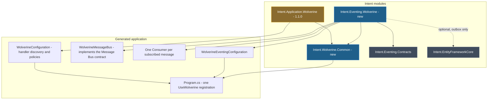
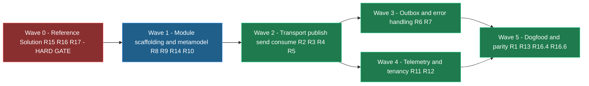

# Design Document

## Overview

This feature is built as **two new Intent modules plus one change to an existing one**, verified against **one hand-written reference solution**.

- **`Intent.Wolverine.Common`** — a new, thin shared module that owns the single `builder.Host.UseWolverine(opts => ...)` registration for an application and exposes an ordered contribution point any Wolverine module can add to. This is what makes R8's "exactly one Wolverine Host Configuration" true by construction rather than by luck.
- **`Intent.Eventing.Wolverine`** — the new Eventing Provider. It reads the Integration Events, Integration Commands and subscriptions already modelled in the Services designer, registers itself with the Contracts module's `MessageBusRegistry`, and generates the transport registration, publishing rules, listeners, Consumers, durability and error handling.
- **`Intent.Application.Wolverine`** — the existing CQRS module, updated to consume the shared host module instead of registering the host itself.
- **`Tests/Wolverine.Reference`** — the hand-written publisher/subscriber pair and its tests. Scope A. Built and green **before** any module artefact exists.

The provider-designation machinery this feature needs already exists and is not rebuilt. <ModelRef application="Eventing.Contracts" name="Message Bus Provider" designer="Module Builder" /> is an element type the Contracts module contributes to the Module Builder designer; declaring one instance is what makes a module selectable on the Message Bus stereotype. <ModelRef application="Eventing.Contracts" name="CompositeMessageBus" designer="Module Builder" /> and <ModelRef application="Eventing.Contracts" name="MessageBrokerRegistry" designer="Module Builder" /> already route per-message across providers, and `MessageBusExtensions.FilterMessagesForThisMessageBroker(...)` already raises the `ElementException` R9.4 asks for. The Wolverine module's job is to register itself correctly and filter through that helper — not to reimplement any of it.

<Callout id="scope-counts" tone="info" title="Scope in counts">

2 new module applications · 1 existing module changed · 3 module settings · 4 stereotype definitions · 9 C# templates · 6 factory extensions · 7 NuGet package declarations · 4 transports · 1 reference solution with 4 automated tests.

</Callout>

## Decisions confirmed with the user

<Callout id="d-shared-host" tone="decision" title="A shared host module owns the single UseWolverine registration">

A new module, `Intent.Wolverine.Common`, owns the one `builder.Host.UseWolverine(opts => ...)` chain statement in `Program.cs` and exposes an ordered contribution point. Transports, subscriptions, durability, discovery and policies stay in whichever module owns them; the shared module owns only the host hook.

**Why:** the alternative was for the eventing module to append into the chain statement that <FileRef path="../../../Modules/Intent.Modules.Application.Wolverine/FactoryExtensions/WolverineRegistrationFactoryExtension.cs" label="WolverineRegistrationFactoryExtension" /> creates. That works today only because that extension runs at `Order = 0` and calls `lambdaBlock.Statements.Clear()` before ours appends — R8.2 and R8.3 would then hold by ordering accident, and a future reorder would silently drop the eventing registrations. A single owner makes the invariant structural.

</Callout>

<Callout id="d-cqrs-change" tone="risk" title="Intent.Application.Wolverine changes in this spec, and it is already released">

`Intent.Application.Wolverine` goes from 1.0.2 to **1.1.0**: it takes a dependency on `Intent.Wolverine.Common`, stops calling `ConfigureHostBuilderChainStatement("UseWolverine", ...)` itself, and instead contributes `WolverineConfiguration.Configure(opts)` through the shared contribution point. Its own <FileRef path="../../../Modules/Intent.Modules.Application.Wolverine/Templates/WolverineConfiguration/WolverineConfigurationTemplatePartial.cs" label="WolverineConfiguration template" /> keeps its role, its type name and its file location, so applications on it see no moved files.

**Why:** R8.2 to R8.4 are unachievable without it — two modules cannot both own one registration. The risk is real and is accepted deliberately: a released module changes host-wiring behaviour, so the coexistence test application is a required part of this work rather than a nice-to-have, and the CQRS module's existing test applications must be regenerated and diffed before release. That module lives in `Intent.Modules.NET.Dispatchers.isln`, which is why the shared module joins both solutions.

</Callout>

<Callout id="d-version" tone="decision" title="WolverineFx is pinned to 5.39.5, locked">

Both new modules declare `WolverineFx` 5.39.5 with `locked: true`, matching the pin already in `Intent.Application.Wolverine`.

**Why:** one application may install both modules, and two different Wolverine majors in one project is not resolvable. 5.39.5 also still supports .NET 8, which 6.x drops, and R15.5 requires the reference solution to declare exactly what the module declares — one pin, one proof.

</Callout>

<Callout id="d-durability" tone="decision" title="Outbox durability follows the Entity Framework provider setting">

The Transactional Outbox setting stays exactly the two options R6.1 requires — None and Entity Framework. When it is Entity Framework, the durability package is resolved from `Intent.EntityFrameworkCore`'s own **Database Provider** setting: `sql-server` gets `WolverineFx.SqlServer`, `postgresql` gets `WolverineFx.Postgresql`. Every other provider — `in-memory`, `cosmos`, `my-sql`, `oracle`, `sql-lite` — stops the Software Factory with a `FriendlyException` naming the provider and the two supported ones.

**Why:** the developer has already told Intent which database they use; asking again as a Wolverine setting would be a second source of truth that can disagree with the DbContext. Wolverine ships durable storage only for SQL Server and PostgreSQL, so the unsupported providers need a stopping condition either way, and a named error at generation time is better than a runtime failure in a consumer's application.

</Callout>

<Callout id="d-nongoal-reading" tone="decision" title="PostgreSQL durability is not the excluded Marten path">

The requirements' non-goal reads "no Marten/PostgreSQL and no RavenDb persistence". This design reads that as excluding **Marten's** document-store durability (and RavenDb), not PostgreSQL as a database. `WolverineFx.Postgresql` durability sitting behind the application's own EF Core DbContext is the Entity Framework outbox R6.3 requires, on a different database engine.

**Why:** the alternative reading would make the chosen "follow the EF provider setting" answer contradict a non-goal. Marten remains out of scope: no `WolverineFx.Marten`, no document session, no `IDocumentStore`.

</Callout>

<Callout id="d-reference" tone="decision" title="The reference solution lives in Tests/Wolverine.Reference and starts its own broker">

A hand-written `Wolverine.Reference.sln` with `Publisher`, `Subscriber` and `Tests` projects, under `Tests/Wolverine.Reference/`. RabbitMQ is started by Testcontainers so R17.1 to R17.4 run unattended. It carries no `.application.config`, which is what marks it as hand-written ground truth rather than a generated test application.

**Why:** R17.5 makes the tests a gate on all module work, and a gate that needs a human to start a broker first is a gate that gets skipped. Sitting beside the other test applications keeps the whole verification estate in one place.

</Callout>

<Callout id="d-solutions" tone="decision" title="The shared module belongs to both eventing and dispatcher solutions">

`Intent.Wolverine.Common` is added as an application to both `Modules/Intent.Modules.NET.Eventing.isln` and `Modules/Intent.Modules.NET.Dispatchers.isln`.

**Why:** both of its consumers are edited by this spec — the eventing module in the first solution, the CQRS module in the second. Belonging to both means neither change needs a solution switch mid-wave.

</Callout>

<Callout id="d-consumer-shape" tone="decision" title="One concrete generated Consumer per subscribed message">

Each subscribed Integration Event or Integration Command gets its own generated `<MessageName>Consumer` class in the Infrastructure layer, discovered by Wolverine's naming convention, delegating to `IIntegrationEventHandler<T>`. There is no single open-generic consumer.

**Why:** this mirrors <ModelRef application="Eventing.MassTransit" name="IntegrationEventConsumer" designer="Module Builder" /> and satisfies R5.1's "exactly one Consumer" literally. It also avoids the trap the NServiceBus module hit, where an open generic handler is invisible to the framework's own discovery and needs explicit registry manipulation to compensate. Wolverine's convention-based discovery of concrete types is the documented path, and Wave 0 proves it before any template is written.

</Callout>

<Callout id="d-designation" tone="decision" title="Provider designation reuses the Contracts module's existing machinery">

R9 is realized entirely through capabilities that already exist: a `Message Bus Provider` element declares Wolverine selectable, a factory extension calls `MessageBusRegistry.Register(...)` at `OnAfterMetadataLoad`, and every message query in every template runs through `FilterMessagesForThisMessageBroker(...)`.

**Why:** that helper already implements inheritance from folder and package, already returns everything when only one provider is installed (R9.2), and already throws the element-highlighting exception R9.4 describes. Writing a Wolverine-specific equivalent would be a second implementation of a rule that must stay identical across six provider modules.

</Callout>

## Module & architecture prerequisites

<Callout id="prereqs" tone="warning" title="Prerequisites that block the first model wave">

**Nothing needs to be sourced from a module feed.** Every Intent module this work depends on is already in this repository or already installed.

Created before any model work:

1. **New application `Intent.Wolverine.Common`** — Module Builder architecture, output to `Modules/Intent.Modules.Wolverine.Common`, added to `Intent.Modules.NET.Eventing.isln` and `Intent.Modules.NET.Dispatchers.isln`.
2. **New application `Intent.Eventing.Wolverine`** — Module Builder architecture, output to `Modules/Intent.Modules.Eventing.Wolverine`, added to `Intent.Modules.NET.Eventing.isln`.

Declared module dependencies of `Intent.Eventing.Wolverine`: `Intent.Eventing.Contracts` (satisfies R14.4 — installing this module brings the message contracts with it), `Intent.Wolverine.Common`, `Intent.Modelers.Services`, `Intent.Common.CSharp`, `Intent.OutputManager.RoslynWeaver`. Minimum-compatible (not installed) entries: `Intent.EntityFrameworkCore` 5.0.47 for R6, `Intent.OpenTelemetry` for R11, `Intent.AspNetCore.MultiTenancy` for R12.

Test applications needed for the acceptance matrix — each an Intent application, created in the dogfood wave: a RabbitMQ publish/subscribe pair, one Azure Service Bus pair, one Amazon SQS pair, one EF-outbox pair, one composite pair with MassTransit alongside, and one coexistence application with `Intent.Application.Wolverine` installed.

</Callout>

## Architecture

The shared module contributes the host statement once. Both Wolverine modules hand it a `WolverineOptions` contribution with an order, so the emitted lambda contains one call per installed module and nothing else. When only the eventing module is installed the lambda holds one call and the application is complete on its own (R8.5); when only the CQRS module is installed the lambda is exactly what it is today (R8.4).

## Scope A — the Reference Solution

Scope A is built first and is never edited to match generated output (R16.5). Everything in it is hand-written (R15.6).

<Table
  id="reference-projects"
  caption="R15.1 / R15.2 — Reference Solution composition"
  columns={["Project", "Purpose", "Declared packages"]}
  rows={[
    ["`Wolverine.Reference.Publisher`", "Raises one Integration Event and sends one Integration Command through a hand-written Message Bus contract implementation", "`WolverineFx` 5.39.5; one transport package for the transport under test; `WolverineFx.EntityFrameworkCore` + `WolverineFx.SqlServer` for the outbox run only"],
    ["`Wolverine.Reference.Subscriber`", "Hosts one Consumer per message, each delegating to an `IIntegrationEventHandler<T>` implementation", "Same as the publisher"],
    ["`Wolverine.Reference.Tests`", "xUnit, Testcontainers for RabbitMQ and SQL Server, asserts R17.1 to R17.4", "`xunit`, `Testcontainers.RabbitMq`, `Testcontainers.MsSql`, `Shouldly`"],
    ["`Wolverine.Reference.Contracts`", "The two message types and the hand-written `IIntegrationEventHandler<T>` / message bus interfaces the generated code will own", "None beyond the framework"]
  ]}
/>

Every version declared here is the version the module declares (R15.5). The licence inventory R10.3 requires is produced from this project's package list, not from the module's — the reference solution is what proves the guarantee, and it runs with no licence key and no licence file present (R15.4).

### Golden Sample correspondence

R16.2 requires each Golden Sample to name exactly one generated artefact. That correspondence is this table, and it is the verification contract for the whole of Scope B.

<Table
  id="golden-samples"
  caption="R16.1 / R16.2 — Golden Sample to generated artefact correspondence"
  columns={["Golden Sample (hand-written)", "Generated counterpart", "Owned by", "Requirements verified"]}
  rows={[
    ["`Program.cs` host registration", "The single `UseWolverine` chain statement", "`Intent.Wolverine.Common` factory extension", "R8.2, R8.3, R8.5"],
    ["`WolverineEventingConfiguration.cs`", "`WolverineEventingConfiguration` template", "`Intent.Eventing.Wolverine`", "R2.2, R3.1, R4.1, R6.3, R7.2, R9.3"],
    ["`WolverineMessageBus.cs`", "`WolverineMessageBus` template", "`Intent.Eventing.Wolverine`", "R3.1, R4.1, R9.6, R12.1"],
    ["One `<Message>Consumer.cs` per subscribed message", "`IntegrationEventConsumer` template, one instance per subscription", "`Intent.Eventing.Wolverine`", "R5.1, R5.2, R5.5, R5.6, R12.2"],
    ["`appsettings.json` transport and error-handling sections", "`AppSettingRegistrationRequest` emissions", "`Intent.Eventing.Wolverine` factory extension", "R2.3, R7.2, R12.3"],
    ["The failing-handler and rollback test fixtures", "Nothing — they stay hand-written proof", "`Tests/Wolverine.Reference`", "R17.3, R17.4"]
  ]}
/>

## Scope B — model changes

All model work is in the **Module Builder** designer of the three module applications. There is no Domain or Services model change anywhere in this feature: R1.1 explicitly forbids introducing a designer or a message element type, so the Services designer is only ever read.

### `Intent.Wolverine.Common`

<ModelChanges id="mc-common" caption="New module application — Intent.Wolverine.Common" changes={[
  { element: "Intent.Wolverine.Common", designer: "Module Builder", change: "added", note: "Intent Module package, version 1.0.0",
    fields: [{ label: "Module id", after: "`Intent.Wolverine.Common`" }, { label: "Output", after: "`Modules/Intent.Modules.Wolverine.Common`" }] },
  { element: "WolverineFx", designer: "Module Builder", change: "added", note: "NuGet Package declaration",
    fields: [{ label: "net8.0 and above", after: "5.39.5, locked" }] },
  { element: "WolverineHostRegistrationExtension", designer: "Module Builder", change: "added", note: "Factory Extension, Order 0 — owns the single UseWolverine chain statement and exposes the ordered contribution point" }
]} />

The contribution point is the only public surface: a static registry a Wolverine module calls at `OnAfterTemplateRegistrations` with a statement factory and an order. The host extension gathers every contribution, then writes one `UseWolverine` chain statement per host program template, appending contributions in order and clearing nothing. Applications with two hosts get one registration each, matching the plural-lookup pattern the CQRS module already uses.

### `Intent.Eventing.Wolverine`

<ModelChanges id="mc-eventing" caption="New module application — Intent.Eventing.Wolverine" changes={[
  { element: "Intent.Eventing.Wolverine", designer: "Module Builder", change: "added", note: "Intent Module package, version 1.0.0-pre.0" },
  { element: "Wolverine", designer: "Module Builder", change: "added", note: "Message Bus Provider element — its element id becomes the WolverineMessageBusId passed to MessageBusRegistry.Register",
    fields: [{ label: "Applicable Stereotypes", after: "Wolverine Message, Message Topology Settings" }] },
  { element: "Wolverine Message Bus Settings", designer: "Module Builder", change: "added", note: "Module Settings Configuration — application settings, exactly three fields" },
  { element: "Wolverine Message", designer: "Module Builder", change: "added", note: "Stereotype Definition on Message and Integration Command — provider designation marker, no properties" },
  { element: "Message Topology Settings", designer: "Module Builder", change: "added", note: "Stereotype Definition on Message — carries the Topic Name override" },
  { element: "Command Distribution", designer: "Module Builder", change: "added", note: "Stereotype Definition on the Send Integration Command target end — carries the Destination Queue Name override" },
  { element: "Command Consumption", designer: "Module Builder", change: "added", note: "Stereotype Definition on the Subscribe Integration Command target end — carries the Queue Name override" }
]} />

The four stereotype definitions are deliberately name-for-name and property-for-property with the MassTransit module's, so a migrator's model reads the same and R1.3's "zero designer changes" is literally true for names as well as structure.

<DataModel
  id="module-settings"
  entity="Wolverine Message Bus Settings — the three module settings (R14.2)"
  caption="Each is a select field on the application settings group"
  fields={[
    { name: "Transport", type: "select — `local`, `rabbitmq`, `azure-service-bus`, `amazon-sqs`", change: "added", note: "Default `local`. Hint must state that Local is in-process only and non-durable (R2.5)" },
    { name: "Transactional Outbox", type: "select — `none`, `entity-framework`", change: "added", note: "Default `none`. Hint must state that Wolverine has no in-memory outbox (R6.7)" },
    { name: "Error Handling Policy", type: "select — `none`, `retry`, `retry-with-cooldown`, `schedule-retry`", change: "added", note: "Default `retry-with-cooldown`" }
  ]}
/>

<DataModel
  id="stereotype-properties"
  entity="Stereotype properties, and the MassTransit stereotype each mirrors"
  caption="R3.3 / R4.3 — override placement matches the MassTransit module exactly"
  fields={[
    { name: "`Message Topology Settings.EntityName`", type: "string, optional", change: "added", note: "Topic Name override on an Integration Event. Mirrors MassTransit stereotype `fc095295`" },
    { name: "`Command Distribution.DestinationQueueName`", type: "string, optional", change: "added", note: "Override on the sending association. Mirrors MassTransit stereotype `5cae1c25`" },
    { name: "`Command Consumption.QueueName`", type: "string, optional", change: "added", note: "Override on the subscribing handler method. Mirrors MassTransit stereotype `ced769d7`" },
    { name: "`Wolverine Message`", type: "marker, no properties", change: "added", note: "Designation only. Mirrors MassTransit stereotype `19664e24`" }
  ]}
/>

Both name overrides are validated at Software Factory time, in the template that reads them, with an `ElementException` carrying the offending element: empty-after-trim stops generation and never falls back to the convention name (R3.5, R4.5), and over 250 characters stops generation naming the limit (R3.6, R4.6). Two messages resolving to one destination is explicitly allowed and generates without complaint (R3.7, R4.7).

### Templates

<Table
  id="templates"
  caption="C# templates in Intent.Eventing.Wolverine — all C# File Builder"
  density="compact"
  columns={["Template", "Cardinality", "Role", "Generates"]}
  rows={[
    ["`WolverineEventingConfiguration`", "One per application", "`Infrastructure.DependencyInjection.Wolverine`, plus `FulfillsRole(TemplateRoles.Application.Eventing.MessageBusConfiguration)`", "Transport registration, publish rules per event, send rules per command, listeners per subscription, durability, error-handling policy, and the `AddWolverineEventingConfiguration` DI entry point the composite bus discovers"],
    ["`WolverineMessageBus`", "One per application", "`Infrastructure.Eventing.WolverineMessageBus`", "The Message Bus contract implementation over Wolverine's own bus, aliased at the using site so the two `IMessageBus` types can never be confused (R8.3 risk)"],
    ["`IntegrationEventConsumer`", "One per subscribed message", "`Infrastructure.Eventing.Consumer`", "The Consumer that receives from the transport and invokes `IIntegrationEventHandler<T>` with the message and a cancellation token"],
    ["`WolverineOutboxConfiguration`", "One per application, outbox only", "`Infrastructure.Eventing.WolverineOutbox`", "The EF Core durability registration and the provider-specific durable storage call"],
    ["`FinbucklePublishingMiddleware`", "One per application, tenancy only", "`Infrastructure.Eventing.FinbucklePublishingMiddleware`", "Writes the Tenant Identifier header on outgoing messages (R12.1)"],
    ["`FinbuckleConsumingMiddleware`", "One per application, tenancy only", "`Infrastructure.Eventing.FinbuckleConsumingMiddleware`", "Establishes and restores tenant context around the handler call (R12.2, R12.4)"],
    ["`FinbuckleMessageHeaderStrategy`", "One per application, tenancy only", "`Infrastructure.Eventing.FinbuckleMessageHeaderStrategy`", "The configurable header name, defaulting to `Tenant-Identifier` (R12.3)"],
    ["`Documentation`", "Module Documentation", "n/a", "Four topics: configuring Wolverine, migrating from MassTransit, multi-tenancy, and the package licence inventory"]
  ]}
/>

<Table
  id="factory-extensions"
  caption="Factory extensions in Intent.Eventing.Wolverine"
  density="compact"
  columns={["Extension", "Phase", "Responsibility"]}
  rows={[
    ["`MessageBusRegistrationExtension`", "`OnAfterMetadataLoad`", "`MessageBusRegistry.Register(WolverineMessageBusId, BrokerStereotypeIds)` — makes composite mode and per-message filtering work (R9.1)"],
    ["`WolverineHostContributionExtension`", "`OnAfterTemplateRegistrations`", "Contributes the eventing configuration call into the shared module's ordered contribution point (R8.2)"],
    ["`WolverineAppSettingsExtension`", "`OnBeforeTemplateExecution`", "Emits the `Wolverine:` sections and keys for the selected transport and error-handling policy, with the defaults in R2 and R7"],
    ["`WolverineMessageBusInteropExtension`", "`OnBeforeTemplateExecution`", "When the outbox is on, injects the flush call into `DbContext.SaveChanges`/`SaveChangesAsync` so a commit dispatches its messages (R6.3)"],
    ["`TelemetryConfiguratorExtension`", "`OnBeforeTemplateExecution`", "Registers Wolverine as a telemetry source only when `Intent.OpenTelemetry` is installed (R11)"],
    ["`FinbuckleConfiguratorExtension`", "`OnBeforeTemplateExecution`", "Registers the tenancy middleware only when the multi-tenancy module is installed (R12.5)"]
  ]}
/>

### Changes to `Intent.Application.Wolverine`

<FileTree
  id="cqrs-files"
  title="Existing files this spec changes"
  entries={[
    { path: "../../../Modules/Intent.Modules.Application.Wolverine/FactoryExtensions/WolverineRegistrationFactoryExtension.cs", change: "modified", note: "Stops owning the chain statement; contributes Configure(opts) to the shared point instead" },
    { path: "../../../Modules/Intent.Modules.Application.Wolverine/Intent.Application.Wolverine.imodspec", change: "modified", note: "Version 1.0.2 to 1.1.0; adds the Intent.Wolverine.Common dependency" },
    { path: "../../../Modules/Intent.Modules.Application.Wolverine/CONTEXT.md", change: "modified", note: "Records that host registration is no longer this module's to own" }
  ]}
/>

`WolverineConfiguration.Configure(WolverineOptions opts)` keeps its signature, its template id and its file location, so no generated file moves for an application already on this module. The only observable change is which module wrote the `UseWolverine` statement in `Program.cs`.

## Realization plan

Every requirement below names one of three mechanisms: **existing module capability** (something Contracts, EF Core or the SDK already does), **modelled Module Builder element** (a template, stereotype, setting, package or factory extension the schema defines), or **hand-written code** in a template partial or factory-extension body. The Module Builder generates every registration and file shell; the bodies marked `[code]` are the hand-written part.

<Table
  id="realization"
  caption="Per-requirement realization plan — the projection sdd-tasks builds its task list from"
  density="compact"
  columns={["Req", "Mechanism", "[model]", "[code]", "Depends on"]}
  rows={[
    ["R1", "Existing capability — the Services designer is read only", "Nothing", "Message queries in every template read `MetadataManager` and filter through `FilterMessagesForThisMessageBroker`", "R15, R16"],
    ["R2", "Modelled setting + template + factory extension", "`Transport` setting field; four transport NuGet Package declarations", "Transport branch in `WolverineEventingConfiguration`; `appsettings` emissions in `WolverineAppSettingsExtension`", "R15"],
    ["R3", "Modelled stereotype + template", "`Message Topology Settings` stereotype with `EntityName`; `Wolverine Message` stereotype", "Kebab-case convention, override resolution and both validations in the configuration and message-bus templates", "R2"],
    ["R4", "Modelled stereotypes + template", "`Command Distribution` and `Command Consumption` stereotypes", "Send-rule and listener generation, override resolution and both validations", "R2"],
    ["R5", "Modelled template, one instance per subscription", "`IntegrationEventConsumer` C# Template, model type Integration Event Handler", "Consumer body: resolve handler, invoke with message and token, let exceptions propagate", "R3, R4"],
    ["R6", "Modelled setting + template + interop extension; EF provider read from the existing module", "`Transactional Outbox` setting; `WolverineOutboxConfiguration` template; EF Core and durability NuGet declarations", "Durability registration, provider switch, unsupported-provider `FriendlyException`, missing-module guard, `SaveChanges` flush injection", "R2, R5"],
    ["R7", "Modelled setting + template + factory extension", "`Error Handling Policy` setting field", "Policy registration per option; delay-list reading; `appsettings` keys and defaults", "R2, R5"],
    ["R8", "New shared module — modelled factory extension plus a changed existing module", "`Intent.Wolverine.Common` package, `WolverineFx` declaration, `WolverineHostRegistrationExtension`", "Contribution registry, single chain-statement emission, and the CQRS module's rewritten contribution", "R15"],
    ["R9", "Existing capability — `MessageBusRegistry` and `FilterMessagesForThisMessageBroker`", "`Wolverine` Message Bus Provider element; `MessageBusRegistrationExtension`", "`Constants.BrokerStereotypeIds`; every message query routed through the filter", "R3, R4, R5"],
    ["R10", "Modelled NuGet declarations + documentation", "Seven NuGet Package declarations, all locked; one Documentation Topic", "Licence inventory content, written from the reference solution's package list", "R15"],
    ["R11", "Existing capability — the OpenTelemetry module's registration point", "`TelemetryConfiguratorExtension`", "Conditional source registration; no package reference when absent", "R2"],
    ["R12", "Modelled templates + factory extension", "Three Finbuckle templates; `FinbuckleConfiguratorExtension`", "Header write, tenant establish and restore, absent-header path, header-name setting", "R5"],
    ["R13", "Modelled documentation", "Documentation Topic — migrating from MassTransit", "Ordered steps, the settings equivalence table, the leftover-artefact list, the wire-format statement, the staged path", "R2, R6, R7, R9"],
    ["R14", "Modelled module manifest", "Module dependencies, three settings, module icon and description", "Nothing beyond the manifest", "R2, R6, R7"],
    ["R15", "Hand-written reference solution", "Nothing — no Intent model involved", "Four projects, both applications, the message contracts and the hand-written bus", "None — this is the first wave"],
    ["R16", "Hand-written reference solution + the correspondence table above", "Nothing", "Every Golden Sample artefact; the recorded diff justifications", "R15"],
    ["R17", "Hand-written tests", "Nothing", "Four xUnit tests plus the Testcontainers fixtures", "R15, R16"]
  ]}
/>

## Modelling order and build order

Wave 0 is non-negotiable: R17.5 and R17.6 make green reference tests the precondition for any module artefact, and R16.5 makes the reference solution the thing that never bends. If a Wave 0 test cannot be made to pass, the reference solution is revised and re-verified — module work does not start around it.

There is no Domain → Services → UI ordering question in this feature, because no application designer is mutated. The ordering that matters instead is **shared module before its consumers**: `Intent.Wolverine.Common` and its contribution point must exist before either the eventing module contributes to it or the CQRS module is rewritten onto it, which is why R8 sits in the first model wave rather than beside the coexistence tests it serves.

## Code placement

The `[code]` bucket here is unusual and worth being precise about, because "hand-written" means something specific in a module-building spec. The Module Builder owns every file shell: template registration classes, `[IntentManaged(Mode.Fully)]` partials, factory-extension scaffolds, the `Api/*StereotypeExtensions.cs` accessors and `NugetPackages.cs` are all generated from the model and must never be hand-edited. What is hand-written is the body inside the merge regions — the fluent `CSharpFile` construction in each template partial, and the logic in each factory extension override.

Placement is therefore **after** each wave's model work rather than interleaved: a template's partial cannot be written before the model element that generates its shell exists. Within a wave the sequence is model change, Software Factory run against the module application, then bodies.

Two bodies are worth specifying now because they are where this design is most likely to be got wrong.

<AnnotatedCode
  id="host-contribution"
  filename="Modules/Intent.Modules.Wolverine.Common/WolverineHostContributions.cs"
  language="csharp"
  code={`public static class WolverineHostContributions\n{\n    private static readonly List<(int Order, Action<ICSharpFileBuilderTemplate, string> Write)> Contributions = new();\n\n    public static void Contribute(int order, Action<ICSharpFileBuilderTemplate, string> write)\n        => Contributions.Add((order, write));\n\n    internal static IReadOnlyList<(int Order, Action<ICSharpFileBuilderTemplate, string> Write)> Ordered()\n        => Contributions.OrderBy(x => x.Order).ToList();\n}`}
  annotations={[
    { lines: "3", label: "Order, not registration sequence", note: "Factory-extension execution order is not a contract. An explicit order keeps discovery ahead of transport registration deterministically." },
    { lines: "6", label: "The lambda receives the opts variable name", note: "The host extension owns the lambda and its parameter name, so a contributor never guesses at `opts`." },
    { lines: "9", label: "No Clear anywhere", note: "The failure mode this whole module exists to remove: one owner writes the statement, contributors only append." }
  ]}
/>

The second is the `IMessageBus` collision R8.3 calls out. Wolverine's publishing interface and the Contracts module's bus contract share a name, and in a coexistence application both are in scope in the same file. The generated bus implementation resolves this with an alias at the using site rather than fully-qualified names inline, so the injected dependency is unambiguous on sight.

<Code
  id="bus-alias"
  filename="Infrastructure/Eventing/WolverineMessageBus.cs"
  language="csharp"
  caption="Generated shape — the alias is what stops a developer injecting the wrong IMessageBus"
  code={`using WolverineBus = Wolverine.IMessageBus;\n\npublic class WolverineMessageBus : IMessageBus\n{\n    private readonly WolverineBus _bus;\n\n    public WolverineMessageBus(WolverineBus bus) => _bus = bus;\n}`}
/>

## Known gap against the requirements

<Callout id="gap-appsettings" tone="risk" title="R2.4 and R7.4 cannot remove appsettings.json keys">

R2.4 and R7.4 require that changing the Transport or the Error Handling Policy **removes** the previous choice's `appsettings.json` section. The Intent SDK's app-settings mechanism is additive only — `AppSettingRegistrationRequest` adds or updates a key, and there is no removal or prune request. `appsettings.json` is also a developer-owned file, so a module pruning it would be reaching outside what it owns.

**Resolution taken:** both criteria are met for the half that is generated — the Wolverine host configuration is fully generated, so the previous transport's and policy's *registrations* genuinely disappear on the next run. The stale `appsettings.json` keys are left in place and documented: the configuring-Wolverine topic and the migration guide both list which sections to delete by hand after a settings change. This needs your acknowledgement, or a requirements amendment narrowing R2.4 and R7.4 to registrations — it is recorded here rather than silently dropped.

</Callout>

## Assumptions

<Checklist
  id="design-assumptions"
  items={[
    { id: "a1", label: "The seven `WolverineFx.*` package names are as declared", note: "`WolverineFx`, `.RabbitMQ`, `.AzureServiceBus`, `.AmazonSqs`, `.EntityFrameworkCore`, `.SqlServer`, `.Postgresql`. Names and 5.39.5 availability are proven by the reference solution compiling in Wave 0, not asserted here." },
    { id: "a2", label: "Wolverine discovers a concrete `<Message>Consumer` class by naming convention", note: "The whole Consumer design rests on this. Wave 0 proves it with a hand-written consumer before any template is written; if it fails, explicit `IncludeType` registration is the fallback and the configuration template grows a registration block." },
    { id: "a3", label: "Wolverine's error-handling policies map onto the four options", note: "None, Retry, Retry with cooldown and Schedule retry map to Wolverine's retry, cooldown and scheduled-retry continuations. R17.3 is the test that proves the mapping, including R7.5's empty-delay-list degradation." },
    { id: "a4", label: "The EF Core outbox shares the application's DbContext connection and transaction", note: "Wolverine's EF Core integration enlists in the ambient transaction, which is what makes R6.3's both-or-neither guarantee true. R17.4 is the proof." },
    { id: "a5", label: "PostgreSQL durability via EF Core is not the excluded Marten path", note: "Recorded as a decision above. If you read the non-goal as excluding PostgreSQL entirely, say so and the durability switch narrows to SQL Server only." },
    { id: "a6", label: "Stale `appsettings.json` sections after a settings change are documented, not removed", note: "See the known gap above. The only assumption in this design that leaves an acceptance criterion partially met." },
    { id: "a7", label: "Changing the CQRS module's host registration is a minor version bump, not a major one", note: "No generated file moves and no public type changes, so 1.1.0. If existing applications show a diff beyond the `Program.cs` statement's authorship, this becomes a major." }
  ]}
/>

<ApprovalGate id="approve-design" phase="design" title="Approve this design?">

Approving means: two new modules (`Intent.Wolverine.Common`, `Intent.Eventing.Wolverine`), a minor version bump and host-registration rewrite of the released `Intent.Application.Wolverine`, a hand-written reference solution under `Tests/Wolverine.Reference` as the hard gate, and the R2.4 / R7.4 narrowing recorded in the known gap above.

</ApprovalGate>
