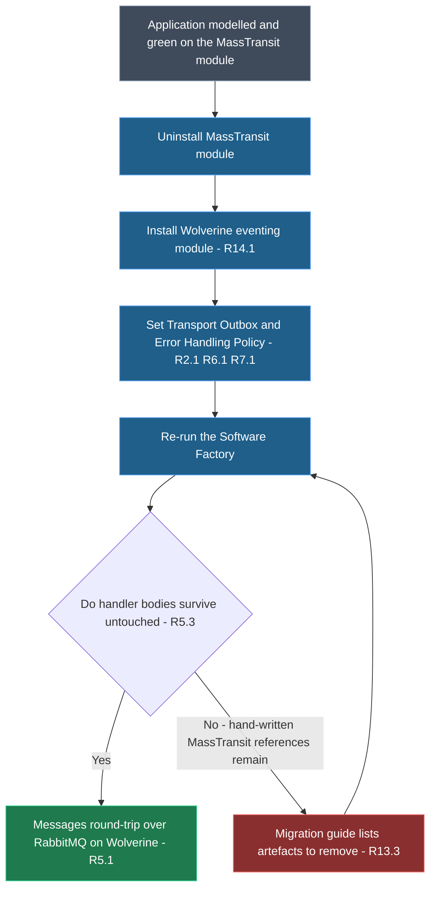
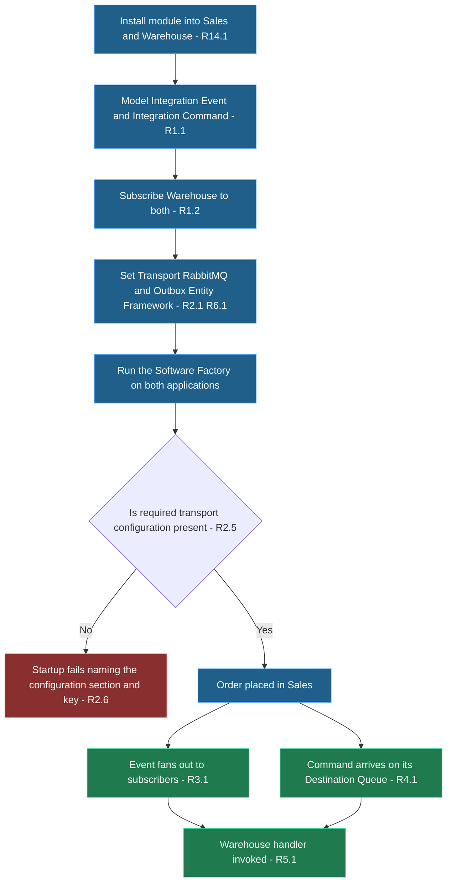
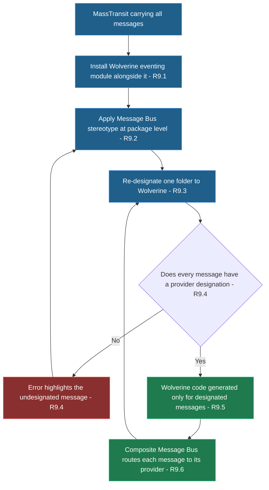
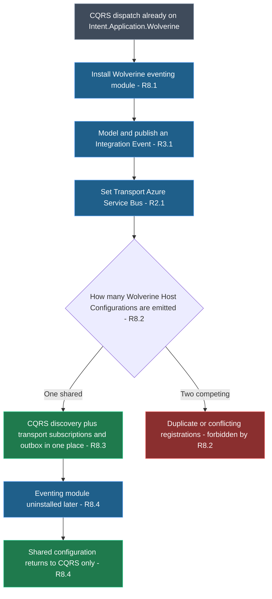

# Requirements Document

## Introduction

This feature adds a new Intent Architect module that generates cross-application integration messaging over a message broker using WolverineFx. It consumes the same Integration Event and Integration Command modelling already used by the MassTransit and NServiceBus eventing modules, and generates the broker configuration, publishing implementation, and consumers that carry those messages between applications. It serves .NET teams building Intent Architect applications who need a permissively-licensed message broker provider.

Explicitly out of scope: wire-format compatibility with messages already published by MassTransit, draining or replaying messages sitting in existing MassTransit queues, scheduled or delayed publishing, request/response over the bus, and any transport beyond Local, RabbitMQ, Azure Service Bus and Amazon SQS.

## Vision

MassTransit's free line has moved to commercial licensing and is no longer maintained. Teams who adopted it on the strength of it being free now face either a licence negotiation or an unmaintained dependency, and today Intent Architect offers them no maintained alternative that covers the same brokers with the same durability guarantees. That is a commercial risk sitting inside generated code, which is exactly the kind of risk Intent Architect exists to absorb on a team's behalf.

After this feature, a team can uninstall the MassTransit module, install this one, re-run the Software Factory, and keep every modelled message, every publisher/subscriber relationship, and every hand-written Integration Event Handler body exactly as it was. The licence exposure disappears without a re-model and without rewriting business logic. For teams starting fresh, cross-application messaging becomes available with no licence conversation at all.

## Target Users & Jobs To Be Done

- **Solution architect** — evaluating an exit from commercially-licensed MassTransit, and needs to establish that the replacement covers the same brokers and the same transactional-outbox guarantee before committing a portfolio of applications to it.
- **Application developer on an existing MassTransit application** — wants the transport swapped underneath with the smallest possible amount of hand-written change, and in particular without touching handler bodies that already carry tested business logic.
- **Application developer on a new application** — wants cross-application messaging that works out of the box against a locally-runnable broker, with no licensing decision to escalate.
- **Application developer running a staged migration** — needs some messages still flowing over MassTransit while others move to Wolverine, so a large application can be cut over message-by-message rather than all at once.
- **Application developer already using Wolverine for CQRS** — has `Intent.Application.Wolverine` dispatching commands and queries in-process, and wants integration messaging on the same runtime rather than a second messaging framework alongside it.

## Key User Journeys

- **UJ-1. Priya swaps MassTransit for Wolverine in an existing application.**
  - **Persona + context:** Priya maintains a Clean Architecture order-management application that publishes three Integration Events and consumes two, over RabbitMQ, with the Entity Framework outbox on. Her licence review flagged MassTransit.
  - **Entry state:** The application is modelled and green. The MassTransit module is installed and its settings are configured.
  - **Path:** She uninstalls the MassTransit module; installs the Wolverine eventing module; sets Transport to RabbitMQ, Transactional Outbox to Entity Framework, and Error Handling Policy to Retry with cooldown; re-runs the Software Factory; reviews the staged changes.
  - **Climax:** The staged diff replaces the MassTransit configuration and consumers with Wolverine equivalents and leaves every Integration Event Handler body untouched. The application builds, starts, and round-trips a message over RabbitMQ.
  - **Resolution:** Same modelled messages, same handler code, no commercially-licensed dependency.
  - **Edge case:** Hand-written code elsewhere in the application still references MassTransit types directly, so the build fails after the swap. The migration guide's list of MassTransit-specific artefacts tells her exactly which references to remove.

- **UJ-2. Marco stands up cross-application messaging on a greenfield pair.**
  - **Persona + context:** Marco is building two new Clean Architecture applications — a Sales application that raises an Integration Event when an order is placed and sends an Integration Command to request fulfilment, and a Warehouse application that consumes both.
  - **Entry state:** Both applications exist and are modelled. Neither has any eventing module installed. RabbitMQ is running locally in Docker.
  - **Path:** He installs the Wolverine eventing module into both; models the Integration Event and Integration Command in Sales and subscribes to them in Warehouse; sets Transport to RabbitMQ in both; turns the Transactional Outbox to Entity Framework in Sales; runs the Software Factory on both.
  - **Climax:** He runs both applications, places an order in Sales, and sees the Warehouse handler hit — the event fanned out and the command arrived on its Destination Queue.
  - **Resolution:** Two applications integrated over a broker, with outgoing messages committed in the same transaction as the order.
  - **Edge case:** He forgets to set the RabbitMQ credentials in `appsettings.json`, so the Sales application fails at startup with an error naming the configuration section and key rather than silently falling back to Local.

- **UJ-3. Aisha cuts a large application over one message at a time.**
  - **Persona + context:** Aisha owns an application publishing fourteen Integration Events over MassTransit. A big-bang cutover is unacceptable, so she needs to move them in batches while both providers run.
  - **Entry state:** The MassTransit module is installed and carrying all fourteen messages. No provider designation exists anywhere, because MassTransit was the only Eventing Provider.
  - **Path:** She installs the Wolverine eventing module alongside MassTransit; the Software Factory now requires a provider designation, so she applies the Message Bus stereotype at the package level naming MassTransit; she moves one folder of messages to name Wolverine instead; re-runs the Software Factory.
  - **Climax:** The staged output generates Wolverine consumers and configuration only for the designated folder and leaves the rest on MassTransit, with a Composite Message Bus routing each message to its provider.
  - **Resolution:** Both providers live in one application; she repeats the move folder by folder until MassTransit can be uninstalled.
  - **Edge case:** One message sits outside any folder carrying the stereotype, so generation stops with an error highlighting that specific message rather than quietly dropping it.

- **UJ-4. Tom adds integration messaging to an application already dispatching CQRS through Wolverine.**
  - **Persona + context:** Tom's application uses `Intent.Application.Wolverine` so its commands and queries are handled through Wolverine in-process. He now needs to publish Integration Events to a sibling application.
  - **Entry state:** `Intent.Application.Wolverine` is installed and generating its own Wolverine setup. No eventing module is installed.
  - **Path:** He installs the Wolverine eventing module; models an Integration Event and publishes it from a command handler; sets Transport to Azure Service Bus; runs the Software Factory.
  - **Climax:** One Wolverine Host Configuration comes out, carrying both his CQRS handler discovery and the new transport, subscriptions and outbox — not two competing setups.
  - **Resolution:** A single place to look when he needs to reason about how Wolverine is configured.
  - **Edge case:** He uninstalls the eventing module later; the shared configuration returns to CQRS-only rather than being left with orphaned transport registrations.

## Glossary

- **Integration Event** — a message published by one application for any number of interested applications to consume; fan-out semantics. Modelled in the Services designer. Zero or many subscribers per Integration Event.
- **Integration Command** — a message sent by one application to exactly one Destination Queue for point-to-point processing; ordering within a queue matters. One Destination Queue per Integration Command; many Integration Commands may share a Destination Queue.
- **Integration Event Handler** — the application-layer class carrying the business logic for one subscribed Integration Event or Integration Command, implementing `IIntegrationEventHandler<T>`. Hand-written body, generated signature. Exactly one per subscribed message per application.
- **Consumer** — the generated infrastructure-layer class that receives a message from the Transport and delegates to its Integration Event Handler. Exactly one Consumer per subscribed message per application. Fully generated; never hand-edited.
- **Message Bus contract** — the transport-agnostic interface application code publishes and sends through (`IMessageBus`, or `IEventBus` in legacy mode), owned by the `Intent.Eventing.Contracts` module. Distinct from Wolverine's own same-named interface.
- **Eventing Provider** — a module that implements the Message Bus contract over one messaging technology. This feature adds one. An application may have one or many installed.
- **Composite Message Bus** — the generated routing implementation of the Message Bus contract that appears when two or more Eventing Providers are installed, dispatching each message to the Eventing Provider(s) designated for it.
- **Message Bus stereotype** — the designer stereotype, owned by `Intent.Eventing.Contracts`, that designates which Eventing Provider(s) carry a message. Applied to a package, folder or individual message; inherited by children.
- **Transport** — the messaging technology carrying messages off the process: Local, RabbitMQ, Azure Service Bus or Amazon SQS. Exactly one Transport per application.
- **Transactional Outbox** — the mechanism that records outgoing messages in the application's database within the same transaction as the business change, then dispatches them, so a committed change can never lose its messages. Either off or backed by Entity Framework.
- **Error Handling Policy** — the rule deciding what happens when a Consumer throws: how many times and after what delays the message is re-delivered, and where it goes once those are exhausted. Exactly one per application.
- **Error Queue** — the broker destination a message lands on once its Error Handling Policy is exhausted, so it is retained rather than lost.
- **Topic Name** — the broker destination an Integration Event is published to. Derived by convention from the message type, optionally overridden per Integration Event.
- **Destination Queue Name** — the broker queue an Integration Command is sent to. Derived by convention from the message type, optionally overridden per send and per subscription.
- **Wolverine Host Configuration** — the single generated setup where Wolverine's transports, subscriptions, durability and handler discovery are registered for an application. Exactly one per application, shared with `Intent.Application.Wolverine` when both are installed.
- **Tenant Identifier** — the value identifying which tenant a message belongs to, carried in a message header so a Consumer can restore the publishing tenant's context.
- **Software Factory** — the Intent Architect process that turns the modelled application into generated code.

## Non-Goals

- **Wire-format compatibility with MassTransit.** A Wolverine publisher is not required to be consumable by a MassTransit subscriber, or vice versa. Messages in flight are not a migration concern.
- **Migrating existing messages.** No draining, replaying or re-shaping of messages sitting in existing MassTransit queues or error queues.
- **Automated settings carry-over.** Migration from MassTransit is documented, not automated; the developer re-chooses the Transport, Transactional Outbox and Error Handling Policy on the new module.
- **Detecting or reporting MassTransit remnants** after a swap. Leftover references surface as ordinary compilation errors, with the migration guide as the reference for what to remove.
- **Scheduled or delayed publishing.** No equivalent of `Intent.Eventing.MassTransit.Scheduling` in this release.
- **Request/response over the bus.** No equivalent of `Intent.Eventing.MassTransit.RequestResponse`, and no Service Proxy integration, in this release.
- **Transports beyond the four listed.** No Kafka, Pulsar or MQTT, even though Wolverine supports them.
- **Durability backends beyond Entity Framework.** No Marten/PostgreSQL and no RavenDb persistence.
- **Anything requiring a commercial licence key.** No generated code path may depend on a paid JasperFx or Critter Stack Pro feature.
- **In-process domain event dispatch.** Already covered by `Intent.Application.Wolverine.DomainEvents`.
- **Configurable message serialization.** One serialization format, not a setting.

## MVP Scope

### In Scope

- One installable module covering all four Transports and the Entity Framework Transactional Outbox — not the root-plus-companion split the MassTransit modules use.
- Publishing Integration Events and sending Integration Commands through the existing Message Bus contract.
- Generated Consumers delegating to hand-written `IIntegrationEventHandler<T>` implementations.
- Transactional Outbox of None or Entity Framework; Error Handling Policy of None, Retry, Retry with cooldown or Schedule retry.
- Optional Topic Name and Destination Queue Name overrides.
- Coexistence with `Intent.Application.Wolverine` on one shared Wolverine Host Configuration.
- Full participation in the Composite Message Bus alongside other Eventing Providers.
- OpenTelemetry instrumentation and Finbuckle multi-tenancy support when those modules are present.
- A documented MassTransit-to-Wolverine migration guide.
- Runtime proof: a publisher/subscriber application pair exercised end to end on each of the four Transports.

### Out of Scope for MVP

- Scheduled publishing and request/response — each was a separate companion module for MassTransit and each is substantial work in its own right.
- Kafka — already served by `Intent.Eventing.Kafka`, so the overlap buys little.
- Marten/PostgreSQL durability — Entity Framework covers the large majority of Intent Architect applications.
- Automated migration tooling — the value is unproven until real migrations have been observed.

## Success Metrics

**Primary**

- **SM-1**: Handler bodies preserved on migration — the number of hand-written `IIntegrationEventHandler<T>` method bodies requiring any edit when the reference application swaps from the MassTransit module to this one. Target: zero. Validates R1, R5, R13.
- **SM-2**: Transport coverage proven at runtime — the number of the four Transports demonstrated publishing and consuming across two applications. Target: four of four. Validates R2, R3, R4.
- **SM-3**: Licence exposure — the number of generated code paths that require a commercial JasperFx licence key to run. Target: zero. Validates R10.
- **SM-4**: Re-model cost on migration — the number of designer changes required to move an application from the MassTransit module to this one, excluding module settings. Target: zero. Validates R1.

**Counter-metrics (do not optimize)**

- **SM-C1**: Configuration burden — the number of module settings a developer must set to get a working RabbitMQ publish-and-consume, which must not exceed the three the MassTransit module needs. Counterbalances SM-1 and SM-2: parity must not be bought by pushing configuration onto the developer.
- **SM-C2**: Hand-written plumbing per message — the number of classes a developer must write by hand for one subscribed message, which must stay at one, the Integration Event Handler. Counterbalances SM-1: preserving handler bodies must not be bought by making the developer write Wolverine wiring.

## Requirements

### Requirement 1: Modelling parity with the existing eventing modules

**User Story:** As an application developer on an existing MassTransit application, I want the Wolverine module to read the messages I have already modelled, so that swapping providers costs me no designer work.

**Realizes:** UJ-1, UJ-2

#### Acceptance Criteria

1. THE Wolverine eventing module SHALL generate from Integration Events and Integration Commands modelled in the Services designer, using the same designer element types the MassTransit module consumes, and SHALL NOT introduce a new designer or a new message element type.
2. THE Wolverine eventing module SHALL generate from subscriptions modelled as an Integration Event Handler subscribing to an Integration Event or an Integration Command, using the same designer associations the MassTransit module consumes.
3. WHEN the MassTransit module is uninstalled and the Wolverine eventing module is installed into an application whose messages and subscriptions are unchanged, THE Software Factory SHALL generate a Consumer for every message that previously had one, and SHALL require zero designer changes to do so.
4. IF an application has no Integration Events and no Integration Commands modelled, THEN THE Software Factory SHALL still generate a valid Wolverine Host Configuration with zero subscriptions and zero Consumers, and the application SHALL start successfully.
5. WHEN the Software Factory is re-run with no change to the model or the module settings, THE Wolverine eventing module SHALL produce zero staged file changes.

### Requirement 2: Transport selection

**User Story:** As a solution architect, I want to choose which message broker carries my messages, so that the module fits the infrastructure my organisation already runs.

**Realizes:** UJ-2, UJ-4

<Table
  id="transport-bounds"
  caption="R2.2 / R2.3 — Transport options and the configuration each requires"
  columns={["Transport option", "appsettings section", "Keys — type, required, default", "Spans applications"]}
  rows={[
    ["Local — default", "none", "none", "No — in-process only"],
    ["RabbitMQ", "`Wolverine:RabbitMq`", "`Host` string required default `localhost`; `Port` integer optional default `5672`; `VirtualHost` string optional default `/`; `Username` string required default `guest`; `Password` string required default `guest`", "Yes"],
    ["Azure Service Bus", "`Wolverine:AzureServiceBus`", "`ConnectionString` string required, no default — emitted as an empty placeholder", "Yes"],
    ["Amazon SQS", "`Wolverine:AmazonSqs`", "`Region` string required, no default — emitted as an empty placeholder; `AccessKey` and `SecretKey` strings optional, omitted means the AWS default credential chain", "Yes"]
  ]}
/>

#### Acceptance Criteria

1. THE Wolverine eventing module SHALL expose a Transport module setting with exactly four options — Local, RabbitMQ, Azure Service Bus, Amazon SQS — defaulting to Local.
2. WHEN a Transport is selected, THE Software Factory SHALL register exactly that Transport in the Wolverine Host Configuration, and SHALL NOT register any other Transport.
3. WHEN a Transport is selected, THE Software Factory SHALL add that Transport's `appsettings.json` section and keys with the defaults given in the table above, and SHALL leave a key with no default as an empty string rather than inventing a value.
4. WHEN the Transport setting is changed and the Software Factory is re-run, THE Software Factory SHALL replace the previous Transport's registration and SHALL remove its `appsettings.json` section.
5. THE Local Transport SHALL be documented as in-process only and non-durable — it cannot carry messages between applications, and messages held in it are lost if the process stops.
6. IF a required configuration value for the selected Transport is absent or empty at runtime, THEN the application SHALL fail at startup with an error naming the configuration section and key, and SHALL NOT fall back to the Local Transport or to any default endpoint.

<Callout id="local-transport-risk" tone="risk" title="R2.5 — Local is a default that cannot do the job">

Local is the default so a freshly installed application runs without infrastructure, matching the MassTransit module's In Memory default. It is also the one Transport that cannot deliver the feature's core value, so the migration guide and the setting's own hint must both say so — a developer who leaves the default in place will see publishing appear to work and no other application ever receive anything.

</Callout>

### Requirement 3: Publishing Integration Events

**User Story:** As an application developer, I want to publish an Integration Event through the Message Bus contract, so that any number of other applications can react to it without my code knowing they exist.

**Realizes:** UJ-2, UJ-4

#### Acceptance Criteria

1. WHEN application code publishes an Integration Event through the Message Bus contract, THE generated implementation SHALL deliver it to that Integration Event's Topic Name on the configured Transport with fan-out semantics, so that every subscribed application receives its own copy.
2. THE Wolverine eventing module SHALL derive an Integration Event's Topic Name from its message type name converted to kebab-case when no override is present.
3. THE Wolverine eventing module SHALL provide an optional Topic Name override on an Integration Event, and WHEN one is present THE Software Factory SHALL use it in place of the convention-derived name.
4. WHEN a Topic Name override is present, THE Software Factory SHALL use it verbatim, without kebab-casing or otherwise transforming it.
5. IF a Topic Name override is present but empty or whitespace-only after trimming, THEN THE Software Factory SHALL stop with an error highlighting that Integration Event and SHALL NOT substitute the convention-derived name.
6. IF a Topic Name override is longer than 250 characters, THEN THE Software Factory SHALL stop with an error highlighting that Integration Event and naming the limit.
7. WHEN two Integration Events resolve to the same Topic Name, THE Software Factory SHALL generate both without error, since a shared destination is a legitimate ordering choice.

### Requirement 4: Sending Integration Commands

**User Story:** As an application developer, I want to send an Integration Command to a named queue, so that exactly one consumer processes it and related commands can be kept in order.

**Realizes:** UJ-2

#### Acceptance Criteria

1. WHEN application code sends an Integration Command through the Message Bus contract, THE generated implementation SHALL deliver it to that Integration Command's Destination Queue Name on the configured Transport with point-to-point semantics, so that exactly one consumer receives it.
2. THE Wolverine eventing module SHALL derive an Integration Command's Destination Queue Name from its message type name converted to kebab-case when no override is present.
3. THE Wolverine eventing module SHALL provide an optional Destination Queue Name override on the sending association and on the subscribing Integration Event Handler method, matching where the MassTransit module places it.
4. WHEN a Destination Queue Name override is present, THE Software Factory SHALL use it verbatim on both the sending and the subscribing side.
5. IF a Destination Queue Name override is present but empty or whitespace-only after trimming, THEN THE Software Factory SHALL stop with an error highlighting the association or handler method carrying it, and SHALL NOT substitute the convention-derived name.
6. IF a Destination Queue Name override is longer than 250 characters, THEN THE Software Factory SHALL stop with an error highlighting the association or handler method and naming the limit.
7. WHEN two or more Integration Commands resolve to the same Destination Queue Name, THE Software Factory SHALL generate all of them without error, since sharing a queue is how ordering between related commands is achieved.

<Callout id="name-validation-decision" tone="decision" title="R3.6 / R4.6 — 250 characters, and no broker-specific validation">

Names are validated only for emptiness and a 250-character ceiling, which sits below the tightest of the four brokers' limits. Per-broker character rules — which characters RabbitMQ permits in an exchange name, how Amazon SQS restricts a queue name — are deliberately left to the broker to reject at runtime rather than duplicated in the module, where they would drift out of date.

</Callout>

### Requirement 5: Consuming messages

**User Story:** As an application developer on an existing MassTransit application, I want the generated consumer to delegate to the same handler class I already have, so that my tested business logic survives the swap untouched.

**Realizes:** UJ-1, UJ-2

#### Acceptance Criteria

1. WHEN a message is subscribed to, THE Software Factory SHALL generate exactly one Consumer for it that receives the message from the Transport and invokes the matching `IIntegrationEventHandler<T>` implementation, passing the message and a cancellation token.
2. THE generated Consumer SHALL be fully generated infrastructure-layer code containing no business logic, and THE Integration Event Handler SHALL remain the only place a developer writes business logic for that message.
3. WHEN an application that previously used the MassTransit module is regenerated on the Wolverine eventing module, THE Software Factory SHALL leave every existing `IIntegrationEventHandler<T>` method body byte-for-byte unchanged.
4. WHEN a message is subscribed to and no Integration Event Handler implementation exists yet, THE Software Factory SHALL generate a handler class whose method body throws `NotImplementedException`, in a mode that preserves the developer's body on subsequent runs.
5. THE Software Factory SHALL register exactly one Consumer per subscribed message type per application, even when the Software Factory is run repeatedly.
6. IF an Integration Event Handler throws, THEN THE Consumer SHALL surface the failure to the configured Error Handling Policy rather than swallowing it.
7. WHEN a message arrives whose type no Consumer in the application handles, THE application SHALL NOT fail at startup or crash, and SHALL leave that message for the Transport's own unhandled-message behaviour.

### Requirement 6: Transactional Outbox

**User Story:** As a solution architect, I want outgoing messages committed in the same transaction as the business change that produced them, so that a committed change can never silently lose its messages.

**Realizes:** UJ-2

#### Acceptance Criteria

1. THE Wolverine eventing module SHALL expose a Transactional Outbox module setting with exactly two options — None and Entity Framework — defaulting to None.
2. WHEN Transactional Outbox is None, THE Software Factory SHALL generate publishing and sending that goes straight to the Transport with no durable store, and SHALL NOT require any database.
3. WHEN Transactional Outbox is Entity Framework, THE Software Factory SHALL generate a durable outbox and inbox backed by the application's Entity Framework database, such that a message published inside a transaction is dispatched if and only if that transaction commits.
4. IF Transactional Outbox is Entity Framework and the `Intent.EntityFrameworkCore` module is not installed, THEN THE Software Factory SHALL stop with a user-facing error naming the Transactional Outbox setting and the missing module, and SHALL NOT generate any Wolverine Host Configuration.
5. WHEN Transactional Outbox is Entity Framework, THE generated inbox SHALL cause a message re-delivered by the Error Handling Policy to be processed by its Integration Event Handler at most once.
6. WHEN Transactional Outbox is changed from Entity Framework to None and the Software Factory is re-run, THE Software Factory SHALL remove the durable outbox and inbox registrations from the Wolverine Host Configuration.
7. THE module documentation SHALL state that Wolverine offers no non-durable outbox, and that a developer migrating from the MassTransit module's In Memory outbox must choose between None and Entity Framework.

### Requirement 7: Error Handling Policy

**User Story:** As an application developer, I want to control how a failed message is retried and where it ends up, so that a transient failure recovers on its own and a permanent one is retained for investigation rather than lost.

**Realizes:** UJ-1, UJ-2

<Table
  id="error-policy-bounds"
  caption="R7.1 / R7.2 — Error Handling Policy options, behaviour and configuration"
  columns={["Policy", "Behaviour when a Consumer throws", "appsettings keys and defaults"]}
  rows={[
    ["None", "No re-delivery. The first failure moves the message to the Error Queue.", "none"],
    ["Retry", "Re-delivers immediately, up to the configured number of attempts, then the Error Queue.", "`Wolverine:ErrorHandling:Retry:Attempts` — integer, default `3`"],
    ["Retry with cooldown — default", "Re-delivers after each delay in an ordered sequence, then the Error Queue.", "`Wolverine:ErrorHandling:RetryWithCooldown:Delays` — ordered list of timespans, default `00:00:01, 00:00:05, 00:00:15`"],
    ["Schedule retry", "Requeues the message for later delivery after each delay in an ordered sequence, releasing the consumer between attempts, then the Error Queue.", "`Wolverine:ErrorHandling:ScheduleRetry:Delays` — ordered list of timespans, default `00:01:00, 00:05:00, 00:15:00`"]
  ]}
/>

#### Acceptance Criteria

1. THE Wolverine eventing module SHALL expose an Error Handling Policy module setting with exactly four options — None, Retry, Retry with cooldown, Schedule retry — defaulting to Retry with cooldown.
2. WHEN an Error Handling Policy is selected, THE Software Factory SHALL register that policy in the Wolverine Host Configuration and SHALL add its `appsettings.json` keys with the defaults given in the table above.
3. WHEN an Error Handling Policy is exhausted for a message, THE application SHALL move that message to the Error Queue and SHALL NOT discard it.
4. WHEN the Error Handling Policy setting is changed and the Software Factory is re-run, THE Software Factory SHALL replace the previous policy's registration and SHALL remove its `appsettings.json` keys.
5. IF a delay sequence is configured as an empty list, THEN the application SHALL treat the policy as None — the first failure moves the message to the Error Queue — and SHALL NOT retry indefinitely.

### Requirement 8: Coexistence with the Wolverine CQRS module

**User Story:** As an application developer already using Wolverine for CQRS, I want one place where Wolverine is configured, so that I can reason about my application's messaging without hunting for a second setup.

**Realizes:** UJ-4

#### Acceptance Criteria

1. THE Wolverine eventing module SHALL be installable into an application that already has `Intent.Application.Wolverine` installed, and vice versa, in either order.
2. WHEN both modules are installed, THE Software Factory SHALL generate exactly one Wolverine Host Configuration for the application.
3. WHEN both modules are installed, THE single Wolverine Host Configuration SHALL contain the CQRS module's handler discovery and this module's Transport, subscriptions, Transactional Outbox and Error Handling Policy registrations, with no duplicated and no conflicting registration.
4. WHEN one of the two modules is uninstalled and the Software Factory is re-run, THE Software Factory SHALL remove that module's registrations from the shared Wolverine Host Configuration and SHALL leave the remaining module's registrations intact and working.
5. WHEN only the Wolverine eventing module is installed, THE Software Factory SHALL generate a complete Wolverine Host Configuration on its own, with no dependency on `Intent.Application.Wolverine` being present.

<Callout id="imessagebus-collision" tone="risk" title="R8.3 — two different interfaces are both called IMessageBus">

Wolverine's own publishing interface is named `IMessageBus`, and so is the Message Bus contract owned by `Intent.Eventing.Contracts`. In an application where both modules are installed, both names are in scope in the same generated files. The generated code must make it unambiguous which one a developer is injecting, and the module documentation must state the distinction — otherwise a developer following a Wolverine tutorial will inject the wrong one and bypass the Composite Message Bus and the Transactional Outbox entirely.

</Callout>

### Requirement 9: Running alongside other Eventing Providers

**User Story:** As an application developer running a staged migration, I want some messages on Wolverine and others still on MassTransit, so that I can cut a large application over in batches instead of all at once.

**Realizes:** UJ-3

#### Acceptance Criteria

1. THE Wolverine eventing module SHALL register itself as a selectable Eventing Provider on the Message Bus stereotype, so it can be chosen alongside any other installed Eventing Provider.
2. WHEN the Wolverine eventing module is the only Eventing Provider installed, THE Software Factory SHALL generate code for every modelled message without requiring any Message Bus stereotype to be applied.
3. WHEN two or more Eventing Providers are installed, THE Wolverine eventing module SHALL generate Consumers, subscriptions and Transport registrations only for messages designated to Wolverine, whether designated directly or inherited from a parent folder or package.
4. IF two or more Eventing Providers are installed and a modelled Integration Event or Integration Command has no Eventing Provider designation, directly or inherited, THEN THE Software Factory SHALL stop with an error highlighting that specific message.
5. WHEN a message is designated to both Wolverine and another Eventing Provider, THE Software Factory SHALL generate that message's handling for both providers.
6. WHEN two or more Eventing Providers are installed, application code SHALL continue to publish and send through the single Message Bus contract, and THE Composite Message Bus SHALL route each message to its designated Eventing Provider(s) with no provider-specific code in the application layer.
7. WHEN a message is re-designated from another Eventing Provider to Wolverine and the Software Factory is re-run, THE Software Factory SHALL generate that message's Wolverine handling and SHALL remove the previous provider's handling for it, leaving all other messages untouched.

<Table
  id="failure-matrix"
  caption="Consolidated failure matrix — every stopping condition, and exactly what it leaves behind"
  columns={["Condition", "Response", "State left behind", "What is NOT done"]}
  rows={[
    ["R6.4 — Transactional Outbox is Entity Framework and `Intent.EntityFrameworkCore` is not installed", "Software Factory stops with a user-facing error naming the setting and the missing module", "No files staged or written", "No Wolverine Host Configuration is emitted"],
    ["R9.4 — Two or more Eventing Providers installed and a message has no provider designation", "Software Factory stops with an error highlighting that message in the Services designer", "No files staged or written", "No Consumer is generated for any message, designated or not"],
    ["R3.5 — Topic Name override is empty or whitespace", "Software Factory stops with an error highlighting that Integration Event", "No files staged or written", "The convention-derived name is NOT silently substituted"],
    ["R4.5 — Destination Queue Name override is empty or whitespace", "Software Factory stops with an error highlighting the association or handler method", "No files staged or written", "The convention-derived name is NOT silently substituted"],
    ["R3.6 / R4.6 — Override name longer than 250 characters", "Software Factory stops with an error highlighting the element and naming the limit", "No files staged or written", "The name is NOT truncated"],
    ["R2.6 — Required transport configuration value blank at runtime", "Generation succeeds; the application fails at startup with an error naming the configuration section and key", "`appsettings.json` holds the key with an empty value", "No value is invented and no fallback to the Local Transport occurs"],
    ["R7.5 — Delay sequence configured as an empty list", "The policy behaves as None: the first failure moves the message to the Error Queue", "Message on the Error Queue", "The message is NOT retried indefinitely and is NOT discarded"],
    ["R5.7 — Message arrives that no Consumer handles", "The application keeps running", "Message left to the Transport's unhandled-message behaviour", "The application does NOT crash or fail at startup"]
  ]}
/>

### Requirement 10: Free and open-source guarantee

**User Story:** As a solution architect, I want to be certain no generated code needs a paid licence, so that adopting this module actually removes the commercial exposure I am migrating away from.

**Realizes:** UJ-1 — this is the motivation the journey exists to satisfy.

#### Acceptance Criteria

1. THE Wolverine eventing module SHALL generate only code that runs against permissively-licensed WolverineFx core packages, and SHALL NOT generate any code path that requires a commercial JasperFx or Critter Stack Pro licence key.
2. THE Wolverine eventing module SHALL NOT expose any module setting whose selection would require a commercial licence key at runtime.
3. THE module documentation SHALL name the WolverineFx packages it declares and their licences, so the guarantee in R10.1 is verifiable without reading the generated code.

### Requirement 11: OpenTelemetry instrumentation

**User Story:** As an application developer, I want Wolverine's messaging activity to appear in my traces, so that a message crossing applications is as observable as a request crossing them.

**Realizes:** none — cross-cutting capability parity with the MassTransit module.

#### Acceptance Criteria

1. WHEN the `Intent.OpenTelemetry` module is installed, THE Software Factory SHALL register Wolverine as a telemetry source in the application's OpenTelemetry configuration.
2. WHEN the `Intent.OpenTelemetry` module is not installed, THE Software Factory SHALL generate no telemetry registration and SHALL NOT add any OpenTelemetry package reference.

### Requirement 12: Finbuckle multi-tenancy support

**User Story:** As an application developer on a multi-tenant application, I want the publishing tenant's context restored when a message is consumed, so that a Consumer reads and writes the right tenant's data.

**Realizes:** none — cross-cutting capability parity with the MassTransit module.

#### Acceptance Criteria

1. WHEN the `Intent.Modules.AspNetCore.MultiTenancy` module is installed, THE Software Factory SHALL add the current Tenant Identifier as a header on every outgoing Integration Event and Integration Command.
2. WHEN the `Intent.Modules.AspNetCore.MultiTenancy` module is installed and an incoming message carries a Tenant Identifier header, THE Consumer SHALL establish that tenant's Finbuckle context before invoking the Integration Event Handler, and SHALL restore the prior context afterwards.
3. THE Tenant Identifier header name SHALL be configurable in `appsettings.json` and SHALL default to `Tenant-Identifier`.
4. IF an incoming message carries no Tenant Identifier header, THEN THE Consumer SHALL invoke the Integration Event Handler with no tenant context established, and SHALL NOT fail the message.
5. WHEN the `Intent.Modules.AspNetCore.MultiTenancy` module is not installed, THE Software Factory SHALL generate no tenancy header handling and no tenancy filter.

### Requirement 13: Migration guidance

**User Story:** As an application developer swapping MassTransit for Wolverine, I want the steps and the setting equivalences written down, so that I can do the swap correctly the first time.

**Realizes:** UJ-1

#### Acceptance Criteria

1. THE module documentation SHALL contain a migration section giving the ordered steps to move an application from the MassTransit module to this one: uninstall, install, re-choose settings, re-run the Software Factory, review the staged changes, build.
2. THE migration section SHALL contain a table mapping each MassTransit module setting value to its Wolverine equivalent, and SHALL state explicitly where no equivalent exists — the In Memory outbox, and the Immediate, Interval, Incremental and Exponential retry policies.
3. THE migration section SHALL list the MassTransit-specific artefacts a swap leaves behind — generated files that are no longer produced, and the MassTransit types hand-written code may reference — so a developer can find and remove them.
4. THE migration section SHALL state that messages in flight and messages already on a MassTransit queue or error queue are not migrated, and that a Wolverine publisher and a MassTransit subscriber are not wire-compatible.
5. THE migration section SHALL describe the staged migration path: install both providers, designate messages with the Message Bus stereotype, move them in batches, then uninstall MassTransit.

### Requirement 14: Installation and settings surface

**User Story:** As an application developer, I want one module to install and a small number of settings to choose, so that getting cross-application messaging working is not itself a project.

**Realizes:** UJ-1, UJ-2

#### Acceptance Criteria

1. THE Wolverine eventing module SHALL be installable as one module that covers all four Transports and the Entity Framework Transactional Outbox, with no companion module required.
2. THE Wolverine eventing module SHALL expose exactly three module settings — Transport, Transactional Outbox, Error Handling Policy — each with the options and default given in R2.1, R6.1 and R7.1.
3. WHEN the Wolverine eventing module is installed and no setting is changed, THE Software Factory SHALL generate a working application using Local, no Transactional Outbox, and Retry with cooldown.
4. WHEN the Wolverine eventing module is installed, THE module SHALL install the message contract module it depends on, so that Integration Events, Integration Commands and the Message Bus contract are available without a separate install step.
5. WHEN the Wolverine eventing module is uninstalled and the Software Factory is re-run, THE Software Factory SHALL remove the Consumers, Wolverine Host Configuration registrations and `appsettings.json` sections it added, and SHALL leave hand-written Integration Event Handler classes in place.

## Assumptions

<Checklist
  id="assumptions"
  items={[
    { id: "a1", label: "Configuration lives under a single `Wolverine:` root in `appsettings.json`", note: "Rather than MassTransit's top-level per-broker sections. A migrator re-points configuration once; the payoff is that everything this module owns sits in one place. See the R2 table." },
    { id: "a2", label: "Convention-derived Topic Names and Destination Queue Names are kebab-cased", note: "Matching the MassTransit module's kebab-case endpoint name formatter, so a message's destination name is unchanged by the swap." },
    { id: "a3", label: "Local is the default Transport", note: "Mirrors the MassTransit module's In Memory default so a freshly installed application runs with no infrastructure. Its limits are called out in R2.5." },
    { id: "a4", label: "Message serialization is JSON, and not configurable", note: "One format keeps the first release small. Listed as a non-goal; revisit if a real broker interop need appears." },
    { id: "a5", label: "Names are validated only for emptiness and a 250-character ceiling", note: "Broker-specific character rules are left to the broker to reject. See the R3/R4 decision callout." },
    { id: "a6", label: "The module targets the latest WolverineFx major version available when it is built", note: "With a version floor declared rather than an exact pin, so applications on a newer Wolverine do not hit a conflict." },
    { id: "a7", label: "Retry with cooldown is the default Error Handling Policy", note: "The closest behavioural match to the MassTransit module's Interval default, so a migrator's failure handling does not change character." },
    { id: "a8", label: "Amazon SQS credentials fall back to the AWS default credential chain", note: "Access key and secret key are optional; an application running with an instance role needs no credentials in configuration." }
  ]}
/>

<ApprovalGate id="approve-requirements" phase="requirements" title="Approve these requirements and move to design?">

Approving advances this spec to **design**. The three things most worth disagreeing with before you do:

- **The journeys** — UJ-1 swap, UJ-2 greenfield pair, UJ-3 staged migration, UJ-4 alongside the Wolverine CQRS module. If a real journey is missing, adding it now is far cheaper than at design.
- **The non-goals** — scheduled publishing, request/response, Kafka, Marten, automated settings carry-over, and any wire-compatibility with MassTransit are all locked out.
- **The assumptions** — eight low-stakes defaults chosen on your behalf, listed above. The `Wolverine:` configuration root and the 250-character name ceiling are the two a migrator would notice.

</ApprovalGate>
