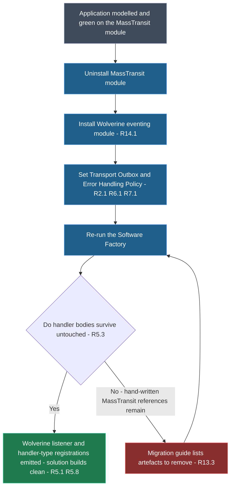
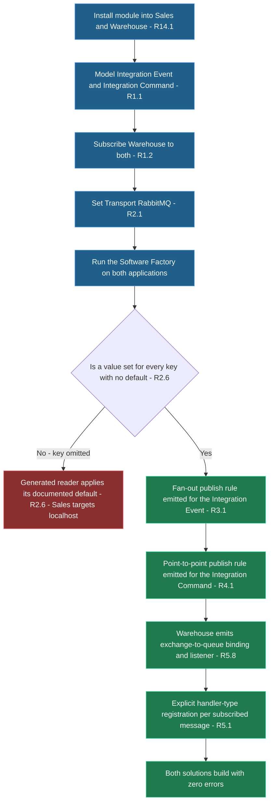
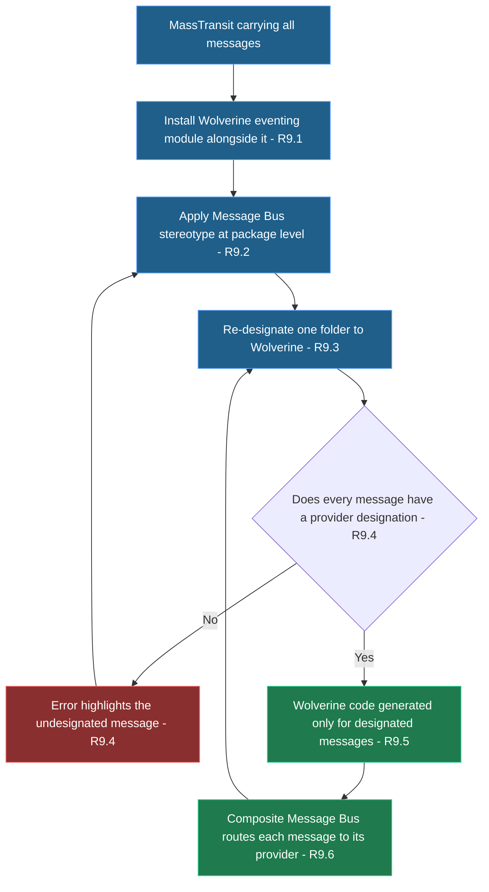
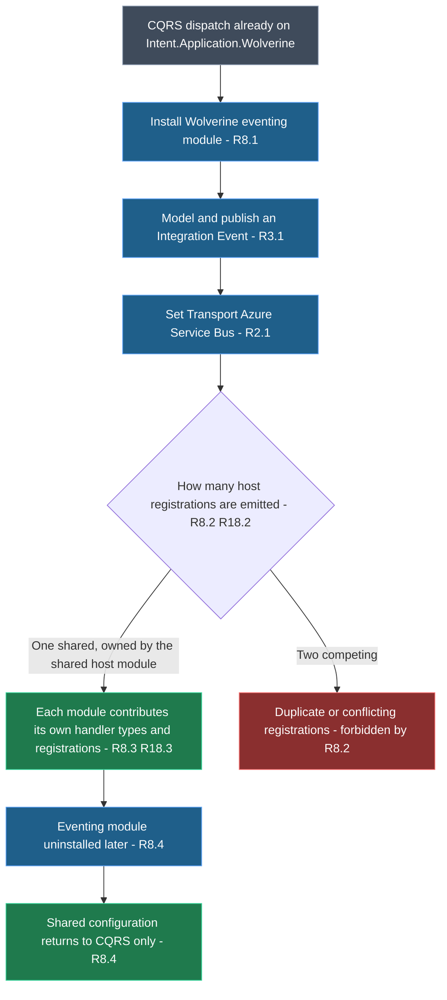
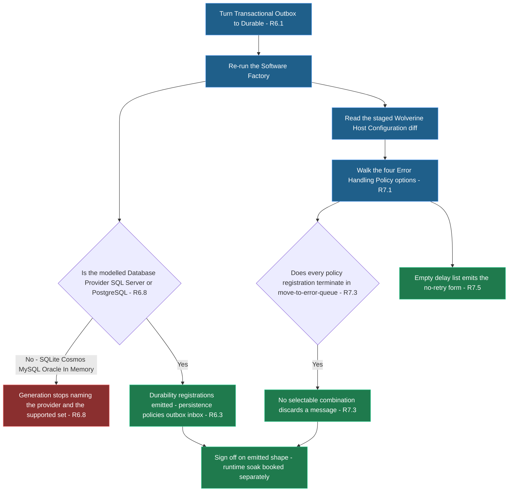
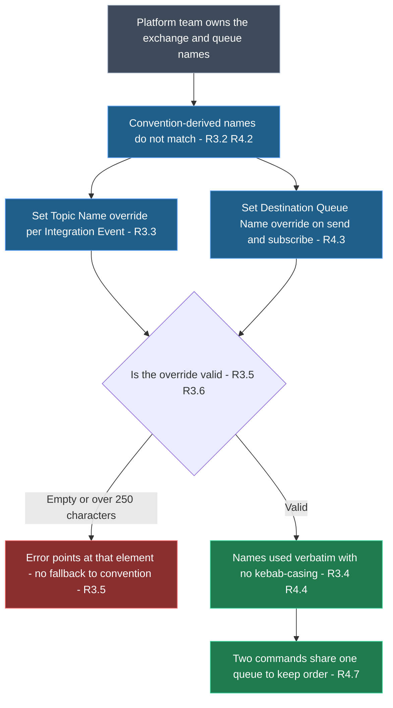

# Requirements Document

## Introduction

This feature adds a new Intent Architect module that generates cross-application integration messaging over a message broker using WolverineFx. It consumes the same Integration Event and Integration Command modelling already used by the MassTransit and NServiceBus eventing modules, and generates the broker configuration, the publishing implementation, and the listener and handler registrations that carry those messages between applications. It serves .NET teams building Intent Architect applications who want Wolverine, whether on its own merits or as a permissively-licensed message broker provider.

Explicitly out of scope: wire-format compatibility with messages already published by MassTransit, draining or replaying messages sitting in existing MassTransit queues, scheduled or delayed publishing, request/response over the bus, and any transport beyond Local, RabbitMQ, Azure Service Bus and Amazon SQS.

## Golden Sample Reference

This document derives from a committed, gated golden sample rather than from theory. Every later session — design, tasks, each implementation wave — reads the Reference first and follows its pointers into code.

- **Reference (authoritative):** <FileRef path="golden-sample/GOLDEN-SAMPLE.md" label="golden-sample/GOLDEN-SAMPLE.md" />
- **Supporting:** <FileRef path="golden-sample/SAMPLE-CHARTER.md" label="SAMPLE-CHARTER.md" /> · <FileRef path="golden-sample/GATE-REPORT.md" label="GATE-REPORT.md" />
- **Sample applications:** `Tests/WolverineEventing.Publish.RabbitMQ`, `Tests/WolverineEventing.Subscribe.RabbitMQ`, at tag `golden/wolverine-eventing-module`
- **Pinned runtime:** `net10.0`, WolverineFx 5.39.5

<Callout id="shape-only-constraint" tone="warning" title="Acceptance criteria in this document assert generated shape only">

The golden sample has no automated tests — a recorded descope. Real-host verification against a Docker RabbitMQ was done by hand and is retained as context, not as an oracle, because nothing re-runs it.

So **no acceptance criterion below claims that a message is delivered, retried, dead-lettered or handled.** Every criterion is phrased against what is emitted, where, and containing which registration. This binds every downstream wave: a criterion that can only be proven by running a broker cannot be proven at all here, and must not be introduced by one.

Where a capability's runtime guarantee is real but unverified — Wolverine's own commit-coupled dispatch, its inbox idempotency — the guarantee is named as a documentation obligation rather than asserted as behaviour.

</Callout>

## Vision

Teams arrive at Wolverine from two directions. Some want it on its own merit — they like its handler model, its durable messaging and the wider Critter Stack it belongs to, and they would pick it regardless of what anything else costs. Others are looking for a free alternative now that MassTransit has gone commercial. Either way they want the same thing from Intent Architect: broker-backed integration messaging they model rather than hand-wire, from a provider they are not locked into.

So this feature adds an eventing module that behaves like the ones they already know — the same Integration Events and Integration Commands in the Services designer, the same handler interface, the same transports, the same transactional outbox. Existing knowledge transfers, and so does an existing model: changing eventing provider becomes a module swap, where uninstalling one and installing another regenerates the framework-specific code while the modelled messages and hand-written handler bodies stay exactly where they are. That reversibility is the point, and it is worth being precise about where it stops — it covers the code, not the messages. Anything already in flight, sitting on a queue, or parked in an error queue remains the team's own migration to run.

## Target Users & Jobs To Be Done

- **Solution architect choosing an eventing provider** — either adopting Wolverine on its merits or moving off commercially-licensed MassTransit, and needs to establish that it covers the same brokers and the same transactional-outbox guarantee before committing a portfolio of applications to it.
- **Application developer who wants Wolverine specifically** — has chosen Wolverine for its handler model and durable messaging, and wants integration messaging modelled the same way the rest of their application is rather than hand-wired around it.
- **Application developer on an existing MassTransit application** — wants the transport swapped underneath with the smallest possible amount of hand-written change, and in particular without touching handler bodies that already carry tested business logic.
- **Application developer on a new application** — wants cross-application messaging that works out of the box against a locally-runnable broker, with no licensing decision to escalate.
- **Application developer running a staged migration** — needs some messages still flowing over MassTransit while others move to Wolverine, so a large application can be cut over message-by-message rather than all at once.
- **Application developer already using Wolverine for CQRS** — has `Intent.Application.Wolverine` dispatching commands and queries in-process, and wants integration messaging on the same runtime rather than a second messaging framework alongside it.

## Key User Journeys

- **UJ-1. Priya swaps MassTransit for Wolverine in an existing application.**
  - **Persona + context:** Priya maintains a Clean Architecture order-management application that publishes three Integration Events and consumes two, over RabbitMQ, with the durable outbox on. Her licence review flagged MassTransit.
  - **Entry state:** The application is modelled and green. The MassTransit module is installed and its settings are configured.
  - **Path:** She uninstalls the MassTransit module; installs the Wolverine eventing module; sets Transport to RabbitMQ, Transactional Outbox to Durable, and Error Handling Policy to Retry with cooldown; re-runs the Software Factory; reviews the staged changes.
  - **Climax:** The staged diff replaces the MassTransit configuration and consumer classes with Wolverine transport, listener and handler-type registrations, and leaves every Integration Event Handler body byte-for-byte untouched. The solution builds with zero errors. Running it against a broker is her own next step, not something this document promises.
  - **Resolution:** Same modelled messages, same handler code, no commercially-licensed dependency.
  - **Edge case:** Hand-written code elsewhere in the application still references MassTransit types directly, so the build fails after the swap. The migration guide's list of MassTransit-specific artefacts tells her exactly which references to remove.

- **UJ-2. Marco stands up cross-application messaging on a greenfield pair.**
  - **Persona + context:** Marco is building two new Clean Architecture applications — a Sales application that raises an Integration Event when an order is placed and sends an Integration Command to request fulfilment, and a Warehouse application that consumes both. He picked Wolverine on its merits; he has never used MassTransit and is not migrating from anything.
  - **Entry state:** Both applications exist and are modelled. Neither has any eventing module installed. RabbitMQ is running locally in Docker.
  - **Path:** He installs the Wolverine eventing module into both; models the Integration Event and Integration Command in Sales and subscribes to them in Warehouse; sets Transport to RabbitMQ in both; runs the Software Factory on both.
  - **Climax:** The generated output carries the whole topology without him hand-writing any of it: a fan-out publish rule for the Integration Event, a point-to-point publish rule for the Integration Command, and in Warehouse an exchange-to-queue binding plus a listener for each. Both solutions build clean, and he starts them himself.
  - **Resolution:** Two applications integrated over a broker, using the module's defaults for everything except the Transport.
  - **Edge case:** He never sets `Wolverine:RabbitMq:Host`, and the generated reader falls back to its `localhost` default rather than failing — so Sales silently targets a broker on his own machine instead of the shared one. The setting's documentation names every key that has a silent default, which is how he finds it.

- **UJ-3. Aisha cuts a large application over one message at a time.**
  - **Persona + context:** Aisha owns an application publishing fourteen Integration Events over MassTransit. A big-bang cutover is unacceptable, so she needs to move them in batches while both providers run.
  - **Entry state:** The MassTransit module is installed and carrying all fourteen messages. No provider designation exists anywhere, because MassTransit was the only Eventing Provider.
  - **Path:** She installs the Wolverine eventing module alongside MassTransit; the Software Factory now requires a provider designation, so she applies the Message Bus stereotype at the package level naming MassTransit; she moves one folder of messages to name Wolverine instead; re-runs the Software Factory.
  - **Climax:** The staged output generates Wolverine consumers and configuration only for the designated folder and leaves the rest on MassTransit, with a Composite Message Bus routing each message to its provider.
  - **Resolution:** Both providers live in one application; she repeats the move folder by folder until MassTransit can be uninstalled.
  - **Edge case:** One message sits outside any folder carrying the stereotype, so generation stops with an error highlighting that specific message rather than quietly dropping it.

- **UJ-4. Tom adds integration messaging to an application already dispatching CQRS through Wolverine.**
  - **Persona + context:** Tom's application uses `Intent.Application.Wolverine` so its commands and queries are handled through Wolverine in-process. He chose Wolverine on its merits and wants one messaging runtime, not two. He now needs to publish Integration Events to a sibling application.
  - **Entry state:** `Intent.Application.Wolverine` is installed and generating its own Wolverine setup. No eventing module is installed.
  - **Path:** He installs the Wolverine eventing module; models an Integration Event and publishes it from a command handler; sets Transport to Azure Service Bus; runs the Software Factory.
  - **Climax:** One Wolverine Host Configuration comes out — a single host registration owned by the shared host module, into which the CQRS module contributes its handler types and the eventing module contributes its transport, publish rules, listeners and outbox. Not two competing setups.
  - **Resolution:** A single place to look when he needs to reason about how Wolverine is configured.
  - **Edge case:** He uninstalls the eventing module later; the shared configuration returns to CQRS-only rather than being left with orphaned transport registrations.

- **UJ-5. Nadia reviews what the durability and error-handling settings actually generate.**
  - **Persona + context:** Nadia is taking Marco's Sales and Warehouse pair through production-readiness review. Her rule is that no configuration a team can select may produce a setup that drops a message, and she reviews generated code rather than trusting a settings screen.
  - **Entry state:** The pair from UJ-2 is modelled and building, on the module's defaults — Transactional Outbox None, Error Handling Policy Retry with cooldown.
  - **Path:** She turns Transactional Outbox to Durable in Sales and re-runs the Software Factory; reads the staged diff of the Wolverine Host Configuration; checks which durability registrations appeared and what the error-handling registration terminates in; then walks the four Error Handling Policy options to see what each one emits.
  - **Climax:** The Durable setting adds the message-persistence registration for the modelled Database Provider, the DbContext integration, and the auto-transaction, durable-outbox-on-all-sending-endpoints and durable-inbox-on-all-listeners policies — she can name each one and point at the line. Every one of the four policies terminates in a move-to-error-queue action, so no selectable combination generates a setup that discards a message.
  - **Resolution:** She signs off on what the module *emits*, and books the runtime soak test separately as her team's own work — because nothing in this specification claims it.
  - **Edge case:** She sets Transactional Outbox to Durable on an application whose modelled Database Provider is SQLite. Generation stops with an error naming SQLite, naming SQL Server and PostgreSQL as the supported providers, and offering None — rather than emitting a durability registration that cannot work.

- **UJ-6. Rashid joins a broker estate that already has its own names.**
  - **Persona + context:** Rashid is adding a new Intent Architect application to an organisation whose RabbitMQ topology is owned by a platform team. The exchange and queue names are fixed by that team's convention and are not his to change.
  - **Entry state:** The Wolverine eventing module is installed and generating convention-derived names that do not match the platform team's topology, so nothing he publishes is picked up. His credentials also have no permission to declare or delete a destination.
  - **Path:** He sets Broker Topology to Externally owned; sets a Topic Name override on each Integration Event and a Destination Queue Name override on each Integration Command, each on the element itself; re-runs the Software Factory; checks the generated destinations against the platform team's list.
  - **Climax:** The generated code publishes and sends to the platform team's exact names, character for character, with no kebab-casing applied on top, and starts without attempting to declare anything.
  - **Resolution:** His application joins an existing estate without asking anyone to rename anything and without needing configure permission, and two of his Integration Commands deliberately share one queue to keep their order.
  - **Edge case:** He pastes a name that trims to nothing, and generation stops with an error pointing at that exact Integration Event rather than quietly falling back to the convention name and publishing to a destination nobody is listening on.

## Glossary

- **Integration Event** — a message published by one application for any number of interested applications to consume; fan-out semantics. Modelled in the Services designer. Zero or many subscribers per Integration Event.
- **Integration Command** — a message sent by one application to exactly one Destination Queue for point-to-point processing; ordering within a queue matters. One Destination Queue per Integration Command; many Integration Commands may share a Destination Queue.
- **Integration Event Handler** — the application-layer class carrying the business logic for one subscribed Integration Event or Integration Command, implementing `IIntegrationEventHandler<T>`. Hand-written body, generated signature — and the signature is generated by the already-shipped `Intent.Eventing.Contracts` handler template, not by this module. Exactly one per subscribed message per application. **This class is itself the Wolverine handler:** Wolverine invokes its `HandleAsync` directly, and no generated class sits between it and the Transport.
- **Handler Type Registration** — the entry in the Wolverine Host Configuration naming one Integration Event Handler explicitly, so Wolverine invokes it without relying on assembly scanning. Exactly one per subscribed message per application. This, together with a listener, is the whole of the module's subscribe-side output — there is no per-message generated class.
- **Subscriber Queue** — the queue an application listens on for a subscribed message. A fanned-out Integration Event gives each subscriber its own, named `{application-name-kebab}-{message-name-kebab}` and bound to that Integration Event's Topic Name. A subscribed Integration Command listens on its Destination Queue Name itself, shared by every sender. Not overridable in this release.
- **Message Bus contract** — the transport-agnostic interface application code publishes and sends through (`IMessageBus`, or `IEventBus` in legacy mode), owned by the `Intent.Eventing.Contracts` module. Distinct from Wolverine's own same-named interface.
- **Eventing Provider** — a module that implements the Message Bus contract over one messaging technology. This feature adds one. An application may have one or many installed.
- **Composite Message Bus** — the generated routing implementation of the Message Bus contract that appears when two or more Eventing Providers are installed, dispatching each message to the Eventing Provider(s) designated for it.
- **Message Bus stereotype** — the designer stereotype, owned by `Intent.Eventing.Contracts`, that designates which Eventing Provider(s) carry a message. Applied to a package, folder or individual message; inherited by children.
- **Transport** — the messaging technology carrying messages off the process: Local, RabbitMQ, Azure Service Bus or Amazon SQS. Exactly one Transport per application.
- **Transactional Outbox** — the mechanism that records outgoing messages in the application's database within the same transaction as the business change, then dispatches them, so a committed change can never lose its messages. Either None, or Durable — in which case the durable store is derived from the persistence the application already has modelled rather than chosen again here.
- **Error Handling Policy** — the rule deciding what happens when an Integration Event Handler throws: how many times and after what delays the message is re-delivered, and where it goes once those are exhausted. Exactly one per application, registered at Wolverine Host Configuration scope rather than per message.
- **Error Queue** — the broker destination a message lands on once its Error Handling Policy is exhausted, so it is retained rather than lost.
- **Topic Name** — the broker destination an Integration Event is published to. Derived by convention from the message type, optionally overridden per Integration Event.
- **Destination Queue Name** — the broker queue an Integration Command is sent to. Derived by convention from the message type, optionally overridden on the Integration Command itself, since the queue belongs to the application that owns the Command.
- **Broker Topology** — whether the application declares the exchanges, topics and queues it uses, or expects them to already exist and never touches them. Exactly one choice per application.
- **Wolverine Host Configuration** — the single generated setup where Wolverine's transports, publish rules, listeners, durability, error handling and handler type registrations are registered for an application. Exactly one per application, contributed into by every installed Wolverine module.
- **Shared Host Module** — the module that owns the one host registration and the decision to disable Wolverine's conventional handler discovery, so that each Wolverine module contributes its own Handler Type Registrations into a single configuration rather than competing for it. Exactly one per application; does not exist yet and is created by this feature.
- **Host** — the application entry point the Wolverine Host Configuration is registered on. Only the ASP.NET host is supported; Azure Functions and AWS Lambda hosts are Non-Goals and receive no registration. An application may have more than one ASP.NET host, and each gets its own registration.
- **Database Provider** — the relational database an application has already modelled through its Entity Framework Core configuration, which is what the Durable Transactional Outbox derives its durable storage from rather than asking again. Exactly one per application. Only SQL Server and PostgreSQL carry Wolverine durable storage; every other value is a stopping condition under R6.8.
- **Tenant Identifier** — the value identifying which tenant a message belongs to, carried in a message header so that the publishing tenant's context can be re-established before its Integration Event Handler runs.
- **Software Factory** — the Intent Architect process that turns the modelled application into generated code.
- **Golden Sample** — the committed publisher/subscriber pair at tag `golden/wolverine-eventing-module`, into which every Wolverine artefact was hand-written before any module existed, and which is this feature's ground truth. Described by the Golden Sample Reference. The direction of correction is one-way: when generated output and the Golden Sample disagree, the module changes — the sample is never edited to match what a template happened to emit.
- **Pre-module delta** — the enumerated lines in the Golden Sample that the Software Factory would strip, each held in place by a code-management directive and tagged with a `GOLDEN-SAMPLE:` marker naming the artifact that will take it over. Two lines today, both host registrations. This list is the definition of what the module must generate, and clearing it is the per-line parity proof.
- **Test Application** — a generated Intent Architect application under `Tests/` whose generated output is committed, so that a later change to a module surfaces as a difference in version control. This is the only automated regression signal this feature has, since the Golden Sample carries no tests. One per configuration permutation named in R19.

## Non-Goals

- **Wire-format compatibility with MassTransit.** A Wolverine publisher is not required to be consumable by a MassTransit subscriber, or vice versa. Messages in flight are not a migration concern.
- **Migrating existing messages.** No draining, replaying or re-shaping of messages sitting in existing MassTransit queues or error queues.
- **Automated settings carry-over.** Migration from MassTransit is documented, not automated; the developer re-chooses the Transport, Transactional Outbox and Error Handling Policy on the new module.
- **Detecting or reporting MassTransit remnants** after a swap. Leftover references surface as ordinary compilation errors, with the migration guide as the reference for what to remove.
- **Scheduled or delayed publishing.** No equivalent of `Intent.Eventing.MassTransit.Scheduling` in this release.
- **Request/response over the bus.** No equivalent of `Intent.Eventing.MassTransit.RequestResponse`, and no Service Proxy integration, in this release.
- **Transports beyond the four listed.** No Kafka, Pulsar or MQTT, even though Wolverine supports them.
- **Durability backends beyond the application's own Entity Framework Core database.** No Marten document-store durability and no RavenDb persistence. To be explicit, because the wording has been misread: PostgreSQL is *not* excluded. `WolverineFx.Postgresql` durability sitting behind the application's own EF Core DbContext is in scope and is selected automatically when that is the modelled provider; what is excluded is Marten as a persistence choice, along with its document session and `IDocumentStore`.
- **Serverless hosts.** No support for Wolverine in Azure Functions or AWS Lambda. Wolverine's handler code generation depends on startup command routing that serverless hosts override, and no `TypeLoadMode` has been made to work there — so the shared host module registers on the ASP.NET host only, and the Azure Functions registration the CQRS module carries today is removed rather than inherited.
- **Anything licence-gated.** No generated code path may depend on a paid JasperFx Software product — CritterWatch's licensed features, Critter Stack Pro or the AI Skills packages. Note that the `JasperFx` shared libraries are themselves MIT and are an unavoidable transitive dependency of Wolverine; they are not what this excludes.
- **In-process domain event dispatch.** Already covered by `Intent.Application.Wolverine.DomainEvents`.
- **Configurable message serialization.** One serialization format, not a setting.

## MVP Scope

### In Scope

- One installable eventing module covering all four Transports and the Durable Transactional Outbox — not the root-plus-companion split the MassTransit modules use.
- A new Shared Host Module owning the single host registration and handler-discovery decision, plus the change to `Intent.Application.Wolverine` that makes it consume that module rather than registering Wolverine itself.
- Publishing Integration Events and sending Integration Commands through the existing Message Bus contract, via a buffered implementation flushed by the application's dispatch module.
- Listener and Handler Type Registrations pointing directly at hand-written `IIntegrationEventHandler<T>` implementations — no generated per-message class.
- Transactional Outbox of None or Durable; Error Handling Policy of None, Retry, Retry with cooldown or Schedule retry.
- Optional Topic Name and Destination Queue Name overrides.
- Coexistence with `Intent.Application.Wolverine` on one shared Wolverine Host Configuration.
- Full participation in the Composite Message Bus alongside other Eventing Providers.
- OpenTelemetry instrumentation and Finbuckle multi-tenancy support when those modules are present.
- A documented MassTransit-to-Wolverine migration guide.
- A Test Application per configuration permutation, generated output committed, as the feature's automated regression signal.

### Out of Scope for MVP

- Scheduled publishing and request/response — each was a separate companion module for MassTransit and each is substantial work in its own right.
- Kafka — already served by `Intent.Eventing.Kafka`, so the overlap buys little.
- Marten document-store durability — the Entity Framework Core path covers the large majority of Intent Architect applications. PostgreSQL is not what is deferred here; Marten is.
- Automated migration tooling — the value is unproven until real migrations have been observed.
- **Automated runtime verification of any kind** — no test in this feature boots a broker, publishes a message, or asserts that one was handled, retried or dead-lettered. This was descoped when the Golden Sample was gated, and the consequence is accepted deliberately: a fault that generates valid, compiling code but misbehaves at runtime is not caught by anything here. Runtime verification is the consuming team's own step, and the Test Applications of R19 are what catch a regression in the generated shape instead.

## Success Metrics

**Primary**

- **SM-1**: Handler bodies preserved on migration — the number of hand-written `IIntegrationEventHandler<T>` method bodies requiring any edit when the reference application swaps from the MassTransit module to this one. Target: zero. Validates R1, R5, R13.
- **SM-2**: Transport coverage — the number of the four Transports whose configuration generates and compiles in a committed Test Application. Target: four of four. Validates R2, R3, R4, R19.
- **SM-3**: Licence exposure — the number of declared packages and generated code paths that require a licence key, a licence file or a paid tier in order to run. Target: zero. Validates R10.
- **SM-4**: Re-model cost on migration — the number of designer changes required to move an application from the MassTransit module to this one, excluding module settings. Target: zero. Validates R1.
- **SM-5**: Golden Sample parity — the number of unintended differences between Software Factory output and the Golden Sample, for an application modelled to match it. Target: zero. Validates R1 through R8, since the Golden Sample is what they are checked against.
- **SM-7**: Pre-module delta cleared — the number of `GOLDEN-SAMPLE:` markers still present in the Golden Sample once implementation is complete, each of which would silently suppress a template's output and make a parity check pass while proving nothing. Target: zero, with each removal followed by a regeneration confirming the template emits that exact line. Validates R18 and, per-line, R8.
- **SM-6**: On-merit onboarding — the number of steps in UJ-2 that require consulting WolverineFx's own documentation rather than this module's README. Target: zero. Validates R2, R14.

**Counter-metrics (do not optimize)**

- **SM-C1**: Configuration burden — the number of module settings a developer must set to get a working RabbitMQ publish-and-consume, which must not exceed the three the MassTransit module needs. Counterbalances SM-1 and SM-2: parity must not be bought by pushing configuration onto the developer.
- **SM-C2**: Hand-written plumbing per message — the number of classes a developer must write by hand for one subscribed message, which must stay at one, the Integration Event Handler. Counterbalances SM-1: preserving handler bodies must not be bought by making the developer write Wolverine wiring.

## Evidence and extrapolation

The Golden Sample settles one path and one path only: RabbitMQ, Transactional Outbox None, Broker Topology Auto-provision, Error Handling Policy Retry with cooldown. It models <ModelRef application="WolverineEventing.Publish.RabbitMQ" name="OrderShippedEvent" designer="Services" type="Message" /> as a fanned-out Integration Event, <ModelRef application="WolverineEventing.Publish.RabbitMQ" name="ProcessOrderCommand" designer="Services" type="Integration Command" /> as a point-to-point Integration Command, and <ModelRef application="WolverineEventing.Publish.RabbitMQ" name="FailingOrderEvent" designer="Services" type="Message" /> as the error-handling probe.

Everything the module ships beyond that path is **extrapolated**, and this table is the mechanism for catching a bad extrapolation: a reviewer reading a row marked *no citation* is the only gate between it and an approved requirement nobody can satisfy.

<Table
  id="evidence-ledger"
  caption="What each requirement rests on. Rows marked EXTRAPOLATED have no committed artifact behind them."
  columns={["Capability", "Requirement", "Evidence"]}
  rows={[
    ["RabbitMQ transport, fan-out publish, point-to-point send, exchange-to-queue binding, listeners", "R2, R3, R4, R5", "**Golden Sample** — compiled, and hand-run once against a Docker broker as retained context only"],
    ["Explicit handler registration with conventional discovery disabled", "R5, R18", "**Golden Sample** — and the reason it is mandatory: a generated intermediate class makes Wolverine find two handlers for one message and emit a duplicate local in its runtime codegen"],
    ["Buffered Message Bus over Wolverine's bus, with a flush seam", "R3.8 to R3.10", "**Golden Sample** — the buffered implementation and its flush method"],
    ["Retry with cooldown, and the no-retry form when the delay list is empty", "R7.2, R7.5", "**Golden Sample** — both branches emitted, both compiled"],
    ["Durable Transactional Outbox on SQL Server and PostgreSQL", "R6.3", "**Compile-only probe** — persistence and policy registrations compile at 5.39.5; nothing asserts commit-coupled dispatch"],
    ["Azure Service Bus, Amazon SQS and Local transports", "R2.1, R2.2", "**Compile-only probe** — registration, publish and listen calls compile; no delivery is claimed"],
    ["Broker Topology = Externally owned", "R2.7", "**Compile-only probe** — the non-declaring registration form compiles; joining a real pre-provisioned estate is not proven"],
    ["OpenTelemetry source name", "R11.1", "**Compile-only probe** — the ActivitySource is named `Wolverine` at 5.39.5, confirmed by reflection"],
    ["MIT licensing of all seven WolverineFx packages", "R10", "**Verified** — read from each resolved package's `.nuspec` at 5.39.5"],
    ["Error Handling Policy options Retry and Schedule retry", "R7.1", "**EXTRAPOLATED — no citation.** Neither form appears in the sample or the probe. A probe must compile both before their template branches are written"],
    ["Running alongside other Eventing Providers via the Composite Message Bus", "R9", "**EXTRAPOLATED.** Untouched by the sample, but with shipped precedent in the MassTransit and NServiceBus modules. Test Application planned per R19"],
    ["Finbuckle multi-tenancy header propagation", "R12", "**EXTRAPOLATED — no citation.** No sample coverage and no probe; the incoming side needs a Wolverine middleware shape nobody has compiled. Test Application planned per R19"],
    ["Failing generation when a required configuration key has no default", "R2.6", "**EXTRAPOLATED.** The sample's RabbitMQ reader applies silent defaults for every key rather than failing, so the fail-fast form for Azure Service Bus and Amazon SQS is a design decision, not an observation"]
  ]}
/>

The direction of correction is one-way and matters more than anything else in this document: when generated output and the Golden Sample disagree, **the module changes**. The Golden Sample is never edited to match what a template happened to emit.

<Callout id="api-pinning" tone="decision" title="Why these criteria say what is emitted, not which method emits it">

The Golden Sample has already pinned the exact WolverineFx calls, and the Reference records them with file-and-line citations. Those citations belong in the design, not here: an acceptance criterion that named a fluent method would break on a Wolverine minor upgrade that renamed it, without the module's behaviour having changed at all. So criteria below are phrased as the **registration that must be present** — a fan-out publish rule, a listener, a policy terminating in move-to-error-queue — and the design maps each onto the cited call.

</Callout>

## Requirements

### Requirement 1: Modelling parity with the existing eventing modules

**User Story:** As an application developer on an existing MassTransit application, I want the Wolverine module to read the messages I have already modelled, so that swapping providers costs me no designer work.

**Realizes:** UJ-1, UJ-2

#### Acceptance Criteria

1. THE Wolverine eventing module SHALL generate from Integration Events and Integration Commands modelled in the Services designer, using the same designer element types the MassTransit module consumes, and SHALL NOT introduce a new designer or a new message element type.
2. THE Wolverine eventing module SHALL generate from subscriptions modelled as an Integration Event Handler subscribing to an Integration Event or an Integration Command, using the same designer associations the MassTransit module consumes.
3. WHEN the MassTransit module is uninstalled and the Wolverine eventing module is installed into an application whose messages and subscriptions are unchanged, THE Software Factory SHALL generate a listener and a Handler Type Registration for every message that previously had a MassTransit consumer, and SHALL require zero changes to the messages, Integration Commands and subscriptions themselves to do so.
4. IF an application has no Integration Events and no Integration Commands modelled, THEN THE Software Factory SHALL still generate a valid Wolverine Host Configuration containing zero publish rules, zero listeners and zero Handler Type Registrations, AND the application SHALL compile.
5. WHEN the Software Factory is re-run with no change to the model or the module settings, THE Wolverine eventing module SHALL produce zero staged file changes.
6. WHEN an application being migrated from MassTransit carried MassTransit-specific name overrides, THOSE overrides SHALL NOT be read by the Wolverine eventing module, and the module documentation SHALL list every override a migrator must re-apply. A message whose override is not re-applied resolves to its convention-derived destination, so the migration guide SHALL state that overridden destinations must be re-captured before the first production run.

### Requirement 2: Transport selection

**User Story:** As a solution architect, I want to choose which message broker carries my messages, so that the module fits the infrastructure my organisation already runs.

**Realizes:** UJ-2, UJ-4

<Table
  id="transport-bounds"
  caption="R2.2 / R2.3 — Transport options and the configuration each requires"
  columns={["Transport option", "appsettings section", "Keys — type, required, default", "Spans applications"]}
  rows={[
    ["Local — default", "none", "none", "No — in-process only"],
    ["RabbitMQ", "`Wolverine:RabbitMq`", "Every key optional, each with a code-level default applied when absent: `Host` string `localhost`; `Port` integer `5672`; `VirtualHost` string `/`; `Username` string `guest`; `Password` string `guest`", "Yes"],
    ["Azure Service Bus", "`Wolverine:AzureServiceBus`", "`ConnectionString` string, **no default** — emitted as an empty placeholder and required at startup", "Yes"],
    ["Amazon SQS", "`Wolverine:AmazonSqs`", "`Region` string, **no default** — emitted as an empty placeholder and required at startup; `AccessKey` and `SecretKey` strings optional, omitted means the AWS default credential chain", "Yes"]
  ]}
/>

#### Acceptance Criteria

1. THE Wolverine eventing module SHALL expose a Transport module setting with exactly four options — Local, RabbitMQ, Azure Service Bus, Amazon SQS — defaulting to Local.
2. WHEN a Transport is selected, THE Software Factory SHALL register exactly that Transport in the Wolverine Host Configuration, and SHALL NOT register any other Transport.
3. WHEN a Transport is selected, THE Software Factory SHALL add that Transport's `appsettings.json` section and keys with the defaults given in the table above, and SHALL leave a key with no default as an empty string rather than inventing a value.
4. WHEN the Transport setting is changed and the Software Factory is re-run, THE Software Factory SHALL emit the newly selected Transport's registration and SHALL NOT emit the previous Transport's registration, in generated code. THE module makes no claim about the previous Transport's `appsettings.json` section: Intent Architect's app-settings mechanism registers and updates keys and has **no removal request**, so the stale section persists and THE module documentation SHALL name the sections a developer deletes by hand.
5. THE module documentation SHALL state that the Local Transport is in-process only and cannot carry messages between applications, and THE Transport setting's own hint SHALL say the same, so that the default is not mistaken for a working cross-application configuration. No claim is made here about whether messages held in a Local queue survive a process stop — that depends on the Transactional Outbox setting and is unverified.
6. WHEN the selected Transport is Azure Service Bus or Amazon SQS, THE generated configuration reader SHALL read that Transport's no-default key and SHALL emit a throw naming the configuration section and key when it is absent or empty, and SHALL NOT emit a fallback to the Local Transport or to a default endpoint. WHEN the selected Transport is RabbitMQ, THE generated reader SHALL apply the code-level default given in the table above for each absent key, and THE module documentation SHALL list every key that has such a silent default.
7. THE Wolverine eventing module SHALL expose a Broker Topology module setting with exactly two options — Auto-provision and Externally owned — defaulting to Auto-provision. WHEN it is Auto-provision, THE Software Factory SHALL generate code that declares the exchanges, topics and queues the application uses. WHEN it is Externally owned, THE Software Factory SHALL generate code that uses those destinations without declaring them and without deleting them, so that an application can join a broker estate it has no configure permission on.

<Callout id="local-transport-risk" tone="risk" title="R2.5 — Local is a default that cannot do the job">

Local is the default so a freshly installed application generates and builds without any infrastructure, matching the MassTransit module's In Memory default. It is also the one Transport that cannot carry a message out of the process, so the migration guide and the setting's own hint must both say so — the generated code compiles and looks complete either way, which is precisely why the documentation obligation in R2.5 is a criterion rather than a nicety.

The same trap sits one level down in R2.6: RabbitMQ's reader defaults `Host` to `localhost` and its credentials to `guest`, so an application with no RabbitMQ configuration at all still starts up pointed somewhere. Azure Service Bus and Amazon SQS have no such default and throw instead. That asymmetry is inherited from the Golden Sample, not chosen — and it is why R2.6 makes the silent-default list a documentation obligation.

</Callout>

### Requirement 3: Publishing Integration Events

**User Story:** As an application developer, I want to publish an Integration Event through the Message Bus contract, so that any number of other applications can react to it without my code knowing they exist.

**Realizes:** UJ-2, UJ-4, UJ-6

#### Acceptance Criteria

1. WHEN an Integration Event is modelled in an application and designated to Wolverine, THE Software Factory SHALL emit into the Wolverine Host Configuration a publish rule routing that message type to its Topic Name on the configured Transport using that Transport's fan-out destination kind — an exchange or topic rather than a queue.
2. THE Wolverine eventing module SHALL derive an Integration Event's Topic Name from its message type name converted to kebab-case when no override is present.
3. THE Wolverine eventing module SHALL provide an optional Topic Name override on an Integration Event, and WHEN one is present THE Software Factory SHALL use it in place of the convention-derived name.
4. WHEN a Topic Name override is present, THE Software Factory SHALL use it verbatim, without kebab-casing or otherwise transforming it.
5. IF a Topic Name override is present but empty or whitespace-only after trimming, THEN THE Software Factory SHALL stop with an error highlighting that Integration Event and SHALL NOT substitute the convention-derived name.
6. IF a Topic Name override is longer than 250 characters, THEN THE Software Factory SHALL stop with an error highlighting that Integration Event and naming the limit.
7. WHEN two Integration Events resolve to the same Topic Name, THE Software Factory SHALL generate both without error, since a shared destination is a legitimate ordering choice.
8. THE Software Factory SHALL generate an implementation of the Message Bus contract that delegates to Wolverine's own bus, and THAT implementation SHALL buffer each publish and send call rather than dispatching it immediately, exposing a single asynchronous flush method that dispatches the buffered calls in the order they were made and clears the buffer.
9. THE Software Factory SHALL register the Message Bus contract implementation in the application's dependency injection **only when that application has at least one Integration Event to publish or Integration Command to send**, and SHALL NOT register it in an application that only subscribes.
10. THE Wolverine eventing module SHALL NOT generate the call that invokes the flush method. THAT call belongs to the application's dispatch mechanism — `Intent.Application.Wolverine` contributes it as middleware, a MediatR application as a pipeline behaviour — and THE module documentation SHALL state that an application publishing through this bus with no dispatch module installed has nothing that flushes it.

<Callout id="flush-seam-risk" tone="risk" title="R3.8 to R3.10 — the buffered bus is only half a mechanism">

Buffering exists so that a handler's outgoing messages leave together, after its work succeeds, rather than one at a time mid-transaction. The cost is that the bus is inert until something calls its flush — and the thing that calls it is owned by a **different** module, chosen by how the application dispatches commands, not by which eventing provider it uses.

The consequence R3.10 makes explicit: an application that installs this module and publishes through the contract, but has no dispatch module contributing a flush, buffers every message and dispatches none. Generation succeeds and the code compiles. This specification cannot assert what happens next, only that the documentation must warn about it.

</Callout>

### Requirement 4: Sending Integration Commands

**User Story:** As an application developer, I want to send an Integration Command to a named queue, so that exactly one consumer processes it and related commands can be kept in order.

**Realizes:** UJ-2, UJ-6

#### Acceptance Criteria

1. WHEN an Integration Command is modelled in an application and designated to Wolverine, THE Software Factory SHALL emit into the Wolverine Host Configuration a publish rule routing that message type to its Destination Queue Name on the configured Transport using that Transport's point-to-point destination kind — a queue rather than an exchange or topic. THE Message Bus contract implementation of R3.8 SHALL buffer a send through the same mechanism as a publish.
2. THE Wolverine eventing module SHALL derive an Integration Command's Destination Queue Name from its message type name converted to kebab-case when no override is present.
3. THE Wolverine eventing module SHALL provide an optional Destination Queue Name override on the Integration Command element itself, since the queue an Integration Command is delivered to is declared by the application that owns the Command and must be identical for every application that sends it.
4. WHEN a Destination Queue Name override is present, THE Software Factory SHALL use it verbatim on both the sending and the subscribing side, resolved from the single place it is declared.
5. IF a Destination Queue Name override is present but empty or whitespace-only after trimming, THEN THE Software Factory SHALL stop with an error highlighting that Integration Command, and SHALL NOT substitute the convention-derived name.
6. IF a Destination Queue Name override is longer than 250 characters, THEN THE Software Factory SHALL stop with an error highlighting that Integration Command and naming the limit.
7. WHEN two or more Integration Commands resolve to the same Destination Queue Name, THE Software Factory SHALL generate all of them without error, since sharing a queue is how ordering between related commands is achieved.

<Callout id="name-validation-decision" tone="decision" title="R3.6 / R4.6 — 250 characters, and no broker-specific validation">

Names are validated only for emptiness and a 250-character ceiling, which sits below the tightest of the four brokers' limits. Per-broker character rules — which characters RabbitMQ permits in an exchange name, how Amazon SQS restricts a queue name — are deliberately left to the broker to reject at runtime rather than duplicated in the module, where they would drift out of date.

</Callout>

### Requirement 5: Consuming messages

**User Story:** As an application developer on an existing MassTransit application, I want Wolverine to invoke the same handler class I already have, so that my tested business logic survives the swap untouched.

**Realizes:** UJ-1, UJ-2

#### Acceptance Criteria

1. WHEN a message is subscribed to, THE Software Factory SHALL emit into the Wolverine Host Configuration exactly one listener for that message's Subscriber Queue and exactly one Handler Type Registration naming that message's `IIntegrationEventHandler<T>` implementation by type.
2. THE Software Factory SHALL NOT generate any intermediate class between the Transport and the `IIntegrationEventHandler<T>` implementation. THE module's entire subscribe-side output SHALL be configuration registrations, and THE Integration Event Handler SHALL remain the only place a developer writes business logic for that message.
3. WHEN an application that previously used the MassTransit module is regenerated on the Wolverine eventing module, THE Software Factory SHALL leave every existing `IIntegrationEventHandler<T>` method body byte-for-byte unchanged.
4. WHEN a message is subscribed to and no `IIntegrationEventHandler<T>` implementation exists yet, THE handler class SHALL be generated by the already-shipped `Intent.Eventing.Contracts` handler template in a mode that preserves the developer's body on subsequent runs, AND THE Wolverine eventing module SHALL NOT generate a competing handler class for that message.
5. THE Software Factory SHALL emit exactly one listener and exactly one Handler Type Registration per subscribed message type per application, however many times it is re-run, and SHALL NOT emit a duplicate when the same message is subscribed to more than once.
6. THE Software Factory SHALL emit the Error Handling Policy registration at Wolverine Host Configuration scope, so that it covers every listener the module emits, AND SHALL NOT emit any exception handling around the handler invocation that would stop a thrown exception reaching that policy.
8. THE Software Factory SHALL derive a subscribed Integration Event's Subscriber Queue name as the subscribing application's name and the message's name, each kebab-cased and joined by a hyphen, and SHALL emit a binding from that Integration Event's Topic Name to that queue — so that each subscribing application listens on its own queue and every subscriber receives its own copy. FOR a subscribed Integration Command, THE Software Factory SHALL emit a listener on that Integration Command's Destination Queue Name unchanged, with no application-name prefix, since a point-to-point queue is shared by design.
9. THE Subscriber Queue name SHALL NOT be overridable in this release, and THE module documentation SHALL state the naming rule so that a platform team can pre-provision the queue it produces.

<Callout id="no-generated-consumer" tone="decision" title="R5.1 / R5.2 — why there is no generated consumer class">

The MassTransit module generates a consumer class per subscribed message. This module generates none, and the difference is not a simplification — it is required.

The `IIntegrationEventHandler<T>` implementation is already shaped exactly like a Wolverine handler: a public class with a `HandleAsync` taking the message and a cancellation token. Wolverine invokes it directly. Putting a generated class in between makes Wolverine discover two handlers for one message type, and its runtime code generation then emits a duplicate local variable and fails to compile the handler pipeline. That failure is silent at the module level and drops messages at runtime, so R5.2 forbids the intermediate class outright rather than leaving it to a template author's judgement.

Requirement 5 numbering runs 1–6 then 8–9 by design; there is no R5.7.

</Callout>

### Requirement 6: Transactional Outbox

**User Story:** As a solution architect, I want outgoing messages committed in the same transaction as the business change that produced them, so that a committed change can never silently lose its messages.

**Realizes:** UJ-5

#### Acceptance Criteria

1. THE Wolverine eventing module SHALL expose a Transactional Outbox module setting with exactly two options — None and Durable — defaulting to None. The setting SHALL NOT name a persistence technology: when it is Durable, THE Software Factory SHALL derive the durable storage from the persistence the application already has modelled.
2. WHEN Transactional Outbox is None, THE Software Factory SHALL generate publishing and sending that goes straight to the Transport with no durable store, and SHALL NOT require any database.
3. WHEN Transactional Outbox is Durable, THE Software Factory SHALL emit all five of the following into the Wolverine Host Configuration, backed by the application's Entity Framework Core database: the message-persistence registration for the modelled Database Provider; the registration integrating the application's `DbContext` with Wolverine; the auto-apply-transactions policy; the durable-outbox-on-all-sending-endpoints policy; and the durable-inbox-on-all-listeners policy. No claim is made here about the runtime relationship between a transaction committing and its messages dispatching — that is Wolverine's own guarantee and nothing in this feature verifies it.
4. IF Transactional Outbox is Durable and the `Intent.EntityFrameworkCore` module is not installed, THEN THE Software Factory SHALL stop with a user-facing error naming the Transactional Outbox setting and the missing module, and SHALL NOT generate any Wolverine Host Configuration.
5. THE module documentation SHALL state that the durable inbox emitted by R6.3 is what makes a re-delivered message safe to handle again, and that this module generates no de-duplication of its own on top of it — so a developer choosing Transactional Outbox None is choosing to have neither.
6. WHEN Transactional Outbox is changed from Durable to None and the Software Factory is re-run, THE Software Factory SHALL remove the durable outbox and inbox registrations from the Wolverine Host Configuration.
7. THE module documentation SHALL state that Wolverine offers no non-durable outbox, and that a developer migrating from the MassTransit module's In Memory outbox must choose between None and Durable.
8. IF Transactional Outbox is Durable and the Entity Framework Core database provider is one for which Wolverine ships no durable storage — In Memory, Cosmos, MySQL, Oracle and SQLite among them — THEN THE Software Factory SHALL stop with a user-facing error naming the configured provider, naming the providers that are supported, and stating that Transactional Outbox may instead be set to None. Only SQL Server and PostgreSQL SHALL be treated as supported.

### Requirement 7: Error Handling Policy

**User Story:** As an application developer, I want to control how a failed message is retried and where it ends up, so that a transient failure recovers on its own and a permanent one is retained for investigation rather than lost.

**Realizes:** UJ-5

<Table
  id="error-policy-bounds"
  caption="R7.1 / R7.2 — Error Handling Policy options, the registration each emits, and the evidence behind it"
  columns={["Policy", "Registration emitted", "appsettings keys and defaults", "Evidence and Test Application"]}
  rows={[
    ["None", "A move-to-error-queue action with no retry action.", "none", "**Golden Sample** — the same form the empty-delay branch emits. Test App: `Wolverine.ErrorPolicy.None`"],
    ["Retry", "A retry-immediately action bounded by the configured attempt count, then move-to-error-queue.", "`Wolverine:ErrorHandling:Retry:Attempts` — integer, default `3`", "**EXTRAPOLATED — no citation.** Must be compiled in a probe before its template branch is written. Test App: `Wolverine.ErrorPolicy.Retry`"],
    ["Retry with cooldown — default", "A retry-with-cooldown action over the ordered delay sequence, then move-to-error-queue.", "`Wolverine:ErrorHandling:RetryWithCooldown:Delays` — ordered list of timespans, default `00:00:01, 00:00:05, 00:00:15`", "**Golden Sample** — both this and the empty-delay branch compiled. Test App: `Wolverine.ErrorPolicy.RetryWithCooldown`"],
    ["Schedule retry", "A schedule-retry action over the ordered delay sequence, releasing the listener between attempts, then move-to-error-queue.", "`Wolverine:ErrorHandling:ScheduleRetry:Delays` — ordered list of timespans, default `00:01:00, 00:05:00, 00:15:00`", "**EXTRAPOLATED — no citation.** Must be compiled in a probe before its template branch is written. Test App: `Wolverine.ErrorPolicy.ScheduleRetry`"]
  ]}
/>

#### Acceptance Criteria

1. THE Wolverine eventing module SHALL expose an Error Handling Policy module setting with exactly four options — None, Retry, Retry with cooldown, Schedule retry — defaulting to Retry with cooldown.
2. WHEN an Error Handling Policy is selected, THE Software Factory SHALL register that policy in the Wolverine Host Configuration and SHALL add its `appsettings.json` keys with the defaults given in the table above.
3. THE registration emitted for every one of the four Error Handling Policy options SHALL terminate in a move-to-error-queue action, so that no selectable policy generates a configuration whose exhausted messages are discarded rather than retained.
4. WHEN the Error Handling Policy setting is changed and the Software Factory is re-run, THE Software Factory SHALL emit the newly selected policy's registration and SHALL NOT emit the previous policy's registration, in generated code. THE module makes no claim about the previous policy's `appsettings.json` keys: the app-settings mechanism registers and updates keys and has **no removal request**, so the stale keys persist and THE module documentation SHALL name the keys a developer deletes by hand.
5. WHERE a policy reads an ordered delay sequence from configuration, THE generated registration SHALL branch on that sequence at startup and, when it is empty, SHALL emit only the move-to-error-queue action with no retry action — so that no configuration value can produce a registration that retries without bound.

### Requirement 8: Coexistence with the Wolverine CQRS module

**User Story:** As an application developer already using Wolverine for CQRS, I want one place where Wolverine is configured, so that I can reason about my application's messaging without hunting for a second setup.

**Realizes:** UJ-4

#### Acceptance Criteria

1. THE Wolverine eventing module SHALL be installable into an application that already has `Intent.Application.Wolverine` installed, and vice versa, in either order.
2. WHEN both modules are installed, THE Software Factory SHALL emit exactly one Wolverine host registration for each of the application's ASP.NET hosts, owned by the Shared Host Module of R18, and SHALL NOT emit a second host registration from either module.
3. WHEN both modules are installed, THE single Wolverine Host Configuration SHALL contain the CQRS module's own Handler Type Registrations and this module's Transport, publish rules, listeners, Handler Type Registrations, Transactional Outbox and Error Handling Policy registrations, with no duplicated and no conflicting registration — and neither module SHALL emit a Handler Type Registration for a handler the other module owns.
4. WHEN one of the two modules is uninstalled and the Software Factory is re-run, THE Software Factory SHALL remove that module's registrations from the shared Wolverine Host Configuration and SHALL leave the remaining module's registrations intact and working.
5. WHEN only the Wolverine eventing module is installed, THE Software Factory SHALL generate a complete Wolverine Host Configuration on its own, with no dependency on `Intent.Application.Wolverine` being present.
6. WHEN both modules are installed, THE generated project files SHALL reference exactly one version of the core WolverineFx package, so that the two modules can never resolve to different Wolverine majors in one application.
7. THE Wolverine Host Configuration SHALL be registered on the ASP.NET host only. THE Software Factory SHALL NOT emit a Wolverine host registration for an Azure Functions or AWS Lambda host, and WHEN an application on `Intent.Application.Wolverine` upgrades to the version that consumes the shared host module, THE previously generated Azure Functions host registration SHALL be removed and THAT removal SHALL be named in that module's release notes.

8. WHERE a generated file references both the Message Bus contract's `IMessageBus` and Wolverine's own `IMessageBus`, EVERY reference SHALL resolve unambiguously to the intended one of the two, and the file SHALL compile with both namespaces in scope. IN PARTICULAR, the dependency-injection registration SHALL bind the **Message Bus contract's** interface to the generated implementation, and SHALL NOT bind Wolverine's. THE module documentation SHALL state which of the two application code is expected to inject, and why injecting the other bypasses the module.

<Callout id="imessagebus-collision" tone="risk" title="R8.8 — two different interfaces are both called IMessageBus">

Wolverine's own publishing interface is named `IMessageBus`, and so is the Message Bus contract owned by `Intent.Eventing.Contracts`. In an application where both modules are installed, both names are in scope in the same generated files, and the wrong one compiles perfectly.

That is what makes this a risk rather than a nuisance: a developer following a Wolverine tutorial injects Wolverine's bus directly and thereby bypasses both the Composite Message Bus routing of R9 and the buffered flush of R3.8, with nothing failing to compile and no message obviously going missing until one does.

**R8.8 deliberately does not pin how the disambiguation is written.** The Golden Sample happens to use using-site aliases, but it was written by hand — a template must instead declare both types as resolved type references and let Intent Architect's type resolution emit the correct form, which is what keeps the output correct as the surrounding `using` set changes. Mandating a literal alias form here would push template authors toward hand-written name strings and defeat exactly the mechanism that gets this right. The form is the design's call; the outcome above is the requirement.

</Callout>

### Requirement 9: Running alongside other Eventing Providers

**User Story:** As an application developer running a staged migration, I want some messages on Wolverine and others still on MassTransit, so that I can cut a large application over in batches instead of all at once.

**Realizes:** UJ-3

#### Acceptance Criteria

1. THE Wolverine eventing module SHALL register itself as a selectable Eventing Provider on the Message Bus stereotype, so it can be chosen alongside any other installed Eventing Provider.
2. WHEN the Wolverine eventing module is the only Eventing Provider installed, THE Software Factory SHALL generate code for every modelled message without requiring any Message Bus stereotype to be applied.
3. WHEN two or more Eventing Providers are installed, THE Wolverine eventing module SHALL emit publish rules, listeners, Handler Type Registrations and Transport registrations only for messages designated to Wolverine, whether designated directly or inherited from a parent folder or package, and SHALL emit none of them for a message designated only to another provider.
4. IF two or more Eventing Providers are installed and a modelled Integration Event or Integration Command has no Eventing Provider designation, directly or inherited, THEN THE Software Factory SHALL stop with an error highlighting that specific message.
5. WHEN a message is designated to both Wolverine and another Eventing Provider, THE Software Factory SHALL generate that message's handling for both providers.
6. WHEN two or more Eventing Providers are installed, application code SHALL continue to publish and send through the single Message Bus contract, and THE Composite Message Bus SHALL route each message to its designated Eventing Provider(s) with no provider-specific code in the application layer.
7. WHEN a message is re-designated from another Eventing Provider to Wolverine and the Software Factory is re-run, THE Software Factory SHALL generate that message's Wolverine handling and SHALL remove the previous provider's handling for it, leaving all other messages untouched.

<Callout id="r9-extrapolated" tone="risk" title="R9 is extrapolated — nothing in the Golden Sample exercises it">

The Golden Sample installs one Eventing Provider. Every criterion above is inferred from how the MassTransit and NServiceBus modules already participate in the Composite Message Bus, which is real shipped precedent — but precedent from another provider is not evidence about this one, and the interaction that matters here is specific to Wolverine: R5's Handler Type Registrations are exactly what must be filtered by designation, and filtering them wrongly produces an application that compiles with a handler registered for a message it will never be routed.

R19 plans a multi-provider Test Application as the check. Until its generated output is committed, treat R9 as designed rather than demonstrated.

</Callout>

<Table
  id="failure-matrix"
  caption="Consolidated failure matrix — every stopping condition, and exactly what it leaves behind"
  columns={["Condition", "Response", "State left behind", "What is NOT done"]}
  rows={[
    ["R6.4 — Transactional Outbox is Durable and `Intent.EntityFrameworkCore` is not installed", "Software Factory stops with a user-facing error naming the setting and the missing module", "No files staged or written", "No Wolverine Host Configuration is emitted"],
    ["R6.8 — Transactional Outbox is Durable and the Entity Framework Core provider has no Wolverine durable storage", "Software Factory stops with a user-facing error naming the configured provider, the supported providers, and the option of setting Transactional Outbox to None", "No files staged or written", "No durability registration is emitted and no provider is silently substituted"],
    ["R9.4 — Two or more Eventing Providers installed and a message has no provider designation", "Software Factory stops with an error highlighting that message in the Services designer", "No files staged or written", "No publish rule, listener or Handler Type Registration is generated for any message, designated or not"],
    ["R3.5 — Topic Name override is empty or whitespace", "Software Factory stops with an error highlighting that Integration Event", "No files staged or written", "The convention-derived name is NOT silently substituted"],
    ["R4.5 — Destination Queue Name override is empty or whitespace", "Software Factory stops with an error highlighting that Integration Command", "No files staged or written", "The convention-derived name is NOT silently substituted"],
    ["R3.6 / R4.6 — Override name longer than 250 characters", "Software Factory stops with an error highlighting the element and naming the limit", "No files staged or written", "The name is NOT truncated"],
    ["R2.6 — Azure Service Bus or Amazon SQS selected, no-default key omitted", "Generation succeeds; the generated reader emits a throw naming the configuration section and key", "`appsettings.json` holds the key with an empty placeholder value", "No value is invented, and no fallback to the Local Transport or a default endpoint is emitted"],
    ["R2.6 — RabbitMQ selected, key omitted", "Generation succeeds; the generated reader applies that key's documented code-level default", "`appsettings.json` holds the key with its default value", "No throw is emitted — this asymmetry with Azure Service Bus and Amazon SQS is inherited from the Golden Sample and must be documented, not silently relied on"],
    ["R7.5 — Delay sequence configured as an empty list", "The generated registration takes its no-retry branch: move-to-error-queue with no retry action", "Generated code contains both branches; the empty list selects the no-retry one at startup", "No registration that retries without bound is emitted"]
  ]}
/>

### Requirement 10: Free and open-source guarantee

**User Story:** As a solution architect, I want to be certain no generated code needs a paid licence, so that this module's licensing position is verifiable up front rather than discovered at a renewal.

**Realizes:** UJ-1 — and it is the standing constraint every other journey inherits.

<Table
  id="licence-inventory"
  density="compact"
  caption="R10.1 / R10.3 — the verified licence position at the pinned version. Read from each resolved package's `.nuspec` during the Golden Sample gate; no licence-gated JasperFx product is referenced."
  columns={["Package", "Version", "Licence"]}
  rows={[
    ["WolverineFx", "5.39.5", "MIT"],
    ["WolverineFx.RabbitMQ", "5.39.5", "MIT"],
    ["WolverineFx.EntityFrameworkCore", "5.39.5", "MIT"],
    ["WolverineFx.SqlServer", "5.39.5", "MIT"],
    ["WolverineFx.Postgresql", "5.39.5", "MIT"],
    ["WolverineFx.AzureServiceBus", "5.39.5", "MIT"],
    ["WolverineFx.AmazonSqs", "5.39.5", "MIT"]
  ]}
/>

#### Acceptance Criteria

1. THE Wolverine eventing module SHALL declare and generate code against only MIT-licensed WolverineFx and JasperFx packages, and SHALL NOT declare or generate a code path against any licence-gated JasperFx Software product — CritterWatch's licensed features, Critter Stack Pro and the AI Skills packages among them. THE seven packages in the table above SHALL be the complete declared set at the pinned version.
2. THE Wolverine eventing module SHALL NOT expose any module setting whose selection would require a commercial licence key, a licence file, or a paid tier at runtime.
3. THE module documentation SHALL name every WolverineFx and JasperFx package the module declares, together with that package's licence at the declared version, so the guarantee in R10.1 is verifiable without reading the generated code.
4. WHEN the module's declared package versions are raised, THE licence record required by R10.3 SHALL be re-checked against the new versions, so that a future licensing change by JasperFx Software is caught at upgrade time by the module's maintainers rather than at runtime or renewal by a consumer.
5. IF a WolverineFx or JasperFx package required by this module ceases to be MIT-licensed at the version the module would declare, THEN the module SHALL remain on the last MIT-licensed version until the change has been assessed, and SHALL NOT silently raise a consumer onto a licence-gated version.

### Requirement 11: OpenTelemetry instrumentation

**User Story:** As an application developer, I want Wolverine's messaging activity to appear in my traces, so that a message crossing applications is as observable as a request crossing them.

**Realizes:** none — cross-cutting capability parity with the MassTransit module.

#### Acceptance Criteria

1. WHEN the `Intent.OpenTelemetry` module is installed, THE Software Factory SHALL emit a telemetry source registration naming the source `Wolverine` — the exact `ActivitySource` name at the pinned version, confirmed by reflection in the committed probe — into the application's OpenTelemetry configuration.
2. WHEN the `Intent.OpenTelemetry` module is not installed, THE Software Factory SHALL generate no telemetry registration and SHALL NOT add any OpenTelemetry package reference.

### Requirement 12: Finbuckle multi-tenancy support

**User Story:** As an application developer on a multi-tenant application, I want the publishing tenant's context restored when a message is handled, so that my handler reads and writes the right tenant's data.

**Realizes:** none — cross-cutting capability parity with the MassTransit module.

#### Acceptance Criteria

1. WHEN the `Intent.Modules.AspNetCore.MultiTenancy` module is installed, THE Software Factory SHALL emit, on the outgoing path of the Message Bus contract implementation, the addition of the current Tenant Identifier as a message header on every published Integration Event and sent Integration Command.
2. WHEN the `Intent.Modules.AspNetCore.MultiTenancy` module is installed, THE Software Factory SHALL emit a Wolverine middleware registered across the listeners of R5.1 that reads the Tenant Identifier header, establishes that tenant's Finbuckle context before the Integration Event Handler is invoked, and restores the prior context afterwards. Because there is no generated per-message class to host this, the middleware SHALL be registered once at Wolverine Host Configuration scope rather than emitted per message.
3. THE Tenant Identifier header name SHALL be configurable in `appsettings.json` and SHALL default to `Tenant-Identifier`.
4. THE middleware of R12.2 SHALL be emitted such that a message carrying no Tenant Identifier header proceeds to its Integration Event Handler with no tenant context established, and SHALL NOT be emitted with a guard that rejects such a message.
5. WHEN the `Intent.Modules.AspNetCore.MultiTenancy` module is not installed, THE Software Factory SHALL generate no tenancy header handling and no tenancy middleware.

<Callout id="r12-extrapolated" tone="risk" title="R12 is the least-evidenced requirement in this document">

Nothing in the Golden Sample or the probe touches multi-tenancy. Unlike R9, there is not even cross-provider precedent to lean on for the incoming half: the MassTransit module hangs its tenancy work on a generated consumer class, and R5.2 forbids one here. So R12.2's middleware is a shape nobody has compiled — the one criterion in this document whose feasibility is assumed rather than cited.

It is retained on the developer's explicit stipulation, for capability parity. The mitigation is ordering: R12.2 must be proven in a probe before its template is written, and R19 plans a multi-tenancy Test Application. If the middleware shape does not hold, R12 is the requirement to drop — not the one to work around.

</Callout>

### Requirement 13: Migration guidance

**User Story:** As an application developer swapping MassTransit for Wolverine, I want the steps and the setting equivalences written down, so that I can do the swap correctly the first time.

**Realizes:** UJ-1

#### Acceptance Criteria

1. THE module documentation SHALL contain a migration section giving the ordered steps to move an application from the MassTransit module to this one: uninstall, install, re-choose settings, re-run the Software Factory, review the staged changes, build.
2. THE migration section SHALL contain a table mapping each MassTransit module setting value to its Wolverine equivalent, and SHALL state explicitly where no equivalent exists — the In Memory outbox, and the Immediate, Interval, Incremental and Exponential retry policies.
3. THE migration section SHALL list the MassTransit-specific artefacts a swap leaves behind — generated files that are no longer produced, and the MassTransit types hand-written code may reference — so a developer can find and remove them.
4. THE migration section SHALL state that messages in flight and messages already on a MassTransit queue or error queue are not migrated, and that a Wolverine publisher and a MassTransit subscriber are not wire-compatible.
5. THE migration section SHALL describe the staged migration path: install both providers, designate messages with the Message Bus stereotype, move them in batches, then uninstall MassTransit.

### Requirement 14: Installation and settings surface

**User Story:** As an application developer, I want one module to install and a small number of settings to choose, so that getting cross-application messaging working is not itself a project.

**Realizes:** UJ-1, UJ-2

#### Acceptance Criteria

1. THE developer SHALL install exactly one module to get all four Transports and the Durable Transactional Outbox — no companion module is selected by hand and no transport-specific or persistence-specific module exists to choose. THE Shared Host Module of R18 SHALL be brought in automatically as a dependency, not presented as a second decision.
2. THE Wolverine eventing module SHALL expose exactly four module settings — Transport, Transactional Outbox, Error Handling Policy, Broker Topology — each with the options and default given in R2.1, R2.7, R6.1 and R7.1. No setting SHALL be added for the Subscriber Queue naming rule, the serialization format, or the durable storage technology, each of which is derived rather than chosen.
3. WHEN the Wolverine eventing module is installed and no setting is changed, THE Software Factory SHALL generate an application that compiles, configured for the Local Transport, Transactional Outbox None, Broker Topology Auto-provision and Error Handling Policy Retry with cooldown.
4. WHEN the Wolverine eventing module is installed, THE module SHALL install the message contract module it depends on, so that Integration Events, Integration Commands and the Message Bus contract are available without a separate install step.
5. WHEN the Wolverine eventing module is uninstalled and the Software Factory is re-run, THE Software Factory SHALL cease emitting the publish rules, listeners, Handler Type Registrations, Transport, outbox and error-handling registrations it added, and SHALL leave hand-written Integration Event Handler classes in place. THE module makes no claim about the `appsettings.json` sections it added: the app-settings mechanism has **no removal request**, so those sections persist and THE module documentation SHALL name the sections a developer deletes by hand, as in R2.4 and R7.4.

### Requirement 18: Shared Wolverine host module

**User Story:** As an application developer with more than one Wolverine module installed, I want one place where Wolverine is registered and one rule about how handlers are found, so that installing a second Wolverine module cannot strand the first one's handlers.

**Realizes:** UJ-4

#### Acceptance Criteria

1. THIS feature SHALL deliver a new Shared Host Module that owns two things for an application: the Wolverine host registration, and the call that disables Wolverine's conventional handler discovery. No other Wolverine module SHALL emit either.
2. THE Shared Host Module SHALL emit exactly one host registration per ASP.NET host in the application, and SHALL expose a contribution point through which each installed Wolverine module adds its own registrations into that single configuration.
3. EVERY Wolverine module SHALL contribute Handler Type Registrations only for the handlers it itself owns, and SHALL NOT contribute a registration for a handler owned by another module.
4. `Intent.Application.Wolverine` SHALL be changed to consume the Shared Host Module instead of emitting its own host registration. THAT change SHALL carry a version increment on that module, and the behaviour it removes SHALL be named in that module's release notes.
5. WHEN the Wolverine eventing module is installed and `Intent.Application.Wolverine` is not, THE Shared Host Module SHALL still emit a complete host registration with conventional discovery disabled, so the eventing module has no dependency on the CQRS module being present.
6. WHEN the Software Factory generates the host registration, THE two host-registration lines currently hand-written in the Golden Sample SHALL be reproduced exactly, and their `//IntentIgnore` directives and `GOLDEN-SAMPLE:` markers SHALL be removed. A search for `GOLDEN-SAMPLE:` across the Golden Sample SHALL return nothing once this requirement is met.

<Callout id="ignore-style-risk" tone="risk" title="R18.6 — the pre-module delta is ignore-style, which fails silently">

The two host-registration lines are protected by `//IntentIgnore`, not by a merge directive. Merge-style was preferred and is not available: `Intent.AspNetCore.Program` emits that file fully managed, and under top-level statements the registration sits in a statement block with no enclosing member to carry a merge attribute.

The consequence has to be carried forward explicitly, because it inverts how a parity check normally fails. With an ignore directive left in place, the hand-written line stays, **the template's output is suppressed**, and the diff comes back clean — a parity check that passes while proving nothing. A duplicate line would at least be visible; a suppressed one is not.

So R18.6's sweep is mandatory rather than tidy-up: remove the directive and marker, regenerate, and confirm the template emits that exact line. If the line disappears once unprotected, the template is incomplete — and that is the finding.

</Callout>

<Callout id="known-deviation" tone="warning" title="R18.3 — do not transcribe the sample's handler registrations into a template">

The Golden Sample's **publisher** registers three CQRS handler types that belong to `Intent.Application.Wolverine`, not to the eventing module. They are there only because the same method calls the discovery-disabling line and would otherwise strand them, and because no Shared Host Module existed to attribute that call to.

This is a recorded deviation, not intended shape. It demonstrates the *effect* R18 requires while attributing it to the wrong owner. A template that copies it would make the eventing module responsible for another module's handlers.

</Callout>

### Requirement 19: Test Application coverage

**User Story:** As a maintainer of this module, I want every configuration permutation to exist as an application whose generated output is committed, so that a later change to a template shows up as a diff in version control instead of reaching a consumer unnoticed.

**Realizes:** none — this is the feature's only automated regression signal, and every extrapolated requirement depends on it.

<Table
  id="test-app-matrix"
  density="compact"
  caption="R19.1 — the required Test Applications. Each one's generated output is committed, so a template change surfaces as a version-control diff."
  columns={["Test Application", "Configuration under test", "Requirement covered"]}
  rows={[
    ["`Wolverine.Transport.Local`", "Transport Local, Outbox None", "R2.1, R2.2"],
    ["`Wolverine.Transport.RabbitMQ`", "Transport RabbitMQ, Outbox None, Auto-provision — the Golden Sample's own path", "R2, R3, R4, R5"],
    ["`Wolverine.Transport.AzureServiceBus`", "Transport Azure Service Bus", "R2.1, R2.2, R2.6"],
    ["`Wolverine.Transport.AmazonSqs`", "Transport Amazon SQS", "R2.1, R2.2, R2.6"],
    ["`Wolverine.Topology.ExternallyOwned`", "Broker Topology Externally owned, with name overrides on every message", "R2.7, R3.3, R4.3"],
    ["`Wolverine.Outbox.Durable.SqlServer`", "Outbox Durable, Database Provider SQL Server", "R6.1, R6.3"],
    ["`Wolverine.Outbox.Durable.Postgresql`", "Outbox Durable, Database Provider PostgreSQL", "R6.1, R6.3"],
    ["`Wolverine.ErrorPolicy.None` · `.Retry` · `.RetryWithCooldown` · `.ScheduleRetry`", "One per Error Handling Policy option", "R7.1, R7.2, R7.3"],
    ["`Wolverine.Coexist.Cqrs`", "Wolverine eventing plus `Intent.Application.Wolverine` on one shared host", "R8, R18"],
    ["`Wolverine.MultiProvider`", "Wolverine alongside MassTransit, messages designated to each", "R9 — the check on an extrapolated requirement"],
    ["`Wolverine.MultiTenancy`", "Wolverine plus the Finbuckle multi-tenancy module", "R12 — the check on an extrapolated requirement"]
  ]}
/>

#### Acceptance Criteria

1. EVERY configuration listed in the table above SHALL be covered by a Test Application under `Tests/` whose generated output is committed to version control.
2. EVERY Test Application SHALL build with zero errors.
3. WHEN the Software Factory is re-run against a Test Application whose model and module settings are unchanged, IT SHALL propose zero file changes, so that a genuine template change is the only thing a committed diff can represent.
4. THE Test Applications covering an extrapolated requirement — `Wolverine.MultiProvider` for R9 and `Wolverine.MultiTenancy` for R12 — SHALL exist before that requirement is considered met, since no other evidence for either exists.
5. WHERE a Test Application's committed output is the sole evidence for a criterion, THE absence of a proposed change SHALL be confirmed rather than assumed — by checking that the module version under test is the version installed, that the message carries the provider designation the templates filter on, that the file is not in the ignored-files list, and that the file's code-management mode permits the template to write it. A clean run against a file no template was ever going to write proves nothing.

## Assumptions

<Checklist
  id="assumptions"
  items={[
    { id: "a1", label: "Configuration lives under a single `Wolverine:` root in `appsettings.json`", note: "Rather than MassTransit's top-level per-broker sections. A migrator re-points configuration once; the payoff is that everything this module owns sits in one place. See the R2 table." },
    { id: "a2", label: "Convention-derived Topic Names and Destination Queue Names are kebab-cased", note: "Matching the MassTransit module's kebab-case endpoint name formatter, so a message's destination name is unchanged by the swap." },
    { id: "a3", label: "Local is the default Transport", note: "Mirrors the MassTransit module's In Memory default so a freshly installed application runs with no infrastructure. Its limits are called out in R2.5." },
    { id: "a4", label: "Message serialization is JSON, and not configurable", note: "One format keeps the first release small. Listed as a non-goal; revisit if a real broker interop need appears." },
    { id: "a5", label: "Names are validated only for emptiness and a 250-character ceiling", note: "Broker-specific character rules are left to the broker to reject. See the R3/R4 decision callout." },
    { id: "a6", label: "The module declares a minimum WolverineFx version, never a floating wildcard", note: "A plain minimum lets NuGet resolve the declared version rather than the newest, so an application on a newer Wolverine still works while nobody drifts onto a future release by accident. A floating version would make R10.5 unenforceable — a consumer could land on a licence-gated release without anyone deciding to." },
    { id: "a7", label: "Retry with cooldown is the default Error Handling Policy", note: "The closest behavioural match to the MassTransit module's Interval default, so a migrator's failure handling does not change character." },
    { id: "a8", label: "Amazon SQS credentials fall back to the AWS default credential chain", note: "Access key and secret key are optional; an application running with an instance role needs no credentials in configuration." },
    { id: "a9", label: "Transactional Outbox Durable combined with the Local Transport is permitted, and nothing here describes what it does at runtime", note: "Wolverine has durable local queues backed by the database, so Durable plus Local plausibly gives a restart-surviving in-process queue. The combination is deliberately NOT forbidden — that would invent a restriction Wolverine does not have — and R2.5 makes no claim either way. R6.3 states only which registrations are emitted, which is true for Local as for any Transport." },
    { id: "a10", label: "No Transport is verified at runtime; all four are verified by generating, compiling and committing the output", note: "RabbitMQ additionally has a hand-run against a Docker broker recorded as context, but nothing re-runs it, so it is not evidence. The accepted consequence is that a transport-specific fault which still compiles — a wrong dead-letter registration, say — is caught by nothing here. R19's committed Test Application output is what catches a regression in the shape; a first-time fault in the shape is caught only by review against the Reference." },
    { id: "a11", label: "Wolverine's own inbox is trusted for re-delivery idempotency, and this feature verifies none of it", note: "R6.3 emits the durable-inbox-on-all-listeners policy and R6.5 makes the guarantee a documentation obligation. Nothing asserts that a re-delivered message reaches its handler only once — that is Wolverine's behaviour, not this module's output, and it is outside what a shape-only specification can check." },
    { id: "a14", label: "The pinned runtime is `net10.0` with WolverineFx 5.39.5 across all seven packages", note: "Every citation in this document was taken at that version. A version raise re-opens R10.3's licence check and invalidates any API citation the design records, so the pin is a decision rather than an incidental." },
    { id: "a15", label: "A subscribed Integration Event's queue name is derived and not overridable", note: "R5.8's rule gives each subscriber its own queue so a fan-out actually fans out. R5.9 declines an override to keep the settings surface at R14.2's four. The cost is real and accepted: under Broker Topology Externally owned a platform team must accept the derived queue name, because R3.3 lets Rashid override the exchange he binds from but nothing lets him override the queue he binds to." },
    { id: "a16", label: "Extrapolated criteria are proven by a probe before their template branch is written, not after", note: "R7.1's Retry and Schedule retry policies and R12.2's tenancy middleware have no citation at all. Compiling each against the pinned version is cheap; discovering during a parity wave that the API does not exist in the assumed shape is not. The ordering is the mitigation." },
    { id: "a12", label: "Documentation is the module's own `docs/README.md`, not modelled help topics", note: "Every requirement that says \"module documentation\" or \"migration section\" — R1.6, R2.4, R2.5, R2.6, R3.10, R5.9, R6.5, R6.7, R7.4, R8.8, R10.3, R13.1 to R13.5, R14.5 — is satisfied by a README section, matching how every other eventing module in this repository carries its prose. No `Module Documentation` element is modelled, so none of those criteria may be verified by pointing at a generated topic. This list is long by design: with runtime verification descoped, a documented warning is the only mitigation several of these risks have." },
    { id: "a13", label: "Wolverine ships durable storage for SQL Server and PostgreSQL only", note: "R6.8's stopping condition rests on this. The provider list it names as unsupported — In Memory, Cosmos, MySQL, Oracle, SQLite — is the set Intent's Entity Framework Core module offers today; a provider added to that module later inherits the error rather than silently generating a durability registration that cannot work." }
  ]}
/>
